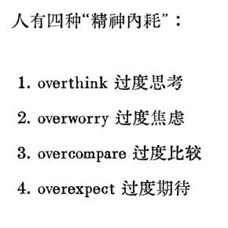

## today：

熟悉bloomberg 字幕，其次路透社

瑜伽？

表达，now

左侧，髋部，舞蹈

## reminder

Relax your shoulders
take a breath
Just breathe
Slow down
Take your time
存在展示联系而不是微笑

> 重复一个行为就能使之成为习惯。
> 习惯塑造性格。
> 性格决定命运。
> 愿成功是你的命运。

1. 短线交易和复盘是核心
2. english 输出提升逻辑能力，复盘也用英语
3. 中文talk也是必备技能，考虑母语，简单
4. 冥想、放松
5. dance 拳击-action
6. 拳击基本躲闪，晃动上身
7. 

#       总论

o  有趣

o  人生无意义

o   

o  锻炼表达——中国人缺乏, 写作，口语

o  桥梁，而不是传道

o  英语表达

o  三件事  

o  表达，聊天

o  Stock

o  放松

o  英语

o  Youtube

o  自私

## 短线交易

## 积极

汉语文化不表演，英语经常夸人

prayer the positive thinking—

chinese driver

## 拳击

### 练习时别忘了带护齿

### 最重要的三种拳法

-https://www.youtube.com/watch?v=R26XPyEpm4M

* jab
    1. 注意要同时迈步
    2. 同时还能防守，后撤同时出拳
* cross
    1. 出拳时，头不要向前伸
* 前手勾拳

### 少实战，对大脑不好

 https://www.youtube.com/watch?v=pr9SrH9zbU8

這影片的重點就是**「享受沒有危險的訓練」**，點到為止的訓練是最安全的

### 步法

https://www.youtube.com/watch?v=LWtUB6Ukp8E

Bob-and-Weave——最基础

## 健身

Bob-and-Weave作为热身

## Dance

情绪，身体不能欺骗自己

## 汉语说话

## 音乐

唱诗

## 笑——大笑/微笑

## Reading

# 荷马史诗选择

* Lombardo’s 戏剧性，很多现代性的俚语，削弱其史诗气质——如果目的是学习当代英语，那么以此为主
* Fagles 史诗，恢弘，综合评价最高
* ~~Fitzgerald 优雅，文学性很强，但是不符合荷马史诗创作的平民气质——排除~~

## exts

性格决定命运，习惯

生活中也要考虑 华尔街精英是如何做的

不干扰别人的生活

选择太多，犹豫都耗费精力，而且还有别的副作用

以交易为中心，培养自己的交易员性格，以及额外的提升英语能力，提升与异性聊天技巧

