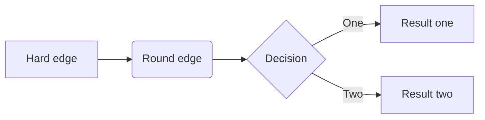

## 真正的强大不是“对抗”，而是允许发生。

允许发生

1. 遗憾
2. 愚蠢
3. 丑恶
4. 虚伪
5. 付出没有汇报

 当你允许这一切发生之后，你会逐渐变成一个

* 柔软
* 放松
* 舒展

的人，总是和自己对抗，和人性以及世界的运行规律对抗，你会越发

* 拧巴
* 软弱
* 痛苦 

允许

* 自己做自己
* 别人作别人

对自己不必远虑，
对她认不必多想

不在别人心中修行自己，
不在自己心中强求别人

你做自己
别人作别人

允许一切发生，

* 接纳
* 包容
* 善待自己和别人

这才是真正的强大

---

