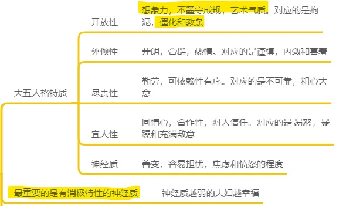
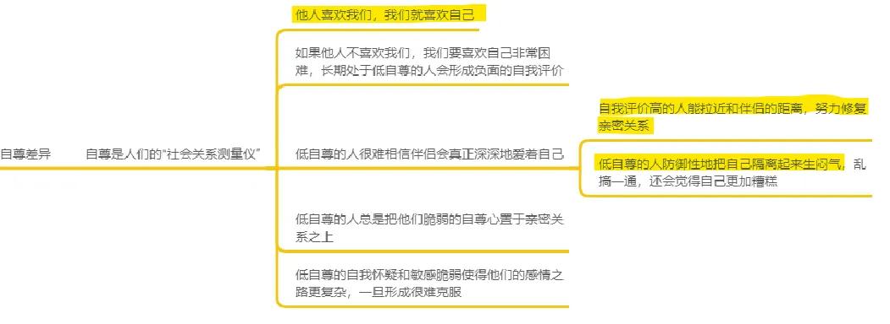
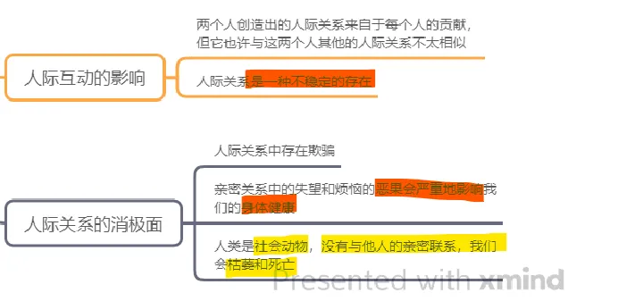

#### 第3章 吸引力

###### 吸引力的基础：一种奖赏

人与人之间产生吸引力最基本的假设是：他人的出现对于我们有奖赏意义（Clore & Byrne，1974）。影响吸引力的奖赏（rewards）有两种类型：与他人交往产生的直接奖赏，和仅与他人有关的间接利益。**直接奖赏指的是**他人提供给我们的所有**显而易见的愉悦**。如果他人**给予我们许多兴趣和赞许，我们就会对这种关注和接纳感到非常高兴**。如果**他人聪明又美丽，我们就会享受这些赏心悦目的个人特征**。而如果他人能给我们带来**物质利益如金钱或地位，我们更会乐于接受这些好处**。多数情况下，人们提供的直接奖赏越多，对我们的吸引力就越强。

但吸引力还受到很多不易觉察的因素影响，这些因素只与人们外在的**友善、俊美的长相或怡人的个性**有间接的关联。

