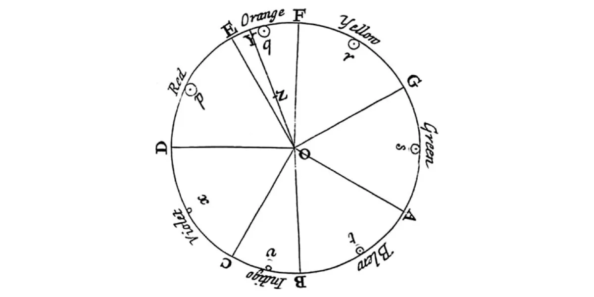
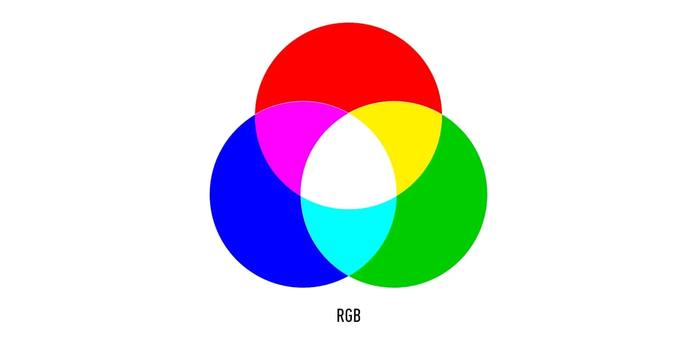
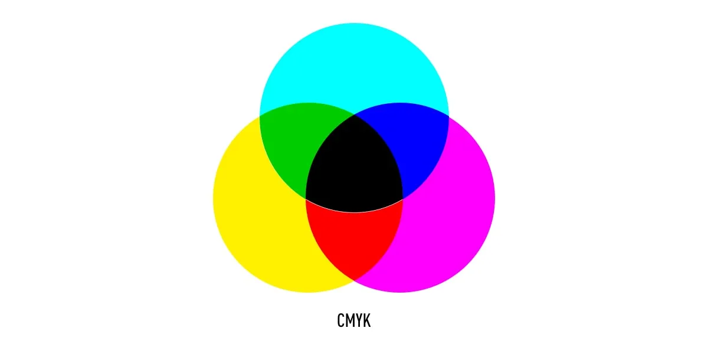
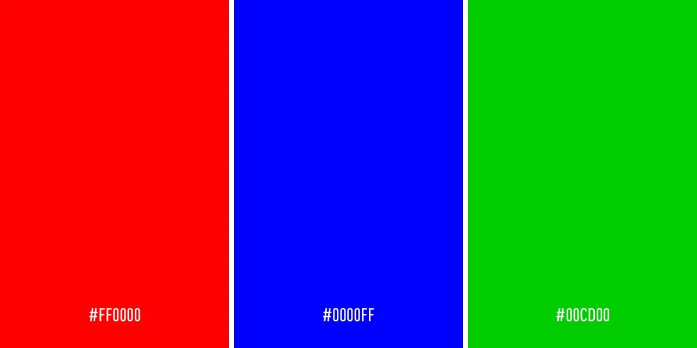
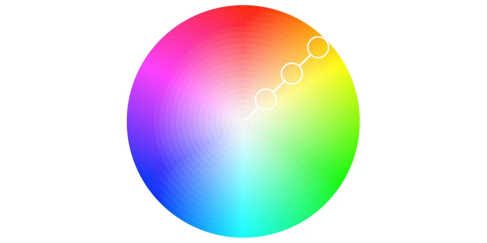
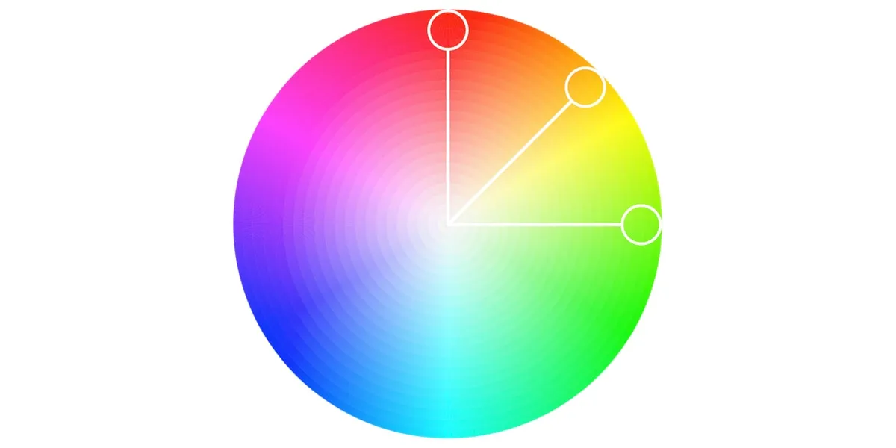
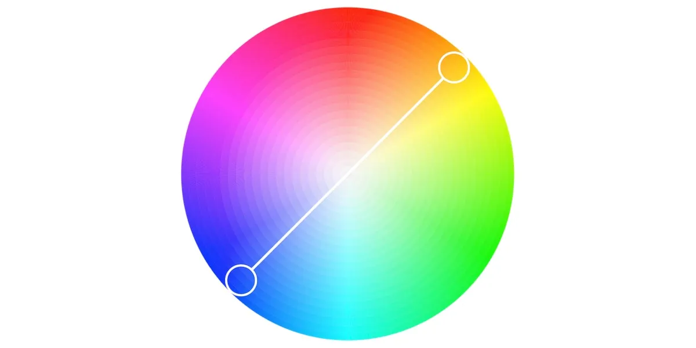
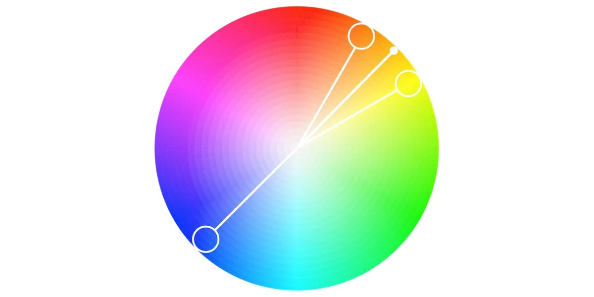
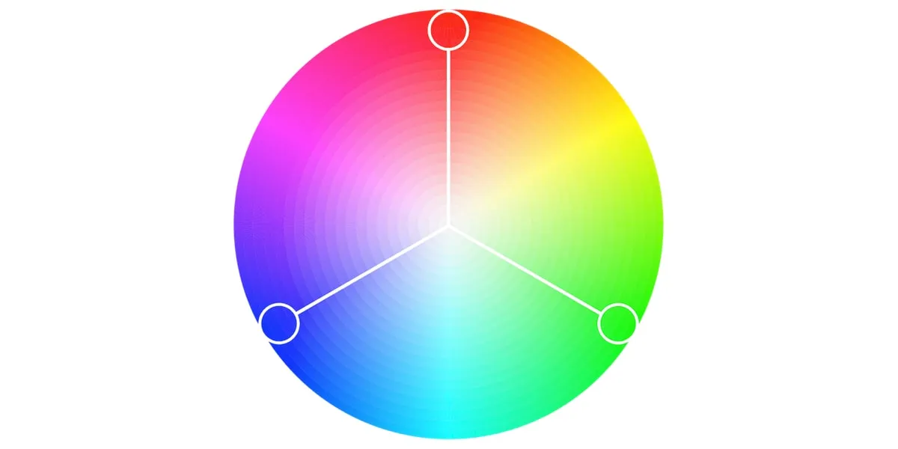

# 注意：这篇文章是关于UI设计的颜色

**Primary colors** 红色、蓝色和黄色。

**secondary colors** 橙色、紫色和绿色

**Tertiary colors** are created by mixing a primary color with a secondary color. The tertiary colors are magenta, vermillion, violet, teal, amber, and chartreuse.
第三色是通过将原色与第二色混合来创建的。第三色是洋红色、朱红色、紫色、蓝绿色、琥珀色和黄绿色。

## 2. Introduction to the color wheel 2. 色轮介绍

You might be thinking, “there are way more than 12 colors out there.” You’re right—and they can all be found on a more advanced version of the color wheel.
您可能会想，“市面上有 12 种颜色。”您是对的，它们都可以在更高级的色轮版本上找到。

The color wheel doesn’t just chart each primary, secondary, and tertiary color—**it also charts their respective hues, tints, tones, and shades.** By visualizing how each color relates to the color that comes next to it on a rainbow color scale, the color wheel helps designers to create bespoke color palettes that promote aesthetic harmony. Let’s dive into these color variants a little deeper:
色轮不仅绘制每种原色、次色和三色，还绘制它们各自的**色调、色调、色调和阴影**。通过可视化每种颜色与彩虹色阶上相邻颜色的关系，色轮可帮助设计师创建定制的调色板，以促进美学和谐。让我们更深入地了解这些颜色变体：

### Hue 色调

Hue refers to the **pure** pigment of a color, **without tint or shade**. In that respect, hue can be interpreted as the origin of a color. Any one of the six primary and secondary colors is a hue.
色相是指颜色的纯颜料，没有色调或阴影。在这方面，色相可以解释为颜色的起源。六种原色和次色中的任何一种都是色相。

### Shade 阴影

**Shade** refers to how much black is added into the hue. As such, shade darkens a color.
阴影是指添加到色相中的黑色量。因此，阴影会使颜色变暗。

### Tint 色调

The **opposite of shade**, tint refers to how much white is added to a color. As such, tint lightens a color.
与阴影相反，色调是指向颜色中添加的白色量。因此，色调会使颜色变亮。

### Tone 语气

**Tone** is the result of a color that has had both white and black added to it. In other words, tone refers to any hue that has been modified with the addition of grey—as long as the grey is purely neutral (only containing white and black).
色调是同时添加了白色和黑色的颜色的结果。换句话说，色调是指通过添加灰色而修改的任何色调，**只要灰色是纯粹的中性色（仅包含白色和黑色）。**

### Color **temperature** 色温

Even if you’re a self-confessed design newbie, you’ve likely heard the terms **“warm, cool and neutral”** tossed around in relation to color. This is referred to as color temperature, and it’s an essential consideration when it comes to color theory.
即使你自认是一个设计新手，你也可能听说过与颜色相关的 “暖、冷和中性 ”这些术语。这被称为色温，在色彩理论方面，这是一个必不可少的考虑因素。

Warm colors contain shades of yellow and red; cool colors have a blue, green, or purple tint; and neutral colors include brown, gray, black, and white. The temperature of a color has a significant impact on our emotional response to it. Within the psychology of colors, for example, warm colors show excitement, optimism, and creativity, whereas cool colors symbolize peace, calmness, and harmony. But we’ll talk a little bit more about color psychology later on!
**暖色包含黄色和红色的阴影;冷色有蓝色、绿色或紫色;中性色包括棕色、灰色、黑色和白色。**颜色的温度对我们对它的情绪反应有重大影响。例如，在色彩心理学中，**暖色表示兴奋、乐观和创造力，而冷色则象征着和平、平静与和谐**。但我们稍后会更多地讨论色彩心理学！

## 3. The importance of color harmony 3. 色彩和谐的重要性

Arguably the most crucial aspect of color theory, **color harmony** refers to the use of color combinations that are visually pleasing for the human eye. Color palettes can either promote contrast or consonance, but as long as they make sense together, they can still result in a visually satisfying effect.
可以说，**色彩和谐是色彩理论中最关键的方面**，是指使用视觉上令人愉悦的颜色组合。调色板可以促进对比或和谐，但只要它们一起有意义，它们仍然可以产生视觉上令人满意的效果。

When it comes to UI design, color harmony is what all designers strive to achieve. Based on the psychological need for balance, **color harmony engages the viewer and establishes a sense of order**. A lack of harmony in a color palette can either result in an interface being **under-stimulating (boring) or over-stimulating (chaotic and messy)**.
在 UI 设计方面，色彩和谐是所有设计师都努力实现的目标。基于对平衡的心理需求，色彩**和谐吸引观众并建立秩序感**。调色板中**缺乏和谐会导致界面刺激不足（无聊）或过度刺激（混乱和凌乱）**。

Unsure about what a user interface looks like? Check out our guide on [what a user interface is, and what you might find within one. ](https://careerfoundry.com/en/blog/ui-design/what-is-a-user-interface/)
不确定用户界面的外观？查看我们的指南，了解什么是用户界面，以及您可能会在其中找到什么。

## 4. Additive and subtractive color models 4. 加法和减法颜色模型

Now that we’ve mastered the color variants, we can move on to adding and subtracting color. Color has two different natures: the tangible colors which can be seen on the surface of objects, and colors that are produced by light. These two types of color are known as the additive and subtractive color models. Let’s take a closer look at what they mean.
现在我们已经掌握了颜色变体，我们可以继续添加和减少颜色。颜色有两种不同的性质：**可以在物体表面看到的有形颜色和光产生的颜色。这两种类型的颜色称为加色和减色模型。让我们仔细看看它们的含义。**

### The additive color model (RGB) 加色模型 （RGB）

RGB stands for red, green, and blue, and is based on the additive color model of light waves that dictates that the more color you add, the closer the color gets to white. The RGB color model forms the basis of all electronic screens, and as a result, is the model used most often by UI designers.
RGB 代表红色、绿色和蓝色，它基于光波的加法颜色模型，该模型指示添加的颜色越多，颜色就越接近白色。RGB 颜色模型构成了所有电子屏幕的基础，因此，它是 UI 设计人员最常使用的模型。

### The subtractive color model (CMYK) 减色模型 （CMYK）

On the other hand, CMYK is known as the subtractive color model, which obtains colors by the subtraction of light. CMYK stands for cyan, magenta, yellow, and black, and it is mostly used in physical printing.
另一方面，CMYK 被称为减色模型，它通过减去光来获得颜色。CMYK 代表青色、品红色、黄色和黑色，主要用于物理打印。

## 5. Introduction to color palettes 5. 调色板简介

So far, we’ve explored the various forms that a color can take, and gotten acquainted with the color model that you’ll use as a UI designer. Now, let’s dive into the fun part: color palettes!
到目前为止，我们已经探索了颜色可以采用的各种形式，并熟悉了您将用作 UI 设计师的颜色模型。现在，让我们深入了解有趣的部分：调色板！

A color palette is a combination of colors used by UI designers when designing an interface. When used correctly, color palettes form the visual foundation of your brand, help to maintain consistency, and make your user interface aesthetically pleasing and enjoyable to use.
调色板是 UI 设计人员在设计界面时使用的颜色组合。如果使用得当，调色板将构成您品牌的视觉基础，有助于保持一致性，并使您的用户界面在美学上令人愉悦和使用起来。

While color palettes date back thousands of years, color palettes are commonly used in digital design, presented as a combination of HEX codes. HEX codes communicate to a computer what color you want to display using hexadecimal values. Back in the ’90s, most digital color palettes only included eight colors. Now, designers have a myriad of shades and hues from the color wheel to choose from.
虽然调色板可以追溯到数千年前，但调色板通常用于数字设计，以十六进制代码的组合表示。十六进制代码使用十六进制值将您想要显示的颜色传达给计算机。回到 90 年代，大多数数字调色板只包含八种颜色。现在，设计师可以从色轮中选择无数的阴影和色调。

Over the next few sections, we’ll learn how to choose and interpret a color palette to ensure you’re creating the best possible interface for your users.
在接下来的几节中，我们将学习如何选择和解释调色板，以确保您为用户创建最佳界面。

## 6. What are the different types of color palettes? 6. 调色板有哪些不同类型？

Colors can be combined to form one of five color palettes that are commonly used by UI designers. Let’s go through them together.
颜色可以组合形成 UI 设计人员常用的五个调色板之一。让我们一起来了解一下。

### Monochromatic 单色的

A popular choice with designers, monochromatic color schemes are formed using various **tones** and **shades** of one single color.
**单色配色方案是设计师的热门选择**，它使用一种颜色的各种色调和阴影形成。

### **Analogous** 类似

An analogous color scheme is formed of three colors that are located next to each other on the color wheel. Analogous color palettes are commonly used when no contrast is needed—for example, on the background of web pages or banners.
相似的配色方案由三种颜色组成，这些颜色在色轮上彼此相邻。**当不需要对比时，通常使用类似调色板**，例如，在**网页或横幅的背景上。**

### **Complementary** 互补

Complementary color palettes are comprised of colors that are placed in front of each other on the color wheel. While the name may suggest otherwise, complementary color palettes are actually the opposite of analogous and monochromatic color palettes, as they aim to produce contrast. For example, a red button on a blue background will stand out on any interface.
互补调色板由在色轮上彼此前面的颜色组成。虽然名称可能并非如此，但互补调色板实际上与相似和单色调色板相反，因为它们旨在产生对比。例如，蓝色背景上的红色按钮将在任何界面上脱颖而出。

### **Split-complementary** 拆分互补

The split-complementary color palette differs from the complementary color palette only in that it employs a higher number of colors. For example, if you choose the color blue, you’ll then need to take the two colors that are adjacent to its opposite color, which in this case would be yellow and red.
拆分互补调色板与互补调色板的不同之处仅在于它使用更多颜色。例如，如果您选择蓝色，则需要采用与其相反颜色相邻的两种颜色，在本例中为黄色和红色。

### **Triadic** 三元组

The triadic color scheme is based on three separate colors that are equidistant on the color wheel. Most designers employ the triadic color scheme by choosing one dominant color, and using the other two colors as accents.
三色配色方案基于三种在色轮上等距的单独颜色。**大多数设计人员通过选择一种主色并使用其他两种颜色作为强调色来采用三色配色方案。**

### **Tetradic 四分体**

Commonly used by more experienced designers, the tetradic color scheme employs two sets of complementary pairs—four colors from the color wheel in total that should form a rectangle when connected. **While it’s a little harder to balance, it makes for a visually stunning end effect!**
通常由更有经验的设计师使用，四色配色方案采用两组互补对——总共四种来自色轮的颜色，连接时应形成一个矩形。**虽然它有点难以平衡，但它会产生视觉上令人惊叹的最终效果！**

## 7. How to choose a color palette 7. 如何选择调色板

Now that we’ve mastered the basics of color theory, let’s look at how you can use this newfound knowledge to select a color palette that tells your brand story and resonates with your audience.
现在我们已经掌握了色彩理论的基础知识，让我们看看如何利用这些新发现的知识来选择能够讲述您的品牌故事并与受众产生共鸣的调色板。

When choosing a color palette for your user interface, here are a few things to consider:
在为用户界面选择调色板时，需要考虑以下几点：

### **Research your audience 研究您的受众**

Emotional responses to colors are can depend on a range of personal factors, including gender, cultural experiences, and age. Before you get started with choosing your color palette, be sure to establish who your audience is. What are their common traits, and what are their expectations? What brands relating to yours are popular among your target audience—and how can you out-do their designs?
对颜色的情绪反应可能取决于一系列个人因素，包括**性别、文化经历和年龄。在开始选择调色板之前，请务必确定您的受众是谁。他们的共同特征是什么，他们的期望是什么？**哪些与您的品牌相关的品牌在您的目标受众中很受欢迎——您如何超越他们的设计？

Conducting structured, thorough research on your target audience will not only help you to fine-tune the story you want to communicate, but it will also help you to prevent a potentially catastrophic design failure.
对目标受众进行结构化、彻底的研究不仅可以帮助您微调要传达的故事，还可以帮助您防止潜在的灾难性设计失败。

To learn more about how to become a better designer, check out our article on [how to avoid the 10 most common UI design mistakes! ](https://careerfoundry.com/en/blog/ui-design/common-ui-design-mistakes/)
要了解有关如何成为更好的设计师的更多信息，请查看我们的文章 如何避免 10 个最常见的 UI 设计错误！

### **Consider color psychology 考虑色彩心理学**

With clarity on your target audience, it’s time to look at the psychology behind your potential brand colors. Color psychology is a branch of psychology surrounding the influence of colors on human mood and behavior. According to color psychology, the human mind subconsciously reacts and interprets colors in a way that influences our actions.
明确了您的目标受众后，是时候看看您的潜在品牌颜色背后的心理学了。色彩心理学是围绕颜色对人类情绪和行为的影响的心理学的一个分支。根据色彩心理学，人类的大脑会下意识地以影响我们行为的方式反应和解释颜色。

If you want to create a color palette that attracts your target audience and accurately tells your brand story, it’s essential to have a basic understanding of color psychology. To get you up to speed, let’s take a look at some of the most common color associations below:
如果您想创建一个能够吸引目标受众并准确讲述您的品牌故事的调色板，则必须对色彩心理学有基本的了解。为了让您快速上手，让我们来看看下面一些最常见的颜色关联：

- **Orange** is energetic and warm. Some common associations with orange include creativity, enthusiasm, lightheartedness, and affordability.
  橙子充满活力和温暖。与橙子的一些常见联想包括创造力、热情、轻松愉快和实惠。
- **Red** is the color of blood, so it’s often associated with energy, war, danger, and power but also passion, desire, and love. Some common associations with red include action, adventure, aggression, and excitement.
  红色是血液的颜色，因此它通常与能量、战争、危险和权力有关，但也与激情、欲望和爱有关。与红色的一些常见联系包括行动、冒险、侵略和兴奋。
- **Yellow** evokes positivity, youth, joy, playfulness, sunshine, and warmth.
  黄色唤起积极、青春、欢乐、俏皮、阳光和温暖。
- **Pink** evokes feelings of innocence and delicateness, gratitude, romance, softness, and appreciation.
  粉红色唤起了纯真和细腻、感恩、浪漫、柔软和欣赏的感觉。
- **Blue** is perceived as authoritative, dependable, and trustworthy. Common associations with blue include calmness, serenity, confidence, dignity, and security.
  蓝色被认为是权威、可靠和值得信赖的。与蓝色的常见联系包括平静、宁静、自信、尊严和安全。
- **Green** is the color of nature. It symbolizes growth, freshness, serenity, money, health, and healing.
  绿色是大自然的颜色。它象征着成长、清新、宁静、金钱、健康和治愈。
- **Black** represents power, elegance, and authority. Common associations with black also include class, distinction, formality, mystery, secrecy, and seriousness.
  黑色代表力量、优雅和权威。与黑色的常见关联还包括阶级、区别、正式、神秘、秘密和严肃。

### Choose your colors wisely 明智地选择您的颜色

Commonly, color palettes are made up of six colors. These colors should include **one dominant color, four accent colors, and one standard color for your text (which is usually black or grey).** Your dominant color is what your customers will forever associate with the brand, so be very careful when reflecting on what this color should be. Take your time to get inspired, keep the color associations in mind, and do some user testing if you have to.
通常，调色板由六种颜色组成。**这些颜色应包括一种主色、四种强调色和一种文本标准色（通常是黑色或灰色）**。您的主色是您的客户将永远与品牌联系在一起的颜色，因此在考虑这种颜色应该是什么时要非常小心。花点时间获得灵感，牢记颜色关联，并在必要时进行一些用户测试。

Note: you’re free to add more or fewer colors depending on your brand personality, and the aesthetic you’re aiming for. Choosing monochromatic, analogous, or complementary colors will help you to achieve a streamlined color palette. Remember: color harmony is the goal here!
注意：您可以根据自己的品牌个性和目标美学自由添加更多或更少的颜色。选择单色、相似色或互补色将帮助您实现流线型调色板。请记住：色彩和谐是这里的目标！

### Don’t skimp on contrast 不要吝啬对比度

Color contrast is core to any interface, as it makes each UI element noticeable and distinct. User interfaces containing only shades from the same color family are unlikely to draw users’ attention—and, moreover, run the risk of being a complete headache to navigate. On the other hand, if copy and background colors contrast each other too much, the text could become illegible.
颜色对比是任何界面的核心，因为它使每个 UI 元素都引人注目且与众不同。仅包含来自同一颜色系列的阴影的用户界面不太可能引起用户的注意，而且，导航可能会非常麻烦。另一方面，如果副本和背景颜色彼此对比太强，文本可能会变得难以辨认。

Designers control the level of contrast depending on what the interface aims to accomplish. Experienced designers strive to create a mild level of contrast and apply high contrasting colors only for elements that are supposed to stand out—such as call-to-actions. This ties into my next point…
设计人员根据界面旨在实现的目标来控制对比度级别。经验丰富的设计人员努力创建温和的对比度，并仅对应该突出的元素（如行动号召）应用高对比度的颜色。这与我的下一点有关......

### Stick to UI conventions 遵守 UI 约定

**When working with colors, it’s easy to get carried away with aesthetics over practicality.** Of course, your interface should be visually pleasing—but it also needs to be accessible, easy to navigate, and enjoyable to use. Of course, it’s great to be experimental—but challenging design conventions with “edgy” designs can confuse your users, and make them work harder than they need to.
**在处理颜色时，很容易被美学而不是实用性所迷惑。**当然，您的界面应该在**视觉上令人愉悦，但它也需要易于访问、易于导航且使用愉快**。当然，实验性是件好事，但挑战“前卫”设计的设计约定可能会使您的用户感到困惑，并使他们比需要的更努力地工作。

Some common UI design color conventions include:
一些常见的 UI 设计颜色约定包括：

- Using a dark color for text to ensure legibility
  对文本使用深色以确保易读性
- Keeping light colors for backgrounds
  保留背景的浅色
- Using contrasting colors for accents (as mentioned above)
  使用对比色作为强调色（如上所述）
- Sticking to classic call-to-action colors—such as red for a warning sign
  坚持使用经典的号召性用语颜色，例如红色表示警告标志

Sticking to these conventions will reduce the cognitive load for your users, and allow them to navigate the interface intuitively.
遵守这些约定将减轻用户的认知负担，并允许他们直观地导航界面。

### Get feedback 获取反馈

Want to know if you’re onto a winning color palette? Conduct some user testing! Color palettes should never be a matter of personal preference, no matter how much you adore the colors you’ve chosen. As we saw when discussing color associations, the emotional response that color can illicit is not to be taken lightly; it can pretty much make or break the relationship a brand has with its customer base.
想知道你是否在选择成功的调色板吗？进行一些用户测试！调色板绝不应该是个人喜好的问题，无论你多么喜欢你选择的颜色。正如我们在讨论颜色联想时所看到的那样，颜色可以非法的情感反应不能掉以轻心;它几乎可以成就或破坏品牌与其客户群的关系。

Getting user feedback at the earliest opportunity will ensure you’re creating an interface using colors that your users will love. Find out [how to conduct a user testing session](https://careerfoundry.com/en/blog/ux-design/user-testing-design-thinking/) in this comprehensive guide.
尽早获得用户反馈将确保您使用用户喜欢的颜色创建界面。在此综合指南中了解如何进行用户测试会话。

## **8. The best tools for choosing a color palette 8. 选择调色板的最佳工具**

When it comes down to the actual task of choosing a color palette for your interface, it’s easy to feel like you have no idea where to start. Luckily, there is a myriad of helpful tools and online color palette generators currently available to give you a dose of inspiration and help you to choose a color palette for your design.
当涉及到为您的界面选择调色板的实际任务时，很容易觉得您不知道从哪里开始。幸运的是，目前有无数有用的工具和在线调色板生成器可以为您提供灵感并帮助您为您的设计选择调色板。

Below, we’ve rounded up the three best tools for generating online color palettes. Take your pick!
下面，我们收集了生成在线调色板的三个最佳工具。随你选！

### Adobe Color

Poised as the “bread and butter” resource for all digital creatives, [Adobe Color](https://color.adobe.com/create) has just about every color palette out there. Compared to other color scheme generators, Adobe Color is a lot more comprehensive—so don’t make it your go-to if you want something quick and simple. Among Adobe Colors’ key features is a color palette generator that pulls colors from the images you upload.
作为所有数字创意的“面包和黄油”资源，**Adobe Color** 几乎拥有所有调色板。与其他配色方案生成器相比，Adobe Color 要全面得多——所以如果您想要快速简单的东西，请不要将其作为您的首选。Adobe Colors 的主要功能之一是调色板生成器，它可以从您上传的图像中提取颜色。

### Coolors 冷却剂

[Coolors](https://coolors.co/) is a useful and beginner-friendly color palette generator, perfect for getting to grips with HEX codes. You can click through random premade color palettes, play around with shades and hues, and save your favorite colors to build your own custom palette. But it’s even more fun to play around with their generator. Once you find a color you love, simply copy-paste it into any external application and start designing!
**Coolors 是一个有用且适合初学者的调色板生成器**，非常适合掌握 HEX 代码。您可以单击随机的预制调色板，玩转阴影和色调，并保存您最喜欢的颜色以构建您自己的自定义调色板。但是玩弄他们的生成器更有趣。找到您喜欢的颜色后，只需将其复制粘贴到任何外部应用程序中并开始设计即可！

### Adobe Illustrator color guide Adobe Illustrator 色彩指南

[Adobe Illustrator Color Guide](https://www.adobe.com/de/products/illustrator.html?sdid=88X75SKP&mv=search&ef_id=EAIaIQobChMI58TS1ZLl5QIVC9TeCh2BCAi6EAAYASAAEgIRkvD_BwE:G:s&s_kwcid=AL!3085!3!341179586064!e!!g!!%2Badobe %2Billustrator&gclid=EAIaIQobChMI58TS1ZLl5QIVC9TeCh2BCAi6EAAYASAAEgIRkvD_BwE) sets itself apart with its popular ‘color guide’ feature. Once you’ve chosen a color, the color guide will generate a five-color palette for you. It will also provide you with a range of tints and shades for each color in the palette. If you switch your main color, the color guide will automatically refresh the corresponding colors to ensure your accent colors are complementary.
Adobe Illustrator Color Guide 凭借其流行的“颜色指南”功能而与众不同。选择颜色后，颜色指南将为您生成一个五色调色板。它还将为您提供调色板中每种颜色的一系列色调和阴影。如果您切换主要颜色，颜色指南将自动刷新相应的颜色，以确保您的强调色互补。

## 9. Final thoughts 9. 最后的思考

If you feel like this was a lot of information to take in, don’t worry! You don’t need to become an expert in color theory in order to be a successful UI designer. Color theory is an extremely complex science that many people dedicate their entire lives to studying. Grasping the basics will help you to understand the psychology behind choosing the perfect color palette for your website or app.
如果您觉得这需要吸收很多信息，请不要担心！您无需成为色彩理论专家即可成为一名成功的 UI 设计师。色彩理论是一门极其复杂的科学，许多人毕生致力于研究。掌握基础知识将帮助您了解为您的网站或应用程序选择完美调色板背后的心理学。