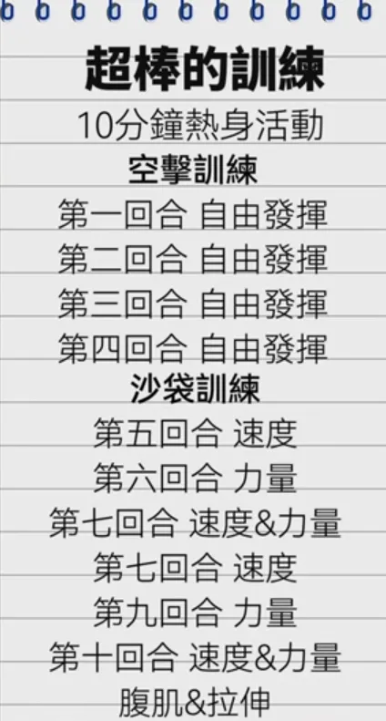
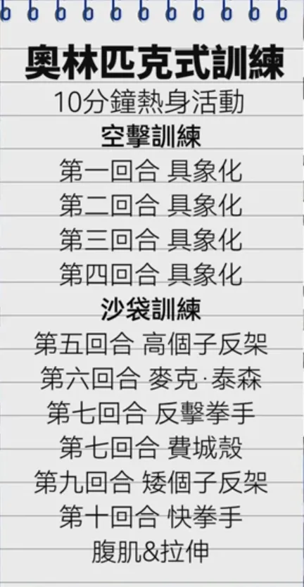
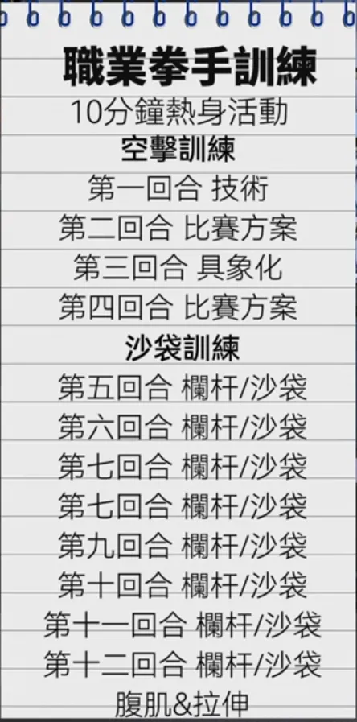
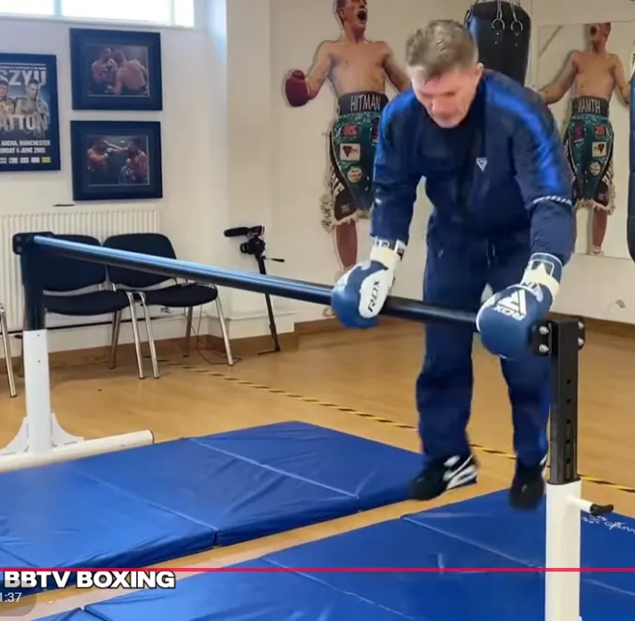

## 少一些真实战，对大脑不好*CTE*

 https://www.youtube.com/watch?v=pr9SrH9zbU8

這影片的重點就是**「享受沒有危險的訓練」**，點到為止的訓練是最安全的

## 脏招：

https://www.youtube.com/watch?v=CVtiIh1v7r0&list=LL&index=8&t=335s

* *打之前说我不想打架，让对方放下防备，然后打击头部KO*
* *前手和对方握手，然后后手重拳KO*
* 抓他的蛋
* 前额撞对方的鼻子
* 打击心口窝，一拳就够了，无论对方多强壮——like 空手道
    * 联想到空手道：踢裆，踹膝盖

## 最佳自卫防身

https://www.youtube.com/watch?v=vcj_9UHg2U8&list=LL&index=2

拳击优势

1. 练习后可以一拳结束战斗
2. *自信心*，坚定的意志
3. 一次同时解决多名对手，比如5秒5拳5个对手——油管上有很多视频，拳击手打到多个小混混

劣势

1. 不适合缠斗

## 完整拳击教程-1小时

https://www.youtube.com/watch?v=jUO8f9q-SUw

1. 防御
2. 转向步
3. 呼吸
4. 头部移动
5. 假动作

## 新手建议

https://www.youtube.com/watch?v=8qho9KWt4ww

1. 无论在什么位置**一直盯着对手，无论多么难堪**

## 练习时别忘了带护齿

## 最重要的三种拳法

-https://www.youtube.com/watch?v=R26XPyEpm4M

* jab
    1. 注意要同时迈步
    2. 同时还能防守，后撤同时出拳
* cross
    1. 出拳时，头不要向前伸
* 前手勾拳

## 步法

https://www.youtube.com/watch?v=LWtUB6Ukp8E

Bob-and-Weave——最基础

## 健身

Bob-and-Weave作为热身

## 如何在沒有教練的情況下練好拳擊？

https://www.youtube.com/watch?v=b8UVozvPKys

每组训练都以腹肌训练结束，在拉伸之前

每次热身后都要空击训练

|                                                              |                                                              |                                                              |
| ------------------------------------------------------------ | ------------------------------------------------------------ | ------------------------------------------------------------ |
|  |  |  |
|                                                              |                                                              |                                                              |

