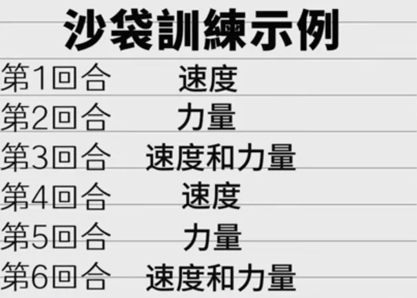

“The best defense is unpredictability”（最好的防御是不可预测）。

不要追求力量，而是将全部注意力放在*完美的姿势、快速的放松和流畅的收回上*。

每次训练都要有一个目标——就像健身一样，每节课有一个目标

> https://www.youtube.com/watch?v=b8UVozvPKys
>
> 理解这个目标(为什么)是*进步*的关键，同时也是巨大的*动机*
>
> 有点像thib的理论，每次课都要有*目标*，每节课都要有*进步*(健身房的进步包括组间歇变短，次数增加)
>
>   

