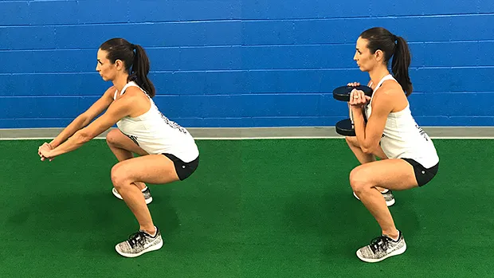
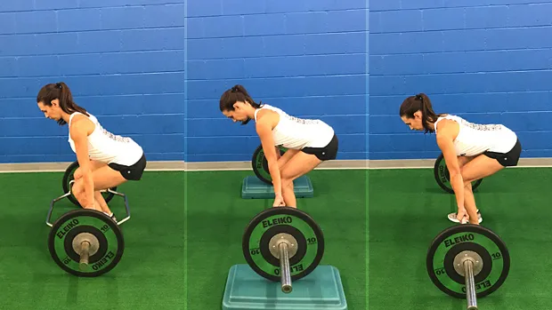

##  6 foundational movement patterns:

> 这6个 模式作者有时候会加上身体部位，例如 hip, upper body等等，有时候不加入

- Squat,
- Hip Hinge,
- Lunge,
- Upper Body Press,
- Upper Body Pull,
- Loaded Carry.

##  [The 6 Foundational Movement Patterns](https://t-nation.com/t/the-6-foundational-movement-patterns/283389)

by Dr. John Rusin 

###   Squat

把“深蹲”看作一个总括性术语。在这个总括性术语下，你会发现杠铃后蹲。但深蹲的动作模式并非针对某项具体的练习。The **pattern is more important than the specific exercise**动作模式比具体的练习更重要，至少如果你的目标是if your **goals are performance and longevity**提高运动表现和持久力的话。

深蹲模式至关重要。它是一种超越健身房用途的运动模式，**适用于日常活动和日常生活中的运动需求**。

每个人都是不同的，因此**每个人的深蹲方式也不同**，尤其是在力量、肌力和肌肥大训练中，深蹲的负重也不同。**确定合适的深蹲进阶是第一步。**

以下是基本的深蹲进阶步骤，用于帮助运动员和举重运动员确定起始点和最佳深蹲模式。我们从基本动作开始，然后逐步过渡到高级动作：

正如你所见，**杠铃深蹲排在最后**。看看你的健身房。深蹲架上背着大杠铃的人，有多少人姿势正确？有多少人看起来正准备做牵引动作？是的，他们需要先回到自重深蹲，把这个动作练好。

而且，*杠铃后蹲甚至不是每个人理想的最终深蹲变式*。关键在于：找到你能完美完成的“最难”变式。这样，你就能不受内在限制地训练深蹲模式，获得良好的训练效果，并最大限度地减少关节压力。目标是随着时间的推移，逐步提升变式列表，并有策略地进步。

一旦确定了最适合你的深蹲变式，下一步就是微调设置和执行。为此，你需要找到适合你身体的深蹲深度。请参阅本文并进行以下测试：[ 深蹲深度：终极答案 ](https://t-nation.com/t/squat-depth-the-final-answer/283393)。

###   Hinge

The hinge is one of the most important patterns when it comes to protecting your lower back from injury, but many people have lost the ability do it.
铰链是保护下背部免受伤害的最重要的模式之一，但许多人已经失去了做到这一点的能力。

髋关节铰链经常与硬拉混淆，而硬拉是髋关节铰链运动的一个特定练习。虽然并非所有髋关节铰链都是硬拉，但所有硬拉都是一种髋关节铰链动作模式。

#####  Hinge Pattern Progressions 铰链模式进展

This pattern needs to be slowly implemented at lower levels to allow motor relearning to take place. Here are the main progressions used to reactivate the hip hinge from the ground up:
这种模式需要在较低水平上缓慢实施，以便进行运动再学习。以下是用于从头开始重新激活髋关节铰链的主要进阶步骤：

1. Bodyweight RDL (Romanian Deadlift)
2. Dumbbell RDL 
3. Barbell RDL
4. Dumbbell Deadlift 
5. *Trap Bar Deadlift* 
6. Barbell Rack Pull (or lifting from blocks/plates)
7. Barbell Deadlift 

###   Lunge

单腿功能是另一种**被忽视**的运动模式。遗憾的是，许多举重运动员并不重视弓箭步的变式。为什么？**主要有两个原因**。首先，弓箭步**无法**像双腿练习那样**使用那么多重量**。其次，弓箭步**很难**。如果你**有任何薄弱环节或功能障碍，弓箭步就能让你迅速发现**。

**很少有动作比单腿变式更能有效地识别薄弱环节、症结所在和疼痛模式**。这些练习可以进行编程以增强力量和肌肉块头，也可以发展成一种技能，通过这种保护性模式来保持身体功能。

#####  Single-Leg Pattern Progressions 单腿模式进展

1. Split Squat 
2. Back Foot Elevated Split Squat
3. Front Foot Elevated Split Squat
4. **Reverse Lunge** 
5. Forward Lunge ——对膝盖压力大
6. **Single Leg Deadlift** 

The single-leg lunge pattern does include more hinge-based movements such as the single-leg RDL and deadlift under its umbrella. While there are overlaps between some of the movement patterns, this doesn't devalue their importance in a good plan built around non-negotiable foundational patterns.
**单腿弓箭步模式确实包含更多基于铰链的动作，例如单腿 RDL 和硬拉**。虽然一些动作模式之间存在重叠，但这并不会降低它们在一个围绕不可替代的基础模式构建的良好计划中的重要性。

> 所以锻炼如果感到疲劳可以换动作，也就是**硬拉最好和单腿硬拉不要在同一天**

In the lunge pattern, be sure to include BOTH the more knee-dominant variations such as **split squats** and the more hip-dominant patterns such as **RDLs** to cover all your bases.
在弓步模式中，一*定要同时包含以膝盖为主的变体（例如分腿蹲）和以臀部为主的模式（例如 RDL），以涵盖所有基础。*

###   Push

从卧推的普及到自重俯卧撑的两极分化，推举练习常常被过分强调，却执行不足。

我们都见过这种情况：新手直接跳到**卧推**，却从未掌握更基础的推举动作——俯卧撑——的稳定性和动态动作要求。这两种动作似乎都是水平方向的运动，并且针对的是相同的肌肉。但在肩部复合体的**静态和动态稳定性方面，它们却截然不同。**

瞧，根据与地面的接触点，运动模式可分为**开链运动和闭链运动**。如果手脚接触的是稳定的表面，例如地面，则运动为闭链运动。如果手脚在空间中自由移动，则为开链运动。

#####  Upper-Body Pushing Pattern Progressions 上肢推举模式进展

#####  Horizontal Pushing 水平推

> 由于心理因素和可能的关节因素，只考虑以下动作：上斜卧推，过顶推举

1. Hands Elevated Push-Up 双手高举俯卧撑
2. Push-Up 俯卧撑
3. Dumbbell Bench Press 哑铃卧推
4. Barbell Bench Press 杠铃卧推

#####  Vertical Pushing 垂直推

1. Single-Arm Dumbbell Overhead Press
2. Dumbbell Overhead Press 
3. Barbell Overhead Press 

The success of a perfect push is highly dependent on the stability of the pillar unit consisting of the hips, core, and shoulder working together. It would be shortsighted not to have a deeper look into more isolated core and hip functional stability, and that's what we'll be looking at in the carry.
完美推举的成功很大程度上*取决于由臀部、核心和肩部共同组成的支柱单元的稳定性*。如果不深入研究核心和臀部更独立的功能稳定性，那就太短视了，而这正是我们在推举中要关注的。

When progressing through the horizontal and vertical pulls, be aware of not only the function and patterning of the shoulder and upper body, but of the entire body, especially the core and hips and their ability to display and maintain good positioning, tension, and control throughout the dynamic motions at the shoulders.
在进行水平和垂直拉伸时，不*仅要注意肩部和上身的功能和模式*，还要*注意整个身体，特别是核心和臀部*，以及它们在肩部动态运动过程中展示和*保持良好定位、张力和控制的能力。*

###   Pull

The upper-body pull pattern may be the most misunderstood pattern of the upper body, especially as it pertains to developing bulletproof shoulders and a resilient back.
上身拉伸模式可能是最容易被误解的上身模式，特别是因为它与锻炼坚韧的肩膀和有弹性的背部有关。

We know that strong and stable shoulders depend on pulling more than pushing, but where many athletes miss the boat is not differentiating between types of pulling and the planes of motion that each pull takes place in.
我们知道，*强壮而稳定的肩膀更多地依赖于拉而不是推*，但许多运动员错失的机会是没有区分拉的类型和每次拉发生的运动平面。

In order to create full-body stability at the shoulders through the pull, the horizontal pull (the row) must first be mastered before introducing the more complex vertical pull variations off the pull-up bar and beyond.
为了通过拉动在肩部建立全身稳定性，必须**首先掌握水平拉动（划船）**，**然后再引入引体向上**杆及**其他更复杂的垂直拉动**变化。

#####  Horizontal Pulling 水平拉动

1. Chest Supported Row 胸部支撑划船
2. Inverted Row 倒立划船
3. Single Arm Dumbbell Row
   单臂哑铃划船
4. Barbell Bent Over Row
   杠铃俯身划船

The vertical pull pattern needs to be de-emphasized in training sessions, and re-emphasized in evaluation of pillar function into the overhead position. While earning the right to get back up on the pull-up bar, don't hesitate to use the vertical pull to evaluate overhead positions at the gleno-humeral joint, rhythm of the scapula, or stability at the core and pelvis.
在训练中，需要淡化垂直拉力模式的强调，并在评估过顶姿势的支柱功能时重新强调。在掌握重新站到引体向上杆上的能力时，不要犹豫，运用垂直拉力来评估过顶姿势下肩胛骨关节的活动、肩胛骨的节奏，以及核心肌群和骨盆的稳定性。

#####  Vertical Pulling 垂直拉动

1. Lat Pulldown 引体向上
2. Assisted Pull-Up 辅助引体向上
3. Pull-Up 引体向上

Once you've mastered the vertical and horizontal pulling patterns, strategic programming around these two planes of motion needs to be addressed. A majority of lifters will do well with a 2:1 ratio between horizontal to vertical pulling. Keep this in mind in terms of total reps completed over a weekly workload.
掌握了垂直和水平拉动模式后，就需要围绕这两个运动平面进行策略性训练。*大多数训练者在水平和垂直拉动比例为 2:1* 时效果良好。在计算每周训练量的总次数时，请记住这一点。

#####  Upper Body Pulling Pattern Progressions 上肢拉伸模式进展

###   Carry

Moving your body through space with smooth stability and control has become a lost art. While the carry pattern can absolutely include loaded variations like the farmer's walk, this pattern is more broadly associated with generalized locomotion of the body. From walking to running, sprinting to reactionary agility, an athlete must display the ability to control his body through space and under a multitude of challenges.
以流畅、稳定和控制的方式在空间中移动身体已成为一门失传的艺术。虽然搬运模式当然可以包含像**农夫行走**这样的负重变化，但这种模式更广泛地与身体的一般运动相关。从**步行到跑步，从冲刺到敏捷反应**，运动员**必须展现出在空间中以及在各种挑战下控制身体的能力。**

**核心肌群需要发挥其最初的功能，即在四肢之间传递力量。**

想要提升运动表现或缓解疼痛，就**必须挑战该区域的近端稳定性以及远端灵活性和负重**。正因如此，**除了短跑训练、负重搬运和推/拖雪橇之外，步行也是智能训练计划的基础动作。**

#####  Carry and Locomotion Pattern Progressions 携带和运动模式进展

1. Walking 步行
2. Farmer's Carry 农夫行走
3. Unilateral Farmer's Carry
   单侧农夫行走
4. Front Loaded Carry 前载式携带
5. Mixed Grip Carry 混合握法携带
6. Overhead Carry 过顶搬运

##  6 Foundational Movements That Every Person On Earth Needs To Master

###  Squat 蹲

###  Hip Hinge 髋关节铰链

###  Lunge (Single Leg) 弓步（单腿）

**The lunge movement is an excellent movement pattern to build a strong, resilient lower body**. Compared to your typical squats and deadlifts, single leg movements like the lunge require additional stability through the foot, ankle, knee, and hip and are a **worthwhile addition to any high-performance training routine.**
**弓箭步动作是打造强健、有弹性的下半身的绝佳运动模式** 。与典型的深蹲和硬拉相比，像弓箭步这样的单腿动作需要脚、脚踝、膝盖和臀部额外的稳定性，因此**对于任何高性能训练来说，都是值得加入的。**

Lunges can be incorporated as a primary lower body strength training movement for rapid and as an accessory movement aimed at triggering functional hypertrophy. Typically, I'll **alternate between three lunge movement patterns: The split squat, the forward lunge, and the step back lunge**. All three can be loaded with dumbbells, barbells, kettlebells, and nearly any other training modality at your disposal.
弓箭步可以作为快速下肢力量训练的主要动作，也可以作为辅助动作，旨在触发功能性肌肥大。通常，我会**交替进行三种弓箭步动作模式：分腿蹲、前弓箭步和后撤弓箭步** 。这三种动作都可以搭配哑铃、杠铃、壶铃以及几乎任何其他你熟悉的训练方式进行负重训练。

**Split Squats** are the least complex on the lunge movement patterns and an excellent starting point for engraining single leg stability and building the lateral subsystem without unnecessary complexity. I prefer these for higher rep work focused on pure hypertrophy due to the increased metabolic stress in the split position.
**分腿蹲**是弓箭步动作中最简单的，也是培养单腿稳定性和构建侧向子系统的绝佳起点，无需太多复杂度。我更喜欢用分腿蹲进行高次数、纯粹的肌肉肥大训练，因为分腿姿势下代谢压力更大。

**The Lunge**, or forward lunge is an excellent single lunge movement for building the quads and grooving a declaration movement mechanic. In addition, the forward lunge hammers the quads into massive growth, but also requires increased tibial inclination, which increases shear stress at the knee. If knee pain is a common problem, consider removing forward lunges from your training.
**弓箭步** ，又称前弓箭步，是一个优秀的单弓箭步动作，可以锻炼股四头肌，并形成一个标志性的动作机制。此外，前弓箭步能显著促进股四头肌生长，但也需要增加胫骨倾角，从而增加膝关节的剪切应力。*如果膝关节疼痛是常见问题，请考虑从训练中移除前弓箭步。*

**The Step Back Lunge** is an excellent lunge variation to take stress off of the knee compared to a forward lunge and load up the glute and hamstring to a greater degree. Due to the step back nature, the tibia stays vertical, reducing shear stress on the knee for pain-free gains.
**后退弓箭步**是一种很好的弓箭步变式，相比前退弓箭步，它能减轻膝盖的压力，并更大程度地刺激臀部和腿筋。由于后退弓箭步的本质，胫骨保持垂直，从而减少了膝盖的剪切应力，从而减轻了疼痛。

###  Push (Upper Body) 推举（上身）

###  Pull (Upper Body) 拉（上身）

**1. Gain Stability at the Shoulders Before You Pull 拉起前保持肩膀稳定**

在**练习**引体向上**技巧**时，**跳**上单杠是你**最不想**考虑的事情。如果你使用高杠姿势，可以在单杠下方放置一个箱子或长凳。

**2.** **Use a Straight-Leg Position in Front of Your Body****2.** **身体前方伸直双腿**

很多时候，运动员在引体向上时会屈膝并向后伸展臀部，以改变拉力线，以“更强”的姿势进行补偿，掩盖虚弱或运动障碍的存在。这与你追求完美无痛的引体向上完全相反。

**3.** **Contract** **Your Glutes, Quads and Core During the Movement****3.** 在运动过程中**收缩****臀肌、股四头肌和核心肌群**

###  Loaded Carry 负重携带

**Loaded carries are one hell of a way to build resilient core stiffness, grip strength, and improved shoulder stability**, all while developing a brutal total body work capacity.
**负重行走是锻炼核心力量、握力、肩部稳定性的好方法** ，同时还能提高全身的工作能力。

Loaded carries are also considered a self limiting exercises, which means that they are damn hard to cheat in terms of hoisting too much weight or using poor technique. **Self limiting exercises like the loaded carry are some of the safest ways to develop pain-free strength and function**, while also providing a huge training effect and moving some serious weight.
负重行走也被认为是一种自我限制性训练，这意味着很难通过举起过重的重量或使用错误的技术来作弊。 **像负重行走这样的自我限制性训练是发展无痛力量和功能的最安全的方法之一** ，同时还能提供强大的训练效果并举起相当大的重量。