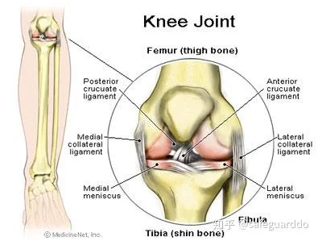
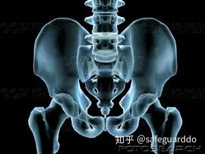

## Summary

* 简单说：no 卧推、杠铃划船

* 基本上，过去20年来，去健身房的人们已经由健美式的分化训练方法，进步到了更高级的、基于动作形式的训练方法。

    事实上，“动作而非肌肉”这个短语几乎已经被滥用了。实话实说，这是一种进步。我想，大多数优秀的重物训练者在思考训练时，已经摒弃了旧的胸、肩、肱三头肌的分类，*进步到了推、拉、人体前部链条、人体后部链条的分类*。

* 我们又回到了前面的问题。大多数背部疼痛并不是因为背部本身出了问题，而是因为**髋关节或踝关节**的灵活性不足。背部只是牺牲品。要解决背部损伤，我的建议是，引用背部训练专家Stuart McGill的话：“**避开脊柱”**。
    是的，那就是我和McGill试图说明的问题。背部疼痛并不是因为背部肌肉软弱无力。背部疼痛源于过度使用，主要是对弯曲力量的过度使用。大重量深蹲和硬拉都能够发展弯曲力量。

* 腰椎（稳定性）结论，永远**不要使用任何旋转躯干**的机器。在下背部热身动作中消除一切躯干的扭转、卷绕动作。正如McGill所说：“避开脊柱。”
    过去十年来，人们一直在谈论核心稳定性，而不是核心灵活性。腰椎需要的是稳定性，而不是灵活性。**深蹲**时，将**杠铃**置于背部**较高**的位置，上体**前倾幅度小一些**；**硬拉时，背部保持平直**。如果你曾经有过下背部疼痛，可以采用**单腿动作**。

* 肩胛胸关节（稳定性）正如我们大家所知，由于我们迷恋仰卧推举动作**（卧推），肩袖肌腱炎**已经成了重物训练世界里的荣誉徽章了。
    当他们练习划船动作时，他们喜欢采用**俯身划船**。以这种方法训练肩胛骨稳定性，通常会**危及腰椎的安全**。大多数（如果说不是全部的话）重物训练者需要做更多针对肩胛胸关节的划船动作，以及*肩胛胸关节的孤立动作*。

## Content

我的好友、物理治疗家Gray Cook非常善于把复杂的问题变简单。他能够用简洁的语言描述一个复杂的思考过程，使得这种思想看上去很简单。我羡慕他的这种能力。最近我们一起讨论了训练对人体的影响，Cook就一个问题展示了他最为明晰的思考过程之一，而这个问题是我闻所未闻的。

我们当时讨论的是他的Functional Movement Screen评估体系（[http://www.functionalmovement.com](https://link.zhihu.com/?target=http%3A//www.functionalmovement.com)）。简单来说，Functional Movement Screen是用于评估人体的灵活性和稳定性的一种体系。

如果你除了自己训练之外，还指导其他运动员训练，我强烈推荐你访问一下这个网站，了解一下这个体系。这些测试有助于识别人体的不同关节的需求，以及在各种训练动作中关节所发挥的功能。

Functional Movement Screen的优点之一是，它使得我们可以区分稳定性问题与灵活性问题。Cook的思路很简单，他使我认识到，训练和矫正训练的未来可能不是基于动作，而是基于关节的。

Cook对人体的分析非常简单易懂。在他看来，人体是由一堆关节组成的。每个关节或一系列关节都有着专门的功能，它的机能不良的方向和程度都是可预知的。因此，每个关节对于训练都有着特殊的需要。着眼于关节，由下向上来分析人体，我们看到的是：

关节的首要训练需求

踝关节灵活性（尤其是在[矢状面](https://zhida.zhihu.com/search?content_id=9052882&content_type=Article&match_order=1&q=矢状面&zhida_source=entity)上）

膝关节稳定性

髋关节灵活性（多平面）

腰椎稳定性

胸椎灵活性

肩胛胸关节稳定性

盂肱关节灵活性

你马上就会注意到：当我们沿着链条由下向上推导时，不同关节对灵活性和稳定性的需求恰好是交替出现的。踝关节需要提高灵活性，膝关节需要提高稳定性。

再向上看，显然髋关节需要的是灵活性。再向上也是如此：不同关节的需求是交叉的。

你也许会问自己：“这跟重物训练有何关系？”这些知识能帮助我提高深蹲重量吗？是的，当然。

基本上，过去20年来，去健身房的人们已经由健美式的分化[训练方法](https://zhida.zhihu.com/search?content_id=9052882&content_type=Article&match_order=1&q=训练方法&zhida_source=entity)，进步到了更高级的、基于动作形式的训练方法。

事实上，“动作而非肌肉”这个短语几乎已经被滥用了。实话实说，这是一种进步。我想，大多数优秀的重物训练者在思考训练时，已经摒弃了旧的胸、肩、[肱三头肌](https://zhida.zhihu.com/search?content_id=9052882&content_type=Article&match_order=1&q=肱三头肌&zhida_source=entity)的分类，进步到了推、拉、人体前部链条、人体后部链条的分类。

我想，我们在许多[力量训练](https://zhida.zhihu.com/search?content_id=9052882&content_type=Article&match_order=1&q=力量训练&zhida_source=entity)者身上发现的损伤和技术问题都与适当的关节功能有着紧密的联系，与关节机能不良有着更加紧密的联系。你被搞糊涂了？让我试着解释一下。简单来说，当一个关节出现问题之后，它的表现形式是，它上方或下方的某个关节出现了疼痛等问题。

最简单的例子就是深蹲。我们都知道，深蹲的最大问题表现在深度。如果你难以蹲得很低，老派的教练会建议你抬起脚跟。

谈到踝关节，我们也许不理解灵活性与稳定性的区别，但我们都明白：穿着训练靴深蹲，我们可以很容易地蹲得很低。也就是说，有跟的鞋子（训练靴）弥补了踝关节灵活性的不足。因此，如果你在深蹲时蹲得不够低，你需要做的是训练踝关节灵活性。

你见过多少人因为背部疼痛而中断了深蹲？原因是什么？髋关节灵活性不足。

下方关节的机能不良（对于下背部而言，是髋关节）似乎会影响到上面的一个或几个关节（腰椎）。换句话说，当髋关节无法移动时，腰椎就被迫移动了。

问题在于，髋关节就是为灵活性而生的，腰椎就是为稳定性而生的。本该具备灵活性的关节（髋关节）如果不够灵活，本该具备稳定性的关节（腰椎或腰骶关节）就会被迫移动，以作为补偿。于是，这个关节的稳定性下降，慢慢地出现了疼痛。换句话说，如果你缺乏[髋关节灵活性](https://zhida.zhihu.com/search?content_id=9052882&content_type=Article&match_order=3&q=髋关节灵活性&zhida_source=entity)或踝关节灵活性，你在深蹲时会使得上体过度前倾，将压力转移到背部。

这个推导过程很简单：

·缺乏踝关节灵活性，导致膝关节疼痛

·缺乏髋关节灵活性，导致下背部疼痛

·缺乏胸椎灵活性，导致颈部和肩部疼痛（或下背部疼痛）

踝关节（灵活性）

基于关节来分析人体，我们首先看到的是踝关节。在跳跃类运动中，踝关节灵活性不足，会导致着陆时的压力转移到它上面的关节：膝关节。

事实上，我认为篮球鞋的硬度与taping和[bracing](https://zhida.zhihu.com/search?content_id=9052882&content_type=Article&match_order=1&q=bracing&zhida_source=entity)有着直接的正相关关系，而且经常会导致篮球选手及其他需要做出跳跃的运动员出现膝－股骨综合症（ADD膝关节前部疼痛链接）。

当我们试图保证踝关节的稳定性时，我们付出了惨痛的代价。我们发现许多出现膝关节疼痛的运动员有着踝关节灵活性不足的问题。很多时候，他们后来又出现了踝关节扭伤，再晚些又出现了bracing和taping。

在重物训练中，正如上文所说，踝关节灵活性不足会导致深蹲时上体过度前倾，试图更多地利用髋部伸肌的力量。想知道自己的踝关节灵活性有无问题，你可以做一下FMS过顶深蹲测试。

（视频见原文）

做一次[过顶深蹲](https://zhida.zhihu.com/search?content_id=9052882&content_type=Article&match_order=2&q=过顶深蹲&zhida_source=entity)。如果手臂前移了（严格来说，手臂可以稍微前移，但角度要与躯干保持一致），就抬起脚跟。

如果抬起脚跟之后，手臂就不需要前移了，说明问题主要在于[踝关节](https://zhida.zhihu.com/search?content_id=9052882&content_type=Article&match_order=16&q=踝关节&zhida_source=entity)。那么，你如何判断这是一个灵活性问题，还是一个柔韧性问题呢？再做一个简单的测试。做出小腿伸展动作。你感觉到小腿肌肉有强烈的拉伸感，还是感觉下肢被锁住了，无法前移？

（视频见原文）

如果你感觉小腿肌肉有强烈的拉伸感，说明你的柔韧性不足，你可以多练习小腿伸展动作。如果你感觉下肢被锁住了，说明你的灵活性不足。柔韧性问题可以通过伸展运动来解决，灵活性问题可以通过关节[灵活性训练](https://zhida.zhihu.com/search?content_id=9052882&content_type=Article&match_order=1&q=灵活性训练&zhida_source=entity)来解决。如果你认为这两者没有区别，说明你需要多花一点时间学习。

[膝关节](https://zhida.zhihu.com/search?content_id=9052882&content_type=Article&match_order=7&q=膝关节&zhida_source=entity)（稳定性）

膝关节本身结构简单，容易解释明白。膝关节需要的是稳定性。它们属于[屈戌关节](https://zhida.zhihu.com/search?content_id=9052882&content_type=Article&match_order=1&q=屈戌关节&zhida_source=entity)，只允许出现极小幅度的旋转。想一想深蹲和[直腿硬拉](https://zhida.zhihu.com/search?content_id=9052882&content_type=Article&match_order=1&q=直腿硬拉&zhida_source=entity)吧，这很简单。

膝关节相关训练的主要问题是，如果髋关节灵活性不足，就有可能导致背部损伤。深蹲和硬拉都是很棒的训练动作，但如果运动员的踝关节和髋关节灵活性不足，就有可能损伤下背部。

我们又回到了前面的问题。大多数背部疼痛并不是因为背部本身出了问题，而是因为髋关节或踝关节的灵活性不足。背部只是牺牲品。要解决背部损伤，我的建议是，引用背部训练专家Stuart McGill的话：“避开脊柱”。

McGill在自己的两本书中强调，大多数背部疼痛并不是源于背部[肌肉软弱无力](https://zhida.zhihu.com/search?content_id=9052882&content_type=Article&match_order=1&q=肌肉软弱无力&zhida_source=entity)。事实上，McGill的研究非常清楚明白。那些背部受伤的人往往有着强有力的[背部伸肌](https://zhida.zhihu.com/search?content_id=9052882&content_type=Article&match_order=1&q=背部伸肌&zhida_source=entity)，而不是背部肌肉软弱无力。

是的，那就是我和McGill试图说明的问题。背部疼痛并不是因为背部肌肉软弱无力。背部疼痛源于过度使用，主要是对弯曲力量的过度使用。大重量深蹲和硬拉都能够发展弯曲力量。

髋关节（灵活性）

谈到髋关节，我们的灵活性、稳定性法则似乎遇到了挑战。我的朋友Jason Ferrugia（[http://www.j1strength.com](https://link.zhihu.com/?target=http%3A//www.j1strength.com)）最近经常谈到髋关节灵活性。Jason认为，一切髋关节灵活性训练都是在浪费时间。

我写文章反驳了他的观点。事实上，我认为，在发展力量的过程中，髋关节灵活性至关重要。正如上文所说，出色的髋关节灵活性使得我们可以利用多关节训练动作来提高下肢的力量。

Jason在文章中说，灵活性和柔韧性是一回事。事实上，它们不是。柔韧性是针对肌肉而言的，表明的是肌肉可以拉伸到某种长度的能力。灵活性针对关节而言的，用于描述动作。

髋关节非常复杂，值得关注。我写过一篇关于屈髋的全面性介绍的文章，我现在正在写一篇关于髋部内收的文章。

髋关节与其在上体的副本——肩关节一样，有可能既不灵活又不稳定；不灵活是因为缺乏柔韧性、动作幅度不足，不稳定是因为肌肉软弱无力，采用的双腿力量训练动作太多，或者采用的[机器训练](https://zhida.zhihu.com/search?content_id=9052882&content_type=Article&match_order=1&q=机器训练&zhida_source=entity)太多。

不稳定会导致膝关节疼痛（髋关节周围的肌肉软弱无力会导致[股骨内旋](https://zhida.zhihu.com/search?content_id=9052882&content_type=Article&match_order=1&q=股骨内旋&zhida_source=entity)和内收），不灵活及其导致的上体过度前倾会带来背部疼痛。一个关节怎么会变得既不灵活又不稳定呢？这真是个有意思的问题。

髋部在弯曲或伸展过程中的肌肉软弱无力和（或）不灵活会导致腰椎做出相应的补偿性动作。深蹲时这种问题就很常见。根据我们的上方关节、下方关节理论，深蹲时髋部动作幅度不足会威胁下背部的安全。

当髋部力量和灵活性不足时，脊柱被迫移动作为补偿，这就导致了髋部灵活性的进一步下降。看起来，髋部力量不足会导致不灵活，而不灵活又会导致脊柱的补偿性动作。结果就是一道谜题：一个关节既需要多平面的力量，又需要多平面的灵活性。

让我们进一步分析这种相互影响。髋部肌肉软弱无力，无法限制内收动作，导致压力转移到了膝关节。我们从前把这个问题过度简单化了，归因到了[臀中肌](https://zhida.zhihu.com/search?content_id=9052882&content_type=Article&match_order=1&q=臀中肌&zhida_source=entity)软弱无力，事实上软弱无力的还包括臀大肌和髋部旋转肌群。

在这种情况下，我们需要的是[冠状面](https://zhida.zhihu.com/search?content_id=9052882&content_type=Article&match_order=1&q=冠状面&zhida_source=entity)控制，以预防膝－股骨问题、IT Band问题等。在矢状面上，[髂腰肌](https://zhida.zhihu.com/search?content_id=9052882&content_type=Article&match_order=1&q=髂腰肌&zhida_source=entity)、髂肌软弱无力和（或）活跃性不足会导致以腰椎动作代替屈髋动作。

臀肌力量和（或）活跃性不足会导致腰椎做出补偿性伸展动作，试图以此代替[伸髋动作](https://zhida.zhihu.com/search?content_id=9052882&content_type=Article&match_order=1&q=伸髋动作&zhida_source=entity)。换句话说，如果你无法使膝部上移（即[屈髋](https://zhida.zhihu.com/search?content_id=9052882&content_type=Article&match_order=3&q=屈髋&zhida_source=entity)），你就会弯曲腰椎，以做出看上去类似的动作。

腰椎（稳定性）

腰椎的情况更加有趣。下背部的一系列关节显然需要的是稳定性，近年来在核心稳定性领域的一切研究都证明了这一点。

奇怪的是，我认为我们过去10年来在训练方面所犯的最大错误是，在这个显然需要稳定性的区域，积极尝试去提高其[静态与动态](https://zhida.zhihu.com/search?content_id=9052882&content_type=Article&match_order=1&q=静态与动态&zhida_source=entity)的动作幅度。

换句话说，朋友，你并不需要使[下背部伸展](https://zhida.zhihu.com/search?content_id=9052882&content_type=Article&match_order=1&q=下背部伸展&zhida_source=entity)。相信我，我明白你可能会怎么说。“旋转的感觉很好。”我在伸展时感觉也不错。我在《旋转真的是一个好主意吗？》一文中解释了这个问题。

当教练们告诉我“我做某件事时感觉很好”，我会告诉他们，抓挠伤口上的痂感觉也很好。但是，这样只会导致流血、留下疤痕。

我对下背部的旋转伸展就是这么看的。这就像是挠痂。我认为，大多数（如果说不是全部的话）针对腰椎的旋转动作都是误导。Sahrmann（《[运动损伤](https://zhida.zhihu.com/search?content_id=9052882&content_type=Article&match_order=1&q=运动损伤&zhida_source=entity)综合症的诊断与治疗》）、Porterfield和DeRosa（《机械性下背部疼痛：功能性[解剖学](https://zhida.zhihu.com/search?content_id=9052882&content_type=Article&match_order=1&q=解剖学&zhida_source=entity)展望》）都指出，不建议去尝试提高腰椎动作幅度，这样有可能导致损伤。

我认为，由于我们对胸椎灵活性缺乏了解，才导致我们试图提高腰椎的旋转范围，这真是大错特错。下面，让我们回到重物训练吧。

结论，永远不要使用任何旋转躯干的机器。在下背部热身动作中消除一切躯干的扭转、卷绕动作。正如McGill所说：“避开脊柱。”

过去十年来，人们一直在谈论核心稳定性，而不是核心灵活性。腰椎需要的是稳定性，而不是灵活性。深蹲时，将杠铃置于背部较高的位置，上体前倾幅度小一些；硬拉时，背部保持平直。如果你曾经有过[下背部疼痛](https://zhida.zhihu.com/search?content_id=9052882&content_type=Article&match_order=4&q=下背部疼痛&zhida_source=entity)，可以采用单腿动作。

胸椎（灵活性）

胸椎是我们所知最少的一个区域。许多[物理治疗](https://zhida.zhihu.com/search?content_id=9052882&content_type=Article&match_order=2&q=物理治疗&zhida_source=entity)家似乎在建议提高胸椎灵活性，但很少有人知道专门针对胸椎灵活性的训练动作。

这种情况似乎是“我们知道你需要它，但我们不确定如何得到它。”我认为，过去几年来，人们设计出了更多的提高胸椎灵活性的训练动作。有趣的是，在《运动损伤综合症的诊断与治疗》一书中，物理治疗家Shirley Sahrmann提倡发展胸椎灵活性，限制腰椎灵活性。

我们在热身动作中加入了一个简单的胸椎灵活性训练动作，帮助胸椎找回失去的动作幅度。

（视频见原文）

以重物训练者的观点来看，胸椎灵活性似乎不太重要。但如果你曾为下背部或颈部疼痛所苦，[胸椎灵活性训练](https://zhida.zhihu.com/search?content_id=9052882&content_type=Article&match_order=2&q=胸椎灵活性训练&zhida_source=entity)将会帮助你将压力从腰椎和颈椎上移开。

肩胛胸关节（稳定性）

让我们随着动力学链条继续向上，我们来到了[肩胛胸关节](https://zhida.zhihu.com/search?content_id=9052882&content_type=Article&match_order=3&q=肩胛胸关节&zhida_source=entity)，它是上体的中转站。这是肩胛骨与躯干的交界处，对于肩部健康也非常重要。

按照我们的逻辑，这个关节需要的是稳定性。对于重物训练者而言，它是保证肩袖部位健康的关键。正如我们大家所知，由于我们迷恋仰卧推举动作（卧推），[肩袖肌腱炎](https://zhida.zhihu.com/search?content_id=9052882&content_type=Article&match_order=1&q=肩袖肌腱炎&zhida_source=entity)已经成了重物训练世界里的荣誉徽章了。

Charles Poliquin经常谈到斜方肌下部力量，以及它与肩部健康的关系。肩胛胸关节周围的肌肉通常软弱无力，潜力没有得到开发。大多数力量项目运动员的背部训练不足，尤其缺乏中背部训练动作，比如划船。

当他们练习划船动作时，他们喜欢采用俯身划船。以这种方法训练肩胛骨稳定性，通常会危及腰椎的安全。大多数（如果说不是全部的话）重物训练者需要做更多针对肩胛胸关节的划船动作，以及肩胛胸关节的孤立动作。

下面这些针对[斜方肌](https://zhida.zhihu.com/search?content_id=9052882&content_type=Article&match_order=2&q=斜方肌&zhida_source=entity)下部的俯卧举臂动作，也就是Y’s、T’s、W’s、L’s（U’s），都是以[肩胛稳定肌](https://zhida.zhihu.com/search?content_id=9052882&content_type=Article&match_order=1&q=肩胛稳定肌&zhida_source=entity)为目标的。

（视频见原文）

做一次简单的测试：做一组极限次数的[反式划船](https://zhida.zhihu.com/search?content_id=9052882&content_type=Article&match_order=1&q=反式划船&zhida_source=entity)。

（视频见原文）

你能做10次吗？大多数“壮汉”如果做出胸触横杠的全程动作，都完不成10次。当他们失败之后，他们马上就会拿出借口手册。1号借口是，他们的块头太大，限制了胸触横杠的动作。

我的回答是：为什么你的块头不影响卧推呢？此时，他们通常会闭上嘴，同时去发展菱形肌和斜方肌下部等[牵引肌](https://zhida.zhihu.com/search?content_id=9052882&content_type=Article&match_order=1&q=牵引肌&zhida_source=entity)的力量。你照镜子时看不到它们，并不表示它们不重要。

肩部

盂肱关节的情况与髋关节相似。盂肱关节是为灵活性而生的，但常常出现灵活性不足的情况。

肩部是一个复杂的系统；其中，盂肱关节与肩胛胸关节有着强烈的相关性。正如俗话所说：“你不可能在小船上使用[加农炮](https://zhida.zhihu.com/search?content_id=9052882&content_type=Article&match_order=1&q=加农炮&zhida_source=entity)。”

肩胛胸关节是一个稳固的基础，灵活的肩部要在这个基础上做动作。要使盂肱关节正确发挥功能，我们需要利用肩胛稳定肌使肩部锁定在缩回、下压的位置上。

底线是，稳定的肩部联合体将会带来健康的肩部联合体。要促成这种相互关系，最佳动作是倚墙滑动。对于盂肱关节而言，倚墙滑动是一个提高动作幅度的训练动作；对于肩胛胸关节而言，倚墙滑动是一个稳定性动作。

（视频见原文）

倚墙滑动的诀窍是当盂肱关节试图使手臂向头上移动时，使肩胛骨保持缩回、下压。

很多初学者做这个动作时会感觉斜方肌下部、[菱形肌](https://zhida.zhihu.com/search?content_id=9052882&content_type=Article&match_order=2&q=菱形肌&zhida_source=entity)疼痛。诀窍是，向上滑动时，前臂必须与墙保持接触，肩胛骨保持靠下、靠后。

如果你完不成这个动作，不要惊讶。你需要花一些时间来掌握它。在不感觉疼痛的前提下，手臂尽量向上移动即可。刚开始动作幅度可能会很小，但请相信我，你会慢慢进步的。

站在重物训练者的立场上，需要记住的是，有助于肩部健康的动作是你自己看不到的。我想，大多数训练者应该先做好倚墙滑动，再尝试大重量的过顶动作。

我还认为，考虑到[盂肱关节](https://zhida.zhihu.com/search?content_id=9052882&content_type=Article&match_order=8&q=盂肱关节&zhida_source=entity)的稳定性和灵活性的需要，健身球或Bosu俯卧撑以及哑铃单侧动作大有可为。

当关节无法正常发挥功能时，就会对它上方或下方的关节施加压力。在“Ultra Prevention”一书中，作者们完美地描述了我们当前对待损伤的反应。他们的比喻很简单：我们对待损伤的反应就好比，当我们听到烟雾报警器发出鸣叫时，我们跑过去切断了它的电源。

疼痛就像报警器的鸣叫一样，只是潜在问题的报警信号。膝部疼痛时，采用冰敷，而不是去检查踝关节或髋关节，那就好比是切断了报警器的电源。

我们需要认识到的是，“我们变老得太快了，醒悟得太晚了。”[奥斯卡·王尔德](https://zhida.zhihu.com/search?content_id=9052882&content_type=Article&match_order=1&q=奥斯卡·王尔德&zhida_source=entity)说过：“当我开始明白一些道理时，我已经太老了。”

每一天，我都能够学到一些关于人体的更多的知识。我学到的一切把我变成了一个更好的教练，一个更好的教育家。我学到的很多东西与自己从前相信的东西是相抵触的。你只需要记住，古人曾经认为大地是一个平面。