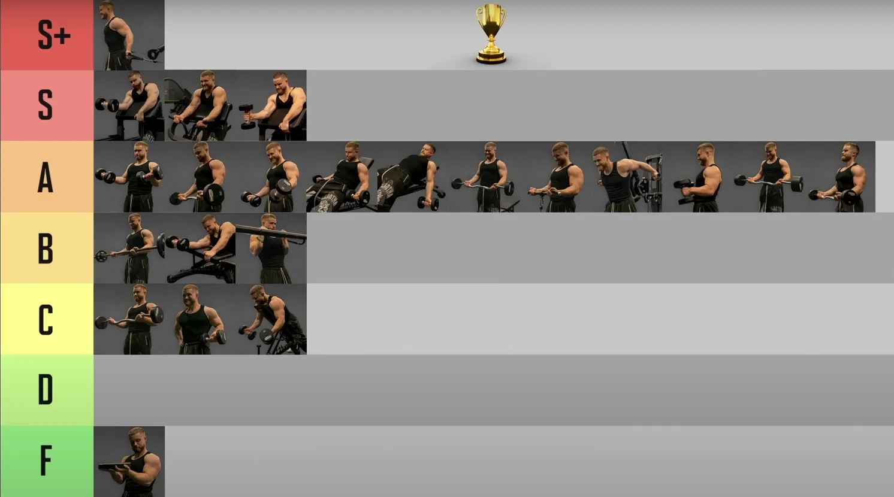

## 肱二头肌

*第一个动作很容易确定，斜板弯举*

> 教练让我用直角，但是其实用途不同，还是斜板更好
>
> * 斜板通过肩部后倾增加肱二头肌长头的拉伸范围，强调峰值塑造。
> * 峰值收缩不强但拉伸刺激更大。斜板更适合细节发展，直角凳适合做大重量阶段。
> * 三剑客推荐

*ez bar vs 杠铃 弯举，对肱二头肌刺激程度和保护手腕 这两个角度 ez bar 都是完胜*

*牧师凳拉伤风险非常非常高*

主要类型是快肌纤维

**二头肌与三头肌锻炼的不同：三头肌在推类无论如何都会发力，而二头肌我们在背部训练中常说注意不要让手臂发力，所以复合动作中二头肌受到的锻炼时比较少的，所以最好两个动作**

## 长头与短头综述

这里时翻译的reddit，是热心人提供的所以可能是错的，因为显然即使一个人的意见在这里面也反复修改过，但是参考

是的，因此，为了锻炼肱二头肌的**长头**，你可以选择将手臂放在**身体后方**进行弯举练习，例如**上斜哑铃弯举（**我个人最喜欢的）或背对绳索弯举。为了锻炼肱二头肌的**短头**，你可以在**身体前方**进行弯举，即**牧师凳弯举**（器械、绳索、哑铃或杠铃）或**蜘蛛弯举**。**此外，站姿交替哑铃弯举和杠铃弯举通常会使短头比长头更加偏向**。需要说明的是，*任何类型的弯举都会针对两个头，此信息只是为了让你知道如何使每个头都偏向另一个头*。值得一提的是，*通过在旋前或中立腕位进行弯举来训练肱肌*（不确定拼写是否正确）。例如，**哑铃锤式弯举或杠铃/ez 杆反向弯举就是其中几种。**

编辑：**这是错误的。进一步研究发现**，肩部在伸展和屈曲方面的定位会影响肌肉位置的延长/缩短。为了调整肱二头肌的不同头的位置，你应该在练习中**更多地进行内旋（短头偏向）或外旋（长头偏向）**。需要注意的是，如果你不是高级举重运动员，并且两个头之间没有明显的不平衡，那么你实际上不需要调整任何一个头的位置。*只需在练习中保持变化，并保持内旋/外旋相对一致即可*。

所以，事实证明我错了，很抱歉。我误解了我的信息来源，**肩部伸展和屈曲**会影响肌肉的缩短*和延长*部分。同**样的道理，大多数推举动作会训练胸肌/三角肌前束的延长部分，而推举和前平举则会偏向缩短部分**。要*偏向二头肌的短头，你需要进行更多的肩部内旋。长头则需要进行外旋。再次为我的错误信息深感抱歉。*

你懂的！我顿悟了！！！我早该知道的……几年前我第一次做上斜哑铃弯举的时候就看出来了……是啊，*关键在于姿势*，如果在*身体外侧，就多用长肌，如果在身体内侧，就多用短肌*！就像牧师椅或者腿内侧一样……妈的，我刚试了一下，很容易就能看出……目标是在内侧或外侧的位置放松你的手臂……也许你的手臂会稍微弯曲……但只要轻轻地做个小动作，你就会看到区别了……当它在腿内侧时，弯曲的方向更多是向二头肌内侧，而当它在外侧时，就像上斜卧推一样……弯曲，哇，整个二头肌就会从右边弹起来。从来不知道这个

### 长头

#### DB Incline Curl 

单臂哑铃斜板弯举（Single-Arm Dumbbell Incline Curl）--30-45度斜角

1. 盖伊三人组- 两个人推荐

2. 每侧10-12次，3组

3. 主要激活肱二头肌**长头**，因为**斜板**让肩部处于**伸展**位置（手臂后倾），长头被**充分拉伸**。

4. **控制下降，保持肘部位置固定，避免肩膀代偿。**

5. **斜板增加拉伸范围**，强化长头的激活，适合塑造肱二头肌的“峰值”。

    **孤立性强，减少代偿**，适合专注肌肉收缩感。

#### DB Waiter' s Curl

注意不要让前臂参与

 

### 短头

#### DB Preacher Curl 

####  DB Seated Curl Plus 

#### DB “no money” Curl 

#### DB Spider Curl 

杠铃蜘蛛弯举是最好的短头二头肌锻炼方法之一，因为它可以限制动量，提供极佳的运动范围，并提供生长所需的必要负荷。

### Miscellaneous

### Brachialis 

DB Robot Curl——funny

---

1. 

2. 单臂绳索锤式弯举（Single-Arm Cable Hammer Curl）
    1. 每侧10-15次，3组。
    2. **Cable** 设备，提供**恒定张力**，动作路径与斜板弯举不同，强调肱肌和前臂屈肌，同时保持单侧训练风格。
    3. 主要激活**肱肌**（brachialis），其次是肱二头肌（长头和短头均衡）和前臂屈肌。
    4. **轻重量**高重复更适合绳索动作，**强调控制**而非冲量。

3. ~~ez bar 弯举~~

    1. 双侧运动，暂时不做

4. ~~Preacher~~

    1. 短头
    2. 我推荐斜板弯举是因为它能更好地拉伸长头，塑造肱二头肌的整体线条，而Preacher弯举更偏向短头，**动作范围较小**，可能与你的目标（全面发展和单侧训练）稍有偏差
    3. **单臂Preacher**弯举虽然可行，但动作**稳定性要求较高**，初学者可能需要适应，且相比斜板弯举，**单侧感不如站姿或仰卧动作明显。**
    4. **动作路径固定，缺乏肩部角度变化**，可能与你喜欢的左右屈伸的“新奇感”相比刺激稍显单一。

## ———名人建议———

##  Athlean-X

###  Biceps

best： Alt. Standing DB Curls

almost best： Incline DB Curls , Chinups, ez Barbell Curls 

##  盖伊三人组：一个动作

二头肌：ez 弯举，db坐姿上斜curl，db坐姿上斜curl ——  两个人都是完全下垂哑铃

##  Thib

| 类别                       | Primary                      | Secondary                                                    | Auxiliary                                | Remedial                                                     |
| -------------------------- | ---------------------------- | ------------------------------------------------------------ | ---------------------------------------- | ------------------------------------------------------------ |
| 手臂屈肌（肱二头肌、肱肌） | 站姿杠铃弯举，牧师凳杠铃弯举 | 锤式弯举，坐姿哑铃弯举及其变化动作，牧师凳哑铃弯举，正握杠铃弯举（站姿或使用牧师凳），Zottman弯举 | 机器弯举，钢索弯举及其变化动作，集中弯举 | 长柄锤或托尔之锤前臂转动（肘部紧贴体侧，弯曲90度，手握锤柄下半段。在起始动作中，采用正握，即掌心向下，拇指向内。接下来，肘部不动，转动前臂。一直转到掌心向上，拇指向内。） |

##  The Best Damn Back and Biceps Workout 最佳背部和二头肌锻炼

- Barbell Curl or EZ-Bar Curl
  杠铃弯举或 EZ-Bar 弯举

##  The Best And Worst Biceps Exercises

> S：db preacher curl, db preacher hammer curl
>
> A : DZ bar curl, DB curl， lying DB curl, stand cable curl