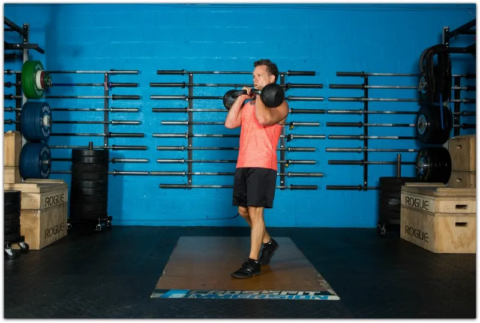
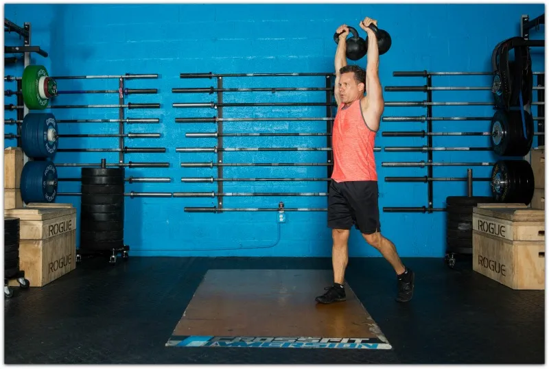
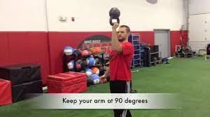
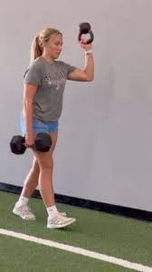

## **FARMERS CARRIES** 

最好不用哑铃，撞腿，壶铃重量似乎也不够

## **3-RACKED CARRIES** (the intense abs carry)

These are brutal folks. I prefer to use kettlebells with racked carries and you have the option of using one bell or two (two is harder, of course).
这些人真是够狠的。我更喜欢用壶铃架，而且你可以选择用一个壶铃，也可以用两个（当然，两个比较难）。

You pick up the bell and carry it in the “racked” position, which is in front of your body with your hand(s) positioned approximately in front of your clavicle.
你拿起铃铛并将其放在“架起”的位置，即放在身体前方，双手大约位于锁骨前方。

The ab contraction is intense as racked carries *force* your abs and trunk musculature to fire at a very high level to keep stability. Mental toughness is required here.
架式负重训练会*迫使*你的腹肌和躯干肌肉高度发力以保持稳定，因此腹部收缩非常剧烈。这时，你需要具备强大的心理韧性。

I should probably do these more often, to be honest.
*说实话，我应该更频繁地这样做。*

### **DOUBLE RACKED KETTLEBELL CARRY 双架壶铃携带**

**4-OVERHEAD CARRIES (aka Waiter's Walk)** (the shoulder stability carry)
**4-过顶行走（又称侍者行走）** （肩部稳定性行走）

This is simply carrying the weight in the overhead position with the arm fully extended.
这只是将重物举过头顶，手臂完全伸展。

The overhead carry can be done with one arm or two. If you've not done a lot of carries in this way or you have shoulder concerns, use only one bell.
过顶搬运可以用一只手臂或两只手臂完成。如果你之前没怎么用过这种搬运方式，或者肩膀不舒服，可以只用一只铃铛。

This carry is excellent for shoulder stability because the shoulder girdle musculature and rotator cuff is firing throughout the exercise to hold the bell in place.
这种携带方式对于肩部稳定性非常有益，因为肩带肌肉和肩袖在整个锻炼过程中都在发力，以将铃固定在适当位置。

### **DOUBLE KETTLEBELL OVERHEAD CARRY 双壶铃过顶举**

**5-BOTTOMS UP KETTLEBELL CARRIES** (the full-body-intensity carry)
**5-臀部向上壶铃搬运** （全身强度搬运）

Renowned spine rehab expert, Dr. Stuart McGill, has described the bottoms up kettlebell carry as *the* way to forge athleticism.
著名脊柱康复专家斯图尔特·麦吉尔博士将自下而上携带壶铃描述为锻炼运动能力的*方法* 。

As with any asymmetrical kettlebell carry, it's excellent for activating the deep abdominal wall muscles and the quadratus lumborum (an important muscle involved in hip and trunk motion and stability).
与任何不对称壶铃携带一样，它非常适合激活深层腹壁肌肉和腰方肌（参与臀部和躯干运动和稳定性的重要肌肉）。

In the bottoms up kettlebell carry, the kettlebell simply inverted to the upside down position.
在底部向上携带壶铃时，壶铃只需倒置到倒置位置即可。

You keep the elbow tucked close to the body and this position forces you to grip the bell *very* hard.
你要将肘部紧贴身体，这个姿势迫使你*紧紧*抓住铃铛。

The core stiffening that's going on with this is extremely high because you have to tighten everything to prevent the kettlebell from losing position. It's wild how the inverted kettlebell position intensifies things.
这项训练的核心肌肉张力非常高，因为你必须收紧所有肌肉，才能防止壶铃移位。倒置壶铃姿势的强度之大，简直不可思议。

In McGill's research, the core activation was even higher in the bottoms up carry in nearly all muscles. Again, it's intense.
在麦吉尔的研究中，在自下而上提举动作中，几乎所有肌肉的核心激活度都更高。同样，它非常激烈。

If you've never tried a bottoms up carry, start with lighter kettlebell to experience what it feels like. This is one you definitely want to get a feel for in the beginning.
如果你从未尝试过倒立壶铃，不妨先从轻一点的壶铃开始体验一下。这绝对是你一开始就应该尝试的。

Dr. McGill has stated that every program *designed to enhance athleticism* requires a carry task.
麦吉尔博士表示，每个*旨在提高运动能力的*项目都需要一项携带任务。

### 其他

