## 肌肉类型

 Type I 和 Type II  几乎各占50%

*前束：哑铃坐姿推肩*——这个动作其实中束锻炼的更多

*后束：face pull*

*中束：侧平举 / cable*

## 三角肌前束

* shoulder press推举最有效
* 前平举的负重要远低于肩上推举，所以如果疲劳不能做shoulder press 可以做前平举，更孤立的训练

### angle

**60度**以上就可以

### DB OR BB

优选**哑铃**

* 在**激活度**，站姿和坐姿中 哑铃都好于杠铃
* 但是在站姿1rm 比较中杠铃显著高于哑铃

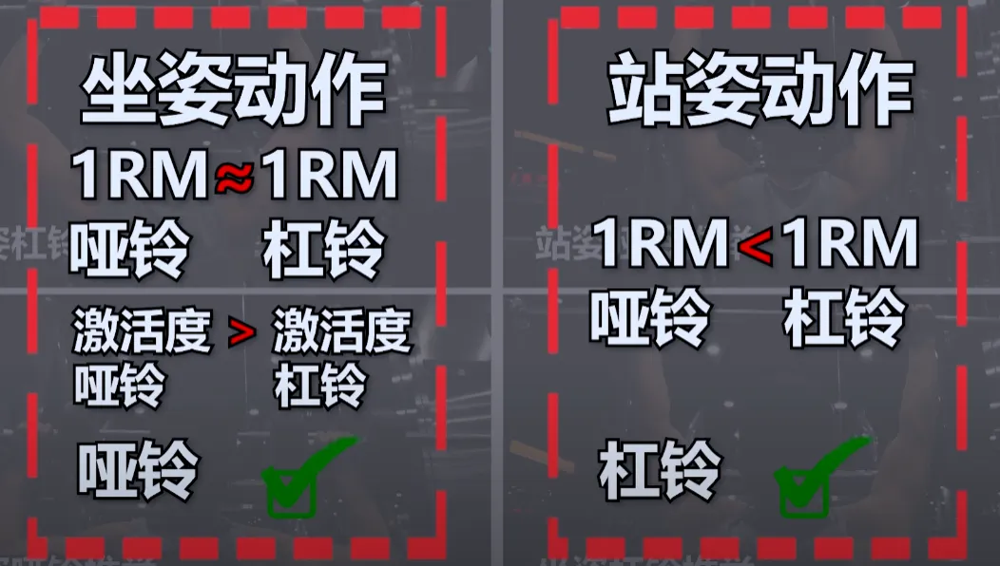

## Face Pull

* 更好的对抗圆肩，大部分人前部的锻炼太多

### 两种位置

#### 胸部齐平

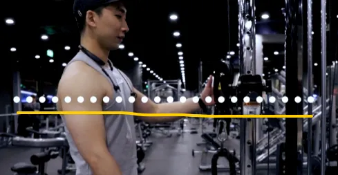

#### 稍高于头顶

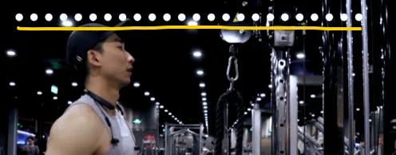

### 两种握法

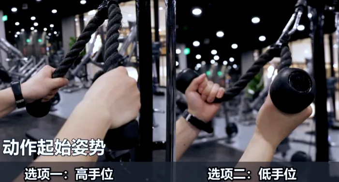

#### 高手位

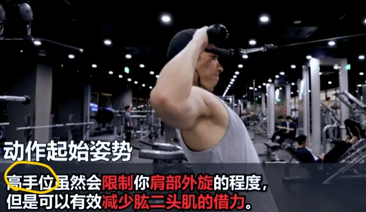

#### 低手位

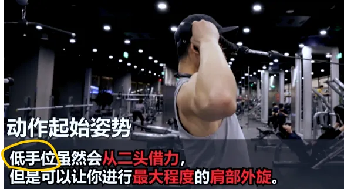

### 综合 

作者最终有两种练法，当然自己可以开发别的

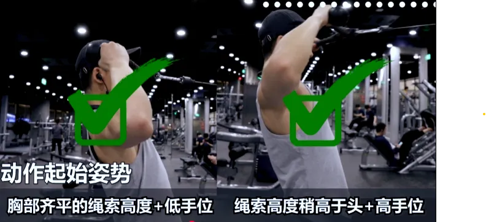

## 三角肌中束

 哑铃侧平举，或者cable侧面拉

### 侧平举tips

* 不能完全直立，一定要轻微俯身，或者轻微俯身靠在凳子上，否则锻炼不到
* 轻重量
* 不是手臂带动，是肘部带动，

side 绳索侧拉或者哑铃

* 后面：单侧蝴蝶机
* face pull
* push press——thib建议

## ———名人建议———

## 白天手術房晚上健身房

肩膀

唯一：杠铃肩推

替代：哑铃肩推

##  Thib

| 类别               | Primary                                                      | Secondary                                                    | Auxiliary                                                    | Remedial                                                     |
| ------------------ | ------------------------------------------------------------ | ------------------------------------------------------------ | ------------------------------------------------------------ | ------------------------------------------------------------ |
| 上背部、三角肌后束 | 反手引体向上及其变化动作，正手引体向上及其变化动作，胸部支撑划船，俯身杠铃划船，T杠划船 | 单臂哑铃划船，T杠下拉及其变化动作，钢索坐姿划船及其变化动作，墙角划船，胖子引体向上（反式划船），坐姿对颈绳子握柄划船 | 直臂下拉，钢索仰卧直臂上拉，高位滑轮交叉划船，低位滑轮交叉划船，机器坐姿划船，机器背阔肌下拉，俯身侧平举，机器反飞鸟，胸部支撑上斜俯身侧平举 | 胸部支撑上斜哑铃耸肩，坐姿钢索耸肩（肩胛骨缩回），上斜俯卧平举 |
| 肩部               | 肌肉挺举，（站姿杠铃）肩上推举，借力推举，坐姿杠铃肩上推举   | 坐姿及站姿哑铃肩上推举及其变化动作，阿诺德推举，斯科特/Thib推举，肌肉抓举 | 机器肩上推举，侧平举及其变化动作，前平举及其变化动作，侧平举机 | 古巴推举，肩外旋                                             |

##  Athlean-X

一个动作刺激整体：**对握哑铃、杠铃推肩，倒立伏地挺身**

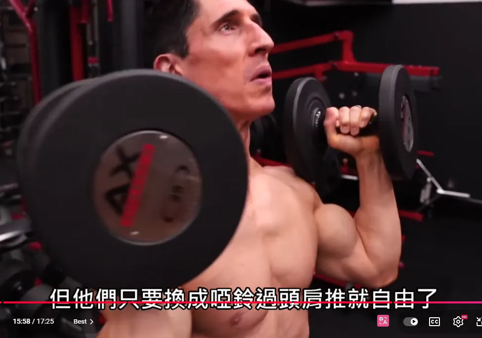

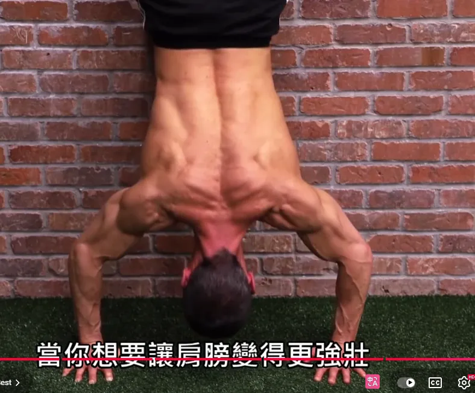

best： 哑铃前平举， cable 侧平举，rear delt row（有点像教练教给我的动作）

almost best：scoop press（前束）， 侧平举(中束)，Dumbbell Hip Hugger（后束）

##  盖伊三人组：一个动作

* 哑铃坐姿press——前，中
* db 侧飞鸟——中
* 杠铃 press——全身性，站姿同时也能锻炼：屁股夹紧，肚子收腹

##  The Best Damn Shoulder and Trap Workout 最佳肩部和斜方肌训练

https://t-nation.com/t/inside-the-muscles-best-shoulders-and-trap-exercises/284619

Based on the results of this experiment, I bet the following would be one kick-ass workout that'd target the front, mid, and rear delts as well as the upper traps. Enjoy!
根据这次实验的结果，我敢打赌，下面的训练计划一定会非常有效，不仅能锻炼到三角肌前束、中束、后束，还能锻炼到斜方肌上束。好好享受吧！

- Seated Behind the Neck Press
  坐姿颈后推举
- Band **Face Pull** 带面拉
- **Cable Lateral Raise** 绳索侧平举
- Barbell Shrug 杠铃耸肩

##  The Best And Worst Shoulder Exercises

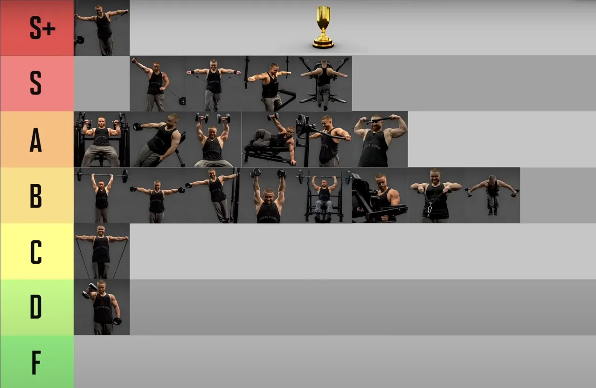

> S：**cable lateral raise**， ， behind ...（这个第一次见到，短期应该不会做），**reverse pec deck（健身房有）**
>
> A: **Machine shoulder press**（这个针对front，可以不做）， Lean  side db lateral raise(这个是s系列的db版本)， db overhead press，**Face pull**
>
> front：Machine shoulder press
>
> side：cable lateral raise，
>
> rear：cable版本健身房没有，用第二个版本*reverse pec deck*
>
> 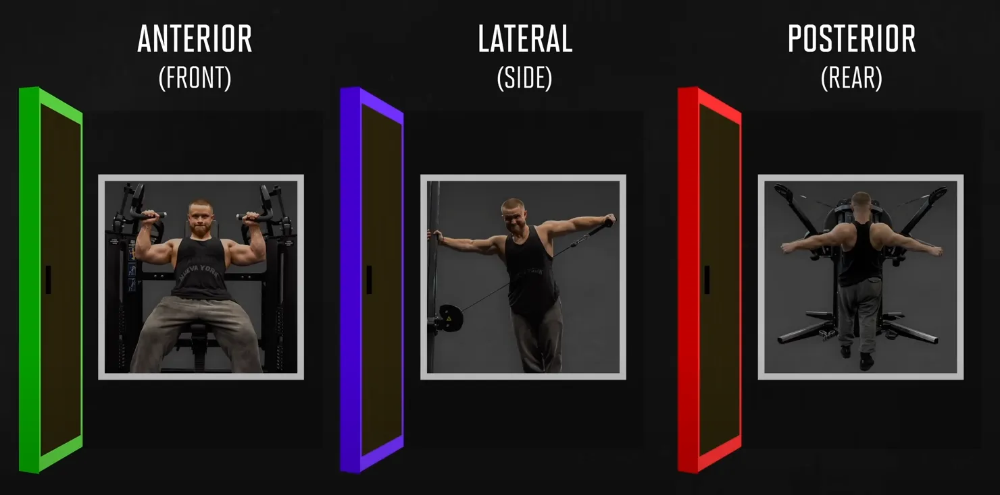

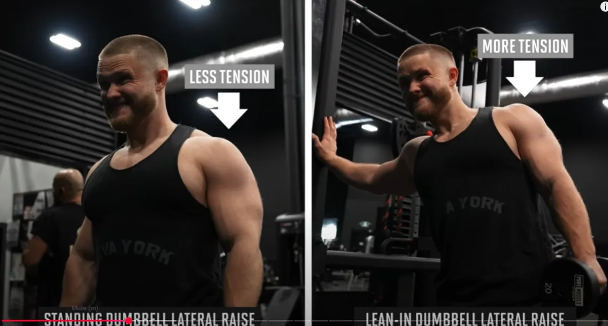