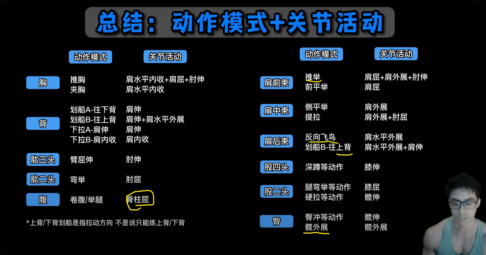
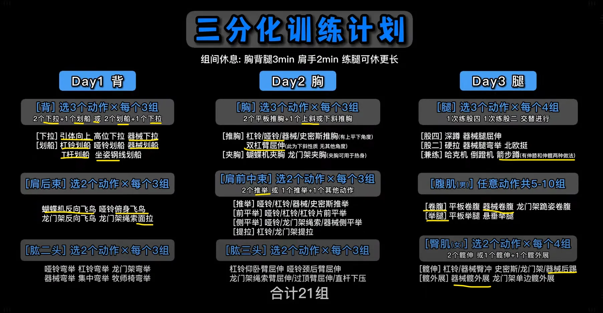
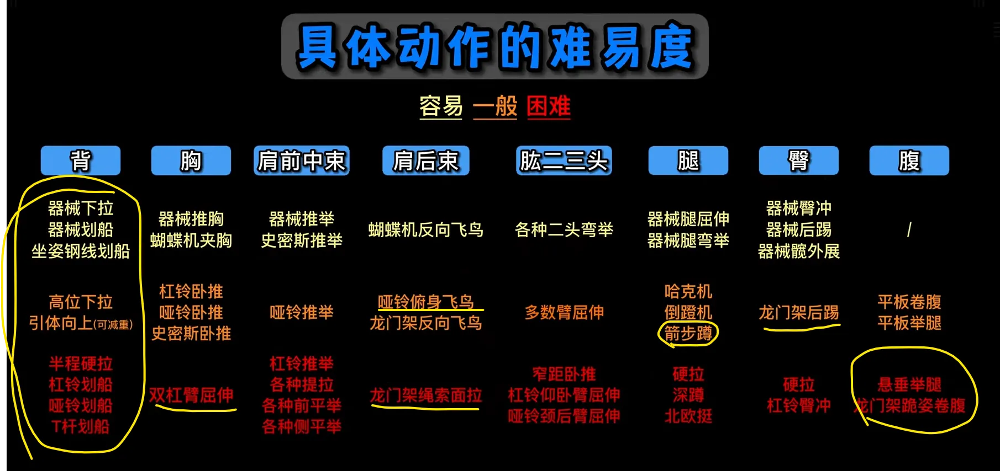
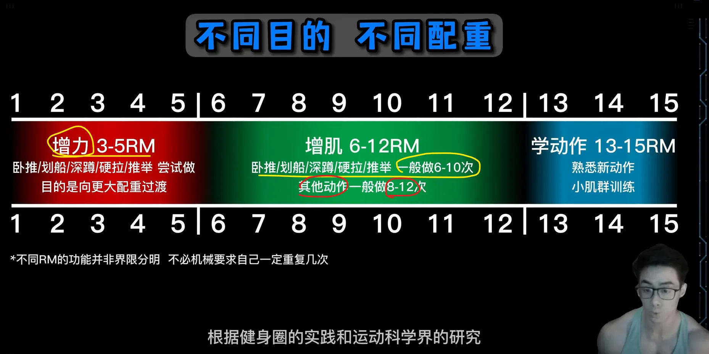
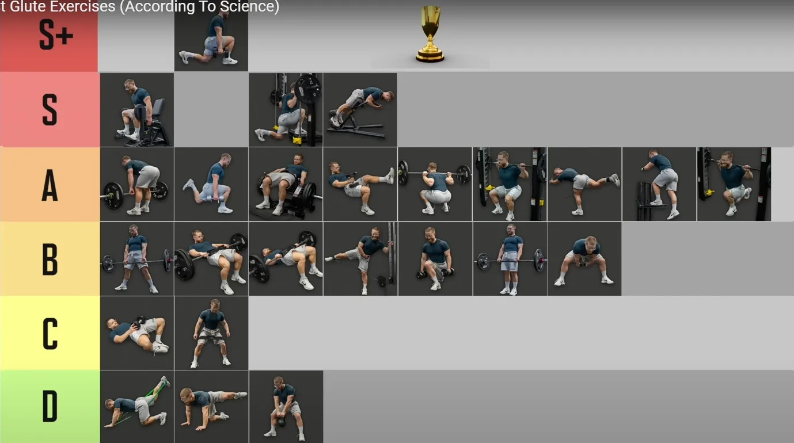
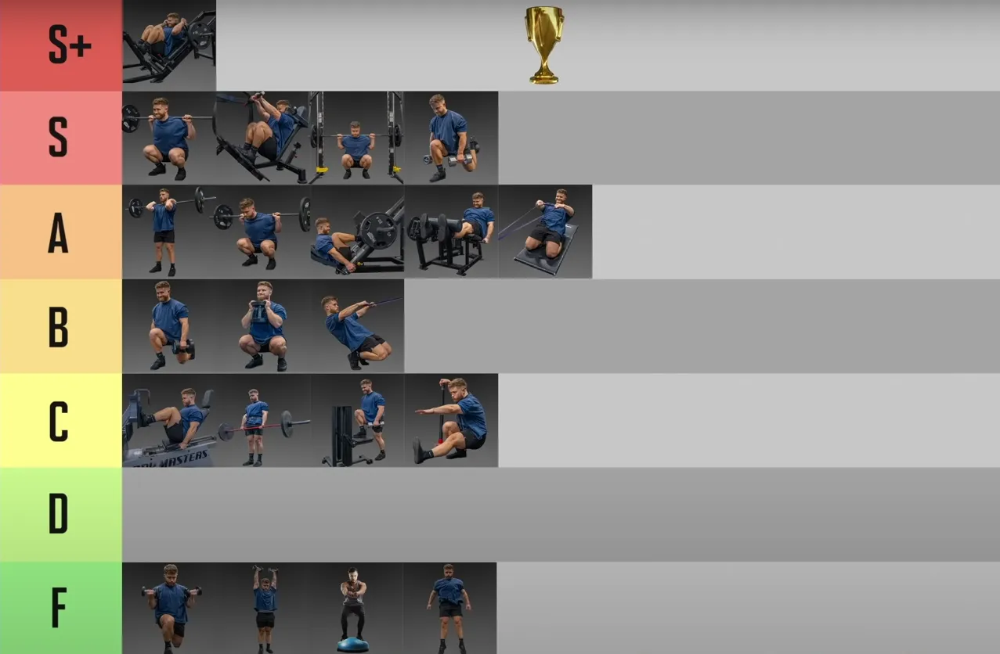

## 力量与肌肉肥大

* 发展力量需要低次数
* 发展肌肉需要高次数
* 除此以外，背部很复杂，需要相对高次数

## 组数、次数、力竭

|                                      |                                      | sets | reps | rest                  | 力竭                                                      |      |
| ------------------------------------ | ------------------------------------ | ---- | ---- | --------------------- | --------------------------------------------------------- | ---- |
| 深蹲，硬拉，卧推，军事推举，杠铃划船 | 多关节，首要动作，对神经系统压力最大 |      |      | 根据计划不同3-8次区间 | 不能力竭，在距离力竭前1-3次停止，对神经压力大，恢复时间长 |      |
|                                      |                                      |      |      |                       |                                                           |      |
|                                      |                                      |      |      |                       |                                                           |      |
|                                      |                                      |      |      |                       |                                                           |      |
|                                      |                                      |      |      |                       |                                                           |      |

### reps &rest

* 孤立动作的次数应该是最高的，rest 时间最短45-90sec
    * 针对不同的部位，背部应该是最高的，因为背部就是控制为主，肌肉肥大
* 多关节复合动作，同时是极限重量， 每组应该是3-5次，背部可以扩展到6-8次，rest 最长3-5min
    * 因为对神经系统负荷高，神经系统恢复比肌肉慢，所以多休息
* *多关节复合动作，非极限重量*，次数也不应该太高，即使是背部不应该到达12次，rest 看情况 1分钟时可以接受的。
    * 这个就是自己分析

### sets

同一个部位，第一个动作组次最高，原因很简单，第一个动作大概率是复合动作，同时也是首要动作，比如是多组的。

比如：

杠铃卧推5x3

杠铃划船7x6-8——这里是背部动作与上面的胸部动作无关

哑铃卧推5x6-8——胸部第二个动作5sets没有超过上面

胸部支撑划船3x12-15——背部第二个动作

### 案例

在thib的《手臂训练计划全解析》可以看出以上特点，这是一个专门针对性训练，不是普遍的训练计划，关注 动作、组数、次数

* 第一个动作 卧推5 x 4-6；手臂动作 4 x 6-8
* 第二个动作 手臂动作 3x8-10
* 第三个动作 手臂动作 3x10-12 or 12-15
* *确实符合thib的理念，第一个动作显然最重要，重量也最重，必然是高组数，低次数，同时避免力竭，因为对神经系统压力大，很难恢复； 后面的次要以及辅助动作组数 要比复合动作的组数低或者相同，次数高，可以到力竭，因为几乎是孤立训练。这里没有，背部，背部特殊，显然是8-12次。*

今天锻炼后蹲，前蹲还没恢复过来

### **热身**

拉阻力橇：3组20步

Glute ham raise：1组6次

**俯卧撑：1组10次**

**T杠下拉或引体向上：1组10次**

#### 两三周以后，组数、次数、动作选择变成了类似这样：

拉阻力橇：4组80步

Glute ham raise：4组12次

俯卧撑：4组12次

T杠下拉或引体向上：3组15次

斜板仰卧起坐：3组20次

Neck raise（如图所示）：3组10次

动态弹力带伸展：5分钟

## plan

没什么可改变的，就是多组深蹲，

1. 农夫走+卷腹
    1. 农夫走：臀部夹紧，收腹，肩胛骨收紧就像能夹住花生米，同时能锻炼前臂 
2. 拉伸，髋部柔韧性

## Leg Exercises-保证肩胛骨下压

1. 深蹲 前蹲 trap-bar 抓举握法硬拉。 
    * 对于抓举来说，背部协调性和刚性锻炼不够，考虑锻炼速度硬拉，架上拉，家里轻重量trap bar，臀部肌肉显然不够。
    * 不要力竭，复合动作同时是首要动作不要力竭，避免神经系统疲劳
    *  高组数 低次数 空杆热身 40kg 开始正式组 40, 50,60 来回循环4次就是12组，重量轻不需要太多休息时间
    * 每两周考虑一次单腿：单腿保加利亚深蹲，单腿罗马尼亚硬拉，单腿跳起。
    * 后侧力量薄弱，高抓水平不够，可以考虑硬拉。
2. 背部——双杠 每组2次 要轻松完美完成 ， t杠，斜上方拉；最后选水平划船 
    1. 控制能力，离心阶段慢速 
    2. 如果两个动作，那么后面的345要减掉一个动作。
    3. 杠铃划船没绝对标准动作，一般都是做到后面越来越站直，很正常——李茶的影片说了，包括Pendlay划船对下背部反而压力更大。
    
3. 腹部(钢索卷腹，悬垂举腿) 或 山羊挺身
    * 第一个动作对下背部要求高，所以在现成的计划里看不到锻炼下背部的山羊挺身等等，但是腹部和背部却很常见。当然如果对后侧刺激不够，可以把负重山羊挺身当作练习后侧链条的没问题
4. face pull / 坐姿俯身侧平举
    * 轻重量 高次数——但是似乎效果不高，不如重一点
5. 农夫走

## Tips

除了试探组都是正式组，杠铃片加减以10磅为单位。——参考thib 体系

上肢训练日太轻松了，感觉像是休息了两天，这种感觉持续将近两周，必须改变

支撑力量太弱了，杠铃杆在头上都晃

## 上肢分类

大肌群

背部没有酸痛感肯定是不对

背部很复杂，而且是自己的弱点，两组

史密斯卧推

双杠：肩膀夹紧，非常容易受伤

## 继续用swing 做热身

我自己深蹲成绩没进展也许与没有继续练习这个有关

壶铃与哑铃摆举也是非常好的变化动作。它们不仅能够训练你的*下背部、腘绳肌、臀部，还能够充分刺激你的斜方肌*。

### 周六leg day ，周日 upper

* 因为周六人最多，上肢动作多，器械安排不上，深蹲只需要一个器械
* 周日几乎没人

### christian thibaudeau, 我大多数时候只采用这3个双腿力量训练动作：

> * 后蹲
>* 前蹲
> * Trap-bar硬拉
> 
> 但是，大多数的下肢训练课上，我只练习后蹲，至少做12个正式组。
> 

## Current Problem：

* leg day 之后体姿很好，但是upper day 却后退了，看来是农夫走，和深蹲时候，缩紧肩胛骨的功劳， uppder day 需要调整，或者face pull的原因——是face pull 的原因——face pull 太轻了，这次背部没有反应。
* 一节课就是40-60分钟，教练再次提醒我，我的时间绝对有问题，或者是效率
* 核心太差，腰腹两个地方都不行
* 髋部灵活性
* 训练时间太长，过度
* 训练的质量和强度远比训练时间长短更重要。

## 组间歇与力竭

主要参考thib体系等等thib的文章，关于力竭，等等都是没有绝对的，根据不同肌肉，和类型

* （Thib体系之一），采用**复合动作**时，**不能**使中枢神经系统过度**疲劳**，因此组间**休息时间**应足以使神经系统接近完全恢复。3-5分钟，也就是在力竭之前停止一组

* 孤立训练，可以力竭，组间歇要短

  > 孤立训练，疲劳，尤其是累积肌纤维疲劳，是主要目标。因此间歇应该短一点，但不能短到两组之间力量过度下降的程度。你应该慢慢地逐渐缩短间歇。
  >
  > 在针对肌肉体积的训练中，孤立动作的两组之间力量下降5%是可以接受的，从第一组到最后一组下降20%是非常理想的。换句话说，在孤立动作中，你从第一组到最后一组的表现应该争取下降20%。这种下降可以表现在次数和负荷上。
  >
  > 例如，如果第一组你使用140磅做了12次，下降20%表示：
  >
  > 在最后一组，使用140磅做9次。
  >
  > 或者……
  >
  > 在最后一组，使用110磅做12次。
  >
  > 如果在4组孤立动作中，表现没有下降20%，说明你的训练不够艰苦，或者间歇太长。
  >
  > 在针对肌肉体积的孤立训练中，间歇应为30-75秒之间。

## 训练不是要最大限度的发挥或者展现你的力量

* 训练是为了提升运动表现，为了提升深蹲、硬拉、引体向上、卧推的水平，但是不是每次都要练习这些动作。dave tate  进化史中就说了他们几乎不练习硬拉，硬拉的"练习"放在深蹲的动力努力日，而在他的 8个诀窍中的 9周计划中，可以看到几乎没有硬拉只有一半的天数有硬拉，而且还是50%重量的快速硬拉，10组x2次的那种。

* **不是要最大限度的发挥或者展现你的力量，而是要打下基础，逐渐增强力量**

* 任何“好动作”都不要无限练习，尤其是多关节符合动作。例如引体向上，如果你极限是5次，那么以5次做组的话，第二组也就三四次，第三组就一二次。所以，单次引体向上的次数、深蹲的极限重量等等，尤其是多关节运动的符合动作，*这些是衡量你运动能力的指标，但是不意味着你要只练习这些动作*，你应该提升相关的肌肉力量等等，比如奥运会举重运动员，虽然经常练习基本比赛动作，但是大部分时间应该练习的是非比赛动作，深蹲，划船等等。

## split

### PPL 

* 一般没有练一天休一天，所以一般练习三天或者两天休息一天
* Leg day 很容易安排，训练量高低很容易调整。但是push 和 pull 很难，尤其是push，自己不喜欢卧推；

### upper / lower

* lowwer day 其实就是深蹲/trap-bar 硬拉/单腿动作——这三种选择一种就可以，另外加上背部和腹肌就行了——西部杠铃俱乐部是这样安排的
* upper 推举+卧推，自己不练习大重量卧推，所以推举放第一位，thib的upper day就是推举放到卧推前面。然后加上手臂与肩部
* 

## 组数与次数

有太多可说的了

* 自然增肌者：单一肌肉 每周10-20组。
* **多关节运动 尤其是 卧推/划船/深蹲/硬拉/推举/，一般做做的次数肯定要比其他要少，比如增肌次数一般时8-12次，那么多关节这几就6-10次**
* *每次训练课重量都不要用极限，这里说的极限不是1rm，是说如果做深蹲每组3次，那么重要也不要选择3rm，而是选择8rm左右的。*

## What I Want

### Explosive Power

天性

NFL 后卫，外接手，安全卫

### 对身体控制力，像跑酷、街头健身的单杠玩家

### 抓举动作

教练便宜，教我练习举重 抓举等等。髋部灵活性优先

### Enough Strength

不需要太大的重量作为目标，thib也说过，外胚型的关节太小，施加不了太大的压力；

更多的负重，更多的压力——不够健康

手臂太弱了，肱二头肌作为 “钩子”力量太弱了

左右不平衡 力量差距非常大

### Hiit

适合减肥

似乎也适合自己喜欢的节奏，充满变化

### 更多的投掷动作

## 每节课最好不要超过四个动作

## 要有孤立训练

thib、 dave tate 都提到孤立训练来补充每个人的缺点，而且必须是个性化的，每个人的优点和弱点是不同的。

## 似乎很多人在HP mass 组件 作为辅助练习 背阔肌、三角肌后束和菱形肌

example 1 :

> I added in some lat, rear delt, and romboid work between every 2nd or 3rd set yesterday, and that worked well. My quads, adductors, and traps are sore today, but I expected that. Completed my first NC workout today as well toulck about 12-15 minutes or so.
> 昨天我每两组或三组之间加练背阔肌、三角肌后束和菱形肌，效果不错。今天我的股四头肌、内收肌和斜方肌酸痛，不过这在我预料之中。今天也完成了我的第一次 NC 训练，大概 12-15 分钟左右。

## 重要的是每节课进步

这不是开玩笑，或者哲学

## 每天练习高抓，这是最好的发展力量

* 其实还有硬拉，但是这两个动作相似

* 我喜欢爆发力——各种变化的引体动作 ，爆发力
* 大肌群，复合动作为主，也最经济， 孤立训练薄弱环节

尽量（即使不是全部）使用多关节动作

我个人建议每次训练包含四个动作

可以采用全身训练法，也可以采用上下肢分体训练法。就我个人而言，我为客户进行的10次训练中，有8次是采用全身分体训练法。在每次训练中，我都会专注于不同的肌肉收缩（我的全方位收缩系统）。

重复次数保持在较低水平（大多数情况下为6次或更少），并且我们通常每个动作使用更多组数（4到6组）。

组间休息时间允许训练者完全恢复，且不会损失潜能。我们指的是每组训练之间3-4分钟的休息时间（当然，进行体能训练时除外）。

7. When using a whole-body approach (which is what I use most of the time) we include one squat-pattern exercise, one hip-hinge pattern movement (can be a variation of the Olympic lifts if the athlete is competent in them), one press, and one pull.
8. 当使用全身方法时（我大多数时候都使用这种方法），我们包括一个深蹲模式练习、一个髋关节铰链模式运动（如果运动员熟练的话，可以是奥林匹克举重的变体）、一个推举和一个拉举。

8. We start every session with one explosive exercise (jumps, throws, striking, etc.) for activation purposes.
9. 为了激活目的，我们每次训练都以一项爆发性练习（跳跃、投掷、击打等）开始。

##  髋部灵活性

* 

##  复合动作是核心，其他器械是辅助

典型的就是hip thrust，很多人推荐，但是运动员不练习这个动作。

弹力带外旋

每个动作似乎每周在9组左右。

有人建议将二头肌移到下部,将二头肌移到下肢可以腾出一些时间在上肢训练，从而专注于其他训练。而且我发现下肢训练日的二头肌训练不会干扰上肢训练日的背部训练。 也有人把肩膀移动到下肢

##  Goal：力量

###  初学者和偏瘦者应*优先高强度*训练，因为：

- 偏瘦者通常肌纤维募集效率较低，高强度训练（3-6次）能快速改善神经适应，提升力量和肌肉募集能力。
- 高强度训练也能刺激肌肥大（尤其是快肌纤维增长），对偏瘦者增加肌肉有效。

###  建议你**更侧重于力量训练**。

以下是原因：

- **高效性：** 力量训练通常涉及*更少的重复次数和更重的重量*，这意味着你的训练时间可能会更短，效率更高。这符合你时间精力有限的需求。
- **基础打牢：** 力量是所有运动表现的基础。提高*力量能让你在各种运动中表现得更好，无论是有氧运动还是其他力量型活动。*
- **兼顾肌肉增长：** 虽然力量训练不以最大化肌肉体积为唯一目标，但在初级阶段，随着你的力量提升，肌肉也会相应地增加。尤其当你使用复合运动（如深蹲、硬拉、卧推等）时，这些动作能同时刺激多组肌肉，促进全身性的力量和肌肉增长。
- **运动表现提升：** 力量训练能直接改善你的运动表现，让你在日常活动或特定运动中感觉*更轻松、更有力*。

###  后侧链条和厚度问题

关于你提到的**“~~后侧链条倾向于肌肉增加，其他方面倾向于力量~~”**的想法，这在理论上是可行的，但*对于初学者来说可能过于复杂*，并且效率不高。

- **以力量为目标的锻炼也会让你“厚”起来：** 没错！专注于力量训练，尤其是**复合型力量动作**（例如硬拉、罗马尼亚硬拉、划船、引体向上等），会非常有效地刺激你的后侧链条肌肉（腘绳肌、臀大肌、背部肌肉）。这些肌肉的增强不仅会增加你的力量，也会让你的身体在视觉上变得更“厚实”。
- **初学者应注重全身协调发展：** 在初级阶段，全身协调发展比专注于特定部位的“增厚”更重要。把精力放在掌握基本的力量训练动作上，让全身肌肉和神经系统同步发展，会带来更全面的进步。等你度过了初级阶段，再考虑更精细的肌肉发展策略会更有效。

------

###  关于腹肌

对于**腹肌**，你可以**结合高次数和低次数负重训练**。

- **高次数（15-25次甚至更多）：** 主要用于核心的稳定性和耐力训练，比如平板支撑、死虫子、卷腹等。这有助于增强核心抗旋转、抗屈伸的能力，对运动表现和日常活动都很有益。
- **低次数（5-12次）负重训练：** 比如负重卷腹、负重仰卧起坐、悬垂举腿等。这类训练能给腹肌带来更强的刺激，促进肌肉增长和力量提升。

如果你想让腹肌更“显眼”，**低次数的负重训练**会更有效。同时，别忘了控制饮食，减少体脂才能让腹肌真正显露出来。

###  关于背阔肌

关于**背阔肌**的训练次数，你说得没错，很多健美训练通常推荐 8-12 次来最大化肌肉生长。但是，既然你以**力量为主导**，那么：

- **低次数（3-6次）\**的动作：例如\**引体向上（负重引体向上）**、**杠铃划船**、**T杠划船**等，这些动作可以让你使用更大的重量，非常有效地提升背部的整体力量和厚度。
- **中等次数（8-12次）\**的动作：可以作为辅助，比如\**高位下拉**或**坐姿划船**，用来增加训练量，进一步刺激肌肉生长。

你可以将两者结合。例如，先做大重量的引体向上或杠铃划船来建立力量基础，然后用一些中等次数的器械动作来补充训练。

###  关于单侧动作

a：纠正左右不平衡

当纠正左右不平衡时，在弱侧额外多做的那一组，我建议你选择*低次数，但高质量的动作*。

- 目标是提升弱侧的力量，所以**专注正确的动作模式**，而不是为了次数而降低质量。
- 例如，如果你的左腿更弱，在完成正常的双侧训练后，可以单独用左腿再做一组 3-5 次的单腿深蹲或硬拉，确保每一次都稳定且有力。

####  b：单腿保加利亚深蹲、单腿罗马尼亚硬拉

你说得对，**单腿保加利亚深蹲**和**单腿罗马尼亚硬拉**这类单侧动作通常不会只做 5 次以下。

- 这些动作确实可以被视为**辅助动作**，它们非常适合用来**纠正不平衡、提高核心稳定性、增强单侧腿部力量和肌肉耐力**。
- 它们通常会放在主力量训练（如杠铃深蹲、硬拉）之后，并且次数会相对高一些，比如**8-15次**。
- 虽然你以力量为主导，但这些单侧动作对你的整体运动表现和平衡能力提升非常重要，高次数能更好地刺激目标肌肉的稳定性与耐力。

####  俯卧撑不能只做 5 次吗？

**不一定！** 这取决于你的训练目标和当前的俯卧撑能力。

- 如果你想把**俯卧撑**作为一个**力量主导**的训练动作，那么当你的能力提升到可以做很多次时，你可以：
  - **增加负重：** 比如穿负重背心、放杠铃片在背上，然后争取在 3-8 次的范围内。
  - **选择更难的变式：** 比如单手俯卧撑、俄式挺身俯卧撑、弓箭手俯卧撑等，这些动作本身就很难，让你自然地落在低次数范围。
- 如果你只是想用俯卧撑来增加**训练量**或作为**热身/辅助**，那么做 10-20 次甚至更多也是完全可以的，这能增加肌肉耐力。

所以，如果你的目标是提升俯卧撑的力量，你就应该想办法让它变得更难，从而只能做少数几次。

##  分化

* Westside Barbell ：

  1. 动力努力日（Dynamic Effort Day）

     > **目标**：提升*最大力量*（1RM），通过高强度（85-100% 1RM）、低次数（1-5 次/组）训练，刺激神经系统和力量适应。
     >
     > **典型动作**：重负荷深蹲、硬拉变体（如低位硬拉、赤字硬拉），每周更换变体以避免适应。
     >
     > **特点**：强调复合动作，组数较少（3-5 组），重量接近极限，休息时间长（2-3 分钟）。
     >
     > **示例**：深蹲 90% 1RM x 3 次 x 3 组，**辅以辅助动作**（如腿举、腘绳肌卷曲）。

  2.  极限努力日（Max Effort Day）

     > **目标**：提升*爆发力和速度*，通过中低重量（50-70% 1RM）、高速度、低次数（3-6 次/组）训练，增强肌肉快速收缩能力。
     >
     > **典型动作**：快速深蹲（使用弹力带或链条增加阻力变化）、箱式深蹲、跳跃训练等。
     >
     > **特点**：多组（8-12 组）、低次数（2-3 次/组），强调动作速度，休息时间短（30-60 秒）。
     >
     > **示例**：深蹲 60% 1RM x 3 次 x 10 组，**速度优先，辅以爆发力动作**（如臀桥、单腿跳）。

* **Westside 与你的计划的相似性**：

  - **力量日**（类似极限努力日）：我设计的腿部力量日（4-8 次/组，70-85% 1RM）聚焦高强度复合动作（如深蹲、杠铃曲腿硬拉），强调力量提升，与极限努力日目标一致，但强度稍低（适合你的中级水平和体姿目标）。
  - **功能性/轻量日**（类似动力努力日）：功能性/轻量日（8-12 次/组，50-70% 1RM）注重动作控制、单侧平衡和体姿改善，包含器械臀桥、单腿罗马尼亚深蹲等，类似动力努力日的辅助动作，但更强调功能性和左右平衡，而非纯爆发力。
  - 区别：
    - Westside 更适合力量举运动员，强调**极限力量和速度（爆发力**），动作变体频繁（如每周换深蹲类型），训练量较高（多组低次数）。
    - 你的计划针对体姿改善（圆肩、高低肩、臀部薄弱）、左右平衡和功能性力量，动作选择更稳定（如单腿动作、农夫走），训练量控制在 10-14 组，适合偏瘦体型和中级训练者。
    - Westside 的动力努力日常使用弹力带/链条和**爆发力**动作（如跳跃），而你的功能性日更注重**单侧动作和核心稳定性，适合体姿目标。**

##  目标：体姿

* 后侧链条：臀部，背部，三角肌后侧，斜方肌中下部分
* 左右平衡
* 髋部灵活性
* 爆发力，运动能力，

##  避免

* 四肢完全固定动作，例如俯卧撑
* 关节锁死的大重量动作，例如卧推，有健美名人确实不做杠铃卧推——钢索推胸可以替换，路线更自然

##  每次训练都要做

* Face pull
* 农夫走——尤其对瘦弱的人很有帮助——有意识的让**斜方肌和肩胛骨**保持紧绷，肩膀向后，就像用肩胛骨夹住一个花生，**臀部**也要保持紧绷，否则身体会晃动 

##  对我来说重点

* 脖子不要紧张，很多动作会习惯性伸脖子
* 肩部放松，往下，自己习惯性耸肩

##  希望有的训练工具

* 推雪橇（Prowler Push
* 药球抛掷（Medicine Ball Throws）
* 弹力带
* 塑胶跑道
* Cable Wood Chop ——高中低

##  最好的动作

* 杠铃高抓
* 阻力撬

##  主要迷思

* 不要迷信自由重量，锻炼同一块肌肉，即使运动轨迹相似，器械和自由重量对同一块肌肉的刺激也是不同的，比如角度问题等等。
    * 现阶段不会有健美运动员只用自由重量就能练出完美肌肉的。器械可以刺激到很多小肌肉。
* 绝对不是组数越多越好
* 同一个重量做三组还没累，就是太轻了
* 一般来说，同一个动作，器械用的重量要超过杠铃，因为器械不用担心安全问题，例如被杠铃砸到，核心不平衡会摔倒等等。

核心始终紧张，器械放回的适合不用松劲

分离训练

肌肉肥大，爆发力转换

腿部：深蹲肩胛骨夹紧

核心区域：，如平板支撑（Plank）、悬垂举腿（Hanging Leg Raise）或俄罗斯扭转（Russian Twist）

##  久坐恢复策略：

- 拉伸：每天10分钟（胸部、肩部、髋部拉伸），例如门框胸部拉伸（3次30秒/侧）、鸽式髋部伸展。
- 泡沫轴：每天5-10分钟（胸、背、腿），改善血液循环，缓解僵硬。
- 站姿动作：优先站姿肩推、站姿划船，激活核心和下肢，纠正久坐姿态。

##  PPL（Push/Pull/Legs）

肩部：放弃前束训练，卧推，上斜卧推都在锻炼前束，哑铃锻炼的稍微比杠铃少一点

背部：

面拉、反向飞鸟

疲劳问题：初学者训练量低（每日2-4个动作，2-3组），6天循环不会过度疲劳，但需通过拉伸、泡沫轴和饮食支持恢复。

##  Legs：

单腿深蹲-放在凳子上——

单腿跳

单腿硬拉

农夫走——更高难度杠铃过顶农夫走——核心，三头肌

##  

##  第一个动作的组数必须等于或大于后面的动作。

每个肌群2个动作，总共10组：

第一个动作：**5组**

第二个动作：5组

第一个动作：**6组**

第二个动作：4组

第一个动作：**7组**

第二个动作：3组

## Thib 动作分类

| 类别                       | Primary                                                      | Secondary                                                    | Auxiliary                                                    | Remedial                                                     |
| -------------------------- | ------------------------------------------------------------ | ------------------------------------------------------------ | ------------------------------------------------------------ | ------------------------------------------------------------ |
| 股四头肌                   | 奥林匹克后蹲（站位与髋同宽，躯干垂直），力量举深蹲（宽站位，躯干做出中等幅度的前倾），前蹲 | 箭步蹲及其变化动作，训练凳搁腿深蹲及其变化动作，腿举，杠铃哈克深蹲，哑铃深蹲 | 机器哈克深蹲，迈上箱子及其变化动作，腿屈伸及其变化动作，西斯深蹲 | 端点伸膝（使用弹力带），弹力带腿屈伸                         |
| 腘绳肌、臀肌               | 罗马尼亚硬拉，直腿硬拉，相扑硬拉，抓举握法硬拉               | 早安式体前屈及其变化动作，glute-ham raise，腿举（双脚置于踏板比较靠上的位置） | reverse hyper，胯下钢索前上拉，腿弯举及其变化动作，钢索伸髋  | X带行走，库克提腿，健身球腿弯举，弹力带腿弯举                |
| 胸肌                       | 下斜卧推，卧推，吉龙达双杠臂屈伸                             | 上斜卧推，哑铃卧推，哑铃上斜卧推，对颈卧推                   | 钢索夹胸，飞鸟及其变化动作，蝴蝶机，坐姿推胸机               | 健身球俯卧撑，晃板俯卧撑                                     |
| 上背部、三角肌后束         | 反手引体向上及其变化动作，正手引体向上及其变化动作，胸部支撑划船，俯身杠铃划船，T杠划船 | 单臂哑铃划船，T杠下拉及其变化动作，钢索坐姿划船及其变化动作，墙角划船，胖子引体向上（反式划船），坐姿对颈绳子握柄划船 | 直臂下拉，钢索仰卧直臂上拉，高位滑轮交叉划船，低位滑轮交叉划船，机器坐姿划船，机器背阔肌下拉，俯身侧平举，机器反飞鸟，胸部支撑上斜俯身侧平举 | 胸部支撑上斜哑铃耸肩，坐姿钢索耸肩（肩胛骨缩回），上斜俯卧平举 |
| 肩部                       | 肌肉挺举，（站姿杠铃）肩上推举，借力推举，坐姿杠铃肩上推举   | 坐姿及站姿哑铃肩上推举及其变化动作，阿诺德推举，斯科特/Thib推举，肌肉抓举 | 机器肩上推举，侧平举及其变化动作，前平举及其变化动作，侧平举机 | 古巴推举，肩外旋                                             |
| 手臂屈肌（肱二头肌、肱肌） | 站姿杠铃弯举，牧师凳杠铃弯举                                 | 锤式弯举，坐姿哑铃弯举及其变化动作，牧师凳哑铃弯举，正握杠铃弯举（站姿或使用牧师凳），Zottman弯举 | 机器弯举，钢索弯举及其变化动作，集中弯举                     | 长柄锤或托尔之锤前臂转动（肘部紧贴体侧，弯曲90度，手握锤柄下半段。在起始动作中，采用正握，即掌心向下，拇指向内。接下来，肘部不动，转动前臂。一直转到掌心向上，拇指向内。） |
| 肱三头肌                   | 窄握卧推，窄握下斜握推，体后臂屈伸                           | 窄握上斜卧推，反握卧推，JM卧推，下斜杠铃臂屈伸，下斜哑铃臂屈伸，平板杠铃臂屈伸，平板哑铃臂屈伸 | 颈后哑铃臂屈伸，颈后杠铃臂屈伸，颈后钢索臂屈伸及其变化动作，臂屈伸机 | 健身球窄握俯卧撑，晃板窄握俯卧撑                             |

## 好人松松 动作模式 关节活动

## 6 foundational movement patterns

- Squat: Barbell Front Squat，Barbell Front Squat
- Hip Hinge: Deadlift ，**Trap Bar Deadlift**
- Lunge: 
- Upper Body Press: 
- Upper Body Pull: 
- Loaded Carry: 

## 高脚杯深蹲

## Exercises

### Snath or  Clearn as Beginning

* *snatch grip deadlift*_thib 推荐所有普通人用这个来替代举重台高抓
* 血与镁粉 对于增大斜方肌有效，而且他从不练习耸肩，他的斜方肌比90%的人要好
* Thib 也是强烈推荐
* 作为开始动作是因为，这是个爆发力动作, 对神经要求也高

### Trap Bar

* 安全， thib 也练习这个
* Hinge

### ~~DeadLift~~

* 西部杠铃练习的是能提升硬拉成绩的动作，而不是硬拉本身这个动作——在进化史第5章

  > 他们提高硬拉的方法是动力深蹲训练日，Glute-ham raise，胯下钢索前上拉，体前屈，架上拉，以及大量的大重量腹肌训练。
* not good for back
* Hinge
* **trap bar 替代**
* **抓举握法硬拉**？
* 对抓举动作有帮助

### Single Leg

*注意肩部不要往前，会导致疼痛*

* 这一类都在thib的*Secondary*里面，作为*第二个或第三个动作*

* 功能性

* Lunge of  6 patterns

* 单腿罗马尼亚硬拉——这个是我感觉体姿最明显的，如果器械被占用，练习这个

  考虑：**弓步 (Lunges)：** 改善单腿力量和平衡。

难度排行

1. Split Squat
2. **Back Foot Elevated Split Squat——保加利亚分腿蹲**—— Bulgarian split squat——非常多的运动研究推荐这个动作
3. Front Foot Elevated Split Squat
4. ~~**Reverse Lunge**——肩部不稳导致疼痛，暂时不做~~——*用史密斯机做分腿蹲或脚后置箭步蹲*
5. ~~Forward Lunge~~ ——对膝盖压力大
6. **Single Leg Deadlift**

### 农夫走& 腹肌

*注意肩部不要往前，会导致疼痛*

减脂：农夫走+腹肌钢索卷腹——臀部夹紧，收腹，肩胛骨收紧就像能夹住花生米，同时能锻炼前臂 

* Carry of  6 patterns

### 山羊挺身

## **北美运动学博士Bruce**

### 8个坑人动作

1. 板凳臂屈伸
2. 阿诺德推举
3. 下斜卧推
4. 暂停硬拉 pause deadlift
5. 啞鈴俯身臂屈伸 
6. 啞鈴飛鳥 
7. 站姿槓片推胸 
   567最好都換成cable 
8. 直立划船（不是垃圾動作是要洗白）（推薦寬握）

---

## Best Exercises 

> ~~Hip thrust~~ 要被排除——自我感觉不好，虚假的重量成绩，下背部不适，有专门的文章说大重量hip thrust对背部不好，thib明确说明不给任何客户这个计划，没有见到任何nfl，nba，短跑运动员做这个动作的视频。

###  Thib: Primary, Secondary

| 类别         | Primary                                                      | Secondary                                                    | Auxiliary                                                    | Remedial                                      |
| ------------ | ------------------------------------------------------------ | ------------------------------------------------------------ | ------------------------------------------------------------ | --------------------------------------------- |
| 股四头肌     | 奥林匹克后蹲（站位与髋同宽，躯干垂直），力量举深蹲（宽站位，躯干做出中等幅度的前倾），前蹲 | **箭步蹲**及其变化动作，**训练凳搁腿深蹲**及其变化动作，腿举，杠铃哈克深蹲，**哑铃深蹲** | 机器哈克深蹲，**迈上箱子及其变化动作**，腿屈伸及其变化动作，西斯深蹲 | 端点伸膝（使用弹力带），弹力带腿屈伸          |
| 腘绳肌、臀肌 | 罗马尼亚硬拉，直腿硬拉，相扑硬拉，抓举握法硬拉               | **早安式体前屈及其变化动作**，glute-ham raise，腿举（双脚置于踏板比较靠上的位置） | **reverse hyper**，胯下钢索前上拉，腿弯举及其变化动作，钢索伸髋 | X带行走，库克提腿，健身球腿弯举，弹力带腿弯举 |

###  盖伊 三人组

#### Quad 

高杠深蹲，高杠深蹲，**保加利亚单腿深蹲**(盖伊)

#### Glute

臀推，臀推，硬拉

###  Athlean-X

#### Quad 

* best：Front Squats , Belt Squats  
* almost best：Hack Squats ， **Bulgarian Split Squats** ， High Bar Back Squats ， **DB / BB Reverse Lunge**

#### Glute

* best： barbell hip thrust
* almost best：  cable pull through， **DB leaning step up**， gluteus bridge curl / gluteus ham rises.， Slick floor bridge curl ，**Barbell RDL's** ， low bar squats.      

### Jeff Nippard -The Best & Worst

####  Glute 

> S ：*machine hip abduction*，walking lunge，*smith lunge*——整个S系列让我困惑，machine太简单，lunge对膝盖要求很高
>
> S：*45度负重山羊挺身*
>
> A ：Machine Hip thrust, single-leg db thrust, BB back squat，保加利亚 split squat，kickback，step up
>

#### Quadriceps

>S : Back squat,  hack squat（肩膀间距除非可调节，否则不做），pendulum squat，**保加利亚split squat**
>
>A：前蹲，45度腿举，leg extension(健身房有)

###  Bret Contreras

The Best Damn Hip, Leg, and Calf Workout 

Based on the results of this experiment, I bet the following would be one kick-ass workout that'd target the quads, hamstrings, glutes, and calves. Enjoy!
根据本次实验的结果，我敢打赌，以下训练计划一定会非常有效，能够有效锻炼股四头肌、腘绳肌、臀肌和小腿肌肉。尽情享受吧！

- Quads: Full Squat, Parallel Squat, Half Squat, or Quarter Squat
  四头肌： 全蹲、平行蹲、半蹲或四分之一蹲
- Hamstrings: Deadlift or Rack Pull
  腿筋： 硬拉或架上拉
- Glutes: Barbell Glute Bridge, Hip Thrust, Pull Through
  臀部： 杠铃臀桥、臀推、臀桥
- Calves: Heavy Calf Raise
  小腿： 重物提踵
