## 背部肌肉

谈训练动作之前，有必要先了解一下我们要训练的肌肉，以及它们的功能。主要的背部肌肉包括：

### 竖脊肌：

又称骶棘肌，包括髂肋肌、最长肌、棘肌，是负责伸躯干的主要肌肉（使躯干后部靠近双腿后部）。在*硬拉和山羊挺身*等动作中，竖脊肌会积极参与。

### 背阔肌：

背阔肌的主要功能是使肩部伸展、内收、内旋。*在所有拉类动作中，背阔肌都会参与*，无论是水平拉类动作（如划船），还是垂直拉类动作（如引体向上）。*垂直拉类动作对背阔肌的刺激更强烈*。

### 菱形肌：

菱形肌是位于肩胛骨之间的深层肌群。主要功能是使肩胛骨内收或者叫缩回（使肩胛骨向后拉）。在垂直和水平拉类动作中，菱形肌都会积极参与。*水平方向的划船对菱形肌刺激更大，因为肩胛骨缩回的幅度更大。*

### 斜方肌：

这块钻石形的肌肉非常有趣。它的肌纤维*有几种不同的走向*，根据募集的肌纤维的不同，它能够做出几种不同的动作。健身房里最常见的斜方肌训练动作都是针对上部的，上部的主要功是上抬肩胛骨和锁骨。主要的训练动作是各种耸肩。体积较小的肩胛提肌也能够帮助上抬肩胛骨。斜方肌*中部的功能是（和菱形肌一起）使肩胛骨缩回*。所有肌纤维同时收缩，也能够帮助肩胛骨缩回。最后，斜方肌*下部的功能是使肩胛骨下压（向下拉动肩胛骨）*。

## 背部训练要领

1. 反手引体向上是指掌心朝向身体，正手引体向上是指掌心向外。
2. 在垂直拉类动作中，背阔肌参与更多；在水平拉类动作中，菱形肌和斜方肌中部参与更多。一般说来，做动作时，**躯干越接近垂直，背阔肌参与越多**；躯干越接近**水平，菱形肌和中背部肌肉参与越多**。要全面、平衡地发展背部，这些知识很重要。
3. 在最低点伸展，在中点（顶点）挤压，想着*以肘拉动重物*。这听上去很简单，但我敢打赌，有95%的训练者在背部训练中动作幅度不足。这就像有些人用半蹲代替深蹲一样，他们想利用大重量来显示自己，而不关心做出正确的动作。

要想自起点到嵌入点充分发展肌肉，全程动作是必需的。在*起点和终点，使得背部保持紧张的同时伸展，在中点（顶点）挤压，以确保正确完成拉类动作。*

*想着以肘拉动重物*能够帮助我们专注于利用背部肌肉而不是手臂肌肉。把你的手臂想象成钩子，即可减少手臂的参与，有效刺激背部肌肉。

4. *做动作时总是保持挺胸*。如果你在意下背部健康的话，这一点在所有动作中都非常重要。做动作时，*抬高胸腔，保持挺胸*。这会使得脊柱保持自然的曲线。背部在负重时弯曲是导致下背部损作的首要原因，因此做动作时要使脊柱保持自然的曲线。

如果你难以理解这一点，可以想想自己在海滩上的样子。男人（以及一些女人）想要展示自己的肌肉，他们自然会抬高胸腔，或者使胸部张开。进行重物训练时，*想着这种“肌肉海滩”反应*，因为它能够保持自然的脊柱姿态。

5. 采用*大重量的基础背部训练动*作，使肌肉平衡发展。背部不仅对于全身肌肉的平衡发展和力量的提高非常重要，还能够帮助你避免损伤。你一定见过很多塌肩的、有肩撞击综合症的、有肌腱炎的训练者。如果他们能够像训练胸部和肩部那样认真训练背部，很多人都会痊愈。*强壮的肩胛骨缩回肌和下压肌对于保持肩部健康和上肢体姿非常重要。*
6. 专注于动作。发达的背部属于善于思考的人。你**必须专注于动作，因为你无法看到背部肌肉。**

## 基础动作

对于背部而言，**大重量的基础动作**是永远不能忽视的。

### 宽握正手引体向上

它能够有效发展背部宽度。它是发展背阔肌（尤其是上部）的最有效动作。宽握正手引体向上也能够发展[大圆肌](https://zhida.zhihu.com/search?content_id=9100080&content_type=Article&match_order=1&q=大圆肌&zhida_source=entity)——一块靠近背阔肌上部的较小的肌肉。

采用正握，握距大于肩宽，手臂放松，悬垂。在最低点，挤压背阔肌和中背部，以肘拉动身体上移。身体稍微后倾，使得背部向后弯曲，这样有助于优化移动轨迹。你可以上拉至下巴高于横杠或上胸触杠。挤压、保持一秒，然后使身体有控制地下落，直至充分悬垂。

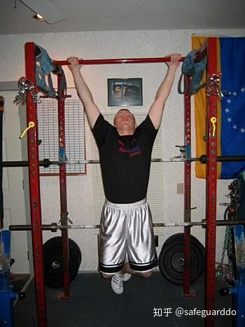

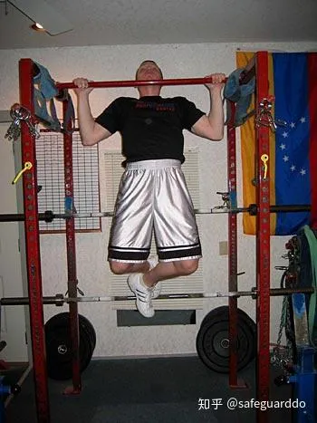

### 胸骨反手引体向上

胸骨反手引体向上出现已经有一段时间了，但我不确定有多少人把它加入了训练计划。原因有二：1.他们不知道这个动作；2.胸骨反手引体向上很困难！胸骨反手引体向上是一个很棒的动作（尤其适合忙人），因为它兼具反手引体向上和划船的价值。

起始动作与标准反手引体向上相同。采用反握，握距与肩同宽，悬垂。挤压背阔肌和中背部肌肉，以肘拉动身体上移。在中途，使身体积极后倾至接近水平，使得接下来的半程接近于划船动作。在最低点伸展，在顶点充分挤压中背部肌肉。这个动作几乎能刺激到上背部的所有肌肉。

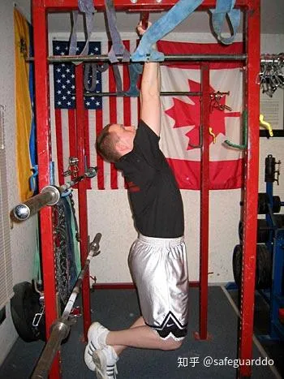

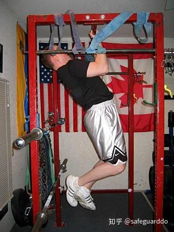

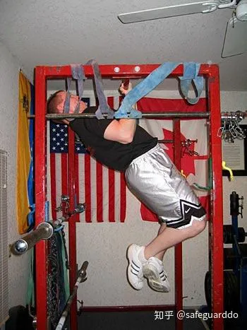

### 哑铃划船

想提高**背部厚度**的人都不应忽视哑铃划船。这个动作**难度小，只要你足够专注，可以迅速提高训练重量**。使用哑铃与杠铃相比，不仅有助于发展单侧力量，还能够加大动作幅度，因为哑铃可以比杠铃更靠近身体。

有一次，我指导的一个排球选手说，她早已知道如何做哑铃划船了。我请她演示一下，她说：“它就好像启动割草机一样。”她把另一侧膝部置于训练凳上，做出了我所见过的最丑陋的划船动作！她利用了每一块肌肉来做这个动作，就是没有用到中背部和背阔肌；她转动脊柱，利用惯性完成动作，我都奇怪她怎么没有出现椎间盘突出的问题。

我的哑铃划船动作与大多数人的做法稍有不同。站在一个稳固的物体后方约两英尺处，空着的那只手置于该物体上。让哑铃悬垂，伸展背部肌肉。以肘部拉动重物上移，直至接近下腹部。挤压中背部，然后回到起点。由于双脚都位于地面上，身体会更加稳定，更强的稳定性意味着更大的重量，更大的重量意味着更快生长。

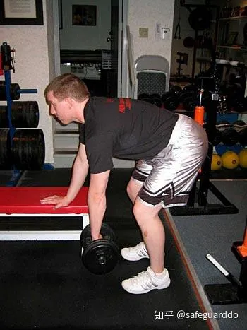

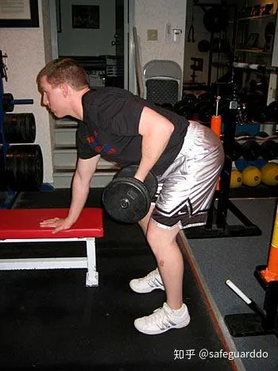

### V形握柄划船

这是我喜欢的混合动作之一，它兼具俯身划船（大重量）和V形握柄划船（译注：指钢索划船）的价值。因为俯身划船可以使用大重量，V形握柄划船的动作轨迹更靠近身体，加大了动作幅度。将杠铃的一端抵在墙角，将V形握柄置于杠铃另一端下方。使用比较小的杠铃片，这样可以加大动作幅度。

动作与俯身划船相似，只不过使用V形握柄时，你采用的是对握。双膝微屈，在整个动作过程中确保挺胸。在最低点使手臂充分伸展，以肘拉动重物上移，直至靠近肚脐，挤压背部。然后**使重物有控制地下落，回到起点。**

### 硬拉

硬拉是发展下背部肌肉的最佳动作：一方面，它能够发展**竖脊肌**；另一方面，大重量硬拉能在合成代谢方面产生很大影响。要发展竖脊肌，站位较窄的传统硬拉更加有效；而**相扑硬拉**则能够发展整个后侧链条（臀部、腘绳肌、竖脊肌等）。

我相信每个读者都听说过硬拉时背部受伤的人。在这方面，硬拉和深蹲一样：如果你的动作不标准，或者使用的重量太大，就有可能受伤。问题在于，很多人听说了这类意外之后，就决定放弃那些真正能够提高力量和肌肉的大重量的基础动作。硬拉和深蹲有可能是最有利于发展力量的两个训练动作了。

为发展背部肌肉，我建议你采用传统硬拉。双脚相距比较近，使胫骨处于铃杆后方两三英寸处。俯身时，胫骨将会自然前移，轻触铃杆。重心置于脚跟，挺胸。如果你没有挺胸，你的下背部很可能会弯曲，有可能导致受伤。

深呼吸，使腹部和下背部保持稳固，脚跟蹬地，同时以肩部向后拉动重物。当你向上、向后拉动重物时，你可以想着挺胸，挤压臀肌。由轻重量开始练习，完善技术，然后逐渐加重。

### 山羊挺身

山羊挺身是纯粹的下背部训练动作，也就是说这个伸躯干的动作将大部分负荷施加在了竖脊肌上。

这里需要驱散一个流言：抬高躯干至超过自然位置并不像我们听说的那样危险。我与Ft.Wayne当地的运动脊椎指压治疗师、力量举选手Mike Hartle博士探讨了一下这个问题，我得知躯干可以移动至超过自然位置30度。我并不建议在这个动作中做到这种幅度，但超过自然位置5-10度是不会对脊柱有害的。

下面是做法。在罗马椅上俯卧，髋部顶端应该超过凳面中点，躯干悬垂并与双腿垂直。挤压[竖脊肌](https://zhida.zhihu.com/search?content_id=9100080&content_type=Article&match_order=7&q=竖脊肌&zhida_source=entity)，抬高上体，直至上体与下肢成一条直线，或者稍高一点。在顶点挤压，保持一瞬间，然后使身体有控制地下落，回到起点。要使用重物，可以将一个杠铃片抱在胸前，或者双手持一个哑铃，置于头部后方。

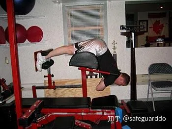

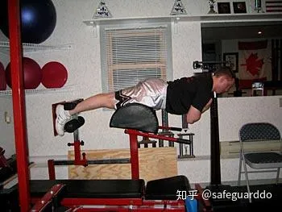

### 深蹲

你说什么？深蹲不是背部训练？我要说：即使深蹲不是发展（背部）力量与肌肉的最佳动作，它至少也排在前3名之内。

我曾到西部杠铃俱乐部在Dave Tate和路易·西蒙斯的指导下训练过几次。那里的运动员都有着发达的、厚实的背部肌肉。这些人可以深蹲800磅，900磅，甚至1000磅以上。想想看，如果你的背部能够支撑住那么大的重量，你的背部肌肉会有多么发达？更不用说深蹲这样的重量了。

深蹲使用的肌肉很多，在合成代谢方面影响很大，而且有助于提高骨密度。

本文不具体介绍深蹲动作了，这种工作还是交给Ian King或Dave Tate吧。你只需要记住，如果你想提高力量、健康和肌肉，你最好把深蹲加入训练计划。

### 倚墙滑动

你们大多数人可能从未听说过这个动作。这个动作并不是用来发展肌肉体积的，它是一个很有价值的、以背部的小肌肉和被忽视的肌肉为目标的训练动作。

我们此时关注的是肩胛骨缩回肌（*斜方肌中部和菱形肌）和肩胛肌下压肌（斜方肌下部*）。如果这些肌肉软弱无力或未被募集，就会导致肩部向前塌。在那些上体疼痛和功能不良的病人当中，这种体姿最为常见。他们的胸部肌肉过于紧张，中背部肌肉软弱无力，这种情况早晚会导致受伤。而这个简单的训练动作能够帮助你改善体姿和运动能力。

直立，上背部和屁股靠墙，双脚前移约18英寸。抬高双臂，使上臂与地面平行，前臂与地面垂直。双肘和双手靠墙。接下来，将双肘向后、向下拉。

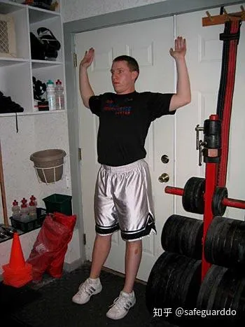

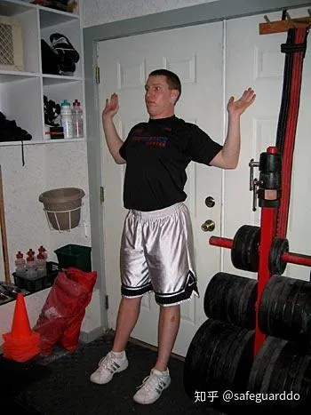

刚开始，你会感觉很困难，所以不必给自己设定太高的目标；当你[感觉适应](https://zhida.zhihu.com/search?content_id=9100080&content_type=Article&match_order=1&q=感觉适应&zhida_source=entity)了以后，再逐渐增加强度。如果你的动作正确，你会感觉到肩胛骨之间的肌肉酸痛。

### 奥林匹克上拉（Olympic Pull）

如果只练习耸肩，斜方肌的体积不会增加很快。如果你从未尝试过奥林匹克上拉（Olympic Pull）或者叫力量上拉（power pull）动作，你可能会有相见恨晚之感，它对你的斜方肌的刺激是任何动作都无法相比的。这个动作的最大好处是，它非常简单，任何人都可以掌握。

手握杠铃，握距稍大于肩宽（翻站握法），直立。接下来，屁股向后推，抬头挺胸，肩胛骨缩回，双肘张开。这样能够使手臂保持挺直，避免手臂过早弯曲。接下来，双脚迅速蹬地，利用耸肩动作带动重物上移，越高越好。

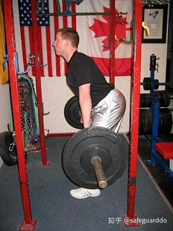

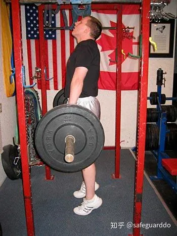

记住，刚开始不必使用太大的重量。重要的是在使双肘保持锁定，手臂保持挺直的前提下，尽量高高耸起肩部。当你掌握了以翻站握法完成这个动作之后，尝试一下不同的握距，以充分发展斜方肌。