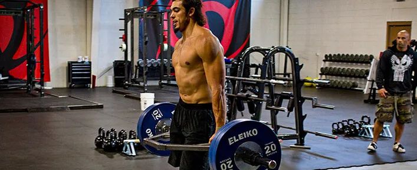
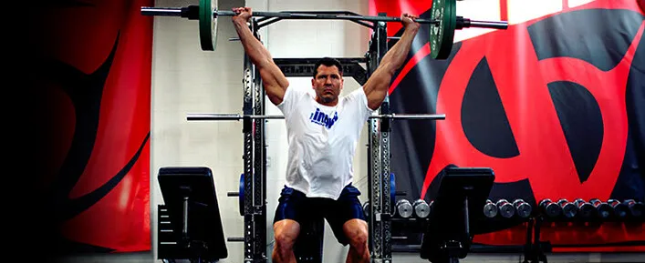
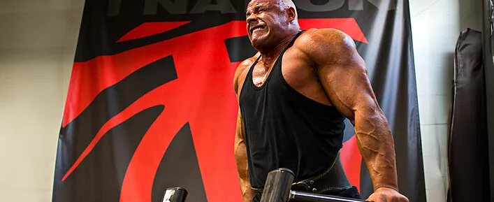
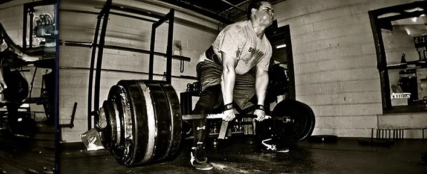
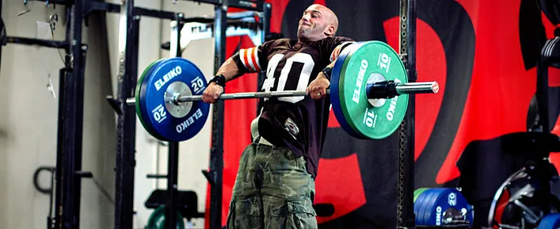

#### *The absolute best movements for fat loss, maximum power, chest development, overall strength, and more. 绝对最佳的运动，可实现减脂、最大限度增强力量、发展胸部、增强整体力量等。*

### Here's what you need to know… 以下是您需要了解的内容……

1. Nothing will make you yoked like the snatch-grip high pull.
   没有什么能像抓举高拉那样让你感到束缚。
2. While using a Prowler is great for fat loss and building muscle, the farmer's walk with a trap bar is better.
   虽然使用 Prowler 对减肥和增肌很有帮助，但使用六角杠铃的农夫行走效果更好。
3. The bench press is not the best exercise to build the pectoral muscles. It's the dip.
   卧推并不是锻炼胸肌的最佳动作，双臂屈伸才是。
4. The best exercise to use as a test for power, speed, and explosiveness isn't the 40-yard dash or the vertical jump, it's the underhand forward medicine ball throw.
   用于测试力量、速度和爆发力的最佳运动不是 40 码短跑或垂直跳跃，而是向下手向前投掷健身球。

One cautionary note before you jump into this list of favorites. I'm assuming you're using proper form on all of them. A great movement can be turned into something totally worthless if not done properly.
在你开始阅读这份最爱动作清单之前，需要注意一点。我假设你所有动作都使用了正确的姿势。如果动作不当，再好的动作也可能变得毫无价值。

### 1. snatch-grip high pull——Best Exercise to Make You Look “Yoked” 

The yoked look comes from the “shoulder pad” area. It's the size and thickness of the delts, traps, and mid-back. They're the muscles that make you look visually intimidating and scream power.
轭式外观源自“肩垫”区域。它指的是三角肌、斜方肌和中背部的大小和厚度。这些肌肉让你看起来极具视觉冲击力，展现出强大的力量。

Nothing will build those like the snatch-grip high pull from the hang or blocks. I've had people contact me saying that it changed the way their body looked in as little as two or three workouts!
没有什么比悬挂或卧推的抓举高拉更能锻炼这些肌肉了。有人联系我，说只练了两三次，他们的身材就变好了！

For the high pull, focus on exploding upwards with the lower body and hips to create upward momentum. Then pull the barbell violently toward your neck – anywhere between the nipple line and neck constitutes a high pull. Keep the bar close and the elbows high.
高拉时，重点在于下半身和臀部爆发性地向上，创造向上的动力。然后猛烈地将杠铃拉向颈部——乳头线和颈部之间的任何位置都算高拉。保持杠铃靠近，肘部抬高。

- **To gain massive size:** Do sets of 3 to 5 reps.
  **要获得巨大的尺寸：** 做 3 到 5 组。

2.farmer's walk —— Best Exercise To Get You Ripped 2. 让你拥有健美身材的最佳运动

Farmers-Walk1000×409 136 KB 农民步行 1000×409 136 KB

While some love the Prowler or sled to keep fat at bay, I prefer the farmer's walk carry. Why? Two reasons:
虽然有些人喜欢用推车或雪橇来控制脂肪，但我更喜欢农夫行走。为什么？原因有两个：

#### 1. You're less likely to be limited by metabolic factors. 1. 你不太可能受到代谢因素的限制。

The Prowler causes the greatest oxygen debt in the least amount of time. This is in part due to the high demands of the exercise, but also because it's hard to breathe when pushing the bastard!
徘徊者在最短的时间内造成最大的氧债。这部分是因为这项运动的要求很高，但也因为推着它的时候呼吸困难！

While the farmer's walk is also metabolically demanding, at least you can breathe properly when you do it. As such, you can carry big weights for longer than you can prowl big weights and you recover faster between sets. That allows for a greater density of work, which is important when trying to get as lean as possible.
虽然农夫行走对新陈代谢的要求也很高，但至少在做的时候，你可以保持正常的呼吸。这样，你就能比潜行更长时间地负重，而且组间恢复得更快。这能让你进行更高强度的训练，这对于想要尽可能瘦身的人来说至关重要。

#### 2. The farmer's walk involves a greater number of muscles. 2.农夫行走需要锻炼的肌肉更多。

The Prowler might hit the legs a little harder, but you don't get the same traps, arms, and abs involvement as the farmer's walk.
徘徊者可能会对腿部进行更重一点的锻炼，但是你不会像农夫行走那样得到同样的斜方肌、手臂和腹肌的锻炼。

You will also experience growth in those muscles because of the occluded stretch you create, which makes the farmer's walk a bigger bang-for-your-buck movement.
由于您创建的闭塞拉伸，您还将体验到这些肌肉的增长，这使农夫行走成为更物有所值的运动。

- **For fat loss:** Bouts of 2 minutes with 1 minute of rest.
  **减脂：** 每组 2 分钟，休息 1 分钟。
- **To build muscle and lose fat:** Go heavier for 1 minute with one minute of rest.
  **增肌减脂：** 举重 1 分钟，休息 1 分钟。
- **To build size/strength while keeping fat gain at bay:** Go very heavy for 20-30 seconds with up to 2 minutes of rest between sets.
  **为了增强体型/力量，同时防止脂肪增加：** 进行 20-30 秒的高强度训练，每组之间休息最多 2 分钟。

Power-Snatch1000×409 112 KB Power-Snatch 1000×409 112 KB

### 3. power snatch ——Best Exercise To Be A Solid Power Athlete 

The power snatch from the hang. A power athlete is someone competing in sports requiring a high level of speed and explosiveness like football, sprinting, throwing, or jumping events.
悬挂式力量抓举。力量型运动员是指参加需要高速度和爆发力的运动项目的运动员，例如足球、短跑、投掷或跳跃项目。

If you do them properly, the power snatch from the hang is also one of the best tests of your athletic capacity. Of all the lifting exercises, it's the one with the highest power production level. It also requires good overall coordination and full shoulder mobility.
如果你做得正确，悬挂式抓举也是检验你运动能力的最佳方法之一。在所有举重练习中，它是力量输出水平最高的。它还需要良好的整体协调性和充分的肩部灵活性。

The power clean from the hang would have been a good choice too, since the power produced is also very high, but you get higher acceleration and rate of force development and peak velocity in the power snatch – all elements that are key to ultimate performance in explosive sports.
悬挂式力量翻也是一个不错的选择，因为产生的力量也很高，但在力量抓举中，你会获得更高的加速度和力量发展率以及峰值速度——所有这些元素都是爆发性运动中达到终极表现的关键。

The power snatch is obviously a complex lift. Remember my cautionary note – if you can't do a movement properly, it's not the best for you.
力量抓举显然是一项复杂的训练。记住我的警告——如果你不能正确地完成一个动作，那么它对你来说就不是最好的。

- **To build maximum power and explosiveness:** Use a load that's 70-80% of your 1RM. We want all reps to be violently explosive, so sets of 2-3 reps are best.
  **打造最大力量和爆发力：** 使用 1RM 的 70-80% 的负荷。我们希望每次训练都充满爆发力，所以 2-3 组为最佳。

4. ## dip——Best Exercise To Build A Big Chest 

John-Schlect-Dips1000×409 99.7 KB 约翰-施莱克特-迪普斯 1000×409 99.7 KB

The dip builds the best pecs.
屈伸运动可以锻炼出最佳的胸肌。

The best exercises for individual body parts can vary from one person to the next because of leverages or muscle dominances. But the chest is one exception. And while most people think the bench press builds the best pecs, most people are wrong.
由于杠杆作用或肌肉优势不同，每个人身体各个部位的最佳锻炼方式可能有所不同。但胸部是个例外。虽然大多数人认为卧推是锻炼胸肌的最佳方式，但大多数人错了。

To this day I haven't met one person who was very strong on dips (in perfect form) who didn't have a very good chest, but I have seen my fair share of big bench pressers with very ordinary pecs.
直到今天，我还没有遇到过一个胸肌不太好但做双杠臂屈伸非常有力（且形态完美）的人，但我见过很多胸肌很普通但卧推能力很强的人。

The first sign of a good/bad dip is body swing. Those who aren't doing the dip properly tend to have their torso and legs moving during the exercise, whereas those who are very good at dips seem to have their torso and legs fixed on a sliding rail.
判断双杠臂屈伸动作好坏的第一个指标是身体的摆动。那些做不好双杠臂屈伸的人，在练习过程中，躯干和腿部往往会晃动，而那些擅长双杠臂屈伸的人，他们的躯干和腿部似乎固定在滑轨上。

Another sign is whether the shoulders stay in the pocket or not. Bad dippers (and those who get shoulder problems from dips) often allow their shoulders to move forward and up relative to their torso when they go down. If you took a picture of only their shoulders, it would look like they were doing a shrug.
另一个迹象是肩膀是否保持在口袋里。不好的下蹲者（以及那些因为下蹲而肩膀出现问题的人）在下蹲时，肩膀经常会相对于躯干向前向上移动。如果你只拍他们的肩膀，看起来就像他们在耸肩。

When you dip down you should flare your lats – think of rubbing the inner part of your upper arm against the lats – and “open up” the chest, not unlike during a bench press.
当你下蹲时，你应该张开背阔肌——想象用上臂内侧摩擦背阔肌——并“打开”胸部，就像卧推时一样。

- **To build a big chest:** Do full-range dips with an additional load of 50% bodyweight for 6-8 reps.
  **要打造大胸肌：** 进行全方位屈伸，并额外增加 50% 体重的负荷，重复 6-8 次。

## 5. deadlift——Best Exercise To Get Strong 

Deadlift1000×409 132 KB 硬拉 1000×409 132 KB

Talk to every competitive strongman and ask him what his most important barbell lift is, and 9 times out of 10, you'll get one answer: the deadlift.
与每一位竞技大力士交谈并询问他最重要的杠铃举重是什么，十有八九你会得到一个答案：硬拉。

No movement transfers better to strength than picking things up from the floor and carrying stuff with your hands, the two most important tasks in strongman competitions.
没有什么动作比从地板上捡起东西和用手搬运东西更能增强力量，这两项是大力士比赛中最重要的任务。

Even back in the 1800s during the golden age of strongmen, the ultimate test of strength was how much weight you could lift off the floor (using two hands, one hand, or one finger). In even earlier days, the strongest man in the village was the one who could pick up the heaviest stone.
即使在19世纪大力士的黄金时代，力量的终极考验也是看你能从地上举起多重的重物（用两只手、一只手或一根手指）。在更早的年代，村里最强壮的人就是能举起最重石头的人。

Lifting a big weight off the floor requires greater overall strength than all other simple actions, so it's not surprising that the deadlift is the king of lifts for strongmen.
与所有其他简单动作相比，从地板上举起大重量需要更大的整体力量，因此硬拉成为大力士的举重之王也就不足为奇了。

Becoming strong in the deadlift is the best way for 90% of the population to become strong overall. The reason? The effect it has on strengthening the nervous system. This, in turn, increases your strength potential everywhere else, too.
对90%的人来说，提高硬拉力量是提升整体力量的最佳途径。原因何在？因为它能增强神经系统。这反过来又能提升你其他方面的力量潜力。

- **To build maximum strength:** I like doing a deadlift workout that I saw Canadian strongest man Jean-Francois Caron do. He would max out on rack deadlifts (bar starting just below the knees) and then do 6 sets of 3 reps of floor deadlifts. Caron has deadlifted over 900 pounds for reps, so it's hard to find fault with this plan!
  **为了打造极限力量：** 我喜欢做加拿大最强壮男人 Jean-Francois Caron 做的硬拉训练。他会先进行架上硬拉（杠铃从膝盖下方开始），然后做 6 组，每组 3 次的地板硬拉。Caron 的硬拉次数超过 900 磅，所以这个计划很难挑剔！

## 6. clean and press——Best Exercise For The Time Constrained 6. 时间有限的最佳锻炼方式

CT-Cleans1000×409 131 KB CT-Cleans 1000×409 131 KB

If you only had time to do one session of 10 minutes per week and could only do one lift, what would you do? I'd do 5 sets of 3-5 reps on the clean and press – specifically a power clean from the hang followed by a push press – with about 60-75 seconds of rest between sets.
如果你每周只有10分钟的时间进行一次训练，而且只能做一项举重动作，你会做什么？我会做5组，每组3-5次的挺举和推举——具体来说，是先进行悬挂式力量挺举，然后进行借力推举——每组之间休息60-75秒。

The clean and press involves to some degree most, if not all, the muscles in the body. I'm not saying that it will work everything optimally, but you can at least stimulate all of your muscles to some extent.
挺举和推举在某种程度上会调动身体的大部分肌肉，即使不是全部。我并不是说它能让所有肌肉都达到最佳状态，但至少可以在一定程度上刺激你所有的肌肉。

It can also help get you leaner because it has a high-energy demand, involves so many muscle groups, and requires a high velocity of movement.
它还可以帮助您变得更瘦，因为它对能量的需求很高，涉及很多肌肉群，并且需要很高的运动速度。

- **To build or maintain muscle size and burn fat:** Do 5 sets of 3-5 reps. More than that and it turns into a metabolic conditioning exercise.
  **想要增肌或保持肌肉量并燃烧脂肪：** 做 5 组，每组 3-5 次。超过 5 组，就变成了代谢调节训练。

### 7. Best Exercise To Test Athleticism 测试运动能力的最佳运动

When you're a strength coach working with groups of athletes you often have to test your athletes to know where they are and who has the most potential. Coaches will use tons of tests and the testing of a team will often take 4 hours or more.
当你是一名力量教练，与一群运动员一起训练时，你经常需要对运动员进行测试，以了解他们的水平以及谁最有潜力。教练会进行大量的测试，而对一个团队的测试通常需要4个小时甚至更长时间。

When it comes to an athlete in football, hockey, basketball, or baseball, the test that has the highest correlation with athletic potential isn't the 40-yard dash or vertical jump, but the underhand forward medicine ball throw.
对于足球、曲棍球、篮球或棒球运动员来说，与运动潜力最相关的测试不是 40 码短跑或垂直跳跃，而是下手向前投掷健身球。

The 40-yard dash is of course a very popular choice, but nowadays it's more about technique and beating the test than pure athletic capacities. The vertical jump is a little bit less technique dependent, but it doesn't involve the upper body that much (about 10-15%) so it's less complete than the underhand throw.
40码短跑当然是一项非常受欢迎的项目，但如今它更注重技术和通过测试，而非纯粹的运动能力。垂直跳跃对技术的依赖程度略低，但对上肢的参与度不高（大约10-15%），因此不如下手投掷那么全面。

- **To test an athlete for potential:** Have them swing the ball between their legs and throw it forward as far as they can. The weight of the ball should be 10-12 pounds. A 15-meter throw (16.4 yards) is a decent result, while 19 meters (20.7 yards) would be excellent.
  **测试运动员的潜力：** 让他们把球摆到两腿之间，然后尽可能远地向前抛。球的重量应为 10-12 磅。15 米（16.4 码）的投掷距离还算不错，而 19 米（20.7 码）的投掷距离则非常出色。