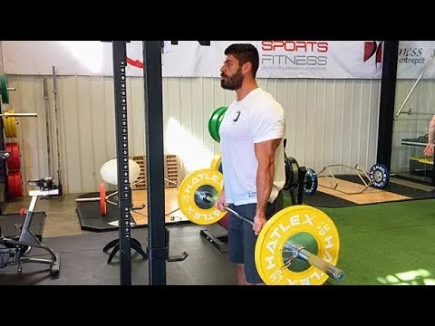

##  [The Best Damn Strength Plan For Natural Lifters 最适合自然举重运动员的力量训练计划](https://t-nation.com/t/the-best-damn-strength-plan-for-natural-lifters/282073)

先看评论

> He's not really saying that workout is "the best workout". Just that that logic is the best TYPE of workout for natty lifters.
> 他其实并不是说那种训练是“最好的训练”。他只是说，对于天生的举重运动员来说，这种训练方式是最好的。
>
> You could TL;DR: that whole article into a few ideas.:
> **您可以将整篇文章概括为以下几个想法：**
>
> PPL is best for natty guys because higher frequency is better.
> PPL 最适合喜欢自然的人，因为频率越高越好。
>
> Since you're upping frequency but also natty, you want to back off the volume a bit.
> 由于您要提高频率，但同时也要提高自然度，因此您需要稍微降低音量。
>
> Here is ONE suggestion of how that program might look.
> 以下是有关该程序可能的外观的一个建议。

> I am all for the low volume high frequency for natty guys. It is what I have seen the best results on afterall. You probably won't get that chiseled physique but you will gorw in strength and size really quickly.
> **我完全支持那些喜欢自然运动的男士使用低音量高频率的训练**。毕竟，这是我见过效果最好的训练方式。你可能不会拥有那种轮廓分明的体格，但你的力量和体型会迅速增长。
>
> Also looking at this it seems like it has a lot of different accesory workouts that would probably waste some of your time. I mean if you are going to go for low volume and increase the frequency, why not just do a full body, using the big compund movements, and hit that 3 times a week. You can take the two days in between to do some ab workouts and cardio if needed. The only isolation workouts I would recommend would be the forearms and calves.
> 另外，看起来它有很多不同的辅助训练，可能会浪费你一些时间。我的意思是，如果你想选择低强度、高频率的训练，为什么不直接做全身训练，用一些大的复合动作，每周做3次呢？如果需要的话，你可以在中间的两天做一些腹部训练和有氧运动。我唯一推荐的孤立训练是前臂和小腿。
>
> I am sure you will see results with this program, but I don't think you will see the best results. There is no need to complicate things when training. If you are natty, hit all your body 3 times a week and lift heavy. You will grow in weeks.
> 我相信你一定会看到这个计划的效果，但我认为你不会看到最好的结果。训练时没必要把事情复杂化。如果你很自然，每周进行三次全身训练，并进行大重量训练。几周后你就会成长。

###  Maximum Strength That's All You 最大力量，这就是你

#####  If you're a natural lifter doing the workouts of drugged lifters, you're going to be disappointed. Build maximal strength the natural way. Here's how. 如果你是一位自然力量训练者，却模仿那些服用药物的训练者，你肯定会失望的。用自然的方式锻炼出*最大力量*吧。方法如下。

####  No Juice? No Problem. 没有果汁？没问题。

We covered a lot of ground in [The Best Damn Workout Plan for Natural Lifters](https://t-nation.com/t/the-best-workout-plan-for-natural-lifters/282025). And even though lifters reported strength gains across the board for these two programs, muscle growth was the main focus.
我们在 [《自然举重运动员最佳训练计划》](https://t-nation.com/t/the-best-workout-plan-for-natural-lifters/282025) 中涵盖了很多内容。尽管举重运动员报告说，这两个计划的力量得到了全面提升，但肌肉增长才是主要关注点。

But what about maximal strength? That's what THIS plan is all about (size being the second objective). We'll dive into the details in just a bit, but first, let's recap a few essentials.
那么，如何才能最大程度地发挥力量呢？这正是本计划的核心所在（尺寸是其次）。我们稍后会深入探讨细节，但首先，让我们回顾一下一些要点。

####  What All Natural Lifters Should Know 所有自然举重运动员应该知道什么

If you're a natural lifter you've probably tried many advanced training programs and noticed that pretty much nothing came out of it. Here are a few reasons why that may have happened:
如果你是一位天生的举重爱好者，你可能尝试过很多高级训练计划，但发现效果甚微。以下是一些可能的原因：

#####  1. The Main Enemy of Natural Lifters is Excessive Cortisol. 1. 自然举重运动员的*主要敌人是过量的皮质醇。*

This is especially true if it's chronically elevated. Cortisol can greatly limit muscle growth by increasing protein/muscle breakdown and decreasing protein synthesis. It can also slow growth by increasing myostatin activation.
如果皮质醇长期处于高水平，情况尤其如此。皮质醇会通过增加蛋白质/肌肉分解和减少蛋白质合成来极大地限制肌肉生长。它还会通过增加肌生长抑制素的活性来减缓肌肉生长。

Myostatin is the gene that limits how much muscle you can build. The more activated it is, the less muscle your body will allow you to carry. This means, excess cortisol limits your muscle growth potential.
肌肉生长抑制素是一种限制肌肉生长的基因。它越活跃，身体允许你拥有的肌肉就越少。这意味着过量的皮质醇会限制你的肌肉生长潜力。

#####  2. Training Volume is What Triggers Cortisol Release the Most. 2. 训练量是刺激皮质醇释放的最大因素。

Cortisol's main function during physical activity is the mobilization of stored energy to fuel the session. The more fuel you need, the more cortisol you'll release. And of course you'll need more fuel when volume is higher. The moral of the story? Natural lifters can't do as much volume as enhanced lifters and expect to grow optimally.
皮质醇在体力活动中的主要功能是调动储存的能量来为训练提供能量。你需要的能量越多，你释放的皮质醇就越多。当然，训练量越大，你需要的能量也就越多。这个故事的寓意是什么？自然训练者无法像强化训练者那样进行大强度的训练，却能期望获得最佳的增肌效果。

#####  3. Natural Lifters can't Artificially Increase Protein Synthesis. 3. 自然举重者不能人为地增加蛋白质合成。

They don't have the benefit of anabolic drugs, so their bodies rely almost exclusively on the training session (and nutrition) to trigger protein synthesis. Under normal circumstances, protein synthesis is elevated in a trained muscle for up to 24 hours after a workout. But after that, it comes back down to normal levels.
他们没有合成代谢药物的益处，所以他们的身体几乎完全依赖训练（和营养）来触发蛋白质合成。正常情况下，训练后肌肉的蛋白质合成在训练后长达24小时内会升高。但此后，蛋白质合成会回落到正常水平。

If a natural lifter trains a muscle only once per week, muscle growth will be fairly slow because the period where protein synthesis is significantly elevated in a muscle is short. A natural lifter will get more muscle growth training a muscle twice per week and even more if he or she can hit a muscle three times in the week.
如果自然训练者每周只训练一块肌肉一次，肌肉生长会相当缓慢，因为肌肉中蛋白质合成显著增加的时期很短。**自然训练者每周训练一块肌肉两次，肌肉生长会更快，如果每周训练一块肌肉三次，肌肉生长会更快。**

#####  4. Volume and Frequency are Inversely Related. 4. 交易量和频率成反比。

The more frequently you train, the less volume you should do at each workout… that is, if you want to build muscle or strength. So the basic principles for natural lifters are:
*训练频率越高，每次训练的训练量就应该越小*……如果你想要增肌或力量的话。因此，自然力量训练者的基本原则是：

- Train each muscle frequently, ideally 3 times per week to trigger protein synthesis more often.
  **经常训练每块肌肉**，理想情况下每周 3 次，以更频繁地触发蛋白质合成。
- Keep volume low to allow for the greater frequency.
  **保持低音量以允许更大的频率。**
- Since the number of work sets will be low, push them extremely hard.
  **由于工作组的数量很少，因此要非常努力。**
- Make use of several different training methods to stimulate growth via several different mechanisms.
  利用几种不同的训练方法，通过几种不同的机制来刺激增长。

With all this in mind, let's dive into the plan.
考虑到这一切，让我们深入研究这个计划。

Lift1000×409 83.9 KB Lift 1000×409 83.9 KB

####  Weekly Schedule 每周计划

There are six workouts per week, since this is a high frequency, low-volume approach. Each workout will include one heavy lift:
每周训练六次，因为这是一种高频率、低训练量的训练方法。每次训练将包含一项大重量训练：

- Squat 蹲
- Bench Press 卧推
- Deadlift 硬拉
- Military Press 军事出版社
- Row or Chin-Up 划船或引体向上

Three of these workouts (the squat, bench press, and military press workouts) will include one heavy assistance lift followed by three lower-stress exercises trained for hypertrophy (muscle growth).
其中三项训练（深蹲、卧推和军事推举训练）将包括一次重型辅助举重，随后进行三项针对肥大（肌肉生长）进行训练的低压力练习。

For the three other workouts (the deadlift, row, and chin-up focused sessions) there's no heavy assistance exercise, but instead three or four lower-stress exercises.
对于其他三项锻炼（硬拉、划船和引体向上重点训练），没有重型辅助练习，而是三到四项低压力练习。

The weekly schedule looks like this:
每周的时间表如下：

#####  Monday – Push/Squat 周一——推/蹲

- Squat (heavy) 深蹲（重量）
- Squat assistance exercise (heavy)
  深蹲辅助练习（重量）
- Pecs lower-stress exercise (hypertrophy)
  胸肌低压力锻炼（肥大）
- Triceps lower-stress exercise (hypertrophy)
  肱三头肌低压力锻炼（肥大）
- Delts lower-stress exercise (hypertrophy)
  三角肌低压力锻炼（肥大）

#####  Tuesday – Pull 星期二 – 拉

- Row (heavy) 划船（重型）
- Hamstrings lower-stress exercise (hypertrophy)
  腿筋低压力锻炼（肥大）
- Lat lower-stress exercise (hypertrophy)
  背阔肌低压力锻炼（肥大）
- Mid-back/traps lower-stress exercise (hypertrophy)
  中背部/斜方肌低压力锻炼（肥大）
- Biceps lower-stress exercise (hypertrophy)
  二头肌低压力锻炼（肥大）

#####  Wednesday – Push/Bench Press 星期三——推举/卧推

- Bench press (heavy) 卧推（重量）
- Bench press assistance (heavy)
  卧推辅助（重量）
- Quads lower-stress exercise (hypertrophy)
  四头肌低压力锻炼（肥大）
- Delts lower-stress exercise (hypertrophy)
  三角肌低压力锻炼（肥大）
- Triceps lower-stress exercise (hypertrophy)
  肱三头肌低压力锻炼（肥大）

#####  Thursday – Pull/Deadlift 周四——拉/硬拉

- Deadlift (heavy) 硬拉（大重量）
- Lats lower-stress exercise (hypertrophy)
  背阔肌低压力锻炼（肥大）
- Mid-back/traps lower-stress exercise (hypertrophy)
  中背部/斜方肌低压力锻炼（肥大）
- Biceps lower-stress exercise (hypertrophy)
  二头肌低压力锻炼（肥大）

#####  Friday - Push/Military Press 星期五 - 推举/军事推举

- Military press (heavy) 军事推举（重型）
- Military press assistance (heavy)
  军事新闻援助（重型）
- Pecs lower-stress exercise (hypertrophy)
  胸肌低压力锻炼（肥大）
- Quads lower-stress exercise (hypertrophy)
  四头肌低压力锻炼（肥大）
- Triceps lower-stress exercise (hypertrophy)
  肱三头肌低压力锻炼（肥大）

#####  Saturday – Pull/Chin-up 周六——引体向上

- Chin-up (heavy) 引体向上（重量）
- Hamstrings lower-stress exercise (hypertrophy)
  腿筋低压力锻炼（肥大）
- Lats lower-stress exercise (hypertrophy)
  背阔肌低压力锻炼（肥大）
- Mid-back/traps lower-stress exercise (hypertrophy)
  中背部/斜方肌低压力锻炼（肥大）
- Biceps lower-stress exercise (hypertrophy)
  二头肌低压力锻炼（肥大）

#####  Sunday – Off 周日 – 休息

####  The Exercise Categories 练习类别

This plan contains three exercise categories:
该计划包含三个锻炼类别：

1. **The Heavy-Focus Lifts:** Squat, row, bench press, deadlift, military press, chin-up. These will be trained with the heavier methods.
   **重心训练动作：** 深蹲、划船、卧推、硬拉、军事推举、引体向上。这些动作将采用更重的训练方法。
2. **The Assistance Work:** Squat assistance, bench assistance, military press assistance. These will be trained with a fairly heavy method, but not as heavy as with the first category.
   **辅助训练：** 深蹲辅助、卧推辅助、军事推举辅助。这些训练会采用*相当高强度的训练方法，但强度不如第一类。*
3. **The Hypertrophy Work:** This requires lighter methods focusing on stimulating muscle growth.
   **肥大训练：** 这需要*更轻松*的方法来刺激肌肉生长。

Each category will use several methods, listed below.
每个类别将使用几种方法，如下所列。

####  Heavy Focus Lift Methods 重聚焦提升方法

#####  Heavy Max Reps Set With Given Percentage 指定百分比的重物最大次数组

With this method I take a page from Jim Wendler's book. You'll use a given percentage of your technically correct (good form) 1RM. After warming up, you'll do one set where you do as many reps as you can.
这种方法我借鉴了 Jim Wendler 的教材。你需要使用你技术上正确（也就是正确动作）1RM 的一定百分比。热身后，进行一组尽可能多次数的训练。

You do not reach failure though. You stop when you know that you probably can't complete the next rep. The program uses a 3-week wave where the load increases by 2.5% every week. Then we go back down and work our way up again for 3 weeks:
但你不会达到力竭的程度。当你知道自己可能无法完成下一次训练时，你就会停止。这个计划采用3周的波动训练，每周增加2.5%的负荷。然后我们开始逐步降低负荷，再用3周时间增加负荷：

- Week 1: 85% 第一周：85%
- Week 2: 87.5% 第二周：87.5%
- Week 3: 90% 第 3 周：90%
- Week 4: 87.5% 第四周：87.5%
- Week 5: 90% 第 5 周：90%
- Week 6: 92.5% 第六周：92.5%
- Week 7: 90% 第 7 周：90%
- Week 8: 92.5% 第 8 周：92.5%
- Week 9: 95% 第 9 周：95%
- Week 10: 92.5% 第 10 周：92.5%
- Week 11: 95% 第 11 周：95%
- Week 12: 97.5% 第 12 周：97.5%

Note: If after 12 weeks you decide to continue with this approach, re-test your 1RM and start a new cycle with the adjusted numbers.
注意：如果 12 周后您决定继续采用这种方法，请重新测试您的 1RM 并使用调整后的数字开始新的周期。

#####  Strength-Skill Work 力量技能训练

This refers to doing a higher amount of non-maximal work. It's mostly done to improve your neurological efficiency. The key here is to make sure every rep is perfect. You'll do several work sets with a fairly heavy weight (82.5% to 87.5%) but always several reps short of failure. To make the sets effective, focus on perfect technique and try to accelerate as much as possible during the concentric (lifting) portion.
这指的是进行大量的非最大强度训练。这主要是为了提高你的神经效率。关键在于确保每次重复都完美无缺。你将用相当重的重量（82.5% 到 87.5%）做几组训练，但每次重复都要比力竭少几次。为了使训练组有效，你需要专注于完美的技巧，并在向心（举重）阶段尽可能加速。

We also use a 3-week wave where the load is fixed, but the volume changes. After a wave we increase the weight but come back down volume-wise:
我们也采用3周的波动训练，其中负荷固定，但训练量会有所变化。一个波动训练结束后，我们会增加重量，但训练量会有所下降：

- Week 1: 82.5% 5 x 2
  第一周：82.5% 5 x 2
- Week 2: 82.5% 5 x 3
  第 2 周：82.5% 5 x 3
- Week 3: 82.5% 5 x 4
  第 3 周：82.5% 5 x 4
- Week 4: 85% 5 x 2
  第四周：85% 5 x 2
- Week 5: 85% 5 x 3
  第 5 周：85% 5 x 3
- Week 6: 85% 5 x 4
  第 6 周：85% 5 x 4
- Week 7: 87.5% 5 x 2
  第七周：87.5% 5 x 2
- Week 8: 87.5% 5 x 3
  第 8 周：87.5% 5 x 3
- Week 9: 87.5% 5 x 4
  第 9 周：87.5% 5 x 4
- Week 10: 90% 5 x 2
  第 10 周：90% 5 x 2
- Week 11: 90% 5 x 3
  第 11 周：90% 5 x 3
- Week 12: 90% 5 x 4
  第 12 周：90% 5 x 4

**Note:** Again, if after 12 weeks you decide to continue with this approach you'd re-test your 1RM and start a new cycle with the adjusted numbers.
**注意：** 同样，如果 12 周后您决定继续采用这种方法，您将重新测试您的 1RM 并使用调整后的数字开始新的周期。

When calculating the load on the chin-up you must include bodyweight in the calculation. If you weigh 200 pounds and your maximum is the addition of 45 pounds, the weight lifted is 245 pounds. If you need to use 82.5% it means 202 pounds, so you'd need to attach a 2.5-pound plate to your waist. If you don't include your bodyweight you'd calculate 82.5% of 45 pounds and it would come up to 37 pounds, which would be way too heavy for the prescribed volume.
计算引体向上的负荷时，必须将自身体重纳入计算。如果你的体重是200磅，你的最大重量是加上45磅，那么举起的重量就是245磅。如果你需要使用82.5%的重量，那就意味着202磅，所以你需要在腰部绑一个2.5磅的杠铃片。如果不包含自身体重，你计算45磅的82.5%，最终重量是37磅，这远远超过了规定的重量。

#####  Rest/Pause Assistance Work 休息/暂停辅助工作

Your work sets will require a weight that you can lift for 4 to 6 reps. You'll complete as many technically correct reps as you can with that weight. Your goal will then be to double that number of reps. To do that you take short rest periods.
你的常规组训练需要你能够举起4到6次的重量。你需要用这个重量尽可能多地完成技术上正确的次数。你的目标是将次数翻倍。为了达到这个目标，你需要进行短暂的休息。

For example, let's say that you get 5 reps in the initial bout. This means you want to do 10 total reps for your set. After your 5 reps, you'll rest for 15 seconds. Then you might get an extra 3 reps. This means you'll need to get 2 more reps. Rest another 15 seconds and then you'll be capable of getting the last 2 reps.
例如，假设你在第一轮训练中完成了5次。这意味着你这组训练总共要做10次。完成5次后，你将休息15秒。然后你可能会再做3次。这意味着你需要再做2次。再休息15秒，然后你就能完成最后2次了。

Here's Anthony Campbell demonstrating the rest/pause method:
以下是安东尼·坎贝尔 (Anthony Campbell) 演示的休息/暂停方法：

[Rest-Pause Method 休息-暂停法](https://www.youtube.com/watch?v=LYrXWYcgnyw)

####  Hypertrophy Methods 肥大方法

#####  mTOR Sets mTOR 套装

Here the key is how you perform each rep. Accentuating the eccentric (negative) and loaded stretching are the contraction types that increase mTOR activation the most. So with this method you'll do as follows:
这里的关键在于你如何进行每次重复。强化离心（负重）拉伸和负重拉伸是提高 mTOR 激活度最有效的收缩类型。因此，使用这种方法，你需要进行以下练习：

- Lower the weight over a 5-second count while tensing/flexing the target muscle as hard as possible at all times.
  在 5 秒内降低重量，同时始终尽可能用力拉紧/弯曲目标肌肉。
- Hold the full stretch position for 2 seconds per rep.
  每次保持完全伸展姿势 2 秒。
- Do 6-8 reps like this, and on the last rep hold the stretch position for as long as you can tolerate. Again, you only do one set of this special technique/method.
  如此重复6-8次，最后一次保持拉伸姿势，直到你能忍受为止。同样，你只能练习一组这种特殊的技巧/方法。

Here's what it looks like in action:
实际操作起来是这样的：

[mTOR Method mTOR 方法](https://www.youtube.com/watch?v=GeiZKG5Bs8s)

#####  “Heavy” Myo Reps “重度” Myo 训练次数

For maximum muscle fiber fatigue, use the myo rep method developed by Borge Fagerly. It's a form of rest/pause. You reach failure or close to it, then do as many micro-sets of 3 reps as possible with around 20 seconds of rest.
为了最大限度地减少肌肉纤维疲劳，可以使用 Borge Fagerly 开发的 Myo Rep 方法。这是一种休息/暂停的方式。当你达到或接近力竭时，*尽可能多地进行 3 次微组训练，中间休息 20 秒左右。*

When you can only get 2 reps on a micro-set, stop. The initial set can use any number of reps from 6 to 20, but with this program we'll use a weight that you can get 6-8 reps with.
当你在一个微组训练中只能完成2次时，就停止。初始组的训练次数可以是6到20次，但在本计划中，我们将使用一个你可以完成6到8次的重量。

Start by doing as many reps as you can with that weight, then rest 20 seconds and do 3 more reps. Rest 20 seconds and do 3 more reps. Continue doing that until you can only get 2 additional reps. If you can get more than 5 micro-sets you likely faked yourself in that original set and didn't go close enough to failure.
*先用这个重量尽可能多地做几组，然后休息20秒，再做3组。休息20秒，再做3组。继续这样做，直到你只能再做2组。如果你能做超过5个微组，那么你很可能在最初的那组训练中只是假装做，并没有接近力竭。*

[Myo Reps Method Myo Reps 方法](https://www.youtube.com/watch?v=8b8Ddq_V2YU)

####  The Workouts 训练

Now that we have the training split and the training methods we'll use, let's put it together in a weekly plan:
现在我们已经确定了训练分组和要使用的训练方法，让我们将其整合到每周计划中：

#####  Monday – Push/Squat 周一——推/蹲

- **A. Squat A. 深蹲**

- 2-4 warm-up sets of 3 reps
  2-4 组热身，每组 3 次

- 1 max-rep set with the given percentage (see earlier in the article for the progression)
  1 组指定百分比的最大重复次数训练（有关训练进度，请参阅文章前面的内容）

  

- **B. Zercher Squat B.泽奇深蹲**

- 2-3 warm-up sets of 3 reps
  2-3组热身，每组3次

- 1 rest/pause set with a starting weight of 4-6 reps
  1 组休息/暂停，起始重量为 4-6 次

  

- **C. Dumbbell Bench Press C.哑铃卧推**

- Do 1-3 warm-up sets of 6-8 reps
  做 1-3 组热身运动，每组 6-8 次

- 1 mTOR set 1 套 mTOR

  

- **D. Rope Triceps Pressdown
  D. 绳索肱三头肌下压**

- 1-2 warm-up sets (6-8 reps)
  1-2 组热身运动（6-8 次）

- 1 Myo-reps set starting with a weight you could do for 6-8 reps
  1 组 Myo-reps 训练，从你可以做 6-8 次的重量开始

  

- **E. Lateral Raise E.侧平举**

- 1-2 warm-up sets (6-8 reps)
  1-2 组热身运动（6-8 次）

- 1 Myo-reps set 1组肌力训练

#####  Tuesday – Pull 星期二 – 拉

- **A. Pendlay Row A. 彭德利街**

- 2-3 warm-up sets (3 reps)
  2-3 组热身运动（3 次）

- Strength-skill work: 5 work sets with the load and reps prescribed in the progression
  力量技能训练：5组训练，按进度规定负荷和次数

  

- **B. Romanian Deadlift B.罗马尼亚硬拉**

- 1-3 warm-up sets (5 reps)
  1-3 组热身运动（5 次）

- 1 mTOR set 1 套 mTOR

  

- **C. Straight-Arm Pulldown C.直臂下拉**

- 1-2 warm-up sets (6-8 reps)
  1-2 组热身运动（6-8 次）

- 1 Myo-reps set 1组肌力训练

  

- **D. Bent Over Lateral Raise
  D. 俯身侧平举**

- 1-2 warm-up sets for 6-8 reps
  1-2组热身，每组6-8次

- 1 Myo-reps 1 次肌肉训练

  

- **E. Incline Dumbbell Curl E. 上斜哑铃弯举**

- 1-2 warm-up sets for 5 reps
  1-2组热身，每组5次

- 1 mTOR set 1 套 mTOR

#####  Wednesday – Push/Bench Press 星期三——推举/卧推

- **A. Bench Press A.卧推**

- 2-4 warm-up sets of 3 reps
  2-4 组热身，每组 3 次

- 1 max reps set with the given percentage
  1 组最大次数，按指定百分比设置

  

- **B. Close-Grip Floor Press
  B. 窄握地板推举**

- 2-3 warm-up sets of 3 reps
  2-3组热身，每组3次

- 1 rest/pause set with a starting weight of 4-6 reps
  1 组休息/暂停，起始重量为 4-6 次

  

- **C. Machine Hack Squat** (or goblet squat with heels elevated)
  **C. 机器哈克深蹲** （或脚跟抬高的高脚杯深蹲）

- 1-3 warm-up sets of 5 reps
  1-3组热身，每组5次

- 1 mTOR set 1 套 mTOR

  

- **D. Dumbbell Shoulder Press
  D.哑铃肩上推举**

- 1-3 warm-up sets of 5 reps
  1-3组热身，每组5次

- 1 mTOR set 1 套 mTOR

  

- **E. French Press** (overhead EZ-bar triceps extension)
  **E. 法式卧推** （头顶 EZ-bar 肱三头肌伸展）

- 1-2 warm-up sets of 5 reps
  1-2组热身，每组5次

- 1 mTOR set 1 套 mTOR

#####  Thursday – Pull/Deadlift 周四——拉/硬拉

- **A. Deadlift A.硬拉**

- 2-3 warm-up sets of 3 reps
  2-3组热身，每组3次

- Strength-skill work: 5 work sets
  力量技巧训练：5组

  

- **B. Chest-Supported T-bar Row
  B.胸部支撑 T 杠划船**

- 1-3 warm-up sets of 5 reps
  1-3组热身，每组5次

- 1 Myo-reps set 1组肌力训练

  

- **C. Face Pull C. 面拉**

- 1-2 warm-up sets of 5 reps
  1-2组热身，每组5次

- 1 mTOR set 1 套 mTOR

  

- **D. Barbell Curl D.杠铃弯举**

- 1-2 warm-up sets of 5 reps
  1-2组热身，每组5次

- 1 Myo-reps set 1组肌力训练

#####  Friday – Push/Military Press 星期五 - 推/军事推举

- **A. Military Press A.军事出版社**

- 2-4 warm-up sets of 3 reps
  2-4 组热身，每组 3 次

- 1 max reps set with the given percentage
  1 组最大次数，按指定百分比设置

  

- **B. High Incline Bench Press** (60 degrees)
  **B.高斜卧推** （60 度）

- 2-3 warm-up sets of 3 reps
  2-3组热身，每组3次

- 1 rest/pause set with a starting weight of 4-6 reps
  1 组休息/暂停，起始重量为 4-6 次

  

- **C. Pec Deck Machine** (or cable cross-over or dumbbell flyes)
  **C. 夹胸机** （或绳索交叉或哑铃飞鸟）

- 1-2 warm-up sets of 6-8 reps
  1-2组热身，每组6-8次

- 1 Myo-reps set 1组肌力训练

  

- **D. Leg Press D. 腿部推举**

- 1-3 warm-up sets of 6-8 reps
  1-3组热身，每组6-8次

- 1 Myo-reps set 1组肌力训练

  

- **E. JM Press E. JM 出版社**

- 1-3 warm-up sets for 5 reps
  1-3组热身，每组5次

- 1 mTOR set 1 套 mTOR

#####  Saturday – Pull/Chin-Up 周六——引体向上

- **A. Chin-Up A. 引体向上**

- 2-3 warm-up sets of 3 reps
  2-3组热身，每组3次

- Strength-skill work: 5 work sets
  力量技巧训练：5组

  

- **B. Leg Curl B. 腿弯举**

- 1-2 warm-up sets of 6-8 reps
  1-2组热身，每组6-8次

- 1 Myo-reps set 1组肌力训练

  

- **C. Lat Pulldown Pronated C. 引体向上**

- 1-2 warm-up sets of 6-8 reps
  1-2组热身，每组6-8次

- 1 Myo-reps set 1组肌力训练

  

- **D. Dumbbell Shrug D.哑铃耸肩**

- 1-3 warm-up sets of 5 reps
  1-3组热身，每组5次

- 1 mTOR set 1 套 mTOR

  

- **E. Incline Dumbbell Hammer Curl
  E. 上斜哑铃锤式弯举**

- 1-3 warm-up sets of 5 reps
  1-3组热身，每组5次

- 1 mTOR set 1 套 mTOR

#####  Sunday – Off 周日 – 休息

####  Effort Level 努力程度

The best program performed 80% effort will give you less results than a basic program done at 100%. This is the most important thing you need to remember. So to get amazing results, you need to apply the proper level of intensity.
即使最好的训练计划只用80%的努力，效果也比100%的基础训练计划差。这是你需要记住的最重要的一点。所以，为了获得惊人的效果，你需要运用适当的强度。

Except for the strength-skill portion of the workout, the volume of work is low: you only perform one work set of each exercise. Since you can't use volume to stimulate gains, you need to milk every set for everything it's worth. If you fail to take the work sets to the required point, you won't grow and increase your strength as fast as you could.
除了力量技巧部分，训练量很低：每个动作只需做一组。由于训练量无法刺激肌肉增长，你需要充分利用每一组训练。如果你的训练组数达不到要求，你的力量就无法快速增长。

The principle of this is to do short but brutally hard sessions. If you do “short” but not “brutal” don't expect much in the way of gains!
这项训练的原则是训练时间短，但强度要非常大。如果你训练时间短，但强度不大，就别指望能有什么收获！

Here's where you need to take each exercise:
以下是您需要进行的每个练习：

#####  Max Reps Strength Lifts 最大次数力量训练

######  (Squat, Bench Press, Military Press) （深蹲、卧推、军事推举）

The work set on these should be around a 9/10 on the perceived effort scale. This means that you should do as many technically correct reps as you can. When you stop your set you must be pretty darn sure that if you would've tried one more rep, you would have either failed or used bad technique. But as long as you're reasonably sure that you can get the next rep, do it.
这些训练的强度在自觉努力程度量表上应该在9/10左右。这意味着你应该尽可能多地完成技术上正确的次数。当你停止训练时，你必须非常确定，如果你再尝试一次，你要么会失败，要么会用错技术。但只要你相当确定自己能完成下一次，那就去做吧。

#####  Strength-skill Lifts 力量技巧提升

######  (Rowing, Deadlift, Chin-Up) （划船、硬拉、引体向上）

These are the only exercises where you don't push close to your limit. Do more sets to get the work done. See it more as “strength practice” than all-out lifting. But to make these effective at increasing strength and size, control the eccentric by lowering slowly for about 2-3 seconds. Try to accelerate as much as possible on the concentric, lifting phase.
*这些是唯一不需要你逼近极限的练习*。多做几组就能达到效果。*与其说是全力以赴的举重，不如把它看作是“力量练习”*。但为了有效地增加力量和肌肉块头，*需要控制离心收缩，缓慢降低身体约2-3秒*。在*向心收缩和举重阶段，尽量加速*。

#####  Rest/Pause Lifts 休息/暂停举重

######  (Zercher Squat, Close-Grip Floor Press, High Incline Bench Press) （泽奇深蹲、窄握地板推举、高斜卧推）

The same rule applies as for the max reps strength lifts – take the set to the point where you know you can't get another full rep, then rest for 20 seconds before resuming the set to get more reps in.
同样的规则也适用于最大次数的力量举——进行一组动作直到你知道你无法再进行一次完整的重复，然后休息 20 秒，再恢复该组动作以进行更多的重复。

For everything else (mTOR sets and myo-reps) you must reach the point of muscle failure, where you fail to complete a rep.
对于其他一切（mTOR 组和肌重复），您必须达到肌肉衰竭的程度，即无法完成一次重复。

####  Q & A 问答

Here are some questions that are bound to pop up:
以下是一些必然会出现的问题：

#####  I can't train 6 days a week. Can I still do the program? 我无法每周训练6天。我还能继续这个计划吗？

If you can train 4 or 5 days a week, you can do the program. In that case, simply roll through the 6 training days in order. It will just take you more than a week to complete one “training week.”
如果你每周可以训练4到5天，那么你可以完成这个计划。在这种情况下，只需按顺序完成6天的训练即可。完成一个“训练周”只需要一周多的时间。

If you can only train 3 days a week this isn't the best plan for you since it's based on a high frequency of work.
如果您每周只能训练 3 天，那么这对您来说并不是最好的计划，因为它基于高频率的工作。

#####  Can I do this program when trying to cut? 我尝试剪切时可以执行这个程序吗？

Just so that we're on the same page, trying to “cut” means eating a caloric deficit in an effort to lose body fat. My answer would be “yes, but…”
为了让大家达成共识，“减脂”意味着为了减掉体内脂肪而摄入热量不足。我的答案是“是的，但是……”

To get the most out of a strength or size plan you should ideally consume at least a small caloric surplus. This is important, especially if you're natural. You can still add size and strength if you're eating at a maintenance level, but the gains will be slower.
为了最大限度地发挥力量或体型增肌计划的效果，理想情况下，你应该至少摄入少量的热量盈余。这一点很重要，尤其对于自然饮食者来说。即使你的饮食维持在维持水平，你仍然可以增加体型和力量，但增肌速度会比较慢。

But what about eating a caloric deficit? For developing size, it's not ideal. Under the right circumstances you can add some muscle while in a slight caloric deficit but even in the best case scenario your capacity to build muscle will be impaired if you don't get enough nutrients.
但是，如果摄入热量不足怎么办？这对于增肌来说并非理想选择。在适当的情况下，你可以在轻微热量不足的情况下增加一些肌肉，但即使在最好的情况下，如果你没有摄入足够的营养，你的增肌能力也会受到损害。

But what about strength? Since strength is gained both by increasing muscle size and neurological efficiency, it's a bit easier to increase strength than to gain size while in a caloric deficit. That said, your strength gains will still be a lot slower than if you were consuming a caloric surplus.
但是力量呢？由于力量的提升是通过增加肌肉体积和神经系统效率来实现的，因此在热量不足的情况下，提升力量比增加体积要容易一些。即便如此，你的力量增长速度仍然会比热量过剩时慢得多。

Why? First because you won't be able to build as much muscle. If you build less muscle your strength potential doesn't increase as much.
为什么？首先，因为你练不出那么多肌肉。练出的肌肉少了，你的力量潜力就提升不了那么多。

Second, when you reduce carbs (which you normally do to get a deficit) you'll store less water inside the muscles, which decreases your leverage. Dehydration or a reduction in water retention can decrease strength significantly even if the muscle mass stays the same. That's why powerlifters “bloat up” on purpose before a meet.
其次，当你减少碳水化合物摄入（通常为了达到赤字效果会这么做）时，肌肉内储存的水分会减少，从而降低你的杠杆作用。脱水或水分滞留减少会显著降低力量，即使肌肉质量保持不变。这就是为什么力量举运动员会在比赛前故意“膨胀”的原因。

Finally, when you consume fewer carbs it's possible to lower your CNS efficiency since the nervous system runs primarily on glucose.
最后，当你消耗较少的碳水化合物时，你的中枢神经系统效率可能会降低，因为神经系统主要依靠葡萄糖运转。

So I'd strongly recommend that you do this program while consuming at least a slight caloric surplus if you want to maximize your gains.
因此，如果您想最大限度地提高收益，我强烈建议您在执行此计划的同时至少消耗少量热量。

Now, if you decide to lower your body fat you still have to train. And since your capacity to recover and adapt to training decreases whenever you try to “cut,” no program will ever yield maximum results when trying to get lean. In that regard, this program is as good as any when on a cutting phase.
现在，如果你决定降低体脂，你仍然需要训练。而且，由于每次尝试“减脂”时，你的恢复能力和适应训练的能力都会下降，所以没有任何计划能够在试图瘦身时取得最佳效果。从这个角度来看，这个计划在减脂阶段和其他计划一样有效。

In fact, due to the low volume, you reduce the potential overtraining/under-recovering that's more likely to occur when you reduce your food intake. So, yes you can do this program when trying to get lean, but don't expect the same gains as if you were doing it while eating a surplus.
事实上，由于训练量低，你能够减少过度训练/恢复不足的可能性，而这些情况在你减少食物摄入量时更容易发生。所以，虽然你可以在尝试瘦身时进行这个计划，但不要指望获得与吃得过多时相同的效果。

#####  Can I add cardio? 我可以增加有氧运动吗？

Same answer as the question about doing this program while trying to lose fat: Yes, but…
与尝试减肥的同时进行此计划的问题的答案相同：是的，但是……

Adding a moderate round of cardio (steady state or short intervals) should not make the program ineffective. Key word: moderate. So if you jog 60-90 minutes per day, there's a good chance you won't be progressing as fast as you would if you simply did the program.
增加一轮中等强度的有氧运动（稳定状态或短间歇）不会使这个计划失效。关键词：中等强度。所以，如果你每天慢跑60-90分钟，你的进步很可能不如单纯按照计划进行时那么快。

Doing 30 minutes of steady state work or 12-15 minutes of intervals 2-3 times per week is fine. But understand that, just like with a caloric deficit, it might slow down your gains slightly.
每周2-3次，每次30分钟的稳定状态训练或12-15分钟的间歇训练是可以的。但要明白，就像热量缺口一样，这可能会稍微减缓你的增肌速度。

#####  Can I add work for abs and/or calves? 我可以增加腹部和/或小腿的锻炼吗？

You can. I personally train abs with a blitz approach which works well with the structure of this workout.
可以。我个人用闪电训练法来训练腹肌，这和这个训练的结构很契合。

Train abs everyday for 3 weeks, then not at all for 3 weeks. Then go back to training them every day for 3 weeks and then no abs work for the last 3 weeks. I normally recommend doing 3 sets of a superset that includes one loaded and one unloaded ab exercise. Example:
每天训练腹肌，持续3周，然后完全停止3周。之后恢复每天训练，持续3周，最后3周完全停止腹肌训练。我通常建议做3组超级组，其中包含一个负重腹部动作和一个无负重腹部动作。例如：

|      | Exercise 锻炼                | Sets 套 | Reps 代表 | Rest 休息    |
| :--- | :--------------------------- | :------ | :-------- | :----------- |
| A1   | Seated Cable Crunch 坐姿卷腹 | 3       | 8-12      |              |
| B    | Swiss Ball Crunch 瑞士球卷腹 | 3       | 8-12      | 1 min. 1分钟 |

Calf work can be added up to 3 days a week at the end of the push days. The best method to use is the mTOR reps method. Do 2 warm-up sets then one all-out mTOR set. You can do them seated, standing, or donkey style.
每周最多可以在推举日结束后增加 3 天的小腿训练。最佳方法是 mTOR 重复训练法。先做两组热身，然后进行一组全力 mTOR 训练。你可以选择坐姿、站姿或驴式训练。

#####  Can I repeat the program once I'm done with a 12 week cycle? 完成 12 周的周期后，我可以重复该计划吗？

Yes. Just retest your max on the 6 “big lifts” to plan the weights for the next cycle. If you decide to start a new cycle, change the hypertrophy exercises, even the heavy assistance lifts. Keep the main lifts the same though.
是的。只需重新测试你之前6个“大重量”动作的最大重量，就可以规划下一个周期的重量。如果你决定开始新的周期，请调整增肌练习，即使是大重量辅助动作也一样。不过，主要动作保持不变。

Another option would be to do 3-6 weeks of either “The Best Damn Workout Plan for Natural Lifters” or part 2 before going back to another strength phase.
另一种选择是进行 3-6 周的“自然举重运动员最佳锻炼计划”或第 2 部分，然后再回到另一个力量阶段。

####  Foolproof Plan 万无一失的计划

This style of training, if you train at the intensity level required, is guaranteed to add significant strength and size on anyone. It's foolproof and might change your training paradigm forever. If you're tired of spinning your wheels on “traditional” plans, this might be the answer you've been looking for.
这种训练方式，只要你按照所需的强度进行训练，保证能让任何人的力量和围度都显著提升。它简单易行，甚至可能永远改变你的训练模式。如果你厌倦了“传统”训练计划，这或许就是你一直在寻找的答案。