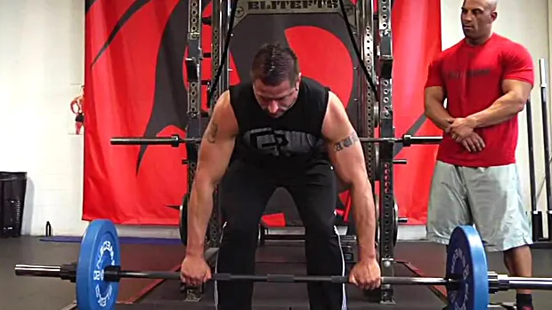
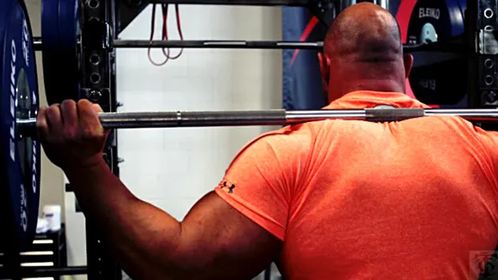

#####  The look of power cannot be faked. Here's how to build a body that has the "go" to back up the "show." 力量的外表是无法伪装的。以下是如何打造拥有“力量”的身材，来支撑你的“秀”。

####  Here's What You Need To Know… 以下是您需要了解的内容……

1. Physiques that exude power are made of *massive lats, traps, and delts.* And they don't just look powerful, they *are* powerful.
   散发力量的体格是由*强大的背阔肌、斜方肌和三角肌构成的*。它们不仅看起来强大，而且*确实*强大。
2. To achieve the power look, you'll need to get strong overall and improve your 3RM.
   为了获得力量外观，您需要*整体增强力量并提高您的 3RM。*
3. Focus on four main lifts with added accessory lifts. The purpose of the accessory lifts is to increase your 3RM on the main lifts.
   *专注于四个主要动作，并添加辅助动作。辅助动作的目的是提高你在主要动作上的 3RM。*
4. There are three phases of this 10-week program. It's periodized so that your main lifts increase in load while your assistance work decreases in volume.
   这个为期10周的训练计划分为三个阶段。它采用周期化的方式，让你的主要训练动作重量逐渐增加，而辅助训练动作的重量逐渐减少。

####  Defining The Power Look 定义力量外观

Few people have a physique that looks powerful and intimidating. And I want what few people have. Don't you?
很少有人拥有如此强悍、令人生畏的体格。而我也渴望拥有这种少数人拥有的体格。你呢？

Picture this: Strong traps that slope down to rounded shoulders, a thick upper back, a lower back you can lose your forearm in, and tree-trunk legs. Now couple that look with strength - being able to move the equivalent of a small car on the big basics.
想象一下：强壮的斜方肌下垂至圆润的肩膀，厚实的上背部，可以容纳前臂的下背部，以及树干般的双腿。现在，将这副外表与力量结合起来——能够在基本动作上移动相当于一辆小型汽车的重量。

This is the physique most lifters want. I designed this program for them.
这是大多数举重运动员都渴望拥有的体格。我为他们设计了这个计划。

When you're striving to achieve the power look, strength has to be the foundation of your training. Not necessarily 1RM strong, but overall strong.
当你努力追求力量型身材时，力量必须是训练的基础。不一定是 1RM 强度，而是整体强度。*

Train toward achieving a new 3RM. The ultimate goal is to get 3 solid sets of 3 reps with your pre-cycle 1RM. That alone will guarantee a 10-15% gain in strength.
*朝着新的 3RM 目标训练。最终目标是以训练前的 1RM 完成 3 组*，每组 3 次的扎实动作。仅此一项就能保证力量提升 10-15%。

This program is built for a “big athlete” look. Think fullback or linebacker bodies. It will build muscle in all the right places and build the strength to back up the look.
这项训练计划专为打造“大块头运动员”的身材而设计。*想象一下全卫或线卫的身材*。它将在所有合适的部位锻炼肌肉，并增强力量来支撑这种身材。

####  Making The Program Work 使程序发挥作用

The purpose of this program is to turn you into one powerful-looking human being. This is not the time to start a fat-loss diet!
本计划的目的是让你看起来更强壮。现在可不是开始减肥节食的时候！

We don't want to get fat in our quest for looking like a tank, but it would be a huge mistake not to consume enough nutrients to fuel the workouts, recover, and then grow from them.
我们不想为了看起来像坦克而发胖，但如果不摄入足够的营养来为锻炼提供能量、恢复体力，然后再生长，那将是一个巨大的错误。

You want at least a 10% caloric surplus when doing this program. For supplements, I had my greatest improvements when I was consuming a high amount of [Surge Workout Fuel (Buy at Amazon)](https://vip.t-nation.com/SurgeAmazon) pre and during training as well as [Mag-10](https://biotest.t-nation.com/products/mag-10?utm_source=tnation&utm_medium=article&utm_campaign=283219_mag10_CT) post-training.
进行此计划时，你至少需要 10%的热量盈余。至于补充剂，我在训练前和训练中服用大量 [Surge Workout Fuel （可在亚马逊购买）](https://vip.t-nation.com/SurgeAmazon) ，并在训练后服用 [Mag-10](https://biotest.t-nation.com/products/mag-10?utm_source=tnation&utm_medium=article&utm_campaign=283219_mag10_CT) 时，效果最佳。

####  The Workouts 训练

I'll provide a week-by-week breakdown of the program below, but let's start with an overview of each section.
我将在下面提供该计划的每周细分，但让我们先从每个部分的概述开始。

Focus on four main lifts. These exercises are selected for their capacity to give you the power look. By themselves they'll give you the body you want. Getting significantly stronger at these movements will earn you the power look.
专注于四种主要的举重动作。这些动作之所以被选中，是因为它们能够让你拥有力量感。它们本身就能让你拥有理想的身材。在这些动作上获得显著的力量，就能让你拥有力量感。

But you'll also use assistance exercises, which will increase the rate of progress in the main movements. Everything you do is designed to push the big four as high as possible, because getting the big-four higher is what will get you looking like a beast.
但你也会使用辅助练习，这会加快主要动作的进展速度。你所做的一切都是为了尽可能地提高四大要素，因为只有提高四大要素的水平，你才能看起来像一头野兽。

####  The Power 4 权力4

1. **Front squat 前蹲**
2. **Deadlift 硬拉**
3. **Bench press 卧推**
4. **Push press 推举**

- Each workout contains three total exercises: One main movement (from the Power 4) and two assistance exercises to improve the main lift.
  **每次锻炼总共包含三个练习： 一个主要动作（来自 Power 4）和两个辅助练习，以提高主要举重能力。**
- The program has three distinct phases: The main movements stay the same for the duration of the cycle (10 weeks) but the assistance exercises will change depending on the purpose they serve.
  该计划分为三个不同的阶段： 主要动作在整个周期（10 周）内保持不变，但辅助练习将根据其目的而变化。
- The main movements are periodized: The load is planned in advance for the whole cycle and based on testing your 1RM just prior to starting the training cycle.
  主要动作是周期性的： 整个周期的负荷是提前计划好的，并且基于在开始训练周期之前测试你的 1RM。

#####  The Periodization Scheme for the Main Movements: 主要动作的周期安排：

- **Week 1:** 80%, 5 x 3
  **第一周：** 80%，5 x 3
- **Week 2:** 80%, 5 x 4
  **第 2 周：** 80%，5 x 4
- **Week 3:** 80%, 5 x 5
  **第 3 周：** 80%，5 x 5
- **Week 4:** 80%, 5 x 6
  **第四周：** 80%，5 x 6
- **Week 5:** 85%, 3 x 3
  **第 5 周：** 85%，3 x 3
- **Week 6:** 85%, 5 x 3
  **第 6 周：** 85%，5 x 3
- **Week 7:** 90%, 3 x 3
  **第 7 周：** 90%，3 x 3
- **Week 8:** 95%, 3 x 2
  **第 8 周：** 95%，3 x 2
- **Week 9:** 100%, 3 x 2
  **第 9 周：** 100%，3 x 2
- **Week 10:** 100%, 3 x 3
  **第 10 周：** 100%，3 x 3

After week 10, take three easy days and then test your new 1RM.
第 10 周后，休息三天，然后测试您的新 1RM。

####  The Assistance Work 援助工作

The program below has two assistance movements for each main lift during each training phase.
下面的计划在每个训练阶段为每个主要举重动作提供两个辅助动作。

At the beginning of the program, the purpose of the assistance exercises will be to strengthen weak links in the main lifts. As the program progresses you'll shift your focus more on getting ready to handle bigger weights.
在训练计划开始时，**辅助练习的目的是加强主要动作中的薄弱环节**。随着训练计划的进展，你将更加专注于为更大重量的训练做好准备。

This means emphasizing the stronger links in the main lifts so that you're able to reach peak performance at the end of the cycle.
这意味着强调主要举重动作中更强的环节，以便您能够在周期结束时达到最佳性能。

**Note:** For the assistance work you won't use pre-planned loads like you will for the main lifts. Shoot for the heaviest load you can handle with proper form for all the work sets. Don't hit failure on purpose, but if it happens once in a while don't worry about it.
**注意：** 辅助训练时，你不会像主要动作那样使用预先计划好的重量。*所有训练组都应以正确的姿势，尽可能承受最大的重量。不要故意达到力竭，但如果偶尔发生，也不必担心。*

#####  Phase 1 – Assistance Exercises 第一阶段——援助演习

The two assistance exercises are selected to fix generally weak areas in the main lifts and build the key muscles involved.
选择这两项辅助练习是为了修复主要举重动作中普遍较弱的部位并锻炼所涉及的关键肌肉。

- Front squat assistance exercises 前蹲辅助练习
  - Paused front squat 暂停前蹲
  - Split squat 分腿蹲
- Deadlift assistance exercises
  硬拉辅助练习
  - Deficit deadlift 赤字硬拉
  - Bent over barbell row (torso parallel to the floor)
    俯身杠铃划船（躯干与地面平行）
- Bench press assistance exercises
  卧推辅助练习
  - Full range dumbbell press(flat, lowering the dumbbells so that the handles are lower than a bench press bar would be)
    全程哑铃卧推（平放，将哑铃放低，使手柄低于卧推杆）
  - Floor press, close-grip 地板推举，窄握
- Push press assistance exercises
  推举辅助练习
  - Military press 军事新闻
  - High incline (60 degrees) dumbbell press
    高倾斜（60度）哑铃卧推
- Sets and reps for the phase 1 assistance exercises
  第一阶段辅助练习的组数和次数
- **Week 1:** 4 x 8
  **第一周：** 4 x 8
- **Week 2:** 2 x 8, 2 x 6 (heavier)
  **第 2 周：** 2 x 8，2 x 6（更重）
- **Week 3:** 4 x 6
  **第 3 周：** 4 x 6
- **Week 4:** 2 x 6
  **第四周：** 2 x 6

#####  Phase 2 – Assistance Exercises 第二阶段——援助演习

One exercise will continue working on a weak link for the main lift, but the second exercise will be an overload movement for the pattern to get used to handling heavier weights.
一项练习将继续针对主要举重动作中的薄弱环节进行训练，但第二项练习将采用超负荷运动模式，以适应处理更重的重量。

- Front squat assistance exercises
  前蹲辅助练习
  - 1 and 1/4th front squat (Go all the way down, then up halfway, back down, stand up. This is one rep.)
    1 又 1/4 次前蹲（完全蹲下，然后蹲起一半，再蹲下，再站起来。这是一次重复。）
  - 1/2 front squat (Going down only until the knee is at 100 degrees.)
    1/2 前蹲（仅蹲至膝盖达到 100 度。）
- Deadlift assistance exercises
  硬拉辅助练习
  - Deficit sumo deadlift 赤字相扑硬拉
  - Deadlift from pins just below knees
    膝盖下方固定点的硬拉
- Bench press assistance exercises
  卧推辅助练习
  - Wide-grip bench press 宽握卧推
  - 1/2 bench press (Normal bench press, lowering until elbows are 90 degrees.)
    1/2 卧推（正常卧推，降低直到肘部呈 90 度。）
- Push press assistance exercises
  推举辅助练习
  - Top-half press from pins (Shoulder press from pins just above forehead.)
    用销钉进行上半身推举（用销钉在前额上方进行肩部推举。）
  - 1/2 push press (From rack position to just above forehead.)
    1/2 推举（从架子位置到前额正上方。）
- Sets and reps for the phase 2 assistance exercises
  第二阶段辅助练习的组数和次数
- **Week 5:** 4 x 6
  **第 5 周：** 4 x 6
- **Week 6:** 2 x 6, 2 x 4 (heavier)
  **第 6 周：** 2 x 6，2 x 4（更重）
- **Week 7:** 4 x 4
  **第 7 周：** 4 x 4

#####  Phase 3 – Assistance Exercises

The goal of the assistance movements is no longer about correcting weak links. Use them instead to emphasize strong links.

辅助动作的目的不再是弥补主体动作的弱区，而是**更强调**主体动作的**“强”区。**

Use only assistance movements where you can use more weight than on the main lifts themselves. The volume of assistance work will be dropped to allow maximum recovery to peak for the main lifts.

- Front squat assistance exercise
  - Back squat, narrow stance (hip width), high bar position
- Deadlift assistance exercise
  硬拉辅助练习
  - Deadlift from pins just above knees
    膝盖上方固定点的硬拉
- Bench press assistance exercise
  卧推辅助练习
  - Decline bench press 下斜卧推
- Push press assistance exercise
  推举辅助练习
  - Power jerk 力量挺举
- Sets and reps for the phase 3 assistance exercises
  第 3 阶段辅助练习的组数和次数
- **Week 8:** 4 x 2
  **第 8 周：** 4 x 2
- **Week 9:** 2 x 2
  **第 9 周：** 2 x 2
- **Week 10:** None
  **第 10 周：** 无

####  The Complete Power Look Program 完整的 Power Look 计划

#####  Week 1 – Day 1 第 1 周 - 第 1 天

|      | Exercise 锻炼                                                | Sets 套 | Reps 代表 |
| :--- | :----------------------------------------------------------- | :------ | :-------- |
| A.   | Front Squat (80%) 前蹲（80%）                                | 5       | 3         |
| B.   | Paused Front Squat (2 second pause in the bottom position) 暂停前蹲（底部位置暂停 2 秒） | 4       | 8         |
| C.   | Split Squat (bar held like in a front squat) 分腿蹲（像前蹲一样握住杠铃） | 4       | 8         |
|      | Optional Bonus Work (pick one or two) 可选的奖励工作（选择一项或两项） |         |           |
| D.   | Leg Press, Leg Extension, Hack Squat 腿举、腿屈伸、哈克深蹲  | 3       | 8-10      |

#####  Week 1 – Day 2

|      | Exercise                                                     | Sets | Reps |
| :--- | :----------------------------------------------------------- | :--- | :--- |
| A.   | Bench Press (80%)                                            | 5    | 3    |
| B.   | Full Range Dumbbell Press                                    | 4    | 8    |
| C.   | Close-Grip Floor Press (1 second stop on floor)              | 4    | 8    |
|      | Optional Bonus Work (pick one or two)                        |      |      |
| D.   | Dumbbell Triceps Extension, EZ-Bar Triceps Extension, Rope Triceps Extension | 3    | 8-10 |

#####  Week 1 – Day 3

|      | Exercise                                                | Sets | Reps |
| :--- | :------------------------------------------------------ | :--- | :--- |
| A.   | Deadlift (80%)                                          | 5    | 3    |
| B.   | Deficit Deadlift (standing on 2" plate)                 | 4    | 8    |
| C.   | Bent Over Barbell Row (torso parallel to floor)         | 4    | 8    |
|      | Optional Bonus Work (pick one or two)                   |      |      |
| D.   | Barbell or Dumbbell Shrugs, Chin-ups/Pull-ups, Leg Curl | 3    | 8-10 |

#####  Week 1 – Day 4

|      | Exercise                                                   | Sets | Reps |
| :--- | :--------------------------------------------------------- | :--- | :--- |
| A.   | Push Press (80%)                                           | 5    | 3    |
| B.   | Military Press                                             | 4    | 8    |
| C.   | High Incline (60°) Dumbbell Press                          | 4    | 8    |
|      | Optional Bonus Work (pick one or two)                      |      |      |
| D.   | Dumbbell Lateral Raise, Dumbbell Front Raise, Barbell Curl | 3    | 8-10 |

#####  Week 2 – Day 1

|      | Exercise                              | Sets | Reps |
| :--- | :------------------------------------ | :--- | :--- |
| A.   | Front Squat (80%)                     | 5    | 4    |
| B.   | Paused Front Squat                    | 2,2  | 8,6  |
| C.   | Split Squat                           | 2,2  | 8,6  |
|      | Optional Bonus Work (pick one or two) |      |      |
| D.   | Leg Press, Leg Extension, Hack Squat  | 3    | 8-10 |

#####  Week 2 – Day 2

|      | Exercise                                                     | Sets | Reps |
| :--- | :----------------------------------------------------------- | :--- | :--- |
| A.   | Bench Press (80%)                                            | 5    | 4    |
| B.   | Full Range Dumbbell Press                                    | 2,2  | 8,6  |
| C.   | Close-Grip Floor Press                                       | 2,2  | 8,6  |
|      | Optional Bonus Work (pick one or two)                        |      |      |
| D.   | Dumbbell Triceps Extension, EZ-bar Triceps Extension, Rope Triceps Extension | 3    | 8-10 |

#####  Week 2 – Day 3

|      | Exercise                                                | Sets | Reps |
| :--- | :------------------------------------------------------ | :--- | :--- |
| A.   | Deadlift (80%)                                          | 5    | 4    |
| B.   | Deficit Deadlift                                        | 2,2  | 8,6  |
| C.   | Bent Over Barbell Row                                   | 2,2  | 8,6  |
|      | Optional Bonus Work (pick one or two)                   |      |      |
| D.   | Barbell or Dumbbell Shrugs, Chin-ups/Pull-ups, Leg Curl | 3    | 8-10 |

#####  Week 2 – Day 4

|      | Exercise                                                   | Sets | Reps |
| :--- | :--------------------------------------------------------- | :--- | :--- |
| A.   | Push Press (80%)                                           | 5    | 4    |
| B.   | Military Press                                             | 2,2  | 8,6  |
| C.   | High Incline (60°) Dumbbell Press                          | 2,2  | 8,6  |
|      | Optional Bonus Work (pick one or two)                      |      |      |
| D.   | Dumbbell Lateral Raise, Dumbbell Front Raise, Barbell Curl | 3    | 8-10 |

#####  Week 3 – Day 1

|      | Exercise                              | Sets | Reps |
| :--- | :------------------------------------ | :--- | :--- |
| A.   | Front Squat (80%)                     | 5    | 5    |
| B.   | Paused Front Squat                    | 4    | 6    |
| C.   | Split Squat                           | 4    | 6    |
|      | Optional Bonus Work (pick one or two) |      |      |
| D.   | Leg Press, Leg Extension, Hack Squat  | 3    | 8-10 |

#####  Week 3 – Day 2

|      | Exercise                                                     | Sets | Reps |
| :--- | :----------------------------------------------------------- | :--- | :--- |
| A.   | Bench Press (80%)                                            | 5    | 5    |
| B.   | Full Range Dumbbell Press                                    | 4    | 6    |
| C.   | Close-Grip Floor Press                                       | 4    | 6    |
|      | Optional Bonus Work (pick one or two)                        |      |      |
| D.   | Dumbbell Triceps Extension, EZ-bar Triceps Extension, Rope Triceps Extension | 3    | 8-10 |

#####  Week 3 – Day 3

|      | Exercise                                                | Sets | Reps |
| :--- | :------------------------------------------------------ | :--- | :--- |
| A.   | Deadlift (80%)                                          | 5    | 5    |
| B.   | Deficit Deadlift                                        | 4    | 6    |
| C.   | Bent Over Barbell Row                                   | 4    | 6    |
|      | Optional Bonus Work (pick one or two)                   |      |      |
| D.   | Barbell or Dumbbell Shrugs, Chin-ups/Pull-ups, Leg Curl | 3    | 8-10 |

#####  Week 3 – Day 4

|      | Exercise                                                   | Sets | Reps |
| :--- | :--------------------------------------------------------- | :--- | :--- |
| A.   | Push Press (80%)                                           | 5    | 5    |
| B.   | Military Press                                             | 4    | 6    |
| C.   | High Incline (60°) Dumbbell Press                          | 4    | 6    |
|      | Optional Bonus Work (pick one or two)                      |      |      |
| D.   | Dumbbell Lateral Raise, Dumbbell Front Raise, Barbell Curl | 3    | 8-10 |

#####  Week 4 – Day 1

|      | Exercise                              | Sets | Reps |
| :--- | :------------------------------------ | :--- | :--- |
| A.   | Front Squat (80%)                     | 5    | 6    |
| B.   | Paused Front Squat                    | 2    | 6    |
| C.   | Split Squat                           | 2    | 6    |
|      | Optional Bonus Work (pick one or two) |      |      |
| D.   | Leg Press, Leg Extension, Hack Squat  | 3    | 8-10 |

#####  Week 4 – Day 2

|      | Exercise                                                     | Sets | Reps |
| :--- | :----------------------------------------------------------- | :--- | :--- |
| A.   | Bench Press (80%)                                            | 5    | 6    |
| B.   | Full Range Dumbbell Press                                    | 2    | 6    |
| C.   | Close-Grip Floor Press                                       | 2    | 6    |
|      | Optional Bonus Work (pick one or two)                        |      |      |
| D.   | Dumbbell Triceps Extension, EZ-bar Triceps Extension, Rope Triceps Extension | 3    | 8-10 |

#####  Week 4 – Day 3

|      | Exercise                                                | Sets | Reps |
| :--- | :------------------------------------------------------ | :--- | :--- |
| A.   | Deadlift (80%)                                          | 5    | 6    |
| B.   | Deficit Deadlift                                        | 2    | 6    |
| C.   | Bent Over Barbell Row                                   | 2    | 6    |
|      | Optional Bonus Work (pick one or two)                   |      |      |
| D.   | Barbell or Dumbbell Shrugs, Chin-ups/Pull-ups, Leg Curl | 3    | 8-10 |

#####  Week 4 – Day 4

|      | Exercise                                                   | Sets | Reps |
| :--- | :--------------------------------------------------------- | :--- | :--- |
| A.   | Push Press (80%)                                           | 5    | 6    |
| B.   | Military Press                                             | 2    | 6    |
| C.   | High Incline (60°) Dumbbell Press                          | 2    | 6    |
|      | Optional Bonus Work (pick one or two)                      |      |      |
| D.   | Dumbbell Lateral Raise, Dumbbell Front Raise, Barbell Curl | 3    | 8-10 |

#####  Week 5 – Day 1

|      | Exercise                              | Sets | Reps |
| :--- | :------------------------------------ | :--- | :--- |
| A.   | Front Squat (85%)                     | 3    | 3    |
| B.   | 1 and 1/4 Front Squat                 | 4    | 6    |
| C.   | 1/2 Front Squat                       | 4    | 6    |
|      | Optional Bonus Work (pick one or two) |      |      |
| D.   | Leg Press, Leg Extension, Hack Squat  | 3    | 6-8  |

#####  Week 5 – Day 2

|      | Exercise                                                     | Sets | Reps |
| :--- | :----------------------------------------------------------- | :--- | :--- |
| A.   | Bench Press (85%)                                            | 3    | 3    |
| B.   | Wide Grip Bench Press                                        | 4    | 6    |
| C.   | 1/2 Bench Press                                              | 4    | 6    |
|      | Optional Bonus Work (pick one or two)                        |      |      |
| D.   | Dumbbell Triceps Extension, EZ-bar Triceps Extension, Rope Triceps Extension | 3    | 6-8  |

#####  Week 5 – Day 3

|      | Exercise                                                | Sets | Reps |
| :--- | :------------------------------------------------------ | :--- | :--- |
| A.   | Deadlift (85%)                                          | 3    | 3    |
| B.   | Deficit Sumo Deadlift (standing on 2" plates)           | 4    | 6    |
| C.   | Deadlift from pins (just below knees)                   | 4    | 6    |
|      | Optional Bonus Work (pick one or two)                   |      |      |
| D.   | Barbell or Dumbbell Shrugs, Chin-ups/Pull-ups, Leg Curl | 3    | 6-8  |

#####  Week 5 – Day 4

|      | Exercise                                                     | Sets | Reps |
| :--- | :----------------------------------------------------------- | :--- | :--- |
| A.   | Push Press (85%)                                             | 3    | 3    |
| B.   | Top Half Press from pins (bar starting on pins just above forehead) | 4    | 6    |
| C.   | 1/2 Push Press (from rack position to just above forehead)   | 4    | 6    |
|      | Optional Bonus Work (pick one or two)                        |      |      |
| D.   | Dumbbell Lateral Raise, Dumbbell Front Raise, Barbell Curl   | 3    | 6-8  |

#####  Week 6 – Day 1

|      | Exercise                              | Sets | Reps |
| :--- | :------------------------------------ | :--- | :--- |
| A.   | Front Squat (85%)                     | 5    | 3    |
| B.   | 1 and 1/4 Front Squat                 | 4    | 6    |
| C.   | 1/2 Front Squat                       | 2,2  | 6,4  |
|      | Optional Bonus Work (pick one or two) |      |      |
| D.   | Leg Press, Leg Extension, Hack Squat  | 3    | 6-8  |

#####  Week 6 – Day 2

|      | Exercise                                                     | Sets | Reps |
| :--- | :----------------------------------------------------------- | :--- | :--- |
| A.   | Bench Press (85%)                                            | 5    | 3    |
| B.   | Wide Grip Bench Press                                        | 2,2  | 6,4  |
| C.   | 1/2 Bench Press                                              | 2,2  | 6,4  |
|      | Optional Bonus Work (pick one or two)                        |      |      |
| D.   | Dumbbell Triceps Extension, EZ-bar Triceps Extension, Rope Triceps Extension | 3    | 6-8  |

#####  Week 6 – Day 3

|      | Exercise                                                | Sets | Reps |
| :--- | :------------------------------------------------------ | :--- | :--- |
| A.   | Deadlift (85%)                                          | 5    | 3    |
| B.   | Deficit Sumo Deadlift                                   | 2,2  | 6,4  |
| C.   | Deadlift from pins                                      | 2,2  | 6,4  |
|      | Optional Bonus Work (pick one or two)                   |      |      |
| D.   | Barbell or Dumbbell Shrugs, Chin-ups/Pull-ups, Leg Curl | 3    | 6-8  |

#####  Week 6 – Day 4

|      | Exercise                                                   | Sets | Reps |
| :--- | :--------------------------------------------------------- | :--- | :--- |
| A.   | Push Press (85%)                                           | 5    | 3    |
| B.   | Top Half Press from pins                                   | 2,2  | 6,4  |
| C.   | 1/2 Push Press                                             | 2,2  | 6,4  |
|      | Optional Bonus Work (pick one or two)                      |      |      |
| D.   | Dumbbell Lateral Raise, Dumbbell Front Raise, Barbell Curl | 3    | 6-8  |

#####  Week 7 – Day 1

|      | Exercise                              | Sets | Reps |
| :--- | :------------------------------------ | :--- | :--- |
| A.   | Front Squat (90%)                     | 3    | 3    |
| B.   | 1 and 1/4 Front Squat                 | 4    | 6    |
| C.   | 1/2 Front Squat                       | 4    | 4    |
|      | Optional Bonus Work (pick one or two) |      |      |
| D.   | Leg Press, Leg Extension, Hack Squat  | 3    | 6-8  |

#####  Week 7 – Day 2

|      | Exercise                                                     | Sets | Reps |
| :--- | :----------------------------------------------------------- | :--- | :--- |
| A.   | Bench Press (90%)                                            | 3    | 3    |
| B.   | Wide Grip Bench Press                                        | 4    | 4    |
| C.   | 1/2 Bench Press                                              | 4    | 4    |
|      | Optional Bonus Work (pick one or two)                        |      |      |
| D.   | Dumbbell Triceps Extension, EZ-bar Triceps Extension, Rope Triceps Extension | 3    | 6-8  |

#####  Week 7 – Day 3

|      | Exercise                                                | Sets | Reps |
| :--- | :------------------------------------------------------ | :--- | :--- |
| A.   | Deadlift (90%)                                          | 3    | 3    |
| B.   | Deficit Sumo Deadlift                                   | 4    | 4    |
| C.   | Deadlift from pins                                      | 4    | 4    |
|      | Optional Bonus Work (pick one or two)                   |      |      |
| D.   | Barbell or Dumbbell Shrugs, Chin-ups/Pull-ups, Leg Curl | 3    | 6-8  |

#####  Week 7 – Day 4

|      | Exercise                                                   | Sets | Reps |
| :--- | :--------------------------------------------------------- | :--- | :--- |
| A.   | Push Press (90%)                                           | 3    | 3    |
| B.   | Top Half Press from pins                                   | 4    | 4    |
| C.   | 1/2 Push Press                                             | 4    | 4    |
|      | Optional Bonus Work (pick one or two)                      |      |      |
| D.   | Dumbbell Lateral Raise, Dumbbell Front Raise, Barbell Curl | 3    | 6-8  |

#####  Week 8 – Day 1

|      | Exercise                                      | Sets | Reps |
| :--- | :-------------------------------------------- | :--- | :--- |
| A.   | Front Squat (95%)                             | 3    | 2    |
| B.   | Back Squat, narrow stance, high bar placement | 4    | 2    |
|      | Optional Bonus Work (pick one or two)         |      |      |
| C.   | Leg Press, Leg Extension, Hack Squat          | 3    | 6-8  |

#####  Week 8 – Day 2

|      | Exercise                                                     | Sets | Reps |
| :--- | :----------------------------------------------------------- | :--- | :--- |
| A.   | Bench Press (95%)                                            | 3    | 2    |
| B.   | Decline Bench Press                                          | 4    | 2    |
|      | Optional Bonus Work (pick one or two)                        |      |      |
| C.   | Dumbbell Triceps Extension, EZ-Bar Triceps Extension, Rope Triceps Extension. | 3    | 6-8  |

#####  Week 8 – Day 3

|      | Exercise                                                | Sets | Reps |
| :--- | :------------------------------------------------------ | :--- | :--- |
| A.   | Deadlift (95%)                                          | 3    | 2    |
| B.   | Deadlift from pins                                      | 4    | 2    |
|      | Optional Bonus Work (pick one or two)                   |      |      |
| C.   | Barbell or Dumbbell Shrugs, Chin-ups/Pull-ups, Leg Curl | 3    | 6-8  |

#####  Week 8 – Day 4

|      | Exercise                                                   | Sets | Reps |
| :--- | :--------------------------------------------------------- | :--- | :--- |
| A.   | Push Press (95%)                                           | 3    | 2    |
| B.   | Power Jerk                                                 | 4    | 2    |
|      | Optional Bonus Work (pick one or two)                      |      |      |
| C.   | Dumbbell Lateral Raise, Dumbbell Front Raise, Barbell Curl | 3    | 6-8  |

#####  Week 9 – Day 1

|      | Exercise                                      | Sets | Reps |
| :--- | :-------------------------------------------- | :--- | :--- |
| A.   | Front Squat (100%)                            | 3    | 2    |
| B.   | Back Squat, narrow stance, high bar placement | 2    | 2    |
|      | Optional Bonus Work (pick one or two)         |      |      |
| C.   | Leg Press, Leg Extension, Hack Squat          | 3    | 6-8  |

#####  Week 9 – Day 2

|      | Exercise                                                     | Sets | Reps |
| :--- | :----------------------------------------------------------- | :--- | :--- |
| A.   | Bench Press (100%)                                           | 3    | 2    |
| B.   | Decline Bench Press                                          | 2    | 2    |
|      | Optional Bonus Work (pick one or two)                        |      |      |
| C.   | Dumbbell Triceps Extension, EZ-Bar Triceps Extension, Rope Triceps Extension | 3    | 6-8  |

#####  Week 9 – Day 3 第 9 周 - 第 3 天

|      | Exercise 锻炼                                                | Sets 套 | Reps 代表 |
| :--- | :----------------------------------------------------------- | :------ | :-------- |
| A.   | Deadlift (100%) 硬拉（100%）                                 | 3       | 2         |
| B.   | Deadlift from pins 硬拉（从保险杠上）                        | 2       | 2         |
|      | Optional Bonus Work (pick one or two) 可选的奖励工作（选择一项或两项） |         |           |
| C.   | Barbell or Dumbbell Shrugs, Chin-ups/Pull-ups, Leg Curl 杠铃或哑铃耸肩、引体向上/引体向上、腿弯举 | 3       | 6-8       |

#####  Week 9 – Day 4 第 9 周 - 第 4 天

|      | Exercise 锻炼                                                | Sets 套 | Reps 代表 |
| :--- | :----------------------------------------------------------- | :------ | :-------- |
| A.   | Push Press (100%) 推举 (100%)                                | 3       | 2         |
| B.   | Power Jerk 力量挺举                                          | 2       | 2         |
|      | Optional Bonus Work (pick one or two) 可选的奖励工作（选择一项或两项） |         |           |
| C.   | Dumbbell Lateral Raise, Dumbbell Front Raise, Barbell Curl 哑铃侧平举、哑铃前平举、杠铃弯举 | 3       | 6-8       |

#####  Week 10 – Day 1 第 10 周 - 第 1 天

|      | Exercise 锻炼                   | Sets 套 | Reps 代表 |
| :--- | :------------------------------ | :------ | :-------- |
| A.   | Front Squat (100%) 前蹲（100%） | 3       | 3         |

#####  Week 10 – Day 2 第 10 周 - 第 2 天

|      | Exercise 锻炼                   | Sets 套 | Reps 代表 |
| :--- | :------------------------------ | :------ | :-------- |
| A.   | Bench Press (100%) 卧推（100%） | 3       | 3         |

#####  Week 10 – Day 3 第 10 周 - 第 3 天

|      | Exercise 锻炼                | Sets 套 | Reps 代表 |
| :--- | :--------------------------- | :------ | :-------- |
| A.   | Deadlift (100%) 硬拉（100%） | 3       | 3         |

#####  Week 10 – Day 4 第 10 周 - 第 4 天

|      | Exercise 锻炼                 | Sets 套 | Reps 代表 |
| :--- | :---------------------------- | :------ | :-------- |
| A.   | Push Press (100%) 推举 (100%) | 3       | 3         |

