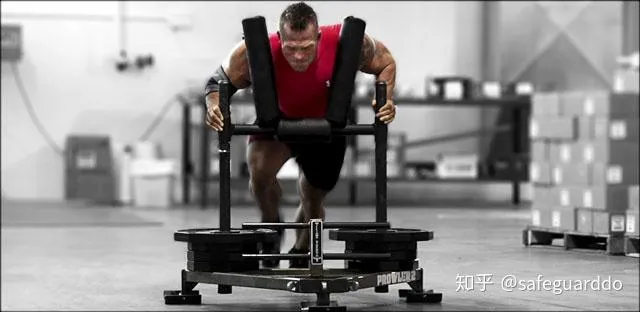

## high performance mass——论坛中简称 HP Mass

我把人体的推类动作分为两类，这两类动作是我的每节训练课的基础。

训练分化：

1. 上体推类动作
2. 下肢推类动作

我**每天**都会照顾到这两类动作，**尤其是上肢**推类动作。其他部位，尤其是**背阔肌、腹肌和肱二头肌，会作为辅助训练**，这主要是为了照顾到全身平衡发展。

认真思考一下，你会发现大多数力量举选手和全部的举重选手都是这样训练的。例如，力量举选手以卧推、深蹲和硬拉为核心。他们会以这些动作为核心认真安排训练计划，每周通常包含两个卧推训练日、两个深蹲/硬拉训练日。

顺便提一句，硬拉并不是一个拉类动作。硬拉动作本身与腿举很相似，只不过此时你是用手持握重物的。因此，硬拉是一个推类动作。（译注：腿举为[leg press](https://zhida.zhihu.com/search?content_id=9178457&content_type=Article&match_order=1&q=leg+press&zhida_source=entity)，推为press，故有此说。）

**力量举选手**只有在感觉有必要的时候，才会加入辅助训练。大多数时候，他们**不会提前安排好辅助训练计划，而是在训练课上根据状态来决定是否进行辅助训练，我也是这样做的。**

## 上体推类动作

正如上文所说，**上体推类**动作是我最为重视的，我**每周要练习5-6天，但并不是每天的训练量都很大**。

关于上体推类动作，我每周通常安排**3天的大重量训练，2-3天的补充训练**，总计5-6天。所谓上体推类动作的**补充训练，是指在训练课的末尾安排一个动作。**我知道，大多数人会觉得**这种训练频率太高了**。但那正是我需要的。如果你希望迅速提高肌肉围度和运动能力，那正是你需要的。

我相信上体推类动作相关肌肉对于运动能力训练非常重要。**训练核心是高频率，低次数，高组数，低动作数**。

**我从前做举重选手时**，每天都要**练习**比赛**动作(——是练习“动作”，不是训练)**，有时甚至每天练习两次。这是最佳方法——我的**训练频率越高，效果越好**。

在每节**上体推类**动作训练课上，我会**先安排一个过顶动作**。采用这种方法之后，我从前的肩部疼痛消失了，哪怕每周练习3-4次大重量卧推。刚开始采用这种方法时，我的卧推重量下降了。但两周后，我的卧推重量又回到了从前的水平。又过了两周，我的卧推重量提高了，同时肩部健康水平也提高了。

*至于组数，大重量推类动作训练日，总组数为20-40组。最高为70组，平均为24组。*

大多数推类动作都会有效刺激*胸部、三角肌和肱三头肌*，我发现*没有必要安排太多这些部位的孤立训练*。我并不是说，你不能练习胸部、三角肌、肱三头肌的孤立动作，因为我有时会让健美者练习这些孤立动作。但是，如果你的目标是提高肌肉围度、爆发力和力量，孤立动作不仅没有必要，还有可能影响你的围度。

这里面涉及到训练经济性的问题。如果你知道*肌肉围度主要取决于首要动作*，而*孤立动作训练只会侵占首要动作的训练时间，那么你打算花多少时间进行孤立训练？*

## 下肢推类动作

我所说的下肢推类动作是指双脚推动某物的动作。某物可能是地面，也可能是腿举机的踏板，具体是什么物体并不重要，这些都是推类动作。正如上文所说，下肢推类动作包括硬拉，硬拉动作与腿举很相似，只不过你此时是使用双手和手臂的力量来控制杠铃。

无论你的双脚推的是一个可移动作的物体还是不可移动的物体，你都应该想象自己正在推动它远离身体。因此，*如果你在练习深蹲，虽然地面是不动的，你也应该想象自己正在推动它远离身体。*

总是想着推动某物远离身体，想象身体保持不动，*把注意力放在双腿上。这种想象有助于使上体保持稳固、锁定，从而为双腿的推类动作提供一个稳固的基础。*

一般说来，要想达到最佳效果，*双腿所需的训练多样性少于上体*。换句话说，*多样性太强反而不利于腿部发展*。基本上，对于双腿的训练动作而言，如果你现在感觉某些动作效果很好，将来它们也会是效果最好的训练动作。

事实上，我大多数时候*只采用这3个双腿力量训练动作*：

·后蹲

·[前蹲](https://zhida.zhihu.com/search?content_id=9178457&content_type=Article&match_order=1&q=前蹲&zhida_source=entity)

·Trap-bar硬拉

但是，*大多数的下肢训练课上，我只练习后蹲，至少做12个正式组。*

### 腿部极限发展要素－无离心阶段训练

你是渴望提高双腿围度、让别人羡慕的“腿部先生”吗？你是只能在梦中体验成为“腿部先生”的感觉的“树枝腿先生”吗？

你是哪种人并不重要，关于尽快提高腿部围度，我只有一个答案：进行大量的策略性无离心阶段训练。

我使用“策略性”这个词是因为，为了取得效果，提高肌肉围度，你必须知道何时、如何加入无离心阶段训练。你还需要知道多大的训练量能够称得上“大量”。简而言之，下肢生长离不开大训练量，但是——力量训练能够很快让下肢疲劳。

因此，我开始试验无离心阶段腿部训练，最终形成了一种完整的腿部训练策略。我见过一些腿部力量很强但围度中等的人，我让他们采用无离心阶段训练之后，他们的腿部围度迅速增加。我也见过一些因伤只能进行无离心阶段训练的健美选手，他们也提高了腿部围度。

由于我曾经作过举重选手，这种现象并不令我感到惊讶。*所有举重选手只用后蹲和前蹲来发展下肢*。他们也练习大量的比赛动作及其变化动作，这些*都是无离心过程训练*。从整体上来看，举重选手们是世界上腿部发展最充分的人群之一。

另外两个项目的选手的腿部也是亮点：速滑和自行车。在进行专项训练的过程中，他们就相当于在进行下肢的无离心阶段训练。他们也会采用一些下肢的爆发力训练动作，主要包括深蹲、箭步蹲、举重变化动作。

正如上文所说，*腿部极限发展的诀窍是进行大量的无离心阶段训练*，但你需要逐渐提高训练量，而且你必须清楚详细做法。

### 增加训练量的一般性原则

一般性原则是以新陈代谢疲劳为标准，永远不要训练到无法再多做一次的程度。

下面介绍一种很好的测试方法：最后一组腿部无离心阶段训练完成，休息15分钟后，你应该感觉自己又想去训练了。我并不建议你真的再去训练，但这种感觉可以用来判断你的训练量是否太大了。

进行腿部无离心阶段训练的时间

后面将会提供一个完整的训练计划，其中包括无离心阶段训练。但为了让你了解一般性原则，这里说一下**基本策略**：

1. **在完成腿部主要力量训练动作之后，进行腿部无离心阶段训练。**
2. **上体推类动作训练完成后，进行腿部无离心阶段训练。**

要记住，最好把腿部无离心阶段训练作为腿部整体训练计划中以训练量为核心的部分。在这个整体计划中，**必须包含爆发力训练**。

## 上体辅助训练

### *斜方肌、菱形肌、三角肌后束*

上体推类动作的支撑肌肉是斜方肌、菱形肌、三角肌后束，当然支撑肌肉不仅限于这些，但如果你专注于发展斜方肌、菱形肌、三角肌后束，其他的上体推类动作辅助肌肉自然也会被照顾到。

正如上文所说，我没有专门的辅助训练计划。我依靠感觉，根据我认为哪里需要提高，来决定要不要加入一些辅助训练。因此，*我会在上体推类动作的组与组之间，交叉安排几组针对支撑肌肉的辅助动作。*

*这并不意味着辅助训练的量就小*。事实上，我会进行很多[斜方肌](https://zhida.zhihu.com/search?content_id=9178457&content_type=Article&match_order=4&q=斜方肌&zhida_source=entity)、菱形肌、三角肌后束的训练，大多数时候，我会在一组推类动作之后安排一组斜方肌、菱形肌或三角肌后束的训练动作。当然，这并不是固定不变的原则。例如，如果我使用的是大重量，为了节省能量，我会在几个[大重量组](https://zhida.zhihu.com/search?content_id=9178457&content_type=Article&match_order=1&q=大重量组&zhida_source=entity)之间跳过辅助动作。

### *背阔肌与肱二头肌*

*背阔肌和肱二头肌比较容易撕裂。它们主要的功能在于控制*，**这与爆发力运动能力相关肌肉的功能恰好相反**。同样，**它们的最佳训练方法也是高频率，中低训练量**，采用持续紧张技术。

记住，在我指导的学员当中，职业健美选手占的比例最大。对于职业健美选手来说，背阔肌和肱二头肌非常重要，我对这些部位的训练方法必须让他们信服。我说这话的意思是，上面一个自然段的表面意思是这两块肌肉并不重要，实际上不是这样的！

我发现，[过度训练](https://zhida.zhihu.com/search?content_id=9178457&content_type=Article&match_order=1&q=过度训练&zhida_source=entity)背阔肌时，与推类动作训练量过大相比，导致的损伤更多。实际上，即使我每天都练习大重量的推类动作，也不会导致肩部问题。与此相反，如果我的背阔肌训练稍微过量一点，那就完了，当我再练习推类动作时，肩部就会疼痛难忍。

这可能是因为背阔肌变得紧张了，导致神经系统出现保护性关闭，使得我在练习[推类动作](https://zhida.zhihu.com/search?content_id=9178457&content_type=Article&match_order=29&q=推类动作&zhida_source=entity)时肩部无法做出正确的姿势。我还发现，如果我进行太多的背阔肌训练，它带来的疲劳是最严重的。它会杀死我的神经系统，熄灭我的训练热情。

我还相信，肱二头肌训练过度会导致肩部疼痛，这是因为肱二头肌训练过度会使得沿肱骨肱二头肌沟延伸的、位于肱骨头的肱二头肌腱出现炎症。过多的肱二头肌训练还会导致[喙肱肌](https://zhida.zhihu.com/search?content_id=9178457&content_type=Article&match_order=1&q=喙肱肌&zhida_source=entity)发炎、紧张，进一步加重肩部疼痛。

那么，如何在训练背阔肌和肱二头肌时避免这些问题呢？这里有几种不同的选择，我最喜欢的是其中最简单易懂的一种方法。我会采用神经充电训练来避免背阔肌训练带来的疲劳。因此，我会在每一次神经充电训练课的末尾训练背阔肌和肱二头肌，采用中等训练量和较高的次数。

我的一节*神经充电训练课用时20分钟，然后我就去训练背阔肌和肱二头肌。我会采用每组6-10次*，不强调离心过程，有时采用[顶峰收缩](https://zhida.zhihu.com/search?content_id=9178457&content_type=Article&match_order=1&q=顶峰收缩&zhida_source=entity)技术，比如在每次动作的顶点采用二次收缩和孤立保持。

我有时也会安排一节专门的背阔肌和肱二头肌训练课，比如每个训练循环（6-8周）安排一次。基本上，我把这样的训练课看成是闪电战，用它来突破平台期，但这样的训练课总会让我付出代价——在接下来的两次训练课上，我的运动能力会下降……这就是所谓的训练经济性！

### 腹肌的闪电战循环

不管你是否相信，腹肌是我身上的亮点之一。我的腹肌很厚实，即使在体脂很高时（以我的眼光来看），你仍然可以看到清晰的六块腹肌。

我发现，最佳的腹肌训练方法是*偶尔安排集中的短时间循环*。在这个循环中，腹肌会迅速生长。准确地说，我发现最好的方法是*在6-8周的周期中，安排一个两周的循环。在两周后，腹肌就会变得难于生长*。

*超过两周是没有必要的*，更何况*腹肌在站姿肩上推举、硬拉、深蹲等大重量复合训练中已经受到了足够的间接刺激。在这个两周闪电战当中，我通常每天练习腹肌，将一个负重动作和个不负重动作组成超级组，做4-5个大组。*

## 下肢辅助训练

### 腘绳肌与小腿

我感觉，**如果你采用高组数的下肢奖金动作，比如深蹲、硬拉、力量抓举Power Snatch，你并不需要安排太多专门的腘绳肌训练**。当我指导职业健美选手时，我会注意增加一点专门的[腘绳肌](https://zhida.zhihu.com/search?content_id=9178457&content_type=Article&match_order=3&q=腘绳肌&zhida_source=entity)训练，这是因为：在职业健美比赛中，腘绳肌是如此重要，你必须过度发展它，裁判才会认为你的腘绳肌好。对于像我这种兼顾肌肉和运动能力的训练者，我认为，**80%的时间里不必安排专门的腘绳肌训练**。这样不仅没有必要，还会阻碍你的腿部整体发展。

在我自己的腿部训练中，**我练习深蹲时会蹲到底，这样能够增加腘绳肌的参与**。我还练习胯下钢索前上拉，采用大量的阻力橇训练，这些都对腘绳肌刺激很大，尤其是在采用持续紧张滑动技术时。

**我不会专门训练小腿。我一生中从未去训练过小腿。我从来没有练过一组提踵，但我的小腿很不错**。小腿围度惊人的Alex也从未训练过小腿。事实上，当我要求他和Daryl练几组提踵时，他很惊讶。实际上，专门的小腿训练只是为Daryl提供了一种心理安慰，我并不指望能产生什么训练效果。

我的观点还是那样，如果你经常练习大重量的深蹲、硬拉和阻力橇动作，你的小腿就可以受到足够的刺激。

如果你仍然打算坚持练习小腿，我的建议是：每周最多练习一次。也可以采用持续紧张技术和长时间的综合性紧张（译注：我管这种技术叫变负荷动态[等长收缩](https://zhida.zhihu.com/search?content_id=9178457&content_type=Article&match_order=1&q=等长收缩&zhida_source=entity)动作。难道是英雄所见略同？小臭美一下）。

例如，选择一个动作，比如站姿提踵，将其与提踵倒退行走拉阻力橇20-30码组成超级组。关于[提踵](https://zhida.zhihu.com/search?content_id=9178457&content_type=Article&match_order=5&q=提踵&zhida_source=entity)，我建议每组做10-12次，在最低点停顿两秒钟（以消除[牵张反射](https://zhida.zhihu.com/search?content_id=9178457&content_type=Article&match_order=1&q=牵张反射&zhida_source=entity)），在顶点保持两秒钟（延长紧张时间）。

### 神经轰炸方法

如果没有球棒和球，就不会有[棒球运动](https://zhida.zhihu.com/search?content_id=9178457&content_type=Article&match_order=1&q=棒球运动&zhida_source=entity)。如果没有可供踢、投的猪皮制成的球（指橄榄球），将有100万人在周一晚上只能收看《与星共舞》（一档电视节目）来打发时间。当然，如果没有冰球和镰刀形的球棒，没有人会去练习滑冰。

这是理所当然的，所有运动项目都有一个不可缺少的关键要素。重物训练也不例外，只不过它的关键要素并不明显，大多数训练者都不知道那是什么。

这真是不幸，因为，如果没有充分理解重物训练的两个关键要素，那么你只是在抬举重物，而不是进行重物训练。换句话说，如果你以为重物训练就是把一个重物举起一定的次数和组数，那你只不过是一个白痴！

事实上，我指的两个关键要素是动作表现风格和设定负荷的方法。你如何完成一次动作，你如何设定一组动作的负荷，了解了其中的道理，进而将其融合在一起，那才是重物训练。不存在对待重物训练的另外一种方法。

如果你觉得我的话听上去很刺耳，那正是我的目的！人们完全、彻底、从头到尾、从下到上误解了我所说的动作表现风格和每组动作负荷设定方法！这两者合起来就叫神经轰炸。你很可能并不理解神经轰炸！

当我不在现场监督时，即使是Alex和Kevin也会偏离正轨，把铃片装上铃杆之后，就开始进行磨洋工式的训练。（**译注：在一组动作中，做完6次以后喘口气再做2次，是不可以的；一组动作中，后面几次动作比前面几次动作速度慢，也是不可以的；一组动作以中低速度完成，也是不可以的；一次动作的向心阶段有停顿，也是不可以的；一次动作的离心过程太慢，也是不可以的。**）那不是我要求的训练。除非我的理念已经对你产生了灵魂附体的效果，否则你绝不可能明白我每天在健身房里取得的令人难以置信的训练效果。

我要提醒你，请不要假设你已经明白了具体做法，直接跳过这部分内容。事实上，如果我只能向学员介绍一个真理，那就是我的神经轰炸方法。我是认真的，如果缺少了神经轰炸，我的指导就失去意义了。

过去，我曾经建议学员在训练课上“自动调整”每组负荷，因为我自己也是那样做的。但是现在，我认为那是一种错误。我认为，对于已经习惯了传统方法的大多数训练者而言，掌握自动调整太困难了。

所以，我在本文中第一次写下了神经轰炸训练计划模板。你只需要知道，我希望这些组数进阶安排将会逐渐成为你的本能。那样才能达到最佳效果和可持续效果。

## 动作表现

正如上文所说，[神经轰炸](https://zhida.zhihu.com/search?content_id=9178457&content_type=Article&match_order=7&q=神经轰炸&zhida_source=entity)是动作表现风格和每组负荷安排的综合。这两个要素是不可分割的，要想理解神经轰炸的概念，你必须时时牢记这两个要素。

我想先介绍一下动作表现。对于任何推类动作而言，只有一种合理的动作表现：最大爆发力加速动作。

### 火箭发射

*当你尽全力推动重物，在整个动作中始终保持加速时，你采用的就是最大爆发力加速动作。*

显然，在伸展位置，为了准备好接下来的转向、下落，你的动作速度一定会放慢。除了在这个特定位置之外，你的每次动作都应该是最大爆发力火箭发射！

我不相信这个概念很难理解、很难应用。像这样移动大重量的感觉是畅快淋漓的。这样的动作才能够轰炸并保护[中枢神经系统](https://zhida.zhihu.com/search?content_id=9178457&content_type=Article&match_order=1&q=中枢神经系统&zhida_source=entity)。只有这种动作表现风格才能提高[肌肉细胞](https://zhida.zhihu.com/search?content_id=9178457&content_type=Article&match_order=1&q=肌肉细胞&zhida_source=entity)中的营养受体的敏感性，它能够最有效地让身体为接下来的重量更大的一组动作做好准备。

*如果方法正确，到了第3组或第4组，尽管使用的重量比前面两三组大了，但你反而会感觉重量更轻*。如果你出现了这种举重若轻的感觉，说明你已经找到了最佳状态，宝贝，你已经为一场肌肉生长之战做好了准备。

然后，大约在第5组，尽管重量更大了，但动作速度与前面一组、使用的重量更小的那一组是相同的。接下来的每一组、每一次动作的速度与这个速度都非常接近，动作感觉是相似的。

*顺便提一句，我经常用到“感觉”这个词*，这是因为你只能通过一组中的每一次动作的感觉来判断该组动作是否成功。我的观点是：如果某一组的某一次动作没能带来这种感觉（最大爆发力火箭发射），那就马上结束这一组。不要再多做一次。如果你想多做一组，就把下一组的次数减至一两次，确保达到火箭发射的效果。

相信我，如果你真的想以最快的速度提高肌肉围度、爆发力，不要试图在每组的末尾多做几次慢速动作。这样做只是在骗自己，它反而会限制你的潜力。

### 次数进阶公式

介绍了动作表现之后，我要教给你一个适用于所有推类动作的公式。我在下文中以卧推动作为例，但这个公式实际上是适用于所有推类动作的。

找出你的最大训练重量：

1. 选择一个你通常用来进行卧推热身（或试探组）的重量。如果你的卧推重量在200磅以上，我建议你由135磅的重量开始。
2. 使用135磅，做几组3次动作，每次动作都应该是火箭发射风格的。组间休息时间足以在下一组达到最佳动作表现即可。根据你的1RM重量的大小的不同，每组加重10或20磅，直到接近你的1RM。如果你的极限卧推重量低于200磅，开始时每组加重10磅；如果高于200磅，加重20磅。
3. 这样做下去，直到你在某一组完不成3次。此时，利用[慢速动作](https://zhida.zhihu.com/search?content_id=9178457&content_type=Article&match_order=2&q=慢速动作&zhida_source=entity)争取完成3次是可以的。也就是说，在测试中，在最后几组中，可以采用慢速动作。但在训练中不能这样做。

注意：为了达到极限重量，在最后两三组，你每组也许只能加重5磅或10磅（而不是10磅或20磅）。例如，你这组用的是300磅，你估计自己有可能推起310磅，但不可能推起320磅，那就加10磅好了。

4. 在某一点上（通常为8-12组）之间，你将会撞墙，无法完成3次。有些人可能在第8组完成了3次，在第9组加重10磅，结果一次动作都未能完成。无论你这一组做了零次还是2.9次，只要你没能完成3次，这就是你的最后一组。你在上一组使用的重量，就是应该代入公式中的数字。

比如说，你的第8组很艰难，你使用300磅勉强完成了3次。在第9组加重到310磅，未能完成一次动作。那么，应该代入公式中的数字就是300磅。也就是这样：

3次极限重量测试（表格）

组数　重量与次数

1 135×3

2 180×3

3 200×3

4 220×3

5 240×3

6 260×3

7 280×3

8 300×3

9 310×1

公式：

300磅（测试中得出的3次[极限重量](https://zhida.zhihu.com/search?content_id=9178457&content_type=Article&match_order=3&q=极限重量&zhida_source=entity)）×87.5%*（根据3RM计算最大训练重量的比值）＝260磅（最大训练重量）

*如果这是一个下肢训练动作，比值应为80%，而不是87.5%。

**将数字四舍五入，精确到10磅。

此时，你在训练计划中（详见下文）应该使用的卧推最大训练重量是260磅。下文中将会列出详细进阶计划。

### 组数与次数

*针对所有推类动作，我最喜欢的训练次数目标是3次。目标是，做每组3次火箭发射式的动作，总共做8-16个正式组。每个正式组加重10磅或20磅*。如果你希望延长某个训练区域内的训练时间，或者只想增加训练量（组数），也可以加重5磅。

总之，每组加重多少取决于你想在一个训练区域内做多少组。为了让你更好地理解这个过程，我将总组数分为3个区域：

#### 活化区域

1－3组或1－4组，你是在激活中枢神经系统，让神经系统做好准备，从而提高接下来的运动能力。此时，你会感觉充满力量，为接下来举起更大的重量做好了准备。

#### 增强区域

4－5组，如果你做的是火箭发射式的动作，你会感觉这两组动作很轻松。尽管每组都在加重，你仍然感觉重量比前一组更轻了。当你采用爆发式加速动作时，经常出现这种现象（感觉重量变轻了）。你已经成功地使神经系统对收缩信号做出了过度反应。

正如上文所说，在爆发力动作中，肌肉中的营养受体也会被激活。爆发力动作使得血液中的肽和partitioning carb增加，让这些重要的营养物质进入肌肉细胞。这种影响将会进一步提高收缩速度，促进合成代谢。

#### 当天的[极限训练](https://zhida.zhihu.com/search?content_id=9178457&content_type=Article&match_order=1&q=极限训练&zhida_source=entity)区域

通常，到了第6组，你会感觉重物明显变重了，但达不到难以控制的程度。你还会发现动作速度也稍有下降，但每次动作仍然是火箭发射式的，你在做动作时仍然会感觉充满力量。这些信号都表明你已经在使用那一天、那个动作的极限训练重量了。此时需要注意，如果你继续加重，超过了最大训练重量，就有可能损害当天的整个训练效果。而且，中枢神经系统的疲劳将影响到后面的几次训练课。考虑到效果和整体进阶过程，中枢神经系统的疲劳是致命的。

总之，达到最大训练重量之后，你将在最大训练重量的95%到100%的范围内，采用微型波浪负荷，再做几组。我将在后文介绍细节。

## 持续进阶

显然，目标是尽量以最快的速度提高肌肉围度和运动能力。这就意味着，你每周都要有明显的进步。但究竟是多大幅度的进步呢？换句话说，进阶模式是什么？

对于大多数训练者和教练而言，进阶首先意味着两次训练课之间训练重量的增加。其次，如果你某一天无法加重，至少应在每组中多做一两次。所以，很多人以为，如果你没能做到上面两点之一，说明你没有进步。

试图加重是一种粗线条的、有瑕疵的进阶模式。这种训练的结局是什么？卧推2000磅？！不太可能。

此外，每个试图每周加重的人都知道，这是不可能做到的。你也许能在6周内持续加重，然后就会撞墙，也就是人们常说的“遇了平台期”，这种现象的真正含义是你的进阶模式不合理。

更重要的是，你每天的身体状态是大不相同的，你在设计进阶策略时必须考虑到这一点。比如说，你上次练习卧推时创造了新纪录，用300磅做了3次。今天你又是练习卧推，但你昨晚睡眠时间很短，而且今天工作很劳累。

这样，你今天的运动能力相比前一周下降了，但这能说明你的肌肉缩小了、变得虚弱了吗？当然不。你可能不但没有变得虚弱，反而变得更强壮了。但由于生活带来的压力和疲劳，你无法充分调动自己身体的潜力。

但是，在另一方面，你完全可以达到当天的最佳表现。你想以尽量快的速度提高，那就是你需要的。

我采用的是动作表现进阶模式。力量是整体表现的一个组成部分，但不是全部。换句话说，表现更多地取决于你如何举起重物，而不是你举起了多大的重量。因此，你不必想着每周都举起更大的重量，你要专注于动作表现质量的两个因素：

1．爆发力——提高使用最大训练重量时的爆发力（你尽了多大的努力来举起重物）。

2．在极限训练区域的训练量——在极限训练区域内，提高爆发力动作的训练量（你使用极限训练重量所做的正式组的数量）。

因此，如果你真的想提高肌肉围度和力量，要争取在每次推类动作训练课上提高动作表现质量。记住，你并不一定要在每次训练课上使用更大的重量。要争取在极限训练区域提高爆发力，同时提高肌肉在极限训练区域做动作的耐力。

## 计划框架

关于我的训练方法，即使我再写10万个单词，也无法说完所有问题。对我来说，更实际的做法是，先让你了解一下计划框架，再告诉你支配我的所有训练的那些重要原则。

你首先需要知道的是我的每周计划。请看下面的表格：

日期 重点 次重点

周一 上体推类动作（将3个主要动作与下肢推类动作辅助动作交叉安排） 下肢推类动作（1个主要动作）

周二 上体推类动作（将3个主要动作与下肢推类动作辅助动作交叉安排） 下肢推类动作（1个主要动作）

周三 神经充电训练（3-4个全身动作）

周四 下肢推类动作（2个主要动作，然后做针对腿部的阻力橇训练） 上体推类动作（1个主要动作）

周五 下肢推类动作（2个主要动作，然后做针对腿部的阻力橇训练） 上体推类动作（1个主要动作）

周六 基础性训练（背阔肌与肱二头肌）（方法包括重物训练、悬吊训练、阻力橇训练）

周日 神经充电训练（3-4个全身动作）

## 不要安排休息日

至少不要有意安排休息日。正如上表所示，我没有安排休息日。我偶尔会因为参加社会活动而错过训练日。但除此之外，我每天都训练。

我坚信，如果有一天完全休息，不利于恢复和以后的表现。事实上，如果休息2－3天，总是会让我变得更虚弱、更疲劳。

不活动会导致神经系统的状态低于标准水平（活跃性差），这总会是导致反锻炼的效果和运动能力下降。休息时，[炎症反应](https://zhida.zhihu.com/search?content_id=9178457&content_type=Article&match_order=1&q=炎症反应&zhida_source=entity)信号会变得不明显，这会进一步加剧酸痛，延长恢复时间。

如果你感觉自己需要休息，与完全不活动相比，改变训练方式更好。例如，如果我感觉对训练厌倦，这说明中枢神经系统疲劳了，于是，我就采用神经充电训练。在另一方面，如果我感觉渴望训练，但身体没有得到足够的休息，那么我会采用无离心阶段程的训练课，打破常规。

我的想法是，你总是可以在“休息日”找到某种合适的训练方式。神经充电训练能够促进神经系统恢复，无离心阶段的训练课能够促进身体恢复。当然，这一切都离不开训练后营养补充（比如MAG-10、ANACONDA和SURGE Workout Fuel），以支持合成代谢与恢复。

事实上，我绝不会在缺少MAG-10、ANACONDA和SURGE Workout Fuel的情况下训练。这些东西就像我的训练方法一样重要。它们会给恢复带来翻天覆地的变化，让你感觉自己拥有超人一样的恢复能力。

## 精选少量动作

许多训练者想把全世界所有训练动作都安排进自己的计划里，认为这样可以“从不同角度刺激肌肉”，或者出于别的什么无聊理由。我发现，变化性太强，采用太多的动作，效果并不好。

在另一方面，我尝试过各种各样的技术。我收集了众多的训练动作与诀窍，它们的作用各不相同。我在过去已经写过很多文章介绍它们。

回到选择训练动作这个问题上，我个人的训练循环是围绕着这少量的首要动作安排的：

肩上推举

卧推

上斜卧推

Thib下拉

后蹲

前蹲

Trap-bar硬拉

阻力橇训练

这些动作是我的训练的基石。除了以上动作之外，我还会增加一些针对菱形肌、斜方肌和三角肌后束的辅助动作。我还会做一些针对背阔肌和肱二头肌的专门训练，偶尔做一些针对腘绳肌的孤立动作。但这些都只是补充，而不是主要动作。

要让训练更简单、更有效率，应该精选少量动作，采用高组数。

## 学习动作之王——力量抓举Power Snatch

如果我今后只能选择一个训练动作，我会选力量抓举。对我来说，力量抓举是训练动作之王。这是一个全身动作；这是一个爆发力动作，对肌肉刺激很大；如果采用高频率，训练量又足够，力量抓举将使你拥有充满力量的体格，以及厚实的肩部和力度十足的双腿。

因此，我喜欢把力量抓举放在每节训练课的开始。如果你的动作正确，它将会成为最佳的肌肉活化动作。

如果某个动作无效，就直接跳过它！

很多人把训练计划看成是家务活清单，他们会一项接一项地完成清单上的所有任务。

大错特错。在一节训练课上，如果某个动作你找不到感觉（也许是内心－肌肉联系不在状态，也许是肌肉感觉不到负荷），那一天就应该直接跳过它。

你上周对某个动作很有感觉，并不代表你将永远对这个动作有感觉。因此，如果你的身体对你说“别那样做！”，不要强迫它继续做这个动作。你必须跟自己的身体保持一致，避免浪费资源。

在另一方向，不要把我的话作为一种借口，去逃避艰苦的或者感觉不舒服的动作。

你必须诚实地对待自己。感觉某个动作没有效果，不想做某个动作，这两件事是不同的。

在一节训练课上，如果某个动作我找不到感觉，大多数情况下我会选择一个作用相似的替代动作。但有时候我也会直接跳过这个动作，这种情况出现在训练课的末尾，目的是避免过度疲劳。

再说一次：不要找借口去减少训练量，但也要果断地放弃无效的动作。根据是训练经济性：有时候跳过一个动作可能会让训练课产生更好的效果，让你在明天以更佳的状态进行训练。

## 不要分神去数次数

正如上文所说，每组3次是我最喜欢的次数范围。如果目标是提高推类动作（包括上肢和下肢）的运动能力，我相信每组3次是最合理的。有时候我也会把次数增加到4次、5次，但这种情况很少。

无论我计划每组做几次，我做动作时都不会去数次数。这样，我有时候可能会多做或少做一次。那又怎么样呢？从整体上来看，一组动作做了3次还是4次不重要，只要你尽了全力去做动作，[生理效应](https://zhida.zhihu.com/search?content_id=9178457&content_type=Article&match_order=1&q=生理效应&zhida_source=entity)就是相同的。

不数次数的原因是，数次数会转移注意力，使你无法专心做动作。你需要让火箭发射式的动作成为本能，就像击球或跨栏那样。

数次数会把爆发力十足的训练变成数学课，你的注意力将无法放在动作表现上。换句话说，它会使你分心，影响你的运动能力。

刚开始，你会感觉很难不去数次数，这不奇怪，这是正常的反应。但是，等到你能够做到不数次数时，你会发现这样能够带来前所未有的解放，让你的每组动作更有效果。

## 不要强调离心阶段

我不仅不会强调离心阶段，我还经常依靠无离心阶段的训练动作。我并不是说训练动作的离心阶段不重要，它的确重要。但在另外一方向，在离心阶段放慢速度或者增加负荷，对你的进步的害处大于益处。

强调离心阶段会破坏神经系统，大大延长恢复时间。这样会影响你的训练频率和训练量，从而影响训练效果。对我来说，训练量和训练频率是刺激肌肉最大限度生长的关键。

而且，强调[离心负荷](https://zhida.zhihu.com/search?content_id=9178457&content_type=Article&match_order=1&q=离心负荷&zhida_source=entity)会影响训练后的糖原补充（因为胰岛素敏感性降低了）。换句话说，强调[离心阶段](https://zhida.zhihu.com/search?content_id=9178457&content_type=Article&match_order=23&q=离心阶段&zhida_source=entity)不仅提高了恢复的工作量，而且放慢了恢复的速度！

事实上，强调离心阶段对[糖原](https://zhida.zhihu.com/search?content_id=9178457&content_type=Article&match_order=2&q=糖原&zhida_source=entity)补充产生的影响最多可持续3天，让你的恢复能力减弱3天！

## 间歇要短

组间歇足以让你在下一组使出全力即可，不要多休息一秒钟。不要给间歇固定一个时间。

我坚信，要保证训练课的质量，节奏至关重要。快节奏能够使你保持最佳状态，你会更加专注，可能会制造更多的[肾上腺素](https://zhida.zhihu.com/search?content_id=9178457&content_type=Article&match_order=1&q=肾上腺素&zhida_source=entity)，这些都会提高训练效果。

但在另外一方面，不要把训练变成是与时间赛跑，那样会影响动作表现。

再说一次：在不影响动作表现的前提下，间歇越短越好。让间歇简单化，不要把它变成一种固定的仪式；随着水平的提高，逐渐缩短间歇。

### 采用短时间的力量循环训练，进一步提高肌肉围度

在每个生长循环内，我会抽出两周时间，在每节训练课的末尾安排一次力量循环训练。我发现这些力量循环训练能够迅速搞肌肉围度，但效果只能持续两周。所以，不要滥用好东西。

针对一个肌群选择3个主要动作。每个动作做3-5次，动作间休息20秒，总共做两个循环。负荷为该动作的极限训练重量的80-85%。

### 选择适合自己的循环

我习惯于进行8-12周的高强度训练，然后进行6周左右的保持性训练。我不会停止训练，但我会减少力量训练的训练量。我会把一天两练变成一天一练。同时，把训练量减少三分之一，代之以其他形式的身体活动。

例如，在我的上一个保持阶段，我经常练习短跑，有时还会和妻子一起慢跑上几英里（别告诉别人）。在保持时期，我还会提高神经充电训练的比例。

此时，我的营养摄入和补剂安排也会保守一些。每天吃两至三餐，每天摄入100克碳水化合物。在保持阶段，我主要依靠Low-Carb Metabolic Drive、Flameout和Curcumin。由于摄入的热量和训练量减少了，我的体重将下降10磅，体脂会减少2-3%。

回到高强度训练阶段之后，我每天吃五餐，增加蛋白质和碳水化合物的摄入。我会改用Metabolic Drive Muscle，每天3份。每天摄入[碳水化合物](https://zhida.zhihu.com/search?content_id=9178457&content_type=Article&match_order=3&q=碳水化合物&zhida_source=entity)400-500克。更重要的是，我会大量服用MAG-10、ANACONDA、SURGE Workout Fuel。

当我开始这样一个阶段时，我的身体已经为生长做好了准备，我的体重、力量和围度将迅速增长。

采用这种循环方法，我将自己的“可保持体重”（我不需要高强度训练或增加营养摄入即可保持的体重）由195磅提高到了215磅。在高强度训练阶段，我的体重最高可达245磅，而且体脂很低。

作为一个身高5英尺9英寸的人，增重到245磅，而且体脂很低，这很酷。但我发现更酷的是，我即使不采用高强度训练，也可以保持215磅的体重，而且体脂更低。采用这种策略，我知道自己将会毫不费力逐渐将瘦体重增加到225磅。