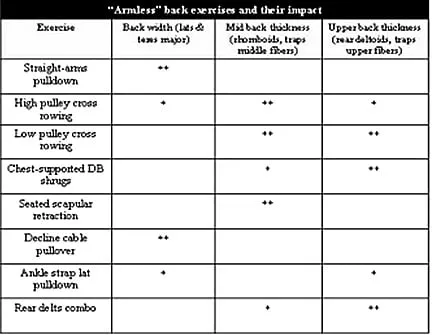

https://thibarmy.com/the-torso-solution-back-exercises-for-people-with-strong-arms/

正确的举重技巧也有助于肌肉有效募集。进行旨在锻炼背部肌肉的训练时，**应尽量减少手臂屈肌的激活**。然而，如果一个人的手臂力量已经非常强大，这一点就很难做到。 

### **大臂/小背综合症：解决方案** 

本文将向您介绍几种可以最大程度减少手臂屈肌参与的上背部练习。如果您患有“大臂小背综合征”，我建议您坚持这些练习，直到您的背部发育恢复正常。恢复正常后，您就可以恢复更传统的背部运动，因为身体会自然地增加背部肌肉在这些练习中的参与度。 

要知道，这些练习并不能替代正确进行的重物拉动作。但是，它们可以帮助你恢复平衡，并学习如何在拉动作中专注于背部肌肉。因此，这些练习既可以帮助你恢复到正常的背部状态，也可以“教会”你的身体在重物拉动作中正确地激活背部肌肉。 

### **Let’s Get Started!  让我们开始吧！**

**Exercise 1: Straight-Arm Pulldown** 
**练习 1：直臂下拉** 

This is my favorite exercise to develop the lats and teres major without involving the biceps. It consists of bringing the arms from a fully extended position in front of your face to your pelvis (while keeping the arms as extended/straight as possible). Focus on keeping the back in a neutral/anatomical position (don’t bend forward). 
这是我*最喜欢的锻炼背阔肌和大圆肌的练习，无需锻炼二头肌*。练习时，手臂从完全伸展的位置放在脸前，靠近骨盆（同时保持手臂尽可能伸展/伸直）。注意保持背部处于中立/解剖位置（不要向前弯曲）。 

At the low position, bring the shoulders down (scapular depression), so you’ll get a better peak contraction of the back muscles. You can use various grips for the sake of variation: hammer grip with a rope or a parallel grip bar, a pronated grip, or a supinated grip.
在低位时，肩膀下沉（肩胛骨下沉），这样背部肌肉就能更好地达到峰值收缩。为了练习的多样性，你可以使用不同的握法：用绳索或平行握杆的锤式握法、正握或反握。

**Exercise 2: High Pulley Cross-Rowing with Fixed Elbow Angle**
练习 2： **固定肘角高位滑轮交叉划船

This is a good exercise for the whole upper back musculature, focusing on the rhomboids, rear deltoids, and lower fibers of the traps. 
这对于整个上背部肌肉来说是一项很好的锻炼，重点锻炼菱形肌、三角肌后部和斜方肌下部纤维。 

The first key point is to “open up” (stretch) your back in the starting position and to squeeze your shoulder blades together at the fully contracted position. The second key is to keep the elbow bent to a minimum during the pull (to minimize biceps involvement). This angle should be anywhere between 100 and 135 degrees, depending on your limb length. 
第一个关键点是在起始姿势下“打开”（伸展）背部，并在完全收缩时将肩胛骨挤压在一起。第二个关键点是在拉的过程中尽量减少肘部弯曲（以尽量减少二头肌的参与）。这个角度应该在 100 度到 135 度之间，具体取决于你的肢体长度。 

**Exercise 3: Low Pulley Cross-Rowing** **w****ith Fixed Elbow Angle** 
练习 3： **固定****肘角****低位滑轮交叉划船** 

This third movement is performed the same way as the preceding one; the only difference is that we’ll use a low-pulley position instead of a high-pulley one. This will emphasize the rhomboids, rear delts (like the preceding exercise), and the traps’ upper and middle fibers. 
第三个动作与前一个动作相同，唯一的区别在于我们将使用低位滑轮姿势，而不是高位滑轮姿势。这将重点锻炼菱形肌、三角肌后束 （与前一个动作类似）以及斜方肌的上部和中部纤维。 

**Exercise 4: Chest-Supported Dumbbell Shrug** 
**练习 4：胸部支撑哑铃耸肩** 

This exercise is an incline shrug. Lie face down on a bench holding a dumbbell in each hand and perform a shrugging motion. The higher the incline, the more stress you’ll place on the upper fibers of the traps. As you lower the angle, the middle fibers’ involvement will increase and that of the rhomboids. 
这个练习是上斜耸肩。面朝下躺在长凳上，双手各握一个哑铃，做耸肩动作。倾斜度越大，斜方肌上部纤维受到的压力就越大。随着角度降低，中部纤维和菱形肌的参与度会增加。 

**Exercise 5: Seated Scapular Retraction** 
**练习 5：坐姿肩胛骨回缩** 

This exercise is similar to the preceding one in that it’s simply a shrugging motion. The difference is that it’s performed in a seated position, making it a horizontal shrug. 
这个练习和上一个类似， 都是简单的耸肩动作。不同之处在于，这个练习是坐着进行的，所以是水平耸肩。 

Open up the back at the starting position and squeeze the shoulder blades together hard. This exercise focuses on the rhomboids. 
回到起始姿势， 打开背部，用力挤压肩胛骨。这项练习主要锻炼菱形肌。 

**Exercise 6: Decline Cable Pullover** 
**练习 6：下斜拉力器套头衫** 

This exercise is very similar to the straight-arm pulldown movement explained earlier. It also has the benefit of putting more stress on the lats during a fully stretched position. As a result, the first half of the movement is executed with a more significant contraction of the lats. However, the last portion of the movement is less effective than the last portion of the straight-arm pulldown, so utilizing both exercises can become quite useful for complete lat development with minimal arm involvement. 
这个练习与前面解释过的直臂下拉动作非常相似。它还有一个好处，就是在完全伸展的姿势下，背阔肌会受到更大的压力。因此，动作的前半部分背阔肌收缩得更明显。然而，动作的后半部分效果不如直臂下拉的后半部分，所以同时进行这两个练习，对于在尽量减少手臂参与的情况下全面锻炼背阔肌非常有益 。 

**Exercise 7: Ankle Strap Lat Pulldown** 
**练习 7：踝带引体下拉** 

This movement requires the use of an ankle strap attachment that you loop around your arm at the elbow. From a position with the arm above your head, pull your elbow toward the side of your ribcage. You essentially duplicate a lat pulldown movement without having to rely on the arm flexors. This exercise can be done with one or two arms at a time. 
这个动作需要用到踝带，将其绕在手臂肘部。将手臂举过头顶，将肘部拉向胸腔一侧。这基本上就是重复了背阔肌下拉的动作，但无需依赖手臂屈肌。这个动作可以一次用一只或两只手臂完成。 

Exercise 8: Rear  Delt Rhomboid Raise 
练习 8：后三角肌菱形肌上举

I consider the rear deltoid to be part of the upper back complex because of both its function and position on the body. The rear delt raise combo is a good way of finishing off a back workout. 
我认为三角肌后束是上背部复合体的一部分，因为它的功能和在身体上的位置。三角肌后束上举组合是完成背部训练的好方法。 

The way you perform the exercise can have a specific impact on muscle recruitment/development. Pictured above are the three different positions that I recommend. I often suggest performing all three positions during a set (five reps of each). 
练习的方式会对肌肉募集/发育产生特定的影响。上图是我推荐的三种不同姿势。我通常建议在一组练习中同时完成这三种姿势（每种姿势重复五次）。 

Here’s a chart to help you sort things out: 
这里有一张图表可以帮助你理清思路： 

### **Sample Programs**

**Level 1 (Easy)** 

*A. Straight-Arm Pulldown – Pronated Grip* 

Four sets of 10-12 reps 

Controlled tempo; add a 2-3 second peak contraction on each rep 

60 seconds of rest 

*B. Low Pulley Cross-Rowing with Fixed Elbow Angle* 

Four sets of 8-10 reps 

Controlled tempo; add a 2-3 second peak contraction on each rep 

60 seconds of rest 

*C. Rear Delt Combo* 

Four sets of 12-15 reps (4-5 reps per position) 

Controlled tempo 

45 seconds of rest 

**Level 2 (Intermediate)** 

*A. Straight-Arm Pulldown – Hammer Grip* 

Three sets of 10-12 reps 

Controlled tempo; add a 2-3 second peak contraction on each rep 

60 seconds of rest 

*B. Decline Cable Pullover* 

Three sets of 10-12 reps 

Controlled tempo; add a 2-3 second hold at the stretch position on each rep 

60 seconds of rest 

*C1. High Pulley Cross-Rowing With Fixed Elbow Angle* 

Three sets of 8-10 reps 

Controlled tempo; add a 2-3 second peak contraction on each rep 

No rest (post-fatigue superset) 

*C2. Seated Scapular Retraction* 

3 sets of 12-15 reps 

Hold a 2-second pause at the stretch position and a 2-second peak on each rep 

90 seconds of rest 

*D. Rear Delt Combo* 

Three sets of 12-15 reps (4-5 reps per position) 

Controlled tempo 

45 seconds of rest 

**Level 3 (Difficult)** 

*A. Straight-Arm Pulldown – Hammer Grip* 

Three sets of 10-12 reps 

Controlled tempo; add a 2-3 second peak contraction on each rep 

60 seconds of rest 

*B1. High Pulley Cross-Rowing with Fixed Elbow Angle* 

Three sets of 8-10 reps 

Controlled tempo; add a 2-3 second peak contraction on each rep 

No rest (post-fatigue superset) 

*B2. Seated Scapular Retraction* 

3 sets of 12-15 reps 

Hold a 2-second pause at the stretch position and a 2-second peak on each rep 

90 seconds of rest 

*C1. Low Pulley Cross-rowing With Fixed Elbow Angle* 

Three sets of 8-10 reps 

Controlled tempo; add a 2-3 second peak contraction on each rep. 

No rest (post-fatigue superset) 

*C2. Chest-Supported Dumbbell Shrug* 

Three sets of 12-15 reps 

Hold a 2-second pause at the stretch position and a 2-second peak on each rep 

90 seconds of rest 

*D. Rear Delt Combo* 

Three sets of 12-15 reps (4-5 reps per position) 

Controlled tempo 

45 seconds of rest 

**Level 4 (Reintegration of the traditional back exercises)** 

*A1. Chest-Supported Dumbbell Rowing* 

Three sets of 8-10 reps 

Controlled tempo 

No rest (post-fatigue superset) 

*A2. Low Pulley Cross-Rowing with Fixed Elbow Angle* 

Three sets of 8-10 reps 

Controlled tempo; add a 2-3 second peak contraction on each rep 

90 seconds rest 

*B1. Lat Pulldown to the front (or weighted chins)* 

Three sets of 8-10 reps 

Controlled tempo 

No rest (post-fatigue superset) 

*B2. Straight-Arm Pulldown – Pronated Grip* 

Three sets of 10-12 reps 

Controlled tempo; add a 2-3 second peak contraction on each rep 

90 seconds of rest 

*C. Rear Delt Combo* 

Three sets of 12-15 reps (4-5 reps per position) 

Controlled tempo 

45 seconds of rest 