## Summary

* 这是一个专门针对性训练，不是普遍的训练计划，关注 动作、组数、次数

    * 第一个动作 卧推5 x 4-6；手臂动作 4 x 6-8
    * 第二个动作 手臂动作 3x8-10
    * 第三个动作 手臂动作 3x10-12 or 12-15
    * *确实符合thib的理念，第一个动作显然最重要，重量也最重，必然是高组数，低次数，同时避免力竭，因为对神经系统压力大，很难恢复； 后面的次要以及辅助动作组数 要比复合动作的组数低，次数高，可以到力竭，因为几乎是孤立训练。这里没有，背部，背部特殊，显然是8-12次。*

* 对于**设计手臂训练计划的兴趣一直不大**，因为*发展粗壮的双腿、宽厚的背部、有力的胸肩更加需要专门的训练*。

  

## Content

很多读者都请我推荐专门的手臂训练计划。我对于**设计手臂训练计划的兴趣一直不大**，因为*发展粗壮的双腿、宽厚的背部、有力的胸肩更加需要专门的训练*。但是，我不会去评判读者的对错。既然人们有这样的要求，我就会去满足他们。如果你最大的梦想就是拥有一对炮筒手臂，这个训练计划正是你想要的。

以周为单位的[分化训练](https://zhida.zhihu.com/search?content_id=9139675&content_type=Article&match_order=1&q=分化训练&zhida_source=entity)计划

我们想要每周训练目标肌群3次，因此每周总共训练5天比较适合。一周分化计划如下：

周一：肱三头肌力量，肱二头肌外侧头

周二：股四头肌，腘绳肌，小腿

周三：肱三头肌外侧头，肱二头肌内侧头

周四：休息

周五：胸，背，肩

周六：肱三头肌长头和内侧头，肱肌

周日：休息

周一：肱三头肌力量，肱二头肌外侧头

A1.窄握卧推

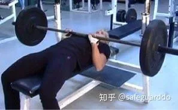

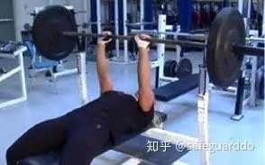

握距稍小于肩宽。在整个动作过程中使双肘保持紧贴身体。

组数：5

次数：4到6

特别技术：交替做A1和A2，间歇45秒（1×A1，间歇，1×A2，间歇，1×A1，间歇……）

A2.站姿杠铃弯举

采用窄握（双手处于双腕内侧），双肘张开。

组数：5

次数：4到6

B.小幅度窄握卧推（力量架锁定）

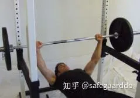

在起点，将杠铃置于力量架上，使其高于胸部几英寸（稍高于[停滞点](https://zhida.zhihu.com/search?content_id=9139675&content_type=Article&match_order=1&q=停滞点&zhida_source=entity)）。每一次动作的起点都是这样。

组数：3

次数：4到6

间歇：90秒

特别技术：小幅度动作，超负荷

C1.杠铃集中弯举

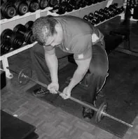

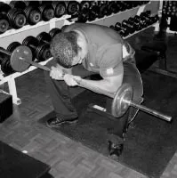

采用窄握，双肘间距大一些。使重物上移时，双肘向外推动双膝，使得双肘进一步向外移动。

组数：3

次数：8到10

特别技术：将C1和C2组成超级组（C1和C2之间不休息），完成C2后休息90秒。

C2.哑铃颈后臂屈伸静态保持

双手握住一个哑铃，做颈后臂屈伸动作，使哑铃与地面垂直，屈肘约90度。

组数：3

每组静态保持20-40秒。

周三：肱三头肌外侧头，肱二头肌内侧头

A1.窄卧卧推

握距稍小于周一时的握距，双肘张开45度。

组数：4

次数：6到8

特别技术：交替做A1和A2，间歇45秒，就像周一一样。

### **A2.布道凳弯举**

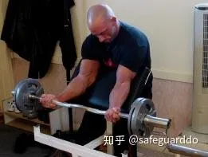

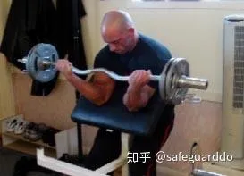

握距应大于双肘间距。双肘间距越小，效果越好。

组数：4

次数：6到8

### B1. **Tate Press 卧推（正握臂屈伸）**

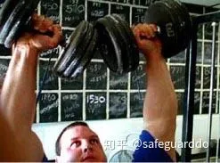

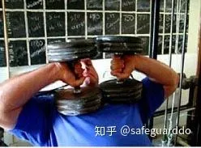

起始动作与[哑铃卧推](https://zhida.zhihu.com/search?content_id=9139675&content_type=Article&match_order=1&q=哑铃卧推&zhida_source=entity)的顶点相同：双肘张开，双手拇指相对。接下来，只利用屈肘动作使哑铃向着胸部下落。在最低点，双肘张开，双手手指相对。

组数：3

次数：8到10

**特别技术：将B1和B2组成超级组。**

B2.绳子握柄下压

手臂伸展时，双手分开得越远越好。

组数：3

次数：8到10

### C1.[站姿杠铃弯举](https://zhida.zhihu.com/search?content_id=9139675&content_type=Article&match_order=2&q=站姿杠铃弯举&zhida_source=entity)

采用宽握，双肘紧贴身体。

组数：3

次数：8到10

### C2.上斜哑铃弯举

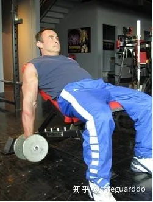

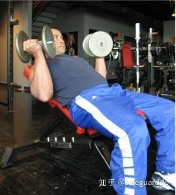

起始动作采用对握，当哑铃向上移动时，双手转至反握。在每次动作的最低点充分伸展肱二头肌。当双肘充分弯曲之后，将其抬高三四英寸。

组数：3

次数：10到12

周六：肱三头肌长头和内侧头，肱肌

A1.反握窄握卧推

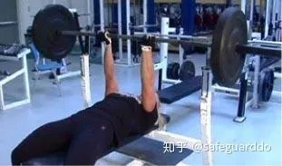

采用反握，握距稍大于肩宽。在整个动作过程中使双肘紧贴身体。

组数：4

次数：6到8

### A2.哑铃锤式弯举

组数：4

次数：6到8

特别技术：将A1和A2组成超级组（A1和A2之间不休息），完成A2之后休息90秒。

### B1.反握下斜仰卧臂屈伸

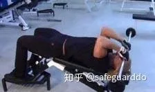

组数：3

次数：8到10

特别技术：将B1和B2组成超级组

B2.[颈后哑铃臂屈伸](https://zhida.zhihu.com/search?content_id=9139675&content_type=Article&match_order=1&q=颈后哑铃臂屈伸&zhida_source=entity)

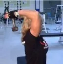

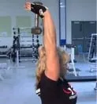

双手握住一个哑铃。

组数：3

次数：12到15

C1.站姿杠铃正握弯举

向心阶段3秒，[离心阶段](https://zhida.zhihu.com/search?content_id=9139675&content_type=Article&match_order=1&q=离心阶段&zhida_source=entity)5秒。

组数：3

次数：6到8

特别技术：将C1和C2组成超级组。

C2. Zottman弯举

手握一对哑铃做弯举，向心阶段采用反握，离心阶段采用正握。

组数：3

次数：10到12