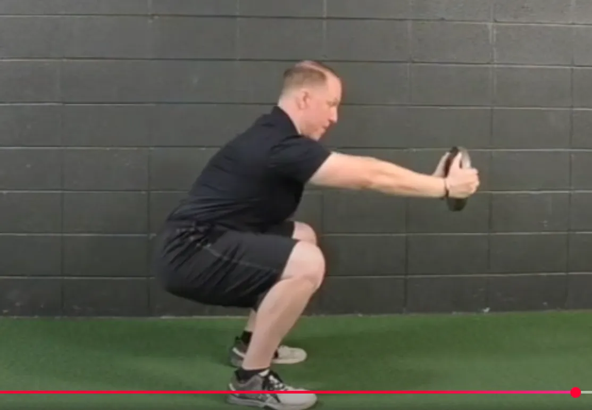
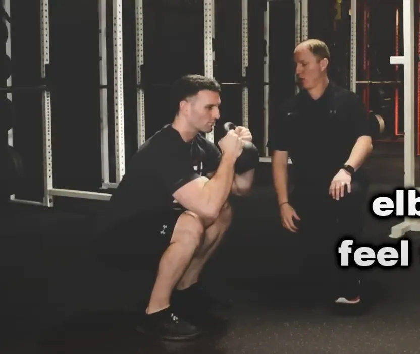
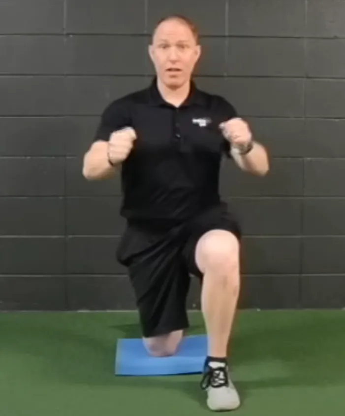
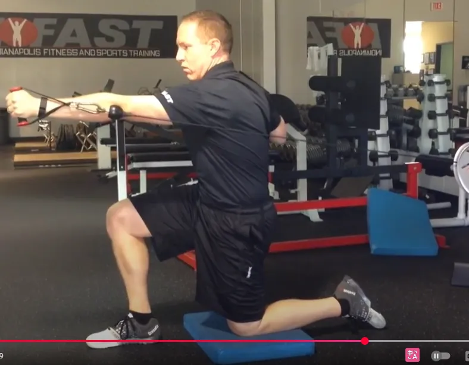
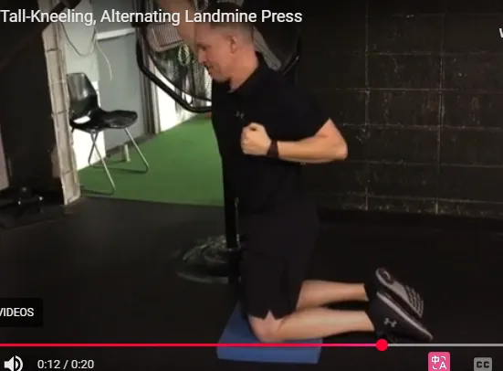
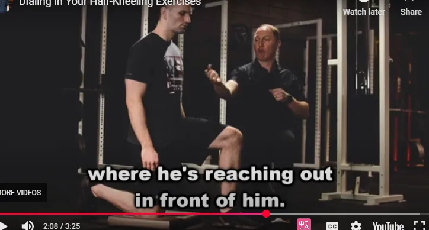
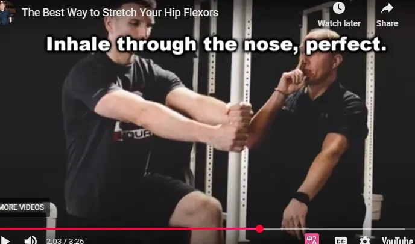

# 缓解下背部疼痛的 7 个训练技巧

我从事这项训练工作已经近 20 年了，我可以告诉你一件事：

几乎每个与您一起训练的客户或运动员都会遇到某种问题。

事实上，在没有任何痛苦或问题的情况下训练新客户或运动员就像在当地的咖啡店遇见哈利波特一样。

很酷吧？当然！

我的意思是，谁不想一边喝着美味的美式咖啡一边谈论打败邪恶的伏地魔呢？

但不幸的是，这种情况很少发生（如果有的话）。

**虽然我确实遇到过膝盖、臀部和肩部功能障碍的人，但似乎没有任何伤害能像下背部问题那样严重地阻碍你的训练成果。**

虽然下背部问题确实很难处理，但同时，它不应该成为任何举重职业的死刑。

事实上，我坚信，当你制定一个专注于所有潜在问题的整体培训计划时，你通常可以让你的客户比以往任何时候都更强壮、更精瘦、更强壮——即使在受伤*之后。*

就像我上面说的，我已经这样做了很长一段时间了——这让我犯了不少错误。

**以下是我多年来使用过的七个技巧，不仅可以帮助训练患有下背部疼痛的客户和运动员，还可以帮助他们在训练过程中活动自如，感觉更好。**

为了清楚起见（以及个人责任），请允许我这样说：

如果您的客户或运动员有严重的背部问题，请在开始严肃的训练计划之前让他们接受合格的医疗专业人员的检查。

现在，事不宜迟，让我们来谈谈如何通过训练缓解背痛！

## 1. 走出矢状面  Get Out of the Sagittal Plane

我有举重运动的背景，我坚信每个人在训练计划中都需要适量的大爆炸复合举重。

无论是深蹲、硬拉还是卧推，这些动作都可以帮助您增强力量、锻炼肌肉和/或减少体内脂肪。

但是，尽管我希望每个客户和运动员都能学习这些举重动作的一些变化或衍生动作，但我也知道，在某些情况下，我正在经历一场艰苦的战斗。

[很多时候，客户来的时候并不了解如何控制自己的矢状面](https://robertsontrainingsystems.com/blog/sagittal-plane-first/)。他们稳定身体的唯一策略就是伸展，但这可能会导致膝盖、臀部，当然还有下背部的问题。

**因此，我不会让他们进行双边站立练习，让他们默认采用基于伸展的策略，而是让他们进行分腿站立或单腿练习，迫使他们在所有三个运动平面上保持稳定。**
**So rather than putting them in bilateral stance exercises that allow them to default to an extension-based strategy, I’ll put them in split-stance or single-leg exercises which force them to stabilize in all three planes of motion.**

对于有下背部问题的人来说，这有很多好处：

1. 它迫使它们在三个运动平面上保持稳定，
2. 在*分腿站立*练习中，它可以减少髋屈肌（驱动伸展）的紧张和僵硬，并且
3. 分腿站立和单腿抬高往往会减少外部负荷，从而进一步减轻症状。

*我并不是说你不能让你的客户和运动员练习深蹲和硬拉。就像我上面说的，我的目标是最终让每个人都能做一些这些动作的变式练习。*

但在早期，如果有人在双侧举重方面确实遇到困难，可以考虑解决这个问题，并使用*更多的分腿站立和单腿练习*。more split-stance and single-leg exercises.

## 2 – 保持直立 Stay Upright

您是否曾经遇到过这样的客户或运动员，他们能够前蹲，但当您让他们做铰链动作时，他们的下背部会像圣诞树一样亮起来？

当然有。

我们*都有*。

**现在我不喜欢做广泛而笼统的概括，但在大多数情况下，下背部处理压缩力的能力远远优于处理剪切力。**

**Now I don’t like making broad, sweeping generalizations, but in more cases than not, the lower back deals with compressive forces far better than it does shear forces.**

接下来的部分可能有点令人困惑，但我会尽力让它变得简单……

当你保持脊柱直立时（就像你在做盘子式、高脚杯式或2-KB前蹲时那样），脊柱的椎骨会相互叠放。考虑到重力向下拉，如果躯干直立，力量会以直线穿过脊柱。

相反，当你弯腰或屈身时，重力仍然向下拉，但脊柱现在与地面*平行*。在这种情况下，椎骨会努力避免彼此“滑动”，也就是说，它们会抵抗剪切力，使脊柱保持在原位。

重申一下——大多数脊柱早期更喜欢压缩力而不是剪切力。

这就是为什么如果我在训练计划初期让有下背部问题的人练习深蹲，我会坚持采用一种能让他们保持直立的变式。平板深蹲和高脚杯深蹲（如下所述）都是不错的入门选择。

## 3 – 打造一组腹肌 Build a Serious Set of Abs

我已经记不清有多少次从客户或运动员那里听到过以下的说法：

*“我只是背部无力。”*“I just have a weak back.”

No.

No.

No, no, no, no, no, no, no.

跟我重复一遍——你的背部并不虚弱。 Repeat after me – you do **NOT** have a weak back.

**Poor positioning of the spine and pelvis put the abdominals in a suboptimal position to create stability, and force the lower back muscles (erector spinae, multifidus, etc.) to do more than their fair share of the work.**

**脊柱和骨盆位置不佳会导致腹部处于不理想的位置，从而无法保持稳定性，并迫使下背部肌肉（竖脊肌、多裂肌等）承担超过其应承担的份额的工作。**

现在，我已经写了比我记得的更多的关于这个主题的文章，所以[如果你想了解更多关于我的核心训练方法，请务必从这里开始](https://robertsontrainingsystems.com/?s=core)。

或者，如果您想要一站式购买所有与核心训练相关的商品，[请考虑购买一份我的完整核心训练产品](http://completecoretraining.com/)。

无论如何，如果您所接触的客户或运动员正受到下背部问题的困扰，请找到核心训练练习，让他们能够在训练计划的早期就确保安全和成功。

## 4 – Unlock the Thorax 解锁胸腔 

多年来我发现，患有腰痛的人的胸腔通常很少（或根本不）能活动。

虽然我很想为此承担全部责任，但真正让我的豌豆大小的大脑明确这个想法的是比尔哈特曼在 2016 年体能准备峰会上的演讲。

首先，别被“胸腔”这个词吓到。它的定义如下：

*“哺乳动物颈部和腹部之间的身体部分，包括肋骨、胸骨和背椎所包围的腔体，其中包含主要的循环和呼吸器官；胸部。”*

所以基本上，它是你的胸部和上背部区域。

当谈到解锁胸腔时，我通常会想到两种大致的动作：

1. *旋转*胸腔（更多的横向平面运动），以及 *Rotating* the thorax (more transverse plane movement), and
2. *弯曲*胸腔（更多额状面运动）。*Bending* the thorax (more frontal plane movement).

现在我确信有人可以用更具体或更专业的描述，但就像 Lynyrd Skynyrd 一样，我是一个简单的人，所以我坚持这些！

当我们谈论胸腔旋转时，手臂的动作更多地集中在*水平方向*上（想想向前和向后）。这里有一个简短的视频，可以更详细地解释这个概念……

https://www.youtube.com/watch?v=buIE1LjtIaY&t=97s  RTS Coaching: Thorax Rotation

 

The half-kneeling alternating cable press is a great example. Our goal is to lock down the lower half and core, and then drive rotation up top through the thorax.

半跪式交替拉力器推举就是一个很好的例子。我们的目标是锁定下半身和核心肌群，然后通过胸腔向上推动旋转。
https://www.youtube.com/watch?v=kmsZLT24qeY

相反，当我们谈论左右*弯曲*胸部时，手臂动作往往更倾向于*垂直*（想象上下），就像你在这种地雷按压变体中看到的那样。
In contrast, when we’re talking about *bending* the thorax side-to-side, the arm action tends to be more *vertical* in nature (think up and down), like you’d see in this landmine press variation.

https://www.youtube.com/watch?v=-bFkPJPE7T0

现在我们已经讨论了这些内容，下面是我用来从这些练习中获得正确动作的一些指导提示。

#### 旋转胸腔的技巧和提示 Tips and Cues to Rotate the Thorax 

- **Stay tall and exhale fully.保持挺直身躯，充分呼气。**这能帮助调整姿势，并确保核心肌群处于正确的起始位置。
- **REACH 伸展！**无论哪只手臂向前，都是如此，这就是为什么我在所有这些练习中都要求两只手臂都运动。
- **Keep the thorax BACK保持胸腔向后。** 当你开始做这样的练习时，身体会倾向于向前倾。保持胸腔向后，并覆盖下半身。
- **Point the laser瞄准激光！**想象你的胸骨上有一束激光，然后一边挥动手臂，一边左右移动激光（这个动作要向迈克·坎特雷尔致敬！）

#### 左右弯曲胸腔的提示 Cues to Bend the Thorax Side-to-Side 

上一节中的前三个提示在这里也适用。不过，当我们左右移动胸部时，这里还有两个提示可以参考：

- **Open and Close the Ab Walls打开和关闭腹壁。** 胸廓侧弯对很多人来说可能难以想象，所以给他们一个不同的参考可能会有帮助。我喜欢告诉他们打开和关闭腹壁——比如关闭右侧腹壁，然后再打开，反之亦然。
- **Keep it subtle保持细微！**这里没有大量的动作，所以大多数客户/运动员会为了让我们开心而尝试做太多。相反，你应该提示他们动作要细微——锁定核心，然后**轻轻地**左右弯曲。

恢复胸腔的运动并不会为您赢得任何健美比赛或举重比赛，但这是您可以做的一些小事之一，可以让您的客户和运动员保持健康和一生的良好运动。

## 5 – 使用替代加载策略 Use Alternate Loading Strategies

在训练方面我看到的最大问题之一是，人们认为如果你不使用深蹲和硬拉等大重量动作，那么你就没有进行努力训练。

但我会反过来问你这个问题：

**哪个更好呢？是寻找其他安全有效的方法来增加负荷、增加压力，还是因为那些动作会引起疼痛而干脆放弃训练？**

希望这里的答案是显而易见的！

当谈到解决背部问题时，我喜欢寻找其他方式来增加身体负荷，避免对脊柱造成过大的压力。

无论是推动推车、拖拉雪橇，还是进行 HICT 台阶练习，都有许多方法可以增强腿部力量，同时保护脊柱。

（不确定 HICT 是什么？观看此短片……）

https://www.youtube.com/watch?v=wNpoVxRNWk0

它们可能不像深蹲或硬拉那样性感，但替代负重策略在训练患有下背部问题的客户或运动员时可以发挥巨大作用。

## 6 – 伸展 REACH 

在许多情况下，患有下背部疼痛的人不仅有一定程度的不受控制的伸展（即骨盆前倾、下肋骨外翻等），而且还*伴随有前部重量转移*。

为了帮助稍微控制住这种情况，学习如何达到这一点绝对可以改变游戏规则。

多年来，我一直在强调伸展运动，因为它对身体有很多好处：

- 它将胸腔堆叠在骨盆上方（这使您的核心处于理想位置以稳定脊柱和骨盆），
- 它可以帮助我们打开上背部，
- 它有助于将重心移回。

**伸展也是我们直立蹲姿变体（如上所述）如此有效的原因。伸展能让我们处于理想的姿势来稳定脊柱，并让我们的核心肌肉群创造稳定性，而不是依赖于骨骼伸展的策略。**

虽然下面的视频是针对肩部疼痛的人的，但伸展的想法和概念仍然适用于背痛的人。

https://www.youtube.com/watch?v=7LpCVVbr7z4

无论是下半身下蹲变体、俯卧撑变体，还是我们上面描述的胸部运动之一，都应提示您的客户和运动员伸展手臂（或肘部）。

他们的身体会感谢你！

## 7 – 花更多时间半跪 Spend More Time in Half-Kneeling

对于那些患有下背部问题的客户和运动员来说，我最常用的姿势之一就是半跪。

**这确实有点令人惊奇 - 但只要让某人处于这个位置并让他们呼吸就可以奇迹般地关闭他们的髋屈肌和背部，同时驱动髋部伸展。**
**It’s kind of amazing, really – but just putting someone in this position and having them breathe can do wonders for shutting off their hip flexors and back, while simultaneously driving hip extension.**

如果你不熟悉半跪式练习，不妨花几分钟时间观看这段简短的视频。它不仅讲解了正确的练习方法，还提供了丰富的练习变式供你尝试。

https://www.youtube.com/watch?v=K1H0rWxcJ8k

但也许您的客户在半跪时难以保持平衡和控制。

*那*你该怎么办？

很简单——让他们进行老式的髋屈肌拉伸，然后让他们呼吸。

https://www.youtube.com/watch?v=lkqaZul2OvM

让你的客户和运动员更多地进行半跪练习将为你带来巨大的投资回报，因此，请想办法尽可能多地实现这一点。

## 概括

所以你已经掌握了七个技巧，可以帮助你的客户和运动员成功地克服下背部疼痛进行训练。

这不是一个包罗万象的作品，但它绝对可以将您的训练游戏提升到一个新的水平！

祝一切顺利，
MR