By Dave Tate

这个新的系列文章正是他们，可能也是你需要的。我将介绍变得更强壮所需的8个关键因素。它们是：

## 教练

## 团队

## 体能

下面要谈的就是我过去两三年看到人们所犯的最大的错误之一。要提高体能，你可以加入额外的训练课（体能训练课）和GPP（一般性体能准备）训练。但我见过有人一下子把每周3节训练课增加到14节，却疑惑自己为何不能恢复。提高体能（提高身体工作能力和GPP）的方法有很多，但我建议你慢慢提高强度，让身体逐渐适应更繁重的劳动。要做到这一点，可以加入专门的热身训练课。例如，开始时，你可以这样安排热身训练课：

### **热身**

拉阻力橇：3组20步

Glute ham raise：1组6次

**俯卧撑：1组10次**

**T杠下拉或引体向上：1组10次**

#### 两三周以后，组数、次数、动作选择变成了类似这样：

拉阻力橇：4组80步

Glute ham raise：4组12次

俯卧撑：4组12次

T杠下拉或引体向上：3组15次

斜板仰卧起坐：3组20次

Neck raise（如图所示）：3组10次

动态弹力带伸展：5分钟

总的训练量和劳动量是逐渐提高的，但训练课的基本结构不变。如果你的热身课动作数超过七八种，应把它们分成两半，把其中4个动作挪到下午的训练课上（一节额外的训练课）。随着水平的提高，你可以在上午的训练课上多加4个动作，在下午的训练课上多加4个动作。

你可能会发现，只在上午安排一节训练课更适合自己，你不希望在下午再安排一节训练课。你可能还会发现，为了让自己的身体为当天的正式训练做好准备，你需要调整热身课的内容。不管你最终决定怎么做，都要记住，必须逐渐增加训练量。如果当前的计划仍然能带给你进步，就不要急于增加训练量。

### 下面是我认为非常适合加入额外的训练课和热身训练课的一些内容：

**Light Plyometric：跳绳、跳上低箱（低于10英寸）。**

Glute ham raise：不是“自然的”Glute ham raise，你需要专门的Glute ham raise训练凳。如果把自然的GHR加入热身课和额外的训练课，难度太大，它更适合放到常规训练课上。

Reverse Hyper

腹肌训练

拉阻力橇

低磅数弹力带训练动作

**徒手深蹲**

轻重量硬拉（低于极限重量的40%）

**俯卧撑**

**哑铃肩上推举**

你从事的项目决定了你所需的体能水平，决定了你应该加入几节额外的训练课。

## 力量

那么，如何才能变得强壮？

我们采用的方法叫作**极限努力**方法。即使用大重量做每组1－3次。每周安排两个极限努力训练日，一个是下肢（深蹲）训练日，一个是上体（卧推）训练日。每天采用一个极限努力动作。针对初学者的最佳动作包括：

### 极限努力深蹲动作

1．站在3英寸高的垫子或木板上硬拉，使用1RM。

2．体前屈极限组，每组3－5次。习惯这个动作以后，采用每组1次。

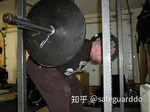

3．窄站位低箱深蹲，使用1RM。坐到箱子上以后，[髋关节](https://zhida.zhihu.com/search?content_id=9258706&content_type=Article&match_order=1&q=髋关节&zhida_source=entity)低于平行3英寸。

4．**安全深蹲杠铃深蹲。这是发展深蹲和硬拉肌肉的最佳方法之一。**

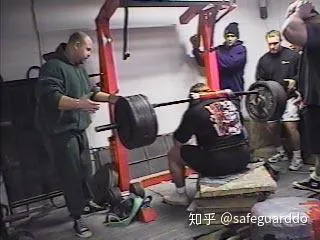

因为，这种杠铃会将你的身体向前拉，你必须对抗这种阻力，使重物保持在正确的轨迹上。这种杠铃还能减轻肩部的压力，因为你不必像使用标准杠铃时那样握杆。你只需要抓住前边的握柄。

如果你没有这种杠铃，可以采用其他能够改变动作重心的方法。方法有很多。你可以使用能够固定杠铃的Manta Ray（如图所示）；你可以练习高杠深蹲；你可以在铃杆上包一块厚毛巾，把杠铃置于背部更高的地方。每种方法都能给予身体不同的刺激。

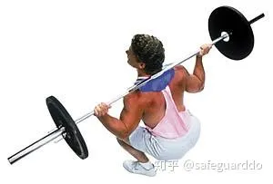

5．**架上拉，**使用1RM。在安全销低于膝关节的前提下，尝试几种不同的高度。但在**一天之内不要尝试两种不同的高度。**

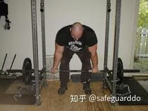

### 极限努力卧推动作

1．不同高度的木板卧推。与卧推相同，只不过你胸前要放几块厚2英寸、宽6英寸的木板。木板长度为12－16英寸，以便保护者抓握。

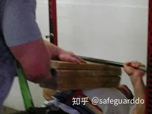

如果你找不到保护者，你可以把木板塞在衣服下面，可以使用弹力带（如图所示），也可以使用橡胶腰封（如图所示）。

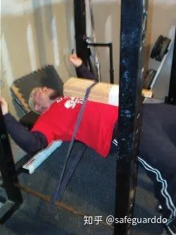

2．地板卧推。在地板上仰卧，做卧推，在最低点停顿1秒。这个动作是用来发展卧推中程力量的，也能有效提高肱三头肌力量。

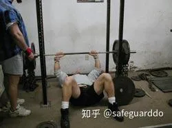

3．窄握上斜卧推。采用不同的倾斜角度，一只手指置于铃杆的光滑区域。

4．架上卧推。把一个训练凳放到力量架里面，杠铃置于安全销上。调整安全销的高度，来调节动作幅度。尝试不同的高度，从铃杆稍高于胸部，到铃杆低于锁定位置两英寸。

5．反向弹力带卧推。使用两根高磅数的弹力带，一端吊在力量架顶端。

提示：上面的所有动作都可以加入弹力带和（或）铁链，以增加训练的变化，带来不同的效果。

### 极限努力动作的组次安排

确保每节训练课只安排一个极限努力动作。组数取决于你的力量水平和加重方法。如果你只能卧推185磅，第1组使用135磅、第2组使用155磅、第3组使用185磅是很不明智的。这样的话，训练量太低了。更理想的组次安排应该是这样的：

两块木板卧推（极限重量为185磅）

45磅3组5次

70磅1组3次

95磅1组3次

115磅1组1次

135磅1组1次

155磅1组1次

175磅1组1次

190磅1组1次

最后一次应该付出最大努力。如果不是这样，就继续加重。未能推起某个重量是很正常的。如你所见，这样安排，训练量更高，所用负荷更有利于提高力量。

### 那么，完成极限努力动作后，要做些什么？

**完成极限努力动作后，你选择哪些训练动作**，取决于你的弱点是什么。*对于我所见过的90%的力量举选手和运动员而言，卧推训练日应该选择肱三头肌训练动作，深蹲训练日应该选择腘绳肌训练动作*。至于然后再安排什么动作，取决于个人的具体情况。为更好地说明这个问题，可以看看下面的模板：

### 极限努力卧推训练日，上肢训练日

热身

正式训练

A. 极限努力动作。从上面的选项中选出一个，比如木板卧推，逐渐加重至极限重量。

B. **肱三头肌**训练动作。从下面的选项中选出一两个：

1．**仰卧哑铃臂屈伸**，*双肘*紧贴身体。

2．**仰卧哑铃臂屈伸**，*双肘*张开。

3．JM卧推。

4．窄握上斜卧推。

5．窄握架上卧推（中程及上半程）。

6．窄握木板卧推（中程及上半程）。

7．**杠铃臂屈伸。**

8．**双手间距较窄的俯卧撑，双手置于六角形哑铃上。**

组次安排取决于训练者的需要。大多数人将会发现，*最好的办法是每周安排一个大重量日、一个轻重量日。我建议把大重量日安排在极限努力训练日，轻重量日安排在速度或动力训练日。*

在大重量日，逐渐加重至大重量组，做3组5次。在这3组5次当中，可以使用同样的重量，也可以采用递增组或递减组。在轻重量日，采用4－8组8－12次。

C. *肩部训练动作*。*如果你想*发展肩部，*每节训练课只需选择一两个轻重量肩部训练动作*，因为在深蹲、卧推等动作中肩部已经受到一定的刺激了。我认为大多数的肩部损伤即源于三角肌的过度使用和过度训练。因此，我建议所有肩部训练动作都应该来自平举和转动这两种类型。这些动作包括：

1．各种肩袖训练。

2．*各种侧平举。*

3．各种前平举。

4．*各种俯身侧平举。*

组次安排应该在*2－4组10－12次左右*。

D. *背阔肌训练动作*。我曾经认为，针对背阔肌，你只需练习与卧推处于相同平面的动作。换句话说，你只需练习划船。这种观点在理论上说得通，但在事实上行不通。有太多力量举选手没有这样做，却能卧推远超过我的重量！

是的，*我仍然认为划船要比T杠下拉和引体向上更重要。我建议兼顾这些动作，每节训练课选择一两个动作。最合适的选择有*：

1．胸部支撑划船。使用*任何一种划船机，胸部支撑在靠垫上*。

2．*杠铃划船*

3．*哑铃划船*

4．*Face Pull*。站在钢索训练机前面，向着面部拉动握柄。

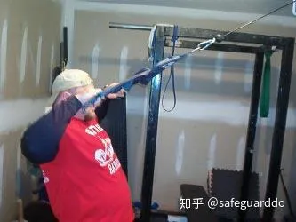

5．颈前*引体向上。*

6．*颈前T杠下拉*，采用窄握或宽握。

这些背阔肌训练动作的*组次安排比较复杂，它取决于具体动作*。不管你选择哪种动作，都*要注意动作的标准性，这就使得你只能使用相对较轻的重量。*对于引体向上而言，*最佳方法似乎是每组做到力竭；对于划船而言，低次数（5－8次）、低组数（2－3组）更佳；对于T杠下拉和Face pull而言，高次数（12－15次）、高组数（4－5组）更佳。*

### 极限努力深蹲训练日，下肢训练日

热身

正式训练

A. 极限努力动作。从上面的选项中选出一个，比如安全深蹲杠铃低箱深蹲，逐渐加重至极限重量。

B. 腘绳肌训练动作。腘绳肌训练动作很多，但能够入选我的名单的很少。对于提高力量而言，大多数腘绳肌训练动作只能浪费时间，因为它们只能用到腘绳肌的[伸髋](https://zhida.zhihu.com/search?content_id=9258706&content_type=Article&match_order=1&q=伸髋&zhida_source=entity)或屈膝功能，而不能同时用到这两种功能。最佳选择包括：

1．Glute-ham raise，使用真正的GHR训练凳！我之所以说“真正的训练凳”，是因为我的公司制造训练器械，我很清楚这个行业里存在着多少垃圾产品，这令人非常失望。

首先，所谓的“自然”Glute-ham raise（双膝跪地，请训练伙伴按住你的脚跟）不是Glute-ham raise，它是一种反向腿弯举。

其次，对于初学者而言，完成一次GHR应该是很难的。如果你第一次使用GHR训练凳，就一口气做了10－15次，说明这台机器没有调节好。夹脚板应该足够长，能够充分压住脚尖。靠垫应该有一定的倾斜角度，使得你在动作顶点不至于滑下来。我可以就这些器械方面的细节不停说下去，但关键在于，很多公司的器械设计师本身根本不进行重物训练！

GHR的做法是，首先，使身体在训练凳上处于水平位置，脚尖被夹脚板固定。双膝处于靠垫后方两英寸处，背部弯曲，下巴靠近胸部。脚尖用力蹬踏板，腘绳肌收缩，带动身体上移，背部仍然保持弯曲。接近顶点时，挤压[臀肌](https://zhida.zhihu.com/search?content_id=9258706&content_type=Article&match_order=1&q=臀肌&zhida_source=entity)，使身体到达垂直位置。

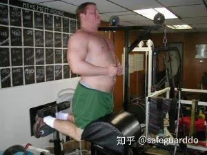

GHR的组次安排取决于训练者的力量水平。我发现大多数运动员和力量举选手都做不好这个动作，因为大多数人的腘绳肌力量都很差。针对这种训练者，我会让他们在每节训练课的热身过程中做两三组GHR。我建议他们把目标设定在3组10次。对于大多数人而言，这就意味着3组都做到力竭，每组少做了3－5次。他们将会慢慢提高。

当他们达到目标之后，我会让他们继续把GHR作为热身动作之一，但把组次安排降低到3组8次。同时，他们应该把GHR放到正式训练课上，作为一个主要动作，每周至少练习一次。这就意味着每周练习5次GHR！

把GHR放到正式训练课上，作为一个主要动作，组次安排可以有几种选择，每两三周换一种方法。可供选择的方法包括：

·3组，都做到力竭。

·将总次数定在100次，根据需要安排组数。

·在胸前持重物，采用大重量组，3组5－6次。

·在头部后方持重物，采用大重量组，3组5－6次。

·将机器后端调高4－30英寸，使其倾斜，采用大重量组，3组5－6次。

·GHR动力组。到达顶点后，以尽量快的速度身体下落，在最低点反弹，以制造更高的爆发力。你可以手持一个大重量实心球或其他重物，以加快下落速度，在最低点松开手。

·静态－动力GHR。先使身体处于水平位置，请一位训练伙伴将双手置于你的背部，保持3－5秒钟。尽全力用身体去推他的手。5秒后，训练伙伴拿开手，你以尽量快的速度使身体上移。最好做5－6组3次。

·Yielding GHR。在上移的过程中，在3个不同的点上停顿，各保持5－10秒钟。首先，在水平位置上保持10秒钟；身体上移到中程时停顿，保持10秒钟；然后，身体上移至顶点，保持10秒钟。

·计时GHR。自己定一个时间，在该时间框架内，尽量完成更多的次数。例如，你可以定为5分钟，第一次训练时完成了70次。第二次训练时，争取在5分钟内完成70次以上。

·弹力带GHR。这个动作适合水平较高的训练者。将弹力带的一端绕在GHR训练凳底部，另一端绕在你的[斜方肌](https://zhida.zhihu.com/search?content_id=9258706&content_type=Article&match_order=1&q=斜方肌&zhida_source=entity)上部。在动作顶点，弹力带的拉力会达到最大值。

·大重量离心强迫GHR。这种版本很适合那些连一次GHR都完不成的人。当训练者抬高身体时，请训练伙伴提供助力，然后依靠自己的力量使身体下落。助力越小越好，只要能够帮助训练者完成上移动作即可。最好采用每组3－5次。

2．Reverse hyper。这又是一个让我不吐不快的动作。Reverse hyper是商标的名称，因此，做这个动作只有一种方法，那就是使用Reverse hyper机。其他的动作都不算是Reverse hyper。

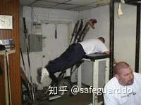

这部机器能够有效发展腘绳肌、臀部和下背部。训练方法很多，但我发现效果最好的方法有3种：

·采用大重量组，3－4组6－10次。这种方法的选择余地比较大，因此很多人习惯采用这种方法。在机器上俯卧，然后先做几次动作，让重物移动起来，这几次动作不计入次数。等到你可以做出全程动作之后，争取在最低点，也就是夹脚板的中心到达机器的前方支柱（靠近你头部的那个方向）所在位置时让重物停住，然后让重物开始向回移动。这种方法能够有效刺激[腘绳肌](https://zhida.zhihu.com/search?content_id=9258706&content_type=Article&match_order=9&q=腘绳肌&zhida_source=entity)和臀部。

·严格版本，3－4组15次。严格的Reverse hyper的做法是，在训练凳上俯卧，使髋部与机器后部相距三四英寸，然后尽量使背部反弓，胸部离开机器。这会使得你的身体处于对角线上。

在起点，夹脚板的中点应与机器的后侧支柱（靠近你髋部的那个方向）齐平。专注于使下背部反弓，带动重物上移。你将无法使重物上移到太高的位置。到达顶点之后，争取保持一秒钟。你必须尽全力才能做到这一点。这个动作的速度应该比前一种版本慢两倍。与其他版本相比，这种版本对下背部的刺激更大。

·计时Reverse hyper。这是路易·西蒙斯发明的经典动作。与其他两种版本相比，使用的重量要轻得多。这两种版本都可以采用这种方法。设定时间（通常是3－5分钟），不停顿地做动作，次数越多越好。如果没到时间就停顿了，则提前结束。

3．胯下钢索前上拉。胯下钢索前上拉是一种特殊的训练动作，目标是发展下背部、腘绳肌和臀部。背对低位滑轮站位，使用D形握柄。接下来，俯身，双手在双腿之间抓住握柄。然后，将握柄由双腿之间向前、向上拉，直到站直。最好采用4－6组10－15次。

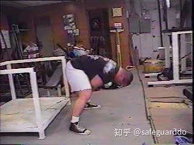

4. Dimel硬拉。Dimel硬拉是读者提问最多的一个动作。

做法是，面对杠铃站立，使用极限硬拉重量的30－40%。拉动杠铃至顶点。这是该动作的起点。

接下来，尽量使背部反弓，髋部向后推，直到腘绳肌和臀部充分伸展。在两面两三次动作中，使杠铃有控制地下落，直到稍低于膝关节，在最低点反弹。等到你习惯了这样的杠铃移动轨迹，你可以让杠铃更快下落，采用Ballistic动作。

这是一种快速的、高次数的动作，最好采用2－3组20次。

5．站在箱子上，做窄站位直腿不触地硬拉。这种动作也能有效发展下背部、臀部和腘绳肌。站在一个4英寸高的箱子上做硬拉。杠铃下落至距地面两三英寸时停止。它可以采用两种方法。第一种，大重量组，5－6组3－5次；第二种，2－3组15－20次。

*6．拉阻力橇*。拉阻力橇是一种被大大低估了的腘绳肌训练动作。使用阻力橇发展腘绳肌，有几种不同方法。最常见的方法是拉动阻力橇前进。

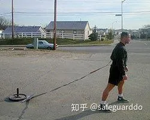

第二种方法是采用窄站位，在双膝后方抓住握柄或带子。上体保持前倾，双手保持在双膝后方，向前行走。采用这种方法的话，步幅不会很大，但前进两三步之后，你就知道目标肌肉是什么了。

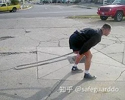

利用拉阻力橇来发展腘绳肌，有两种很好的组次安排。第一种是使用非常大的重量，每组迈15－20步。第二种是使用较轻的重量，每组迈70－100步。

7．反向腿弯举。你可以使用Glute-ham raise训练凳或罗马椅来做这个动作。在训练凳上摆出山羊挺身的起始动作。面朝下，背部弯曲，双脚离开夹脚板，只靠踏板和靠垫来固定身体。如果你使用的是GHR训练凳，你需要把夹脚板向前调，使得双膝处于靠垫稍偏后方。

尽量使下背部反弓，迫使身体紧贴靠垫。拉动身体上移至水平位置，然后争取做出反向腿弯举动作，使上体继续上移三四英寸。如果你的动作正确，上体无法上升太高。到达最高点之后，静态保持3秒钟，然后下落。最好做4－6组，每组做到力竭。

#### C. 躯干训练。

**这些躯干训练动作的目标是发展下背部和腹肌。在很大程度上而言，它们是整个训练计划中最重要的肌群。**

下面列出了很多极限力量训练的最佳动作。从中选择一个针对下背部的动作，一个针对腹肌的动作。如果你感觉有必要，针对每个肌群可以选择两个动作，但一节正式训练课的动作数不能超过4－6个。如果你想增加躯干训练的训练量，可以在热身中加入躯干训练的内容，也可以在当天的晚些时候或某个休息日专门安排一节躯干训练课。

1．Reverse hyper。做法已经在上面介绍过了。如果你已经在腘绳肌训练动作中选择了该动作，在躯干训练中可以选择另外一个动作，也可以采用该动作，但采用不同的训练方法。

2．弹力带体前屈。这是一个很好的高次数动作。找一根Jump Stretch弹力带，把一端踩在双脚下面，采用中等站位。将弹力带的另一端绕在斜方肌上部。双膝保持微曲，上体前倾，然后再站直，做标准体前屈动作。上体前倾的同时，确保髋部充分后移，以刺激腘绳肌。可以有多种不同的训练方法，从2－3组20次，到2－3组100次。

3．**腹肌下拉。**使用T杠下拉机，但使用钢索下压所用的绳子握柄或皮带握柄。背对机器站立，双手在头部后方抓住绳子。做硬拉动作。首先将腹部同外推，然后尽量收紧腹肌。上体自腰部前倾，直至躯干低于平行。接下来，上体沿同样的轨迹上移，回到起点。

4．**山羊挺身**。这个动作有助于加强下背部力量。使用Glute-hame raise训练凳或罗马椅，脚跟固定在夹脚板和踏板之间，上体自腰部前倾。首先，使下背部反弓，使上体上移至平行，保持一秒钟。然后回到起点，下落速度要慢，以避免头晕。

5．**腹肌滚轮**。这是一个很好的腹肌训练动作。使用一个腹肌滚轮。首先，双膝跪地，使滚轮向前滚动，使腹肌保持紧张。当身体与地面平行以后，使身体向上、向后移动，回到起点。并不是所有人都能完成这个动作，因为它需要出色的核心力量。

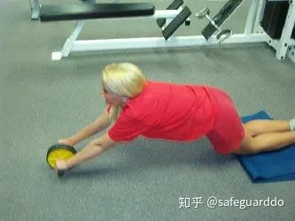

6．**悬垂举腿**。你可以直接在单杠上悬垂，也可以使用悬垂举腿专用的带子。这个动作有几种不同的做法。第一种做法是，使双膝向着胸部移动，然后使双膝下落。这种方法最容易，适合初学者。

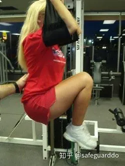

这个动作更高级的版本是，在整个动作中使双腿保持伸直。对于那些渴望挑战的人，可以把双脚一直抬到触杠。确保不要做出摆荡动作，不要利用惯性来完成动作。如果你的力量连一次都动作都不能完成，可以请训练伙伴扶住你的下背部。

7．罗马椅仰卧起坐。这是一个发展髋部屈肌和腹肌的好动作。双脚置于GHR夹脚板中，使双膝保持接近伸直，做仰卧起坐。要提高动作难度，可以在脑后持一个杠铃片。

8．彩虹。这是一个腹外斜肌孤立动作。做法是，在地面上仰卧，双手在头部后方抓住一个稳固的物体。屈膝，使双膝向着胸部移动。保持屈膝，使双膝向左侧转动，直至触地；然后转回到身体中部，再向右转。你需要使肩胛骨保持触地。要提高动作难度，可以抬高大腿至垂直。

9．仰卧直腿提腿。这个动作的目标是加强腹肌和髋部屈肌的力量。在平凳或地面上仰卧。双臂在体侧伸展，或者抓住力量架。把双腿抬高至垂直，下背部尽量按压训练凳。使双腿下落，直到你感觉下背部开始反弓。在这一点上，再次抬高双腿，回到起点。刚开始训练时，你也许无法使双腿下落至触地。你只需在避免下背部反弓的前提下，使双腿下落至最大限度。如果你的动作幅度过大，可能会受伤。

### 如何安排极限努力动作的循环？

你必须记住，当你采用这种风格的训练方式时，每个动作都要有相应的循环安排方式。换句话说，每个动作的循环与其他动作都是不同的。此外，针对同一个动作，一天的训练安排与另一天也是不同的。

在极限努力训练日，第一个动作（极限努力动作）应采用1－3周的循环。训练者的水平越高，换新动作的频率应该越高。高级训练者需要每周都采用新动作。中级训练者可以把一个动作坚持两周，初级训练者可以把一个动作坚持3周。

那么我怎么知道自己是初级、中级还是高级训练者呢？如果你问了这个问题，说明你是初级训练者。在训练计划中有一些检查要点，你可以根据它们来了解何时需要进行调整。极限努力动作的检查要点就是，你有没有打破个人纪录。如果你选择了两块木板卧推，在第1周使用315磅，第2周使用320磅，第3周使用325磅，那么你就应该采用3周循环。

如果你第第1周使用315磅，第2周使用320磅，第3周连315磅都完成不了，那么你应该采用两周循环。当你采用这种训练方法以后，随着水平的提高，很快你就需要每周换新动作了。具体做法包括：

1．很多教练发现，最佳方法是两周循环，把第一周作为准备性训练。他们可能会采用这样的极限重量的百分率来安排每周的组次：针对某个动作，使用1RM的70%做2组5次，或者使用80%做3组3次。这些教练发现，如果先安排一个准备性训练周，运动员们在第2周（当他们采用每组1次时）有了更佳的表现。

2．另一种与其相似的方法是3周循环，第1周使用70%做每组5次，第2周使用80%做每组3次，第3周有可能一下把训练重量增加100磅。我个人并不喜欢这种方法，我感觉高次数与每组1次相比，受伤的可能性太大。

3．一位非常成功的海外力量举选手告诉了我这样一种方法：给极限努力动作安排减重组循环。训练者应该逐渐加重至极限重量，然后按照固定的百分率做减重组。他会在第1周使用70%作2组5次，第2周使用72%做2组5次，第3周使用76%做1组5次，第4周使用80%做1组5次。每周都采用新的极限努力动作，但减重组的百分率在4周内是逐渐提高的，然后开始下一个循环。

### 需要每周都采用极限努力动作吗？

答案既取决于你在其他几天里的训练情况，也取决于个体差别。如果你在动力训练日使用了弹力带，进行了艰苦的训练，那么你可能会发现自己无法每周采用极限努力动作，只能每月采用极限努力动作。如果是这样的话，你可以在不采用极限努力动作时，采用针对相同肌群的高次数动作来代替它。

怎样才能知道自己有没有使用足够大的重量？

如果你问出了这个问题，说明你完全没有理解这种训练方式。极限努力动作的意思就是要倾尽全力。如果你完成极限努力动作训练后觉得自己还有能力多做几次，就加重，再做几组。当你采用极限努力动作时，必须倾尽全力，才会有效果！

### 如何安排其他动作的循环？

极限努力动作并不是一个训练日的全部内容，所有补充动作也需要有合适的循环。这些动作的循环的持续时间与极限努力动作不同，它们的循环的持续时间可以更长一些。**我建议你安排这些动作的循环时可以采用4种方法：以重量为核心的循环，以次数为核心的循环，以组数为核心的循环，以动作为核心的循环。**

1．以重量为核心的循环。针对某个动作，次数不变，逐渐加重，直到你无法再加重为止。此时，换新的动作。

例如，在肱三头肌训练动作中，你选择了仰卧哑铃臂屈伸。第1周，你使用50磅做了3组10次。第2周，你使用60磅做了3组10次。第3周，你使用70磅完成了2组10次以后，第3组只做了6次。现在，你就需要换新动作，或者不换动作，但改变训练方法。

2．以次数为核心的循环。针对某个动作，在每组内争取做更多的次数。例如，在腘绳肌训练动作中，你选择了GHR。第1组做了6次，第2组做了5次，第3组做了5次。下一周，你要争取做更多的次数。在三四周以后，或者当你无法再增加次数时，你需要换新动作，或者不换动作，但改变训练方法。

3．以组数为核心的循环。这种方法是迅速提高一个循环内的训练量的最佳方法之一。做法是，针对某个动作，次数不变，每次多做1组。例如，在下背部训练动作中，你选择了Reverse hyper。第1周，你做了2组10次。第2周，你做了3组10次。第3周，你做了4组10次。第4周，你完成了4组10次以后，第5组只做了7次。此时，需要换新动作，或者不换动作，但改变训练方法。

4．以动作为核心的循环。每周都换新动作，并根据动作来安排组次的循环。这是针对更高级的训练者的最佳方法，因为他们已经知道如何根据感觉来训练了。

实际动作并不需要每3周换一次，但每两三周都应对训练内容有所调整。我感觉Reverse hyper和GHR对我的训练都非常重要，这两个动作我每周都要训练2－4次。下面举例说明我针对正式训练课的GHR动作循环：

GHR循环

1－3周

周一：GHR，以次数为核心的循环

周五：倾斜6英寸的GHR，以重量为核心的循环

4－7周

周一：Ballistic GHR，以次数为核心的循环

周五：倾斜10英寸的GHR，以次数为核心的循环

提示：如果训练者还不到3周就出现了停滞，则提前结束循环。另外，在这两个训练日，也应该安排不同的循环。

## 速度

速度训练日（动力努力训练日）的目标是加快训练者的动作速度。如果你准备做一次垂直跳跃，你会尝试慢慢跳起吗？如果这样的话，你能跳多高？如果你尝试以最快的速度跳起，制造更高的爆发力呢？当然，你会跳的高得多！

*极限力量训练必须包含速度因素，否则你就无法充分挖掘自身潜力*。有些训练者的力量强，有些训练者的速度快。无论你属于哪种类型，你都要兼顾力量和速度。这样，你才能充分利用自身力量，弥补弱点。

每周有两天用于速度训练。第一天练习卧推，第二天练习深蹲和硬拉。速度训练包括这些动作：

### 速度深蹲

1．平行箱子深蹲。这种训练动作的好处有很多。它能够打破离心－向心链条，发展离心和向心爆发力。箱子深蹲是超负荷和孤立的一种形式。箱子深蹲是学习深蹲技术的最佳方法，因为你自然会向后坐，并保持将双膝向外推。

双手置于铃杆上，保持对称。背部紧贴铃杆，找到一个合适的位置。双腿蹬地，下背部反弓，腹肌向着皮带推，挺胸，[头颈部](https://zhida.zhihu.com/search?content_id=9258960&content_type=Article&match_order=1&q=头颈部&zhida_source=entity)向后推动铃杆，使杠铃离开深蹲架。挺胸是为了让铃杆处于尽量靠后的位置。一只脚后移，然后另一只脚后移，摆出深蹲站位。

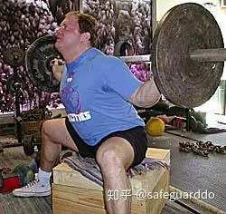

摆出宽站位。脚尖笔直向前或者稍微张开。同时，双肘置于铃杆下方。当你准备好开始下蹲时，应确保下背部保持反弓。肩部尽管向后振，挺腹。髋部向后推，以此启动下蹲动作。向后坐的同时，将双膝向外、向侧面推，以确保[髋部肌肉](https://zhida.zhihu.com/search?content_id=9258960&content_type=Article&match_order=1&q=髋部肌肉&zhida_source=entity)最大限度的参与。碰到箱子以后，你应该完全坐上去，放松髋部屈肌。注意使背部保持反弓，腹部保持向外推，双膝保持向外、向侧面推。

要启动起立动作，腹部向着皮带推，使背部反弓至最大限度，头颈、胸部和肩部都向后推。如果你先以双腿蹬地，你的臀部就会首先上移，这会迫使杠铃前移至正对双膝（就像体前屈动作一样），导致下背部和双膝的压力增加，影响你的力量发挥。

2．安全杠铃箱子深蹲。做法已经在本系列文章第二部分中有过介绍。在速度深蹲训练中使用安全杠铃，这对于提高你的硬拉重量大有好处，因为它能够增加你的上背部和下背部力量。

3．弧形杠铃箱子深蹲。这种杠铃有一个巨大的14英寸长的[拱形结构](https://zhida.zhihu.com/search?content_id=9258960&content_type=Article&match_order=1&q=拱形结构&zhida_source=entity)，这使得你的双手可以更加靠近身体。这一点是有利的，原因包括：

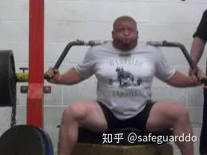

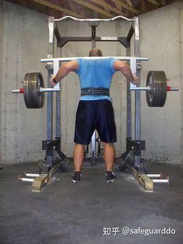

首先，能够减轻肩部压力。你要记住，深蹲能够带给肩部多大的压力。当你深蹲时，肩部要保持静态收缩，对抗[极限重量](https://zhida.zhihu.com/search?content_id=9258960&content_type=Article&match_order=1&q=极限重量&zhida_source=entity)。同样，在所有卧推类动作中，你的肩部也要参与。弧形杠铃和安全杠铃能够让肩部有一个放松的机会，使他们得以恢复。

这种杠铃的第二个好处与前者是相关的。因为你的手臂处于更低的位置，这会大大减轻上背部压力，把压力转移到下背部、臀部和腘绳肌。

如果你使用这种杠铃时搭配使用弹力带，固定弹力带的方式必须有所调整。如果你使用标准杠铃，采用传统方式固定弹力带，在深蹲最低点，弹力带仍然会足够紧张；如果你使用这种杠铃，采用传统方式固定弹力带，在深蹲最低点，弹力带可能会是松驰的，因为这种杠铃的铃片要比铃杆上端低14英寸。你可以把弹力带绕在[铃片](https://zhida.zhihu.com/search?content_id=9258960&content_type=Article&match_order=2&q=铃片&zhida_source=entity)上，这样，在深蹲最低点，弹力带仍然会足够紧张。

### 速度硬拉

1．速度硬拉。在速度硬拉中，你可以采用传统硬拉，也可以采用[相扑硬拉](https://zhida.zhihu.com/search?content_id=9258960&content_type=Article&match_order=1&q=相扑硬拉&zhida_source=entity)。速度硬拉通常作为紧邻速度深蹲或动力深蹲之后的动作（是的，放在同一天）。大多数训练者喜欢使用40－50%的重量，做6－10组1次，组间歇为20－45秒。

·传统硬拉。这个动作是对全身力量的考验。教练通常会建议训练者采用窄握，双手置于铃杆的光滑区域。采用[窄握](https://zhida.zhihu.com/search?content_id=9258960&content_type=Article&match_order=2&q=窄握&zhida_source=entity)时，在转动肩胛骨的同时，肩部会前旋，这缩短了杠铃的移动距离。这种建议适合块头比较小的训练者，而大块头的人实际上更适合大于肩宽的握距。由于大块头选手的腰围也比较大，采用宽握时，在最低点，两条大腿之间能够为腹部留出足够大的空间。大多数小块头选手应该采用窄站位，主要依靠背部力量；而大块头选手应该更多地利用腿部力量来启动动作。

将杠铃拉起，站直。传统硬拉的关键在于确保下背部反弓，使肩部保持在铃杆后方。

·相扑硬拉：采用窄握距。利用髋部迅速向上、向着杠铃移动的动作来启动杠铃上移的过程。这种硬拉需要强壮有力的背部，因为双腿锁定以后很长时间，杠铃才会完全锁定。

最常见的做法是采用非常宽的站位，双腿接近铃片。注意避免髋部过分下移。背部必须反弓至最大限度。最重要的是将双脚向外、向侧面推，而不是向下蹬地。为什么？采用相扑站位或宽站位时，双膝很容易内移，这是相扑硬拉的最常见失误。通过用力将双膝向外推，髋部将会迅速向着杠铃移动，充分利用杠杆作用，将大部分负荷置于髋部、双腿和臀部。记住，下蹲以后不要保持太长时间，那样会破坏[牵张反射](https://zhida.zhihu.com/search?content_id=9258960&content_type=Article&match_order=1&q=牵张反射&zhida_source=entity)。

2．弹力带速度硬拉。使用Jump Stretch弹力带平台，将弹力带的一端固定在平台上，另一端固定在杠铃上。这样，在动作顶点，由于弹力带被拉长，阻力会增加。针对这种速度训练，弹力带磅数应为杠铃重量的20－30%。通常做5－8组1－3次，组间歇20－45秒。

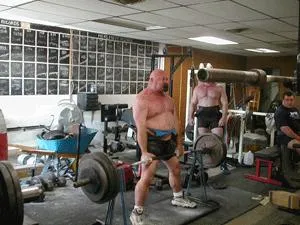

3．双脚垫高的速度硬拉。站在一个箱子或几块橡胶垫上，使双脚高于地面2－4英寸，做速度硬拉。使用极限重量的30－40%，做5－10组1次，组间歇45－60秒。

### 卧推

1．速度卧推。两侧肩胛骨靠近，用力向着训练凳推，双肘靠近身体。在动作最低点，铃杆触到下胸。将杠铃沿直线推起，而不是向后、向着头部方向推起。一组3次的时间不应超过3－3.5秒。这种速度训练是该计划的常规方法，大多数时候都会用到。

2．速度承托卧推。动作与卧推基本相同，区别是：使杠铃迅速下落，在铃杆距离胸部1－2英寸时再将它托住，使杠铃停止，然后利用爆发力推动杠铃上移至锁定。这种速度训练能够有效发展启动力量，每两三周用一次即可。

3．地板卧推。做法在本系列文章的第2篇已经有过介绍。这个动作非常适合肩、胸、肱三头肌伤病初愈的训练者。确保避免双肘触地板反弹，在最低点停顿一秒钟，然后利用爆发力推动杠铃上移至锁定。这个动作能够有效发展推类动作肌肉，因为这个动作减少了腿部的参与。

4．地板承托卧推。与上面的动作基本相同，区别是：使杠铃迅速下落，在铃杆靠近胸部再将它托住，使杠铃停止在距离胸部1－2英寸处（因为你此时是在地板上仰卧），然后利用爆发力推动杠铃上移至锁定。这个动作能够有效发展肱三头肌力量。

5．速度低木板卧推。木板卧推是一种极限努力动作，用于加强卧推锁定力量。它也能有效提高肱三头肌力量。动作与卧推基本相同，只不过要让杠铃在置于胸部上的木板上停住。在这种[训练方法](https://zhida.zhihu.com/search?content_id=9258960&content_type=Article&match_order=1&q=训练方法&zhida_source=entity)中，应使用1－2块6英寸宽、2英寸厚、12英寸长的木板。让杠铃在木板上完全停住，然后再将杠铃向上推起。这个动作同样也能够有效发展卧推的启动力量。

在速度训练日，练习箱子深蹲、卧推和硬拉时应采用什么样的组次安排？

针对箱子深蹲，有很多不同的循环可供选择，这主要取决于训练者的水平和经验。在很多循环中，需要用到弹力带和铁链，以便将训练提升到一个新的水平。更多信息见本人前文《友好阻力：弹力带与铁链》。

### 针对初学者的循环

初学者指的是从未采用过这种训练方法、肌肉不够发达或者技术不佳的人。针对这类训练者，我将介绍两种不同的深蹲循环、两种卧推循环、两种硬拉循环。

一些诀窍：

在卧推训练中，你可以采用3种不同的握距，从将一根手指置于铃杆的光滑区域，到将一根手指置于标志环外侧。如果计划要求你做8组，不论如何变换握距，总共做8组，而不是每一种握距都做8组。当然，你也可以只采用一两种握距。

在深蹲训练中，采用平行箱子和标准动作。在动力训练中，向心（上升）阶段必须要快。初学者在速度训练中应该只采用标准箱子深蹲、卧推和硬拉。他不应该采用其他的特殊速度训练动作！

#### 针对初学者的深蹲循环

深蹲循环1

该循环针对新手或深蹲技术有问题的训练者。

·第1周：20-30%，15组2次，间歇60秒

·第2周：20-30%，18组2次，间歇60秒

·第3周：20-30%，20组2次，间歇60秒

深蹲循环2

该循环针对已经训练过一段时间，但刚接触箱子深蹲或这种训练方法的训练者。

·第1周：50%，8组2次，间歇60秒

·第2周：55%，8组2次，间歇60秒

·第3周：60%，8组2次，间歇60秒

#### 针对初学者的卧推循环

卧推循环1

该循环针对新手或卧推技术有问题的训练者。

·第1周：20-30%，15组3次，间歇60秒

·第2周：20-30%，18组3次，间歇60秒

·第3周：20-30%，20组3次，间歇60秒

卧推循环2

该循环针对已经训练过一段时间，但刚接触这种训练方法的训练者。

·第1周：55%，8组3次，间歇60秒

·第2周：60%，8组3次，间歇60秒

·第3周：65%，8组3次，间歇60秒

#### 针对初学者的硬拉循环

硬拉循环1

该循环针对新手或硬拉技术有问题的训练者。

·第1周：20-30%，15组1次，间歇60秒

·第2周：20-30%，15组1次，间歇45秒

·第3周：20-30%，15组1次，间歇30秒

硬拉循环2

该循环针对已经训练过一段时间，但刚接触这种训练方法的训练者。

·第1周、第2周、第3周：50%，8到10组1次，间歇45秒

#### 针对中高级训练者的循环

这些训练循环针对那些已经训练很多年、拥有了良好的训练基础的训练者。同时，这些训练者还应该对于这种训练方法有一定的经验。下面会介绍更多不同的[训练循环](https://zhida.zhihu.com/search?content_id=9258960&content_type=Article&match_order=2&q=训练循环&zhida_source=entity)，它们各有价值。比如说，有些用于发展基础体能，有些用于赛前训练。

#### 针对中高级训练者的深蹲循环

只使用杠铃

在该循环里，不使用铁链、弹力带等工具。该阶段适用于很多种训练者。有些训练者喜欢在一年的大部分时间里采用该阶段。（我这么做长达8年时间，直到铁链和弹力带训练方法出现，取得了很好的效果。）还有一些训练者喜欢在一场比赛结束后，把它作为第一阶段，以便找回训练的感觉。

·第1周：45%，8组2次，间歇60秒

·第2周：50%，8组2次，间歇60秒

·第3周：55%，8组2次，间歇60秒

使用Regular Band

在弹力带阶段中，大多数时间都属于使用Regular Band的阶段。这是关键的弹力带阶段。弹力带的选择取决于训练者的力量。深蹲重量低于450到500磅者应使用light band，深蹲重量为501到700磅者应使用average band，深蹲重量为701磅以上者应使用strong band。

·第1周：47%，8组2次，间歇60秒

·第2周：49%，8组2次，间歇60秒

·第3周：51%，8组2次，间歇60秒

使用Heavy Band

这个阶段堪称是杀手阶段，大多数情况下只用于赛前的一两周。在这个阶段，你要使用自己所能承受的最高磅数的弹力带。开始时，你可以使用磅数为以往的2.5倍的弹力带。例如，如果在你在以往的弹力带循环里使用一根average-rated band，现在就用两根average band和一根light band。完成5组以后，你还可以加一组大重量单次。

·第1周：20-30%，5组2次

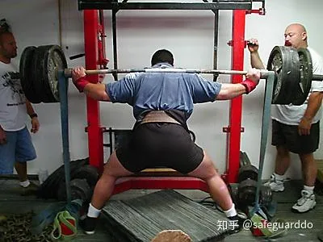

Circa-Max One

对于我所知道的大多数深蹲700磅以上的人，这个阶段都很适用！它针对的是高级训练者，而不是新手和初学者。这个阶段是为了让你在赛前达到最佳状态。此时，使用的弹力带更多。如果你的深蹲重量为500到800磅，此时应使用一根average band和一根light band；如果你的深蹲重量为800磅以上，此时应使用一根蓝色弹力带和一根粉色弹力带。

·第1周：47%，5组2次，间歇60秒

·第2周：51%，5组2次，间歇60秒

·第3周：53%，5组2次，间歇60秒

·第4周：47%，5组2次，间歇60秒

4周以后，训练者应该降低训练重量了。你应该把低磅数的那根弹力带拿走，高磅数的那根弹力带不动。

·第1周：53%，5组2次，间歇60秒

·第2周：47%，5组2次，间歇60秒

使用铁链

在铁链循环中，使用的杠铃重量与只使用杠铃的循环是一样的。因为在动作最低点，铁链的有效负荷会大大降低；只有在动作顶点，铁链的有效负荷才会达到最大值。先将支撑铁链固定在铃杆上，再在支撑铁链底端挂上训练铁链。这样，在动作最低点，铁链的有效负荷才会大大降低。如果直接把所有铁链都挂在铃杆上，在动作最低点，铁链的有效负荷仍然会占到总负荷的大部分。

合适的铁链重量

·深蹲极限重量为200-400磅＝60磅的铁链

·深蹲极限重量为400-500磅＝80磅的铁链

·深蹲极限重量为500-600磅＝100磅的铁链

·深蹲极限重量为600-800磅＝120磅的铁链

·深蹲极限重量为800-900磅＝160磅的铁链

体能阶段

这个3周的阶段是一个杀手阶段，目标是帮助你迅速减脂。间歇时间这是个阶段的关键。

·第1周：40%，10组2次，间歇低于45秒

·第2周：42%，15组2次，间歇低于45秒

·第3周：44%，15-20组2次，间歇低于45秒

#### 针对中高级训练者的卧推循环

这种训练方法的卧推训练循环都是计算百分率的基础方法，采用平波浪计划。平波浪指的是每周使用的训练重量不变，但每周争取加快一点动作速度。

循环1

·第1周：50%，8组3次，间歇60秒。

·第2周：50%，8组3次，间歇60秒。

·第3周：50%，8组3次，间歇60秒。

循环2：弹力带

最适合用于卧推速度训练的弹力带是mini band。将弹力带的一端固定在铃杆上，将另一端向下拉，从一个哑铃的铃杆下方穿过，再向上拉，同样固定在铃杆上。这就叫做double mini band。Mini band经过对折以后，在动作顶点的拉力为70-80磅，在动作最低点的拉力为30-40磅。对于卧推极限重量低于450磅的人而言，这样的拉力足够用了。

如果你的卧推极限重量超过450磅，你可以多用一个哑铃，从而拉长弹力带。在这种情况下，在动作顶点的拉力为100-110磅，在动作最低点的拉力为50-60磅。

·第1周：40%，8组3次，间歇60秒。

·第2周：40%，8组3次，间歇60秒。

·第3周：40%，8组3次，间歇60秒。

注意：以上的百分率指的是杠铃重量，不算弹力带的拉力。

循环3：铁链

当杠铃放在卧推架上时，应该有一半的铁链落在地上。铁链重量取决于你的卧推极限重量。如果你的成绩低于300磅，铁链总重量应为50-60磅。如果你的卧推极限重量为300-500磅，铁链重量应为80-90磅。如果你的卧推极限重量为500磅以上，铁链重量应为120-130磅。

·第1周：50%，8组3次，间歇60秒

·第2周：50%，8组3次，间歇60秒

·第3周：50%，8组3次，间歇60秒

注意：以上的百分率指的是杠铃重量，不算铁链的重量。

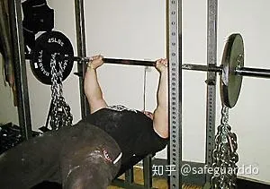

可供选择的循环还有一些，但本文的篇幅不足以容纳，因此只在下面做简要介绍：

·使用比上面推荐的磅数更大的弹力带，同时降低杠铃重量。

·前面几组完成后，增加一根弹力带，做两组，然后拿掉这根弹力带，做最后几组。铁链训练也可以这样。

·在这8组里逐渐加重。比如：用40%做两组，用45%做两组，用50%做两组，用55%做两组。

·承托卧推。大多数训练者采用这种方法时，动作都不对！你应该使杠铃迅速下落（但要保持控制），在铃杆距离胸部1－2英寸时再将它托住，使杠铃停止，然后利用爆发力推动杠铃上移。采用这种方法时，每个循环持续一两周即可。如果时间太长，可能会受伤。

#### 针对中高级训练者的硬拉循环

对于硬拉，不需要介绍很多循环。针对硬拉，最常见的速度硬拉循环就是使用50%左右的重量，做5-8组1次。关键在于动作的标准度和速度。你也可以使用弹力带或铁链，以增加动作顶点的负荷。

其他的速度训练动作应该用在何时？如何安排计划？

在上面所列的各种深蹲循环中，你都可以使用安全深蹲杠铃、野牛杠铃（如图所示）和弧形杠铃。我认识的一位选手直到赛前3周才开始使用标准杠铃，却能深蹲1000磅以上！其余的时间里，他都使用安全深蹲杠铃。他感觉使用这种杠铃时，肩部能轻松一点，从而不至于影响卧推训练。

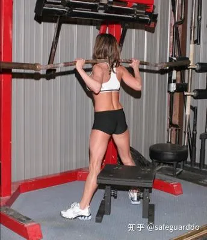

卧推时，你可以使用弧形卧推杠铃（如图所示）和粗杆杠铃，以便从不同的角度刺激相关肌肉。有很多选手在日常卧推训练中中只使用粗杆杠铃，直到比赛时才使用标准杠铃。

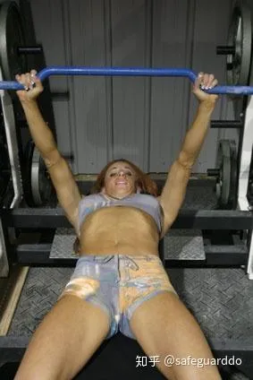

### 上面推荐的百分率都是不可更改的吗？

不是！上面介绍的百分率只不过是一种指导方针。如果你使用推荐的重量时，感觉太轻，那就提高重量；如果你使用推荐的重量时，感觉太重，那就降低重量。上面介绍的百分率只是用于帮助你找到一个合适的起点。

算百分率的问题在于，它们都基于极限重量。但有些人擅长极限动作，有些人擅长高次数动作。如果你擅长极限动作，应降低百分率！是的，降低。降低了重量，你才能提高速度。对于很多选手而言，速度都是非常重要的，速度训练将使他们的表现大为改观。

例如，如果我告诉你，将安全销插在13处，我的架上卧推重量是455磅，你会怎么想？对我而言，将[安全销](https://zhida.zhihu.com/search?content_id=9258960&content_type=Article&match_order=2&q=安全销&zhida_source=entity)插在13处时，卧推过程中杠铃的移动距离是4英寸。你可能会想，这说明我无法在全程动作中使用500磅的重量。但我能卧推600磅。在全程动作中，启动速度更高。我属于速度型选手，而不是力量型选手。在极限努力动作中，我使用的重量和某些极限总重量比我低400磅的人是相同的。这表明，我在提高速度的同时，必须兼顾极限努力训练。

那些力量型选手都非常强壮，但速度慢。当你缓慢举起重物时，会发生什么？非常简单，每次动作的时间更长。每次动作的时间越长，你的力量必须越强才够用。

### 完成速度动作后，应该练些什么？

根据需要安排。我建议你先瞄准自己的弱点。如果你不知道自己的弱点是什么，怎么办？首先，你可以去找一个好教练。其次，你可以阅读下面的段落。

深蹲失败点

在顶点失败：你在起立至接近顶点时失败，但身体没有向前或向后倒。从某种意义上来说，这是一件好事，因为这说明你的深蹲动作很标准，只不过在顶点的力量不足。在这种情况下，你几乎不存在技术问题，除了你没能将髋部向前推。

要解决这个问题，首先，你要提高力量！这听起来很简单，实际上也不难。有时候，你并不需要总是费尽心思找出自己的缺点。我认为有太多的训练者以为自己未能进步的原因是某种神秘的缺点，而事实上，他们只需要提高全身力量。

其次，加快动作速度。如果你的动作速度足够快，动力自然会帮助你突破粘滞点。

第三，根据事实进行检查。这个[粘滞点](https://zhida.zhihu.com/search?content_id=9258960&content_type=Article&match_order=3&q=粘滞点&zhida_source=entity)的存在，是否只因为你坚信它存在？我的意思是，你总是在同一点上失败吗？你总是在这里失败吗？你是否在心理上暗示自己，你一定会在这里失败？如果是这样的话，你需要解决这种心理问题。

在最低点失败：这个问题的成因有很多。第一个也是最明显的一个是，重量太大。我知道很多读者会想：“嗯，废话！”但如果你也像我一样曾接到过那些电邮和电话，你会感到惊讶的。

例如，有个人打电话给我说，他卧推315磅时失败，怎么也想不通其中的原因。我跟他聊了一会儿才发现，原来他只能勉强卧推275磅！他的问题很简单，就是使用的重量太大！

第二个成因是，站位不正确。如果你在站位时没有使下背部保持反弓，没有使腹肌保持紧张，没有在启动下蹲时向后坐，你就会笔直向下坐。你必须在下蹲时向后坐，才能充分利用腘绳肌、下背部和髋部的力量。如果你笔直向下坐，大部分负荷就会施加在股四头肌上，使杠铃前移。

第三个成因是，你在下蹲和开始起立时没有想着将双膝向外推。要解决这个问题，你只需让训练伙伴提醒你：“双膝向外！”你可能还需要增加髋部力量训练。合适的选择是弹力带绕膝坐姿外展，我们称其为“弹力带双膝外推”。第二个选择是轻重量高次数（约10次）宽站位低箱深蹲。下蹲至最低点，起立至四分之一程，再下蹲。这样能够在你出现问题的那段路线上使肌肉保持紧张。

第四个成因是，你在下蹲时使胸部下落了。

第五个成因是，你的腘绳肌力量不足，使你难以充分向后坐。在我参加过的[研讨会](https://zhida.zhihu.com/search?content_id=9258960&content_type=Article&match_order=1&q=研讨会&zhida_source=entity)上，我经常见到这样的问题。训练者本该大幅度向后坐，但他们却笔直下蹲。他们的腘绳肌力量不足，难以完成向后坐的动作。要解决这个问题，你可以在速度训练日练习箱子深蹲，箱子高度以你能够以标准动作向后坐为准。在接下来两三周里，每周将箱子高度降低半英寸到一英寸，并且使动作100%保持正确。

要加强[腘绳肌力量](https://zhida.zhihu.com/search?content_id=9258960&content_type=Article&match_order=3&q=腘绳肌力量&zhida_source=entity)，你还可以练习Glute-ham raise，Reverse hyper、体前屈、胯下钢索前上拉等动作。

最后一个成因是，腹部与下背部力量不足。因此，每个力量举选手都应该多多练习腹部和背部训练动作。

开始起立时向前倒：这是最常见的深蹲失误，最常见的粘滞点。它的成因有很多，既包括体能，也包括技术。

第一个成因是，开始起立时，你没有先抬高胸部，而是先抬高髋部。[屈髋](https://zhida.zhihu.com/search?content_id=9258960&content_type=Article&match_order=1&q=屈髋&zhida_source=entity)时，胸部自然会前移。你必须想着先抬高胸部，推动杠铃后移而不是上移。如果你想着推动杠铃后移，它才会沿着直线上移，而不是前移。两点之间，直线的距离最短，杠铃必须沿着直线移动。

第二个成因是，你低头了。你的身体总是会随着头部移动，你必须使头部保持在靠后的地方。注意，我说的不是抬头，而是使头部保持在靠后的地方。你可以看看深蹲高手们开始起立时眼睛的角度。你会看到他们的眼睛在向上看，颈部在向后推动杠铃。即使有些人眼睛在向下看，他们仍然在将头部和[斜方肌](https://zhida.zhihu.com/search?content_id=9258960&content_type=Article&match_order=1&q=斜方肌&zhida_source=entity)向后推。

这些技术问题出现的主要原因是什么，如何解决这些问题？要解决任何一种技术问题，你只需学习正确的动作，利用轻重量来完善自己的动作。你还应该利用训练伙伴的口头提示。针对这些失误，最佳的口头提示是“抬头！”或“挺胸！”

第三个成因是，腹部和下背部力量不足。如果你的核心部位不够强壮有力，无法将力量由下肢向着杠铃传导，体姿必然变形。针对腹部，最合适的选择是兼顾腹肌和[髋部屈肌](https://zhida.zhihu.com/search?content_id=9258960&content_type=Article&match_order=2&q=髋部屈肌&zhida_source=entity)的动作（跪姿下拉、举腿、Spread eagle仰卧起坐等等）。针对下背部，最合适的选择是Reverse hyper、山羊挺身、体前屈。

此外，你还可以练习弧形深蹲杠铃低箱深蹲。原因是什么？如果你在开始起立时没有先抬高胸部，你的动作就会变得非常不稳定。当你遇到一次这种问题之后，你自然会找出办法改变这种情况。

底线是，无论你的弱点是什么，都要想办法纠正！这离不开自律和Discipline（纪律、训练）。基本上，你只需去做该做的事，因为没有人会替你做这些！

起立半程向前倒：这可能是我第二个最经常见到的深蹲问题或粘滞点。此时，训练者开始起立的力量很强，但在起立至半程时开始向前倒。原因在于，他的逆转力量很强，到达起立半程时才失败。他无法继续使身体保持稳固，因为躯干开始疲劳，动力使得髋部继续保持上升，但上体无法再保持接近垂直。

为解决这个问题，他需要确保极限努力动作的紧张时间与比赛动作一致，也就是3至4秒左右。第二，增加腹肌训练，提高负荷。第三，在你的失败点上做静态动作。利用轻重量杠铃（约20%）和弹力带。下蹲至你的失败点，保持5秒钟，然后起立，在顶点保持5秒钟。最好做3至5组5次。你还可以练习体前屈，它的效果有可能更好，因为这个动作与杠铃深蹲相比，施加在躯干上的负荷更大。最后一种方法是使用安全杠铃做极限努力训练。当你起立时，安全杠铃会将你的身体向前拉。此时，你必须与这种力对抗，争取使杠铃保持在正确位置上，从而发展相关肌肉。

向后倒：这种失误的害处最小，因为它说明你的深蹲力量没问题。唯一需要做的是完善技术。你只需向后坐得更远一点，加大躯干前倾幅度。训练者向后坐得不够远，也有可能是[腘绳肌](https://zhida.zhihu.com/search?content_id=9258960&content_type=Article&match_order=6&q=腘绳肌&zhida_source=entity)力量不足。

下蹲时双膝内移：这在初中级训练者中也是一种常见问题。原因很多：髋部力量不足，柔韧性差，动作不标准。如果问题在于动作不标准，训练者需要的只是口头提示：“双膝向外！”

如果训练者的柔韧性差，可以使用更高的箱子，高度以其能够保持将双膝向外推为准。熟练以后，随着柔韧性的提高，逐渐降低箱子的高度。

如果问题在于髋部力量，解决方法与上面介绍的“在最低点失败”相同。

卧推失败点

在顶点失败：如果你在卧推顶点失败，问题在于杠铃移动轨迹错误或肱三头肌力量不足。在本系列文章中，前面已经介绍过很多发展[肱三头肌力量](https://zhida.zhihu.com/search?content_id=9258960&content_type=Article&match_order=4&q=肱三头肌力量&zhida_source=entity)的方法了。

开始上移时失败：原因很多。首先，逆转力量和速度不足。这正是速度训练的价值所在。如果你的爆发力很强，你绝不可能在杠铃开始上移时失败，除非重量太大。

第二，[启动力量](https://zhida.zhihu.com/search?content_id=9258960&content_type=Article&match_order=3&q=启动力量&zhida_source=entity)不足。卧推服装可能也有一定的影响。因为卧推服装越紧，杠铃越难下落，所需的逆转力量越强，因为杠铃下落速度与无装备动作相比更慢。这意味着训练者需要多多练习在最低点停顿的卧推。最佳方法之一是低位架上卧推，使杠铃处于稍高于胸部的位置，将其用于极限努力训练，或者作为一节训练课的第二个动作，采用每组3到5次的[极限组](https://zhida.zhihu.com/search?content_id=9258960&content_type=Article&match_order=1&q=极限组&zhida_source=entity)。确保在杠铃在安全销上停顿一两秒钟。

第三，背阔肌、上背部和肩袖力量不足。你应该把这些肌肉看作是发射台。如果你的推起动作缺少一个稳固的基础，就相当于平台不稳。

要提高启动力量，还可以练习窄握上斜卧推、[哑铃卧推](https://zhida.zhihu.com/search?content_id=9258960&content_type=Article&match_order=1&q=哑铃卧推&zhida_source=entity)和俯卧撑。

上移中程失败：出现这种粘滞点，意味着训练者有效地利用爆发力将杠铃推起了，但在杠铃上移两三英寸后失败。要解决这个问题，你也可以增加杠铃速度，从而突破粘滞点。

第二个成因是，[肱三头肌](https://zhida.zhihu.com/search?content_id=9258960&content_type=Article&match_order=6&q=肱三头肌&zhida_source=entity)力量不足。要解决这个问题，最佳极限努力动作为中程架上卧推、两块木板卧推、地板卧推。

杠铃上移时向后、向着[卧推架](https://zhida.zhihu.com/search?content_id=9258960&content_type=Article&match_order=2&q=卧推架&zhida_source=entity)移动：问题主要在于卧推服装。你要么是不知道如何使用卧推服装，要么是卧推服装质量不佳。使用卧推服装时，你必须使杠铃沿着正对下胸的位置上移，而不是向着头部方向移动。如果你让杠铃向着头部方向移动，它会后移得更远。你必须在杠铃上移时制造出足够高的速度。如果你的卧推服装质量不佳，也会导致杠铃后移。

第二个成因是，你的肩部力量超过了肱三头肌。你试图将负荷从肱三头肌上转移，移向肩部，从而导致了这样的问题。同时，如果你的肩部力量不足，无法使杠铃保持在正确轨迹上，也会导致这样的问题。

另一个成因是，你没有使前臂保持在铃杆的正下方。如果你的手腕向后弯曲，铃杆处于前臂后方，就会导致这种问题。在这种情况下，你制造出的力就不是笔直自下向上的。

此外，你可能还需要正确的指导和训练。确保动作足够标准，提高锁定力量，方法是专门的肱三头肌训练和将高木板卧推、高位架上卧推用于极限努力训练。

硬拉失败点

大多数硬拉失败点和深蹲失败点，麻烦都出在相同的肌群和技术问题上。因此，如果技术没有问题，深蹲训练有助于提高硬拉。极限努力硬拉训练和速度硬拉都能够完善硬拉动作。站位时要注意动作的标准性，确保肩部处于铃杆后方，起立时使身体保持向后倒。

如你所见，这些问题的大多数解决方法已经隐藏在前面内容中介绍的一般性方针里了。常规模板已经照顾到了大多数弱点，比如腘绳肌、下背部、髋部、腹肌和肱三头肌。只要按照一般性方针来做，注意自己的动作，不要逃避某些训练内容，就够了。

## 恢复

正如本系列文章前文所说，GPP（一般性体能准备）是非常重要的，尤其是对于恢复而言。根据Yuri Verkhoshansky在《针对具体体育项目的力量训练基础》一书中所说，以及已故的Mel Siff在《超级训练》一书中所说，GPP的功能是：

·塑造、加强或恢复运动技巧，在完善运动能力方面起到辅助作用。

·帮助训练者学习在某个体育项目中得不到发展的技能，提高或保持一般性运动能力。

·在高负荷训练后，得到积极休息，促进恢复，避免训练的单调。

### GPP的一种常见方法是拉阻力橇。使用阻力橇有很多好处：

·阻力橇便于使用，不必特地跑去健身房。

·阻力橇能够提高极限力量发展所需的针对性技术。（顺便提一句，我们从不练习拉阻力橇跑。）

·事实上，使用阻力橇能够发展所有肌肉。有很多针对腹肌、肩部、[腘绳肌](https://zhida.zhihu.com/search?content_id=9270654&content_type=Article&match_order=1&q=腘绳肌&zhida_source=entity)等不同肌肉的动作。

·阻力橇能够有效促进积极恢复。使用阻力橇练习上体拉类动作时，是没有离心（还原）过程的。只有向心过程的动作带来的[肌纤维](https://zhida.zhihu.com/search?content_id=9270654&content_type=Article&match_order=1&q=肌纤维&zhida_source=entity)损伤要小得多，因此非常有助于恢复。

为了节省笔墨，我建议你读一下我之前在本网站（T-mag）发表的文章《拉阻力橇：西部体系GPP》，你从中可以找到所需的各种信息。想买阻力橇的话，请访问[http://www.elitefts.com](https://link.zhihu.com/?target=http%3A//www.elitefts.com)。

## 营养

我会把这部分写得简短一点。是的，营养很重要，你不应靠垃圾食品度日。我在这方面走过弯路，我感觉自己的很多伤病都跟糟糕的饮食习惯有关。

我不是营养学专家，我感觉自己没有资格告诉你应该吃什么、怎么吃。

但这方面的信息来源很多，本网站就是其中之一。你应该多学习，找出你感觉最适合的体系。我仍然在不断学习营养学知识，看T-mag帮助我纠正了很多坏习惯，最重要的收获是少食多餐，增加蛋白质摄入，合理使用补剂。我有时会补充蛋白粉和Tribex，但我要学习的还有很多。

## 态度

### “一个人有可能失去一切，但有一件东西是别人夺不走的，它堪称是终极人类自由因素——面对不同的环境给出自己的态度，找出自己的路。” ——Victor E Frankl

我们每个人的生活中都会有一些重要时刻。这些时刻有可能是光荣的，也可能是悲惨的，它们能够为我们成为什么样的人指明方向和道路。这些时刻使我们成长，让我们变得更好或更坏。好与坏的差别在于你如何看待眼前的形势。如果你遇到了一些坏事，你会从中学习、吸取教训，然后继续前进，还是会从此一蹶不振？如果你遇到了一些好事，你会试图找出其中的原因，还是仅仅把它看成是命运之神的垂青？

这些与力量训练有何关系？它对力量训练、力量举、体育和生活都有重大影响！要在[力量运动](https://zhida.zhihu.com/search?content_id=9270654&content_type=Article&match_order=1&q=力量运动&zhida_source=entity)中取得成功，你需要具备很多不同的品质。我把这些品质归纳为3个词：做事、学习、传承。

### *做事：最重要的品质是过你想要的生活，而不是你现有的生活*。

换句话说，假如你是一个排名后100位的力量举选手，但你希望进入前10位，你应该过前10位选手的生活，还是后100位选手的生活？你是否和前10位选手做的是同样的事？你会按照他们的思路想问题吗？你曾放弃过训练课吗？（译注：原文疑有误，正确的句子应该是：“你会坚持完成每一节训练课吗？”）你像他们一样认真吗？如果不是这样，你凭什么指望自己能达到他们的高度？

### *你只需要转换思路，尽量去过自己想要的生活！“嗯，Dave，我也希望这样，但是……”但是什么？做自己应该做的！有很多人过的是“但是”生活、“我本该……”生活、“我本可以……”生活，或者“要是……”生活。*

这样的人遍地都是。我们管这种人叫批评家，他们都是“我没有……”专家，他们喜欢告诉我们，我们能做到什么，做不到什么。我遇到过的人当中，有90%都是这种人。避开他们！他们喜欢把你拉到和他们一样低的层次上。如果你也是这种人，你要马上改变，因为它会影响你的训练和生活。

### *学习：最成功的人们会花时间从自己的错误当中学习，向别人学习*。

如果你是力量项目选手，你就要阅读有关它的资料，与别人交流有关它的话题，采用各种办法提高自己。你感觉谁能够帮助自己，就多跟他交流。向强壮的人学习，把它用到自己的训练中去。知识是永远不嫌多的。有些细节可能是你自己想破头也想不出来的，而你的成功可能仰仗的正是这种细节。

传承：很多年前，在一家初中的健身房后面的一道黑暗的、散发出被汗水浸透的摔跤垫气味的楼梯上，站着一个9年级的摔跤选手。过去两年里，他只赢过一场比赛。到此时为止，这个孩子算不上是一名出色的运动员。他参加过很多体育项目，表现还不错，但在任何项目当中都称不上杰出。

在等待母亲来接自己的时候，他决定用这段时间练一下跑楼梯，而不像平常那样干坐着。跑了5分钟之后，他觉得训练量足够了，准备坐下来继续等待。就在这时候，摔跤主教练从这里经过，问他在做什么。这孩子回答，他正在跑楼梯，因为他实在无事可做。教练接下来说的一句话让这孩子终身难忘：“如果你足够努力，就没有实现不了的目标。”

于是我又跑了45分钟。在那个赛季接下来的时间里，我再也没有输过一场比赛。我的运动生涯非常成功。那句话教会我为了实现目标而奔跑，从此以后，我从未停下脚步。一个孩子，一句话，一段被改变的人生。

**我为什么要这么做？我为什么要写这些文章？我为什么要花那么多时间免费帮助人？明知道大多数选手和教练都不会听我的，我为什么还要如此在意他们？因为我曾听过教练的话。如果他不在意我，今天的我会是什么样子？我欠他的，我要把他曾给过我的最好的礼物传递出去。这就是我为什么如此努力的原因。**

我相信你也有过类似的故事。某地某时，某人曾花时间给予你帮助。你欠他们的，你必须把你知道的东西传播出去。当我们离开这个世界时，重要的不是我们带走了多少东西，而是我们留下了多少东西。曾有很多人帮助过我，我现在可以告诉你，我永远不会忘记他们的名字和他们的所作所为。这才是一个人在一生中所能取得的最大的成功。

### Vince Lombardi曾说过：“我坚信，一个人最幸福的时刻就是他为一个好的理由而拼尽全力，直到他带着胜利的光环累倒在赛场上。”

## 总结

写到这里，我回过头去，读了一下本系列文章第一篇的第一节。我发现自己并不比那个写出了长篇婴儿床安装指南的家伙更强。事实上，我干脆扔掉了指南，照着包装箱上的图片轻松装好了婴儿床。为了起到同样的作用，下面就是本系列文章的“包装箱上的图片”：

·每周花一天，采用不同的3周循环进行深蹲训练，做8组2次，以最高速度完成动作。

·每周花一天，按照文中介绍的重量比率进行卧推训练，做8组3次。

·每周花一天，练习深蹲或硬拉的极限努力动作。

·每周花一天，练习卧推极限努力动作。

·多训练腘绳肌。

·*多训练腹肌*。

·多训练肱三头肌。

·*发展GPP*。

*·找一些好搭档。*

*·找一位好教练。*

·反省自己的态度。

*·任何时候都不要吃垃圾食品。*

### 常见问题

让我猜猜，读过上面几篇文章，你已经憋了一肚子问题，对吗？没关系，针对这种类型的训练，我们已经回答过成千上万人的问题了。下面列出其中最常见的几个。

·每节训练课应该持续多长时间？

这实际上取决于健身房的人口密度和你是否进行热身。*一般说来，一节课以低于45分钟为佳，不包括热身时间*。但不要把这个原则看成是死规定。实际上，你只需要完成训练计划，就可以离开健身房了。如果完成训练计划需要60分钟，那就练60分钟。

·如果健身房没有Reverse hyper、Glute-ham raise、铁链、弹力带，怎么办？

*如果你没有铁链和弹力带，那就不要用铁链和弹力带，只用杠铃！记住，在使用铁链和弹力带之前的20年里，西部杠铃的会员们仍然取得了进步！*开始使用铁链以后，他们变得更强壮了。又过了两年，他们才开始使用弹力带。你更需要问的问题是，以你现在的水平，需要使用铁链和弹力带吗？

如果你没有GHR或Reverse hyper，就继续坚持你有条件练习的动作：胯下钢索前上拉、直腿硬拉、Dimel硬拉等下背部和腘绳肌训练动作。我感觉GHR和Reverse hyper这两个动作更好，西部杠铃的会员们每周至少训练两次这两个动作。但即使没有这两个动作，你也可以采用我的训练计划。

·我应该把每节训练课安排在哪天？

#### 大多数训练者可以采用这个基本模板：

周一——极限努力深蹲/硬拉训练日

周三——极限努力卧推训练日

周五——动力努力深蹲训练日

周日——动力努力卧推训练日

·如果我每周只能训练3次，怎么办？

那就采用8天循环，而不是7天循环。比如：

周一——极限努力深蹲/硬拉训练日

周三——极限努力卧推训练日

周五——动力努力深蹲训练日

周一——动力努力卧推训练日

周三——重复以上循环

## 9周的训练计划举例

正如前文预告的，下面是针对中级训练者的训练计划举例：

第1周

第1个训练日（极限努力深蹲训练日）

体前屈：做几组3次作为热身，直到你感觉自己无法再完成一组3次动作为止。此时，做每组1次，逐渐加重至1RM。

Glute-hame raise：3组10次。有控制地还原，争取在还原过程中数到4。

Reverse hyper：3组8次，使用小弹力带（small strap）。

跪姿钢索卷腹：5组10－15次。

悬垂直腿举腿：5组15次。

第2个训练日（极限努力卧推训练日）

木板卧推：做几组3次作为热身，直到你感觉自己无法再完成一组3次动作为止。此时，做每组1次，逐渐加重至1RM。

杠铃仰卧臂屈伸：6组10次。

钢索下压：3组10次。

单臂肩上推举：3组15次。

第3个训练日（动力努力深蹲训练日）

箱子深蹲：10组2次，使用1RM的50%，组间歇45－60秒。

Reverse hyper：3组8次，使用小弹力带。

单腿深蹲：4组，每组每条腿做10次。

哑铃划船：4组6次。

杠铃耸肩：3组15次。

第4个训练日（动力努力卧推训练日）

卧推：10组3次，使用1RM的60%。采用3种不同的握距，组间歇45－60秒。

哑铃仰卧臂屈伸：4组8次。

哑铃侧平举：3级10次。

哑铃俯身侧平举：3组10次。

第2周

第1个训练日（极限努力深蹲训练日）

体前屈：做几组3次作为热身，直到你感觉自己无法再完成一组3次动作为止。此时，做每组1次，逐渐加重至1RM。

Glute-hame raise：3组8次。有控制地还原，争取在还原过程中数到4。

Reverse hyper：3组8次，使用小弹力带。

跪姿钢索卷腹：5组10－15次。

悬垂直腿举腿：3组20次。

第2个训练日（极限努力卧推训练日）

木板卧推：做几组3次作为热身，直到你感觉自己无法再完成一组3次动作为止。此时，做每组1次，逐渐加重至1RM。

杠铃仰卧臂屈伸：6组10次。

钢索下压：3组10次。

单臂肩上推举：3组15次。

第3个训练日（动力努力深蹲训练日）

箱子深蹲：10组2次，使用1RM的54%，组间歇45－60秒。

Reverse hyper：3组8次，使用小弹力带。

单腿深蹲：4组，每组每条腿做10次。

哑铃划船：4组6次。

杠铃耸肩：3组15次。

第4个训练日（动力努力卧推训练日）

卧推：10组3次，使用1RM的60%。采用3种不同的握距，组间歇45－60秒。

哑铃仰卧臂屈伸：4组8次。

哑铃侧平举：3组10次。

哑铃俯身侧平举：3组10次。

第3周

第1个训练日（极限努力深蹲训练日）

体前屈：做几组3次作为热身，直到你感觉自己无法再完成一组3次动作为止。此时，做每组1次，逐渐加重至1RM。

Glute-hame raise：3组8次，使用小弹力带。

Reverse hyper：3组8次，使用小弹力带。

跪姿钢索卷腹：5组10－15次。

悬垂直腿举腿：3组20次。

第2个训练日（极限努力卧推训练日）

木板卧推：做几组3次作为热身，直到你感觉自己无法再完成一组3次动作为止。此时，做每组1次，逐渐加重至1RM。

杠铃仰卧臂屈伸：6组10次

钢索下压：3组10次。

单臂肩上推举：3组15次。

第3个训练日（动力努力深蹲训练日）

箱子深蹲：10组2次，使用1RM的56%，组间歇45－60秒。

Reverse hyper：3组8次，使用小弹力带。

单腿深蹲：4组，每组每条腿做10次。

哑铃划船：4组6次。

杠铃耸肩：3组15次。

第4个训练日（动力努力卧推训练日）

卧推：10组3次，使用1RM的60%。采用3种不同的握距，组间歇45－60秒。

哑铃仰卧臂屈伸：4组8次。

哑铃侧平举：3组10次。

哑铃俯身侧平举：3组10次。

第4周

第1个训练日（极限努力深蹲训练日）

低箱深蹲：做几组3次作为热身，直到你感觉自己无法再完成一组3次动作为止。此时，做每组1次，逐渐加重至1RM。

Glute-hame raise：5组5次。

半程硬拉：3组20次。

Reverse hyper：3组8次，使用小弹力带。

跪姿钢索卷腹：5组10－15次。

第2个训练日（极限努力卧推训练日）

地板卧推：做几组3次作为热身，直到你感觉自己无法再完成一组3次动作为止。此时，做每组1次，逐渐加重至1RM。

JM卧推：逐渐加重，最后做2组3次。

哑铃上斜卧推：2组10次。

哑铃坐姿翻站：4组8次。

悬垂直腿举腿：5组15次。

第3个训练日（动力努力深蹲训练日）

箱子深蹲：10组2次，使用1RM的60%，组间歇45－60秒。注意：完成以上内容后，逐渐加重至大重量1组2次。这不是极限努力训练，做动作过程中不允许失败。

胸部支撑划船：4组8次。

Glute-ham raise：3组6次。

钢索跪姿卷腹：5组10次。

第4个训练日（动力努力卧推训练日）

卧推：10组3次，使用1RM的60%。采用3种不同的握距，组间歇45－60秒。

窄握卧推：逐渐加重，最后做2组3次。

哑铃单臂臂屈伸：3组10次。

杠铃片前平举：3组10次。

第5周

第1个训练日（极限努力深蹲训练日）

低箱深蹲：做几组3次作为热身，直到你感觉自己无法再完成一组3次动作为止。此时，做每组1次，逐渐加重至1RM。

Glute-hame raise：5组5次。

半程硬拉：3组20次。

Reverse hyper：3组8次，使用小弹力带。

跪姿钢索卷腹：5组10－15次。

第2个训练日（极限努力卧推训练日）

地板卧推：做几组3次作为热身，直到你感觉自己无法再完成一组3次动作为止。此时，做每组1次，逐渐加重至1RM。

JM卧推：逐渐加重，最后做2组3次。

哑铃上斜卧推：2组10次。

哑铃坐姿翻站：4组8次。

悬垂直腿举腿：5组15次。

第3个训练日（动力努力深蹲训练日）

箱子深蹲：10组2次，使用1RM的50%，组间歇45－60秒。

速度硬拉：8组2次，使用1RM的50%。

Reverse hyper：5组8次。

胸部支撑划船：4组8次。

Glute-ham raise：3组6次。

钢索跪姿卷腹：5组10次。

第4个训练日（动力努力卧推训练日）

卧推：10组3次，使用1RM的60%。采用3种不同的握距，组间歇45－60秒。注意：完成以上内容后，逐渐加重至大重量1组1次。这不是极限努力训练，做动作过程中不允许失败。

窄握卧推：逐渐加重，最后做2组3次。

哑铃单臂臂屈伸：3组10次。

杠铃片前平举：3组10次。

第6周

第1个训练日（极限努力深蹲训练日）

低箱深蹲：做几组3次作为热身，直到你感觉自己无法再完成一组3次动作为止。此时，做每组1次，逐渐加重至1RM。

Glute-hame raise：5组5次。

半程硬拉：3组20次。

Reverse hyper：3组8次，使用小弹力带。

跪姿钢索卷腹：5组10－15次。

第2个训练日（极限努力卧推训练日）

地板卧推：做几组3次作为热身，直到你感觉自己无法再完成一组3次动作为止。此时，做每组1次，逐渐加重至1RM。

JM卧推：逐渐加重，最后做2组3次。

哑铃上斜卧推：2组10次。

哑铃坐姿翻站：4组8次。

悬垂直腿举腿：5组15次。

第3个训练日（动力努力深蹲训练日）

箱子深蹲：10组2次，使用1RM的52%，组间歇45－60秒。

速度硬拉：8组2次，使用1RM的55%。

Reverse hyper：5组8次。

胸部支撑划船：4组8次。

Glute-ham raise：3组6次。

钢索跪姿卷腹：5组10次。

第4个训练日（动力努力卧推训练日）

卧推：10组3次，使用1RM的60%。采用3种不同的握距，组间歇45－60秒。

窄握卧推：逐渐加重，最后做2组3次。

哑铃单臂臂屈伸：3组10次。

杠铃片前平举：3组10次。

第7周

第1个训练日（极限努力深蹲训练日）

体前屈：做几组3次作为热身，直到你感觉自己无法再完成一组3次动作为止。此时，做每组1次，逐渐加重至1RM。

Glute-hame raise：5组5次。

箭步蹲：4组，每组每条腿做10次。

Reverse hyper：3组8次，使用小弹力带。

跪姿钢索卷腹：5组10－15次。

第2个训练日（极限努力卧推训练日）

实心球卧推：3组20次，组间歇总时间为5分钟。

哑铃坐姿肩上推举：5组10次。

杠铃上斜臂屈伸：5组6次。

Face pull：5组15次。

第3个训练日（动力努力深蹲训练日）

箱子深蹲：10组2次，使用1RM的54%，组间歇45－60秒。注意：完成以上内容后，逐渐加重至大重量1组2次。这不是极限努力训练，做动作过程中不允许失败。

Reverse hyper：4组8次。

钢索下拉：3组8次。

Glute-ham raise：4组15次。

第4个训练日（动力努力卧推训练日）

卧推：10组3次，使用1RM的60%。采用3种不同的握距，组间歇45－60秒。注意：完成以上内容后，逐渐加重至大重量1组2次。这不是极限努力训练，做动作过程中不允许失败。

仰卧哑铃臂屈伸：4组6次。

钢索反握下压：3组15次。

前平举、侧平举、俯身侧平举三联组：2组60次（每种动作20次）

钢索跪姿卷腹：5组10次。

第8周

第1个训练日（极限努力深蹲训练日）

体前屈：做几组3次作为热身，直到你感觉自己无法再完成一组3次动作为止。此时，做每组1次，逐渐加重至1RM。

Glute-hame raise：5组5次。

箭步蹲：4组，每组每条腿做10次。

Reverse hyper：3组8次，使用小弹力带。

跪姿钢索卷腹：5组10－15次。

第2个训练日（极限努力卧推训练日）

实心球卧推：3组20次，组间歇总时间为5分钟。

哑铃坐姿肩上推举：5组10次。

杠铃上斜臂屈伸：5组6次。

Face pull：5组15次。

第3个训练日（动力努力深蹲训练日）

箱子深蹲：10组2次，使用1RM的62%，组间歇45－60秒。

速度硬拉：8组1次，使用1RM的60%。

Reverse hyper：4组8次。

钢索下拉：3组8次。

Glute-ham raise：4组15次。

第4个训练日（动力努力卧推训练日）

卧推：10组3次，使用1RM的60%。采用3种不同的握距，组间歇45－60秒。注意：完成以上内容后，逐渐加重至大重量1组2次。这不是极限努力训练，做动作过程中不允许失败。

仰卧哑铃臂屈伸：4组6次。

钢索反握下压：3组15次。

前平举、侧平举、俯身侧平举三联组：2组60次（每种动作20次）

钢索跪姿卷腹：5组10次。

第9周

在这周的末尾安排一个极限重量训练日。

箱子深蹲：逐渐加重至1RM。

卧推：逐渐加重至1RM。

硬拉：逐渐加重至1RM。

注意：这一天所用的极限重量将作为下一个8周循环的1RM。

结束语

哇，我都不敢相信自己终于写完了！我试图在本文中介绍所有相关信息并回答最近3年里在网上和[研讨会](https://zhida.zhihu.com/search?content_id=9270654&content_type=Article&match_order=1&q=研讨会&zhida_source=entity)上收到的所有问题。我相信自己还遗漏了很多东西，但我感觉你需要的东西中的90%都已经包括在其中了。