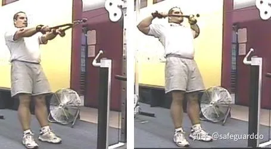
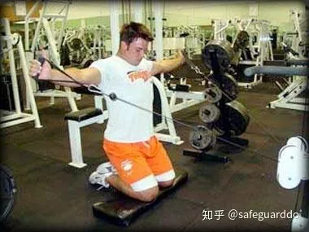
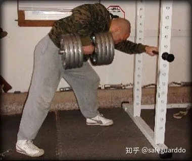
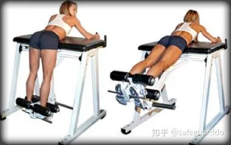
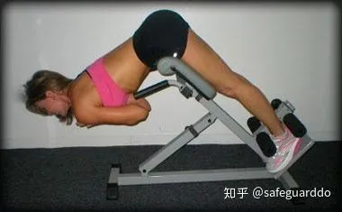
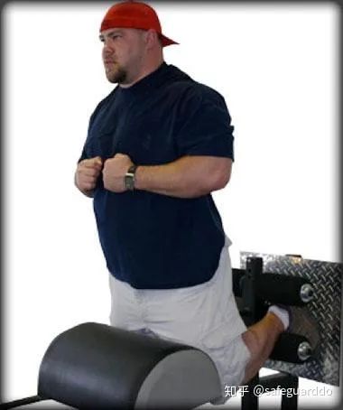
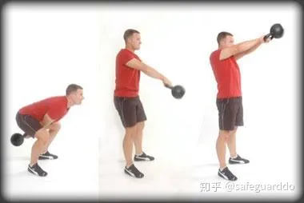
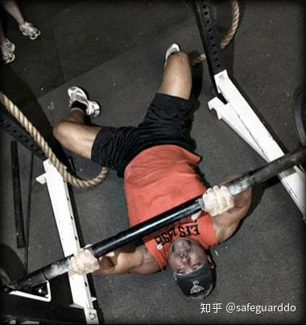
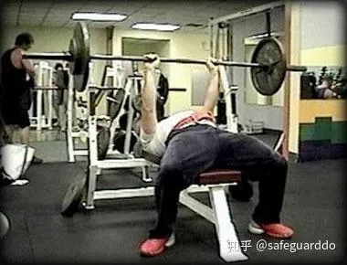
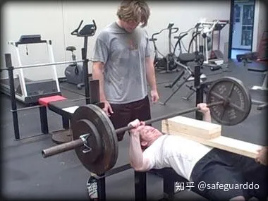

作者：Bryan Krahn

Jim Wendler

## 一

退役之后，Jim的身份是父亲，是Elite CEO Dave Tate的得力助手。他对力量训练仍然充满热情，出版了广受好评的电子书：《5/3/1：提高力量的最简单、最有效的训练体系》

TMUSCLE：我的**冬季训练目标是发展“颈背”**，吓住擂台上的对手。你对于发展斜方肌、上背部、颈部有什么建议吗？拥有发达的颈背有哪些好处？

Jim Wendler：发展颈背的好处很多。首先，它是力量训练者的标志，一张名片，有些人害怕自己的颈背太发达，有些人训练不够努力，无法得到它。其次，它看上去令人敬畏。第三，这样你就不必花时间系领带，系T恤衫顶端的钮扣了（说到底，你××为什么要穿衬衫？）。第四，因为，再说一遍，它上去××令人敬畏。

要练好它，第一点就是你正在做的——**使用大重量训练，坚持练习硬拉**。坚持到底，永不松懈（除非是休息日）。坚持5年。

第二点是，**练习力量翻（Power Clean）**。拿起杠铃，将它放到肩上。每周练习一次。

第三点是，**做一些划船动作，使用杠铃或哑铃**。但不要把它变成加西莫多力量翻（译注：加西莫多是巴黎圣母院敲钟人）。*每周练习一次，做5组10次。*

第四点是，要练习颈部肌肉，可以使用头部挽具，开始点头。对于初学者，我建议每次做30－50次，每周练习3次。不断增加每周练习次数和每次练习次数，直到你能够每天做100次。

最后，要**平衡肩胛带**，你可以做一些**face pull**（如图所示），**俯身侧平举**，**Joe DeFranco Scarerow**（如图所示）等。*不要用大重量，动作要标准*。每周练习两次，**做3－5组，每组15－20次**。

现在，在某些人提问之前，我要说，我没有介绍耸肩动作（尽管它是很好的动作），原因是：1.惹恼你，让你哭。2.如果训练者能够把时间用来练习*硬拉和力量翻*，而且动作正确，效果一定好于耸肩。3.我很少看到有人能把耸肩做对。4.*我的斜方肌比99%的人要好，而我从不练习耸肩。*

TM：每当我练习硬拉时，我的握力总是先于背部和腘绳肌出现问题。我试过各种方法增加握力，但无效。帮帮我！

JW：典型答案是：“使用助握带！”但那不会解决问题，只会让你的硬拉变得更具欺骗性、更糟糕。我从前的握力也很差，是下面这些方法帮助我解决了问题。

1.练习高次数哑铃划船（如图所示）。你必须使用能够做20次以上的最大重量。你还可以练习Kroc Row（训练凳搁腿划船），它能够帮助你发展上背部、背阔肌和握力。你的目标应该是使用“连一次动作都完不成的哑铃”，做50次。我是认真的。

2．练习高次数硬拉。每个人都害怕做高次数硬拉，因为他们说这些有可能伤到背部，或者他们在进行速度训练，等等。事实上，他们只是太烂了，他们害怕艰苦的训练。我知道，因为我以前就是这样的懦夫，在许多年以前。但是，做高次数硬拉，比如10次以上，是发展握力的好办法。

3．练习高次数耸肩。原则与高次数哑铃划船相同。正握杠铃。

4．做硬拉渐降组（如果这样符合你的训练计划的话），正握。

注意，*上面每一种方法都不仅仅是提高握力的，这正是“训练经济性”的实例。*

TM：在TMUSCLE和EliteFTS阅读了一些关于力量翻的文章之后，我决定把它加入我的5/3/1训练计划中去。这会干扰我的深蹲或硬拉训练吗？

JW：首先，力量翻并不那么难学。似乎每个人都认为它就像有机化学一样难学难用。把重物拿起来、放到肩上是一个很自然的动作，不要让某些专家影响你学习一个有趣的动作的热情。

如果你想成为职业举重选手，那就不同了。但是，如果你只想和朋友玩玩抛接橄榄球，你不一定要请一位专门训练[四分卫](https://zhida.zhihu.com/search?content_id=8931020&content_type=Article&match_order=1&q=四分卫&zhida_source=entity)的教练，对吗？

它完全不会影响你的深蹲或硬拉。由于它能够发展上背部力量，它也许还会对你的硬拉有帮助。我通常会建议训练者把它作为训练课的第一个动作，放在深蹲或硬拉之前。

由于力量翻是针对爆发力的，它能够帮助大多数训练者更好地完成第二个动作。关于组数和次数，我建议训练者采用我的5/3/1计划中介绍的。

要学习力量翻，这里有一种简单方法：

1．确保你能够一边行走一边数印弟安人。

2．你最好有足够的力量和协调性完成俯卧撑、仰卧起坐、双杠臂屈伸、箭步蹲。

3．以正确的动作拉起杠铃（即硬拉动作）。

4．当铃杆高于双膝之后，跳跃。

5．将杠铃置于肩上，然后站直。

6．放下杠铃。

7．不要当懦夫，不要害怕这个动作。

TM：在你的5/3/1手册里，你提到了有一些动作有助于增加硬拉重量。不幸的是，你没有提到细节，你这个懒惰的××。你愿意详细说说吗？

JW：这很简单，人人都能做到。它们包括：

1． 硬拉。你已经在练习了。你现在只需要制定一个计划，比如说我的5/3/1计划。

2． 早安式体前屈。在硬拉日练这个动作，注意动作要标准，屁股充分后移，双膝接近伸直（微曲），做5组10次。它能够发展你的下背部和腘绳肌。我使用safety squat bar（译：有护颈和握柄的弯曲铃杆）做这个动作。不需要使用大重量，我很少使用超过135磅的重量。不要使用训练腰带。

3． 深蹲。你应该已经在练习了。不要使用装备。不使用装备时，站距与肩同宽，或小于肩部，这样能够让负荷更多地施加在[股四头肌](https://zhida.zhihu.com/search?content_id=8931020&content_type=Article&match_order=1&q=股四头肌&zhida_source=entity)上。下蹲直至大腿与地面平行或低于平行，让臀部和腘绳肌也参与进来。强壮的双腿对于大重量硬拉很重要。

4． *高次数哑铃划船*。它能够很好地发展锁定力量和握力。有很长一段时间，我在硬拉时不锁定。我认为自己需要让臀部、下背、腘绳肌用力更多。这些部位很重要，同时练习高次数哑铃划船能够帮助我解决这个问题。

5． *负重仰卧起坐和悬垂直腿举腿。发展腹肌力量*。这一条还需要解释吗？

练习这5个动作要有计划、目标和激情。你的硬拉重量一定会上升的。

TM：我在一家糟糕的“24小时健身”训练，有一个××深蹲时总是穿着深蹲背心。我都快笑死了，因为他的极限重量是365磅。我想，他穿深蹲背心只是为了唬一唬俱乐部的一些小鸡。

但这引发了我的思考，我应该使用装备吗？我的最好平行深蹲（[力量举深蹲](https://zhida.zhihu.com/search?content_id=8931020&content_type=Article&match_order=1&q=力量举深蹲&zhida_source=entity)）是495磅左右。理论上，我使用装备能够达到多少磅？还有卧推背心呢？我现在的最好卧推是385磅。

JW：去“24小时健身”训练很勇敢，穿深蹲背心更勇敢。关于装备的争论很多。在力量举运动中，一个男人会唠叨、抱怨、批评另外一个男人穿什么，这样的体育项目很少见。

深蹲和卧推背心有帮助吗？是的，它们的确能够帮助你举起更大的重量。对于大多数人而言，它们能够迅速提高成绩，但幅度可能没有人们想象的那么大。[卧推背心](https://zhida.zhihu.com/search?content_id=8931020&content_type=Article&match_order=3&q=卧推背心&zhida_source=entity)很难使成绩提高200磅以上。技术是不同的，巨大的压力会作用在你的头部、胸部、背部和手臂，你会感觉重量无法承受；就像你的手臂会马上断掉，你的[肩关节](https://zhida.zhihu.com/search?content_id=8931020&content_type=Article&match_order=1&q=肩关节&zhida_source=entity)会脱臼。

深蹲背心也是这样。你也许能够蹲起更大的重量，但你能够扛起深蹲架上的杠铃后退两步吗？700磅或800磅与500磅的感觉是不同的，衣服、紧身裤或背心都帮不了你。

使用装备能够达到怎样的效果，这要看你花多大精力去了解装备。如果你使用它的效果不明显，你就会憎恨那些使用它以后大大提高了成绩的人，并声称装备毁了这项运动。如果你使用它的效果很明显，你就会声称它对你的帮助并不大。就是这么回事。

TM：我收藏了大约30本力量举方面的书和电子书……当然，5/3/1是我最喜欢的一本。不幸的是，我的藏书中有大约三分之二都是××。这个领域里，有哪些人是值得信赖的？我如何分辨好书和××？你能列出你最喜欢的[力量训练](https://zhida.zhihu.com/search?content_id=8931020&content_type=Article&match_order=3&q=力量训练&zhida_source=entity)书吗？

JW：我也不是训练书方面的专家，但我可以告诉你如何分辨××。你准备好了吗？坐下，拿出你的钢笔，如果你能够蘸着你自己的血和精液书写，效果更佳：

像××一样训练十年，不松懈，不××。你的世界里只有杠铃、力量架和一些镁粉。

等你做到这一点，你就能够分辨出大多数训练文章是否是××。你会发现，许多号称专家的人不过是吹牛者。即使没见过作者，你也能猜出他（她）是手上结满老茧的训练者，还是躲在键盘后面的吹牛者。那就好像是，你眼前的××一层纱被掀起来了，你眼中的一切都变得更清晰了。

有时候你也会判断不清，但你所需要做的就是看看某人的[胫骨](https://zhida.zhihu.com/search?content_id=8931020&content_type=Article&match_order=1&q=胫骨&zhida_source=entity)和双手，他是个经常训练的人吗？如果是，就倾听他的见解。

TM：关于训练，流传最广的流言是什么？

JW：最大的流言是，当你做极限次数时，动作要标准。如果它真的是**极限次数**，不是一组5次，而是5RM，你的**动作就不可能完美**。这是**因为它是极限次数**。如果你的**动作很完美**，我**怀疑它是不是真正的极限次数**，或者你是否真的尽力了。

当人们查看自己做极限次数组的动作录像，想要检查自己的动作是否标准时，问题就来了。检查录像没问题，但你的动作一定会有瑕疵，你的动作也应该有瑕疵。

换句话说，除非你的动作错到了可能导致伤害的程度，或者动作错得很离谱（比如说，深蹲时将杠铃置于额头上，或者卧推时屁股离开训练凳3英尺），否则就有可能是可以接受的。

## 二

提高**全身力量**的最佳动作？**硬拉**。

提高**下背部**力量的最佳动作？**早安式体前屈、山羊挺身能够提高下背部、腘绳肌和臀部的力量。**

提高**股四头肌**力量的最佳动作？**箭步蹲**和腿举。

提高**腹肌力量**的最佳动作？**负重仰卧起坐**。

这些动作都要练。如果你没有练习这些，为什么？你是不是忙着去参加花车游行了？负重仰卧起坐和早安式体前屈突然变得没有价值了？

TM：我正在考虑让我的妻子采用5/3/1。女人采用这个计划时，需要做什么调整吗？

JW：一般说来，女人的训练与男人并无不同。我不知道为什么“女人需要特殊的××”这种说法如此流行。因为男人长了XX，女人长了XX？还是因为做两份计划，教练就可以拿两份钱了？指导女人确有不同，但在教练眼里每个人都是不同的，这无关性别。

你只需要认识到一点，**在极限重量的某个百分率上，女人能够做比男人更多的次数。例如，假设一个男人能够以极限重量的90%做3次，一个女孩也许可以做6次。**这只是举个例子，希望你明白我的意思。另外，女人的加重幅度（指力量提高以后）应该小一些，上肢动作每次加2.5磅，下肢动作每次加5磅。

如果她们不善于做某个核心动作（往往是站姿推举），那就多加练习。我正在写一本新书，里面将会提供给新手的5/3/1计划。

## 三

TMUSCLE：**卧推的最佳辅助训练**是什么？

首先，要提高卧推重量，最重要的两点是：

正确的训练计划。

增加体重。

现在，至于辅助训练，你必须分析一下卧推，看看哪些肌肉将会帮助你取得提高。起**主要作用的肌肉是胸部，肩部和肱三头肌。起次要作用的肌肉是背阔肌，上背部和肱二头肌**。现在，由于我是训练经济性的支持者，我只选择最有效的训练动作。

**双杠臂屈伸**——兼顾负重和不负重的动作。我很重视这个动作，我感觉**它是我尝试过的最佳上肢动作之一**。此外，讨厌的是，练习这个动作总是让人泵感十足，因此你可以在周五晚上约会之前练习这个动作。

**哑铃卧推**——注意事项不多，你只需要做出**全程动作。那正是你使用哑铃的原因**。

**肩上推举**——我认为这个动作非常重要，因此我把它作为自己的训练的核心动作，以及5/3/1计划的核心动作。强壮有力的肩部对于大重量无装备卧推极为重要。我总是采用站姿（这正是你小便的姿势，因此你在推举时也要采用这个姿势），握距不要太宽。你应该做颈前推举。

布拉福德推举——起始动作与肩上推举类似。推举杠铃，使其高于头部数英寸。接下来，使杠铃向头部后方下落。现在，它看上去就像颈后推举一样了。再次推举杠铃，使得杠铃高于头部数英寸，然后使杠铃回到头部前方，回到颈前推举的位置。这样算一次。

不要使重物锁定，持续对肩部施加压力，减少肱三头肌的参与。最好采用高次数（8－15）。

**负重俯卧撑**——你可以使用Blast Straps（译注：类似吊环和TRX的器械），俯卧撑架，或者直接将双手放在地面上。负重有很多种：将**铁链**缠在背部和颈部，双手握**弹力带**再绕在背上，背上放**杠铃片**，或者穿沙袋背心（或者综合以上方法）。

负重俯卧撑有多种变化动作，其中之一是：

徒手做3次。保持在顶点，让你的训练伙伴将两条铁链绕在你的肩背部。再做3次，再次保持在顶点，多缠两条铁链。不断增加铁链，直到完成原定次数。

在这一点上，让你的训练伙伴拿掉两条铁链，做3次。依此类推，最后是徒手做3次。

现在，关于你的上背部和背阔肌，你必须明白无装备和有装备卧推的区别。在有装备卧推中，杠铃开始下降时更靠近你的头部，在最低点时更靠下（双脚方向）。在有装备卧推中，你必须拥有的是，**首先是强壮有力的、围度大的背阔肌，其次是有力的、发达的上背部**。这是因为，在有装备卧推中，背阔肌受到的压力比上背部更大。

在无装备卧推中，你必须拥有非常强壮、稳固、围度大的上背部。这是因为在最低点杠铃更靠上（头部方向），你需要采用较窄的握距。你必须依靠上背部做出最佳的支撑，这样才能提高卧推重量。如果你的背部扁平，成绩就不会好。

*Face pull（图片见血与镁粉之一）和俯身侧平举都是好动作，但难以使用大重量，这就使得它们更接近于补充性训练和结构整体性训练。*

**千万不要试图做极限重量的face pull，或者使用80磅的哑铃做俯身侧平举。不要。**

*为提高卧推重量而发展上背部*——注意前提，我发现划船的一些变化动作最有效。我喜欢正手和反手引体向上（我一直坚持练习），但只有划船才能够有效地帮助你提高卧推重量。诀窍是，划船时，向着身体较高的位置拉起杠铃，双肘稍微张开。不要向着腹部拉起杠铃。**我推荐俯身划船，哑铃划船，以及TC（译注：教练，TMUSCLE网站编辑）最喜欢的动作——T杠划船。**

**至于肱二头肌——练习杠铃弯举**。这里没有什么革命性的发现。你只需要像老虎一样用力做就可以了。

**总之——身体前部要强壮有力，身体后部围度要大，要稳固。**

TM：如果你必须选择一种器械去发展后侧链条，你会如何选择？

我知道你指的是在45度挺身，glute-ham raise和reverse hyperextension当中选择。这3种动作都很好，各有价值。当然，其中某个动作可能比其他动作更适合你。下面是它们各自的优点和缺点。

Reverse hyperextension——这种器械是由[路易·西蒙斯](https://zhida.zhihu.com/search?content_id=8931042&content_type=Article&match_order=1&q=路易·西蒙斯&zhida_source=entity)设计的。当路易还是一名力量举选手的时候，他的背部多次受伤。在几次受伤之后，路易决定想办法让身体恢复过来，于是reverse hyperextension诞生了。

记住，reverse hyper或许最适合背部有伤、无法做标准背部训练动作（例如硬拉和早安式体前屈）但仍然希望拥有一个强壮、健康的背部的人。我喜欢做高次数，因为我觉得这样能让更多的血液进入肌肉。

对于肩背有伤的运动员而言，这个动作，以及glute-ham raise，belt squat是最佳的赛季下肢训练动作。在这3种器械中，它最贵，但对于背部有伤的人真的很有价值，这一点是无法用钱来衡量的。

45度挺身——这种器械最适合初学者，相比标准的山羊挺身动作，这种动作更容易负重。大多数45度挺身器械的问题在于，它们太差了！当你将杠铃置于背部时，它们很容易翻倒。如果你能够找到一台自重大、夹脚部分设计合理的器械（比如我们EliteFTS销售的那种），你就走运了。

在我们的Pro 45度挺身器械上，上下很方便，你可以使用大重量（185磅）做很多次，器械也不会移动。在这上面用杠铃做挺身，和标准的早安式体前屈动作是一样的，你可以有效地发展腘绳肌和下背部。

Glute-ham raise——在这3种动作中，它是我最经常做的。拥有强壮有力的[腘绳肌](https://zhida.zhihu.com/search?content_id=8931042&content_type=Article&match_order=3&q=腘绳肌&zhida_source=entity)对于所有运动员都很重要，而GHR能够帮助你达成目标。这台器械不仅可以用来练习glute-ham raise，还可以用来练习山羊挺身。

与45度挺身器械相比，在这上面加重有点困难。你可以穿沙袋背心，手持哑铃，或者将杠铃置于背部（这需要有训练伙伴帮忙）。当然，你也可以在GHR上面练习负重仰卧起坐，当我还是一名力量举选手的时候，这个动作是我经常做的。

（Jim Wendler演示glute-ham raise）

这3种器械都不错。如果我一定要选择一个的话，我会选择有着可移动衬垫的glute-ham raise。GHR是一种很棒的动作，通过移动衬垫，你还可以在这台器械上练习山羊挺身和负重仰卧起坐。

## 四

TMUSCLE：我经常在文章中读到，力量举选手会在训练中采用一个“结束动作”，比如在每一次深蹲训练课的末尾再深蹲315磅30次。你如何看待结束动作？力量举训练者应该经常这样做吗？按照有些网友的说法，如果你不训练到流鼻血、小便失禁的程度，你就不算中坚分子。

现在，我的大多数结束动作都是**基础体能训练：上坡跑，Prowler**（详见前文《训练课后段》），阻力橇等等。现在我一直在进行这些训练，但它们是否能成为真正的结束动作，这取决于你的安排。

TM：我喜欢低位滑轮钢索胯下前上拉（pull-through）。你如何看它？另外，我听说你会用阻力橇做这个动作，作为GPP训练。你是怎么想的？

好吧，下面是我的答案。假如你想做pull through，你最好不要浪费时间，*直接改用壶铃或哑铃摆举*。它们不仅动作幅度比pull through更大，而且是全身动作，在动作顶点也能够给予髋部充分的刺激。

当我刚尝试pull through时，我并没有对它留下深刻印象。要想看到效果，次数必须很高。这样的话，为了照顾动作的标准性，只能使用非常轻的重量。但我当时还是选择了这个动作，因为许多强壮的家伙发誓说这是一个好动作，我假定这个动作一定有某种好处。

回忆往事，我原本应该坚持采用基础动作的：早安式体前屈，glute ham raise，reverse hyperextension，挺身，直腿硬拉。

壶铃与哑铃摆举也是非常好的变化动作。它们不仅能够训练你的*下背部、腘绳肌、臀部，还能够充分刺激你的斜方肌*。

我发现人们做这些动作时的常见问题是，有很大一部分次数动作不够标准。他们的上背部力量不足，无法稳定地控制重物向下摆动，他们过多地依靠肩臂的力量了。

的确，我试过用阻力橇练习pull through，作为GPP训练。但我对训练效果并不满意。抱歉，朋友，我不喜欢在阻力橇训练中采用这种猛拉的动作。我相信，阻力橇的价值在于可以使用尽量大的重量，让你推或拉着它前进直到你呕吐在自己喜欢的鞋子上。使用阻力橇练习pull through就像是喂虎鲨吃动物饼干——毫无意义。

TM：我曾读到过，肩上推举有利于提高卧推重量，但卧推无助于提高肩上推举重量。我讨厌肩上推举，我无法使用大重量。我哪里做错了呢？

首先，请记住，*在四个基础动作（深蹲，卧推，硬拉，肩上推举）*当中，肩上推举是进步最慢的。因此你必须有点耐心，加重不要太快。你的进步不可能像卧推那样快，正如你的卧推的进步不可能像硬拉那样快。

但我从你的话中感觉到了那种挫折感，因此我给你两个建议，它们似乎帮助其他人大大改善了肩上推举：

采用不同的站位。有些人反映说，采用交叉站位时（一脚在前，一脚在后），动作更稳定，可以使用更大的重量。我的好友Ryan Goldstone改用这种站位之后，马上就能用原来的重量多做5次了。

采用[空握](https://zhida.zhihu.com/search?content_id=9011126&content_type=Article&match_order=1&q=空握&zhida_source=entity)。我是从Diesel Crew的Jim “Smitty” Smith身上学到这个诀窍的。多年前，Smitty和我谈论肩上推举时，他告诉我，他采用空握时，杠铃运动轨道更理想，更容易发力。许多键盘战士可能会争论说，这样太危险，但我在训练中发现这样非常安全，而且更加舒适。事实上，当我第一次尝试空握肩上推举时，感觉就很棒，完全不需要适应期。

除了改变动作之外，许多人需要的只是把这个动作放在训练课的开始，不再把它当成是辅助动作。你可以把它看成是和卧推一样重要的。我发现，这种心理上的小调整能够带来很大的改变，因为你更在意它了。

（空握——拇指置于铃杆下方）

TM：每当我试图提高体能时，我的上肢力量就会下降。我知道，正因为这个原因，许多力量举选手的体脂都比较高，但一定有某种方法可以预防这种情况。你有何建议？请不要给我一个无意义的答案，比如“你必须选择一个目标，要么提高力量，要么提高体能”。这只是在逃避问题。许多NFL的选手既强壮，又能快速奔跑，体脂又低。

哦，我必须说，我钦佩你愿意为自己的目标而奋斗，但让我们换个角度来看这个问题：

你是在拿自己和自己的训练与职业橄榄球员做对比。先生，这是很不明智的。但我不会责备你，因为我同情像你这样感觉无助的人。不要再凭空想编造理论了，好吗？

我猜想，你在当前的训练循环中发现力量下降（对于大多数人而言，进行体能训练两周后会发现力量下降），但没有意识到你的身体需要对训练量的提高进行调整。

听着，朋友，NFL球员并不是突发奇想从事这个行业的。每个球员都经历过长期的训练，最后才成为了精英。

请允许我以自己为例，让你了解一下大学五年中的橄榄球训练是什么样子的。

1月－3月：早晨进行体能训练，通常在球场上进行一系列残酷的循环训练，做1个小时。大多数人会呕吐，倒在地上。这种训练每周进行3次。另外，每周要进行4次重物训练。

春季球季：早晨6点开始训练，持续约两小时。每次训练课的末尾进行体能训练。每周进行3到4次的重物训练。

春季球季到暑假：每周进行3次重物训练，跑步3到4次。

暑假训练：每周进行4次重物训练，跑步4次，每天进行七对七传球训练。

赛季前：每天训练两三次。由于训练量比较大，此时很少进行重物训练。

赛季：这取决于教练和学校的安排。我们每周进行3次重物训练。周二和周三为高强度，周四为低强度，但仍要进行长时间的跑步。周二和周三的体能训练很艰苦。周日通常为1英里跑和游泳。每节训练课的开始都要进行10－15分钟的[动态伸展](https://zhida.zhihu.com/search?content_id=9011126&content_type=Article&match_order=1&q=动态伸展&zhida_source=entity)热身。

现在，大多数大学橄榄球选手都是在高中就开始打球的。很多时候，高中的跑步训练甚至更严酷、更疯狂。大多数橄榄球手都要兼项。因此，在大约10年的时间里，他们在体能和运动能力方面已经打下了出色的基础。换句话说，他们的身体已经适应了。

因此，我的灰心丧气的朋友，我给你的建议是，如果你希望拥有[职业运动员](https://zhida.zhihu.com/search?content_id=9011126&content_type=Article&match_order=1&q=职业运动员&zhida_source=entity)的身体，你要先花上10XX年的时间。到那时候，你就可以选择一个目标，为之而奋斗了。同时做好两件事是不可能的。

这并不表示你不能兼顾力量和体形。但想两全其美的困难之处在于：

什么是强壮？什么是体形好？

我很清楚这两者对我来说意味着什么。我知道强壮是什么意思。我知道保持体形是什么意思。但那只是我的想法。你如何看待强壮？你如何看待体形好？更重要的是，你如何看待“既强壮又能保持体形”？

用具体的数字和成绩来定义这二者。越准确越好，不要说“我希望自己变得强壮而且肌肉发达”这样的废话。我知道自己有一点跑题了，但你必须先知道自己想要什么，然后才能为目标而奋斗。否则，你只会浪费自己最大的资本：时间。

最后，为了达到目标，你必须充满勇气。

TM：我现在做卧推时很少采用宽握。我通常采用与肩同宽或14英寸左右的握距。我知道这会影响我的[极限力量](https://zhida.zhihu.com/search?content_id=9011126&content_type=Article&match_order=1&q=极限力量&zhida_source=entity)，但这样能够避免肩部疼痛。你是怎么做的？

嗯，我同意你的观点。我总是采用较窄的握距，这没问题。减小一点重量卧推20年，要好于一次大重量卧推然后余生只能用哑铃、组合器械来训练胸部，甚至完全不能训练。

大多数采用宽握的人刚改用[窄握](https://zhida.zhihu.com/search?content_id=9011126&content_type=Article&match_order=1&q=窄握&zhida_source=entity)以后，训练重量会下降。但过一段时间，你的力量就会回来。我想这对于一生的卧推而言只是一个小代价。

少数人能够长期采用宽握（不穿卧推背心）而不受伤，但他们属于[稀有物种](https://zhida.zhihu.com/search?content_id=9011126&content_type=Article&match_order=1&q=稀有物种&zhida_source=entity)。你还是多看看那些肩部受了伤的人吧。不要忘记，肩部有伤还会限制你的深蹲能力。

底线是：坚持采用较窄的[握距](https://zhida.zhihu.com/search?content_id=9011126&content_type=Article&match_order=3&q=握距&zhida_source=entity)。

（采用较窄的握距，肩部不容易受伤）

TM：我喜欢木板卧推，但我通常是独自进行训练的，因此我只能在力量架上采用安全销卧推作为代替。这样可以吗？

对于某些训练计划而言，安全销卧推是有价值的，但大多数力量举选手发现，旧式的木板卧推带来的效果可以很好地转移到卧推当中去（健美选手不必练习）。安全销卧推的好处是可以使用更大的重量——但只在安全销卧推当中。它的效果难以转移到全程卧推当中去。因此，除了满足虚荣心，它没有更大的好处。

对手臂长的选手和有装备的选手而言，木板卧推是一种很好的辅助训练动作。但要记住，不能把木板卧推作为主要训练。有些人日复一日地练习木板卧推，只在比赛日才尝试全程卧推，都遭遇了悲惨的失败。箱子深蹲和架上拉也有这种问题。

小幅度动作是有价值的，但不要把[半程动作](https://zhida.zhihu.com/search?content_id=9011126&content_type=Article&match_order=1&q=半程动作&zhida_source=entity)作为训练计划的核心。那样你只能取得一半的效果。

（当钢铁遇到木头——木板卧推是卧推高手的保留节目）

编辑提问

TM：嗨，Jim，你在力量举界的地位相当于乔普拉在主持界。给我们一点灵感吧。说说你在2009年学会的10件事如何？

我讨厌这种问题。我感觉这个问题充满了同性恋的味道。

但既然你问了，我在2009年学到的是：

·在40[华氏度](https://zhida.zhihu.com/search?content_id=9011126&content_type=Article&match_order=1&q=华氏度&zhida_source=entity)（等于4摄氏度）的天气里，冒雨骑摩托车走400英里是不明智的。

*·如果你想进行有效的训练，要在日出前起床。*

*·过有趣的生活。做些你想做的事。你应该争取让自己的生活值得拍一部电影或者写一部小说。*

注意，*在网上斗嘴是最没趣的，如果你感觉这种情节也能拍成电影的话，我可不想看你推荐的DVD。*

·如果一个健身专家是娘娘腔，把他推荐的训练方法加倍。

·如果一个健身专家让你怕得发抖，把他推荐的训练方法减半。

*·不看新闻可以节约时间。*

·留一部虬髯很酷。

*·为了训练而推掉约会是不好的。这是你的生活，应该做你想做的事。*

*·可以受益一生的座右铭：“如果你怀疑某件事，那它一定有问题。”*

·自助书的读者是那些需要的东西不仅是一本自助书的人。

*（为了证明自己是刻苦训练的人而推掉和她的约会，那是愚蠢的）*