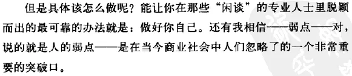
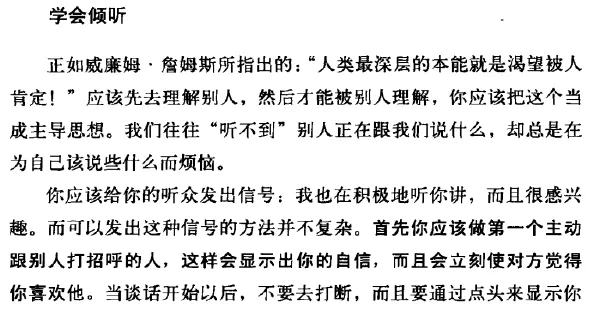
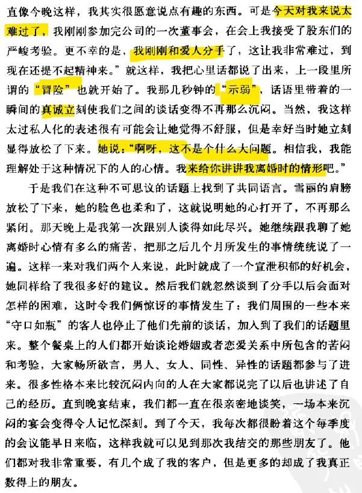
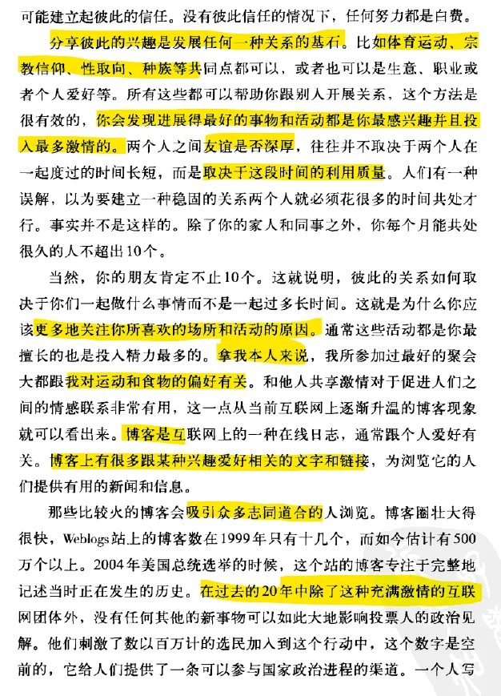
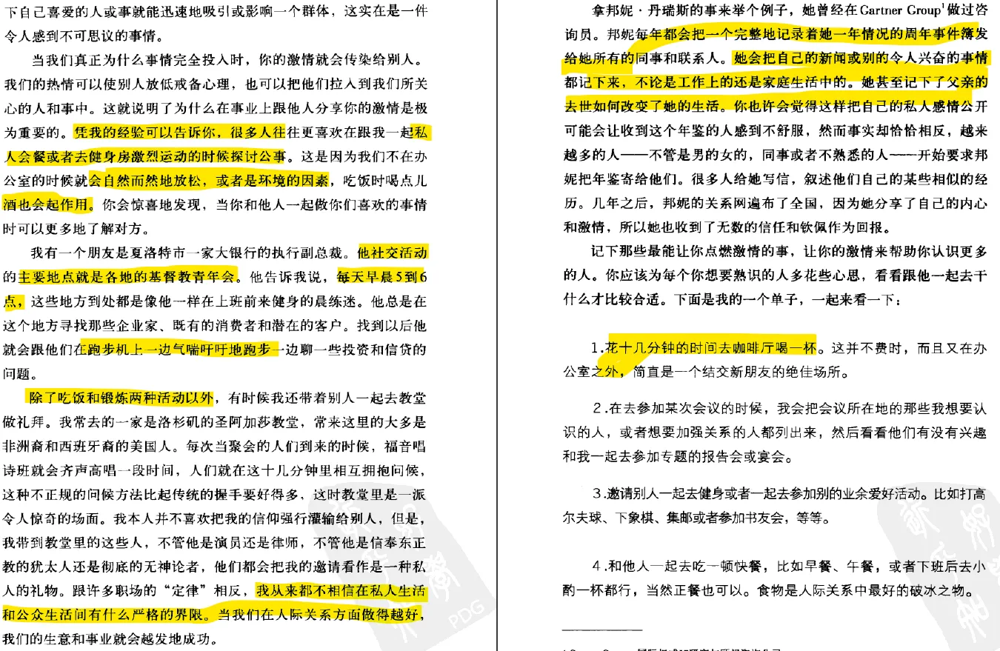
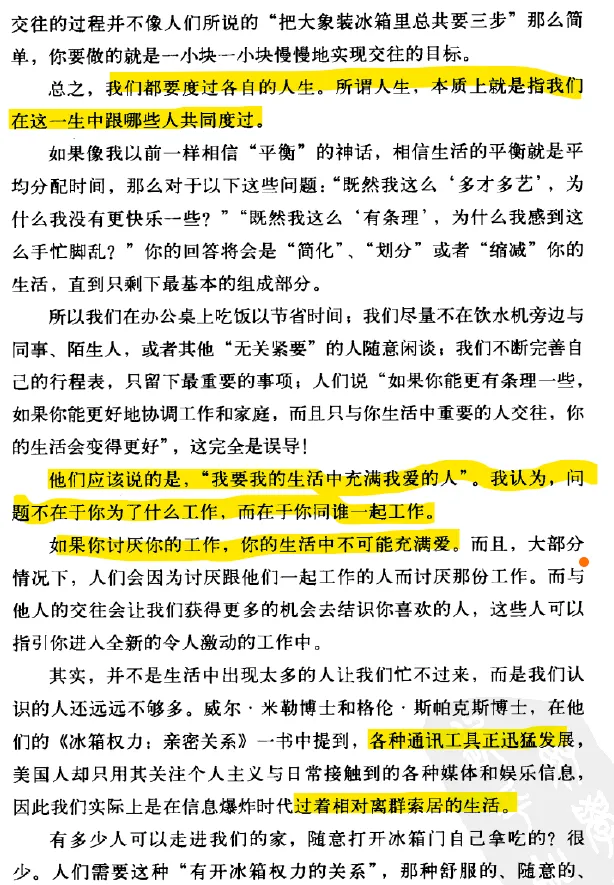
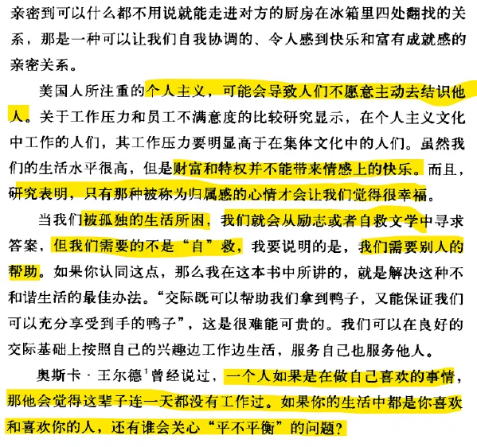
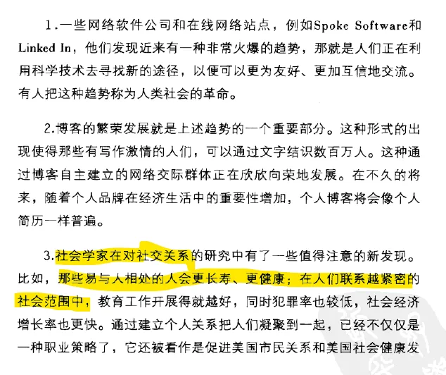

# my note

* 聚会不超过6-10人，不要同一圈子的
* 一定要youtuber——展示自己，反过来也会塑造自己
* 成功的人一定是口头流利的人
* 
* 

## chapter 12 share your passions

## chapter 30

要在各种事情中找到平衡，只能在童话里实现。

## chapter 41

# 【蜡翼·笔记】书中提到的30个小技巧

1. 成功的关键是慷慨大方：在社交中通行的不是贪图便利，而是慷慨大方。

2. 明确你的人生目标：**你的才能与渴望的交集就是你内心的激情。什么是你最兴奋的事？你做什么事时会觉得时间过得飞快？**

3. 为发展人际关系设定计划：打造交际网络是有过程的，你的计划应当包括以下三份：
     1. 你3年的目标，及每3个月的进度。

     2. 列出可以帮你实现每个目标的人。

     3. 如何与第2点中列出的人联系。一但你设立了目标，就贴在你经常看的到的地方。

4. 打造出你个人的“智囊团”：找到愿意尽责帮助你的有识之士。他们就是你的“智囊团”.

5. 在你需要前，打造好人际网络：要你发现要用到别人之前，就尽早的保持联系。重要的是把这些人当做是朋友，而不是潜在的客户。

6. 与你认识的人保持好联系：刚开始时，要关注于你当前人际网络中的人。

7. **乐于求助于别人：乐于索取可以创造出机遇。**你应当像乐于帮助别人一样，乐于向他人索取。记住，要做好别人说”不”的最坏打算。

8. 尊重别人：尊重每个人，不分高低贵贱。

9. 了解与你交往的人：如果你有足够了解你交往的人，可以深入他的领域专业，与之对话。你就能很容易得到赞赏。找到一个丰富而有深度的共同点，之后你们就能容易交往并能留下深刻的印象。

10. **了解其他人的兴趣**：爱屋及乌，你很快就会成为他们生活的一部分。

11. 决不独自用餐： **吃饭时非常易于轻松的交流。和别人一起吃，是交际的有效方法。**

12. 管理好你的信息：有效的信息管理非常重要。如果你有条理. 专注. 坚持，那没有人会离开你的交际网。

13. 列出清单：按自己的目标分类（如潜在客户. 潜在雇主等）整理出自己的列表。不仅要列出相关的单位，还要列出单位里有话语权的人。

14. 列出你已经认识的人：列出你已经认识的人：亲戚. 大学同学. 过去的同学. 之前的老师. 之前的同事…….

15. 利用别人的联系清单，补充自己的：他人的清单是你的资源。

16. 试着联系完全陌生的人（Cold Call）：当你需要给陌生人打电话时，你多少都会有些惧怕。只管硬着头皮。只想着自己会成功。去认识一个新人是挑战，也是机遇。

17. **坚持：**如果你与他人联系，别人没有回音。你要继续与他们联系。**你要占据主动。甚至是侵略性的。**

18. 联系有间接关联的人（Warm Call），用下面四条规则来
      1. 表达可靠性：提及相关的人或单位。

      2. 提出有价值：你能为他们做什么？

      3. 告知急迫性和便利性：大部分情况下，冷不防打电话的唯一目的就是预约见面。

      4. 准备好折衷的方案：开始时定位高些，留下商量的空间。

19. 把门卫看作盟友而非敌人：**门卫也应当受到尊重。不要去惹恼他们。**

20. **努力保持可见和活跃**：排满你的社交. 会议和事件日程。你必须在初创的朋友和关系网络中保持可见和活跃。

21. **分享你的激情：分享兴趣是任何关系的基础。当你确实对某些事感兴趣的时候，是很有感染力的.**

22. 强调时间质量：友谊建立在双方花费时间的质量上而非数量上。

23. 会议上花时间与人交流：会议总被人误解为是寻找见解的地方。错！会议只有一个好处：那就是提供一个场所来结交志同道合的人。

24. **做会议组织者：不要仅做参加者**；做组织者。**提前做好信息准备工作**：打算见谁，怎么见，在哪见。

25. **公开发言：发言是让别人记住你的最简单有效的方式之一。**

26. 与交际高手保持联系： 有一些人比我们认识的人多得多。这些人是各个网络的核心。你如果能和这些人交友。你与上千人的联系，就只要通过这一个人。

27. 与其他人交换人脉：扩大你朋友圈的最有效的方法就是把你的圈子与别人的圈子相连。

28. **做真实的自己：要让人印象深刻，与众不同是关键。要保证能与众不同，就要做真实的自己。做自己才有魅力。你的独特性是你的力量.**

29. 学会**利用非语言的沟通**：别人见到你，**只要10秒钟就可以下意识的决定是否会喜欢你。**这样的判断是基于非语言的沟通。

30. **一定要记住别人的名字：没有什么比自己的名字听起来更舒服的了。**

# 作者最后是这么说的：

>
> 我们不是为了搞人际关系而去交朋友，不断去结识朋友，它本身就是一种生活方式，所谓成功的人际交往其实就是以**另一种方式来看这个世界。**
>
>
> It's a way of living. I started to realize that connecting was actually a way of seeing the world.

# readingnote:

非常长，留给自己看吧。

1贫穷的真正可怕之处

.Poverty, I realized, wasn't only a lack of financial resources; it was isolation from the kind of people that could help you make more of yourself.

2.没有白手兴家之辈，没有人能脱离别人的帮助

There is no such thing as a "self-made" man. We are made up of thousands of others. Everyone who has ever done a kind deed for
us, or spoken one word of encouragement to us, has entered into
the make-up of our character and of our thoughts, as well as our
Success.

3.先付出后索取

You gain trust by asking not what people can
do for you, to paraphrase an earlier Kennedy, but what you can do
for others.In other words, the currency of real networking is not greed but generosity.

4.如何结识更多的人

Right now, there are countless ways you can begin to create the kind of community that can help further your career. You can: (1)create a company-approved project that will force you to learnnew skills and introduce you to new people within your company;(2) take on leadership positions in the hobbies and outside organizations that interest you; (3) join your local alumni club and spend time with people who are doing the jobs you'd like to be doing; (4) enroll in a class at a community college on a subject
that relates to either the job you're doing now or a job you see
yourself doing in the future

5.你去请求人家帮助，最坏的结果，只不过是NO。那你还怕什么？Every time I start to set limits to what I can and can't do, or fear
starts to creep into my thinking, I remember that Big Wheel tricycle.
I remind myself how people with a low tolerance for risk,
whose behavior is guided by fear, have a low propensity for success.The memories of those days have stuck with me. My father
taught me that the worst anyone can say is no. If they choose not
to give their time or their help, it's their loss.
Nothing in my life has created opportunity like a willingness
to ask, whatever the situation

6.冒险，则卓越。The choice isn't between success and failure; it's between choosing risk and striving for greatness, or risking nothing and being certain of mediocrity

7.别扯淡

Don't schmooze.
Have something to say, and say it with passion. Make sure you
have something to offer when you speak, and offer it with sincerity.

8.记住别人的名字，你就没什么人认识不到了

Remember, if you're organized, focused, and a stickler for taking
names, there's no one that's out of reach.

9.兴趣才是大家互相交往的最纯真动机

Shared interests are the basic building blocks of any relationshipIt is what you do together that matters, not how often you
meet. That's why you have to pay special attention to where you're
most comfortable and what activities you most enjoy.
Usually it's the events and activities you excel at that you're
most passionate about.

10.花时间交朋友也不要忘了你身边最重要的人

Of course, we all need to schedule the appropriate time
with friends and family as well, or just to read or relax. While
enriching your life to include others whenever and wherever you
104 Never Eat Alone
can, make sure you're not neglecting the key relationships in
your life.
When your day is fueled by passion, filled with interesting
people to share it with, reaching out will seem less like a challenge
or a chore and more like an effortless consequence of the way
you work.

11.要步步紧随，做好跟进方案

Do you want to stand out from the crowd? Then you'll be
miles ahead by following up better and smarter than the hordes
scrambling for the person's attention. The fact is, most people
don't follow up very well, if at all. Good follow-up alone elevates
you above 95 percent of your peers. The follow-up is the hammer
and nails of your networking tool kit.
In fact, FOLLOW-UP IS THE KEY TO SUCCESS IN ANY
FIELD.

12让跟进成为一种习惯

.Make follow-up a habit. Make it automatic. When you do,
the days of struggling to remember people's names—and of other
people struggling to remember yours—will be a thing of the
Past.

13.演讲是让人认识你最有效的方式

But there may be no better place to extend your professional
network and, on occasion, get deals done

14演讲的重要性

Listen. Better Yet, Speak.Calm yourself. First, you should know that giving speeches is
one of the easiest and most effective ways to get yourself, your
business, and your ideas seen, heard of, and remembered,

15做了准备工作，你知道每个人，你就牛逼了

.Be an Information Hub
Once you've created an opportunity to meet new people,
establish yourself as an "information hub"—a key role of any
good networker

16.休息时间就是你认识人的时间

Breaks Are No Time to Take a Break
Breaks are where the real work happens at a conference.
Make sure and stake out the right place.

17弱联系才是真正有价值的

.weak ties" are generally more important
than those you consider strong.

Your weak ties, on the other hand, generally occupy a very different
world than you do. They're hanging out with different people,
often in different worlds, with access to a whole inventory of
knowledge and information unavailable to you and your close
Friends.

18. 别他妈总是和同事扯淡，花时间结交不同的有趣的人吧！！

Hunt out people who look and act and
sound nothing like you do. Seek out ideas from people you don't
ordinarily talk to who inhabit professional worlds you don't ordinarily
travel in.In one word: Connect. In four better words: Connect with the
Connectors.

19.分享自己的圈子给其他朋友

The most efficient way to enlarge and tap the full potential of
your circle of friends is, quite simply, to connect your circle
with someone else's.

20分享圈子的作用

.If you are sharing someone else's circle of friends, be sure that
you adequately acknowledge the person who ushered you into
this new world, and do so in all the subsequent connections that
they helped foster.
Never forget the person who brought you to the dance.

21.搭讪的用处

As Harrell's study confirmed, the more successfully you use
language, the faster you can get ahead in life.
So what should your objective be in making small talk? Good
question. The goal is simple: Start a conversation, keep it going,
create a bond, and leave with the other person thinking

22.做你自己是最简洁的方式，不用烦。

When it comes to making an impression, differentiation is the
name of the game. Confound expectation. Shake it up. How?
There's one guaranteed way to stand out in the professional world:
Be yourself

23.帮助人家完成他的梦想！！

"What's Your Mission?" the
answer to "What do you really want?" determines all that you do
and all the people who help you accomplish it. It provides the
blueprint for all your efforts to reach out and connect with others.
Likewise, when you understand someone else's mission, you hold
the key to opening the door to what matters most to them. Knowing
that will help you create deep, long-lasting bonds.

24.记住这个宗旨，关联即每个人你见到的人都是一个能帮助你，或者你帮助人的机会

Connecting is a philosophy of life, a worldview. Its guiding principleis that people, all people, every person you meet, is an opportunity
to help and be helped

25.事业的本质。

This is far from a trivial question. Business is, after all, the ability
to motivate a group of individuals to move an idea from concept
to reality; to take a theory and make it a practice; to gain the
buy-in of your employees and colleagues; to encourage others to
execute your plans

26. 认可他人是最重要的。

The only way to get people to do anything is to recognize their
importance and thereby make them feel important. Every person's
deepest lifelong desire is to be significant and to be recognized.
What better way is there to show appreciation and to lavish
praise on others than to take an interest in who they are and what
their mission is?

27.财富，健康，子女，这三样是每个人最渴求别人能帮助的，若你能提供这三方面的帮助，别人感激不尽啊有木有

When you help someone through a health issue, positively
impact someone's personal wealth, or take a sincere interest in
their children, you engender life-bonding loyalty.

29不停介绍可以朋友可以双赢的机会

.I'm constantly introducing two people from different
parts of my life who might benefit from knowing each
other. It's a sort of ongoing puzzle, matching up the right people
and the right opportunities. Once you, too, start to see the world
this way, it opens up exciting opportunities. It's both rewarding
and fun.

30.如果要靠自己成功，你要两年。如果你努力帮助别人成功，那你成功则需两个月

To paraphrase Dale Carnegie: You can be more successful in
two months by becoming really interested in other people's success
than you can in two years trying to get other people interested
in your own success

31写作非常重要

.And writing articles can be a great boost for
your career. It provides instant credibility and visibility. It can
become a key arrow in your self-marketing quiver, creating relationships
with highly respected people and helping you develop a
skill that's always in high demand.

32.为什么我们要结交成功的人？

Why is it that we're so taken with the lives of big achievers? If
we measure our accomplishments against the accomplishments of
others, it stands to reason that the more accomplished the people
we associate with, the greater our aspirations become.
People who fit our conventional notions of fame and celebrity
often have qualities or skills that we admire. Many of these people
have achieved great things through risk, passion, focus, hard
work, and positive attitudes. And so many of them have overcome
so much.

33不管你以后成就有多大，你不能傲慢，特别是对你的老朋友，这没意思，随时感恩，别装逼，他们是你最好的老朋友

.Most important, I learned that arrogance is a disease that can
betray you into forgetting your real friends and why they're so
important. Even with the best of intentions, too much hubris will
stir up other people's ire and their desire to put you in your place.
So remember, in your hike up the mountain, be humble. Help
others up the mountain along with and before you. Never let the
prospect of a more powerful or famous acquaintance make you
lose sight of the fact that the most valuable connections you have
are those you've already made at all levels. I reach back into my
past regularly to touch base with the folks who have meant so
much to me since I was a kid. I go out of my way to tell the early
mentors what they meant to me and how much they were responsible
for my success today

34人际交往，是一种生活的方式

.It's a way of living. Several years ago, I started
to realize that connecting was actually a way of seeing the world.

.In the end, we all live one life. And that life is all about the
people we live it with.

36.如果我们每天都在和自己喜欢的人打交道，那么工作和生活根本没有界限，你每天都生活在爱当中，幸福死了！！

if a person did what he or she loved, it would feel as if they never worked a day in their life. If your life is filled with people you care about and who care for you,
why concern yourself with "balancing" anything at all?

# [值得读很多遍，反复读的书](https://book.douban.com/review/4933405/)

这篇书评可能有关键情节透露

了解一个人，最重要的是要了解他的身份，行业，个人爱好和成就，还有他面对的挑战。

思路：
真正的关系在于如何想办法让其他人更成功，在于努力地去付出而不是索取。你不能老靠“别人能为你做什么”赢得信任，靠的是“你能为别人做什么”。底线：最好先给予后索取。如果你慷慨行事，那么你将得到同样慷慨的回报。
与他人建立联系永远不会令人厌烦。虽然有时会很好时间，也可能会很费力气，但是永远不会让人感到无聊。你总是在不断地了解自身，了解他人。同时了解生意以及整个世界，而这感觉棒极了。
关系就像肌肉，你越使用，它就越强壮。

了解你的使命：

1. 寻找你的激情：

要寻找自己才能和梦想的交叉点，也就是“蓝色火焰”--激情和能力聚集的地方。当这“蓝色火焰”在心中点燃时，将会成为帮助你完成目标的强大动力。
---审视自我：把自己的梦想和目标列成一个表，然后在第二个列表中写出这些目标可以带给我的快乐，成就，以技能打动我的因素。然后把这两个列表连线，寻找交叉点，寻找那种实现目标的感觉。

2. 把目标记在纸上：

--- A. 致力于可以完成使命的目标的开发：i.列出今天起三年后想做到的成就； ii.以一年和三个月的间隔制定完成使命的中期、短期目标； iii. 在每个时间段制定一个A目标和一个B目标
  B. 将这些目标与能够帮助你完成这项任务的任务、地点、事物联系起来
  C. 帮你决定一个最佳方式，去接近那些可以帮你实现目标的人
目标标准：明确，可信，有挑战性并有需求，实现目标后再制定一个
目标制定方向：我的长处，弱点，在哪些行业有竞争能力，想结交哪些人
例子：
克林顿每天晚上把当天遇到的每一个人的名字和重要信息详细地分门别类地保存起来。（生活目标越明确，就越容易建立起一个关系网来达到目标；在跟别人交往时，要认真地去和对方建立一种真正的关系）

3. 知识是在社交活动中可能帮你获得好处的最有价值的东西。

阅读方法：
寻找热门的商业书籍，读完，把书里的见解总结一个简单的纲要，再把那些有趣的研究结果或者奇闻轶事记录下来，想办法和别人共享，这就是属于你的知识。
给别人教授知识就是你学习知识的最好方法，也是让你尽快成为专家的最佳途径。
如何言简意赅：
从自己讲的故事中找出三个重要而且有意思的亮点，然后用一种有特色的，快速而又容易记住的方式讲给别人听。

个人发展计划：
应该包括经常阅读书本报纸，多听教育讲座，每年参加三到五个行业大会，参加一两门培训课程，然后和所处领域内的大人物搞好关系。
保持健康：每周锻炼五次，每隔一个月给自己放五天的假期（还是可以读书），每周都要做一做思想功课，保持给自己充电。

如果有级别比你高的人帮助你，感激的方式是学以致用，让你的成功成为他们的成功。

未雨绸缪：
每个人都有一个圈子，里边有你的商业伙伴和良师益友，但是你必须在动用这些关系之前就把所有的人都紧紧团结住，未雨绸缪才是正道，临时抱佛脚是不行的。
勇敢些没什么不好的，最差的情况无非是被人家拒绝而已。如果你去求助的人不肯帮助你，那么其实失败的是他们。
建立交际圈的方法：

1. 找一个可以得到大家认同的事情并开始着手去做，要能让你学到新东西还要能帮你认识一群新朋友
2. 参加某项感兴趣的业余活动或组织，并成为其中的带头人
3. 参加本地校友会，多花些时间和那些从事你所感兴趣的行业的校友在一起，努力成为朋友

可以努力的方向：

1. 寻找一位榜样，他必须是左右逢源的，去接近他并模仿他
2. 学会说话：战胜自己胆怯心理，了解这是一种非常正常的反应，努力一点点克服。
3. 加入团体，并努力成为领导人
4. 做心理治疗，帮你释放自己的恐惧和社会压力

跟陌生人交流的对话模板：

1. 认清环境，明白自己的立场和论点
2. 感情交流，要懂得示弱
3. 告诉对方主要目的（自己要懂得自己的主要目的）

提问的时候要用对方不能简单回答的问题，比如“你觉得….怎么样啊”，“那么这个事情我们该怎么解决呢”，“我们是不是应该约个时间再好好地聊一下”
每次谈话的时候留下一个“未完待续”的议题，这样就相当于邀请别人来跟你一起为了某件事情而努力。

经典的错误：

1. 不要闲谈拉皮，交谈的时候要带着激情去谈，一定要言之有物。要确保你所说的话能够给对方带来有用的信息，然后还要用真诚的态度去讲。
2. 不要相信和散步小道消息，做人要直率真诚。
3. 善待那些位不及你的人，不要太过追求高效率，目标应该是专注地跟自己计划中的某一些人发展成真正的交往关系。

技巧：
有些问题对每个人都很重要：他在工作或者生活中有什么爱好，遇到了什么挑战，想要达到什么样的目标。如果要跟他人建立稳定的关系，还应该关注他所在企业的新情况，比如他在上个季度工作的好不好，或者他们公司有没有什么新产品。
具体做法：

1. 上互联网，核对一下他公司所在的网站
2. 看公司年报，了解公司的发展方向，还可以知道它面临的机遇或者挑战是什么（需要学习，还要了解自己所在的公司）

丘吉尔要做多少辛苦的准备和积累，才能妙语连珠（要阅读他的传记）。

列表格：
你的亲属
你朋友的亲属
你的伴侣的亲戚和朋友
目前的同事
专业机构或者社会团体里的好友
现有的和曾经你的客户
你家孩子朋友的父母亲
邻居，包括以前的现在的
过去的同学
以前的同事
以前的老师和老板
你社交圈里的朋友
为你提供服务的人
按地区，行业，活动爱好分类，或者分成一般的熟人和朋友，各种情况都行。还可以加入一个list，叫“我的野心”

电话热场：
态度：你必须想象自己想要成功就一定会成功，反正你总是要再什么地方认识别人，那么就该把这样的事当成一个机会，一次挑战。只要你这样想了，你心里竞争的那股热情就会被点燃，你就不会在社交活动中再羞于去大胆结识陌生朋友。
当你最终跟你要见的人联系上的时候，千万不要表现出你等得多么辛苦，这会让你前功尽弃的。每次要跟以前没有说过话的人打电话的时候，要尽量选择不一般的时候打给他，比如早上8点或者下午6点半。
热场法则：

1. 通过熟识的人或者组织来获取信任

----这样对方就会觉得跟你的交往不仅仅是要对你负责，也是要对你刚才提到的那个中间人或者组织负责。

2. 阐述一下与对方利益有关的事

----透漏一些信息以显示出我对其成功经历的极大兴趣，还有我为了了解对方做了很多准备

3. 告诉对方你方便和对方见面，时间可以根据对方的日程表安排（自己先提议一个）

----这是“对话”，要给对方回应的时间；电话的目的是把对方约出来

4. 准备好一个妥协的方案，以确保至少可以再继续联系

----可以留下一个妥协的空间。
对于看门人：
答谢他们的帮助，用一个电话，一束鲜花或者一条留言来表示感谢。
如果得不到帮助，坦率示弱的语气其实是一种警告，还要学会给对方台阶下。

永不独自用餐：
无论如何，不要从别人的视野里消失。
希拉里即使经历了非常丰富交际的一天，也会把工作人员叫到身边，跟他们笑谈一整天的事情，花1小时时间调整自己。
如果要跟一个以前不认识的人会面时，可以带上一个朋友一起去，这样就能保证会谈不是浪费时间。

分享彼此的激情是发展任何一种关系的基石。彼此的关系取决于你们一起做什么事情而不是一起过多长时间。当我们真正为什么事情完全投入时，激情就会传染给别人。跟许多职场定律相反，私人生活和公众生活之间并不存在严格的界限。当我们在人际关系方面做得越好，我们的生意和事业就会越发地成功。
点燃激情的单子：

1. 花十几分钟的时间去咖啡厅喝一杯
2. 去参加会议的时候，把所有想要认识，以及想要加强关系的人都列出来
3. 邀请别人一起去健身或者一起去参加别的业余爱好活动，或者参加一些特别的活动
4. 和别人一起吃一顿快餐，或者在家里请人吃饭，食物是最好的破冰之物。

要想在大批的人里脱颖而出，必须比其他人更聪明，必须步步紧随并吸引对方的注意。在认识某个值得认识的人的20小时以内，要动用“步步紧随”战术，要点如下：

1. 言简意赅地用邮件表达感谢之情
2. 要提一下上次会谈里有趣的事情，比如一个玩笑
3. 重提一下双方的约定，同样要记得与介绍人保持联系，应该让他知道双方会谈的进展，并对他表示感谢。

参加会议：
一个人如果在工作中能够演讲得越多，他的收入层次也就越高。
在最初的时候，可以从一些小的演说开始。参加会议的目的不是跟别人学什么新东西，任务是要去结识别人，让别人能够记住你。提问环节的时候，需要先介绍一下自己，告诉大家你在什么公司，做什么工作，然后再提问题，提的问题最好还和自己的经历有所联系，让后面能继续有话说。
对新认识的人，要简单记下谈话的内容，然后再为以后如何和这个人交往写一段小注释。在不同的场合，要根据情况强有力地介绍自己，告诉他们你想为他们做什么，能为他们带来什么。
不要成为下面的人：
跟屁虫：用不着非在会上这一段时间抓住哪个不放。开会期间应该尽可能多建立一些会有后续发展的关系。
眼神飘忽不定的人：如果你跟某人相处的时间只有短短的30秒钟，一定要在30秒里体现你的热情和真诚。

有关共享朋友圈子：
与别人共享朋友圈的时候，你和你搭档间的地位必须是平等的，付出和回报要成正比。
你一定要信任你的搭档，因为最终你还要确保他们与你的关系网所进行的接触是对你有利的。

闲谈：
想要有魅力其实很简单，那就是做好你自己。你的独特就是你的力量。我们与生俱来的独特足以使我们成为一个闲谈的高手。
无声的暗示：给对方一个发自真心的笑容，放松自己，听别人说话的时候微微点头，向对方靠近，并学会握手。
跟新认识的人见面时，一定要准备好一些可以谈的话题，要保持交流的连续性，要培养一种有意思的谈话基调。可以让话题直指一些你富有激情的爱好。谈话时不要独霸所有的时间，你要做的是分享激情，而不是去给对方说教。
每个人都可以吸引那些跟自己的心灵之窗差不多的人，所以见面时，要努力将自己的心灵之窗调整到和对方差不多大小，也就是，针对每个人去调整交谈的方式方法。
倾听的方法：

1. 主动打招呼，让人觉得你喜欢他
2. 通过点头显示你听的很投入，真诚地提一些问题，在别人讲笑话时笑
3. 一定不能忘记对方的名字

人们在世界上所有深刻的情感联系都是由三种事物来构建的，那就是健康，财富和子女。为了表达好意去做的其他任何事情，都不如从上述的三个角度去入手更为有效。

人际脉冲
如果想要对方记住你，必须让对方从不同的三个途径看到或听到你的名字。
发展关系的初期，一个月基本要联系一次。
一段普通的关系深入变成朋友的话，至少要与对方有两次在工作场合以外的交往活动。
对于不是第一等重要的联系人，一年至少联络两到三次。
每次外出，帮别人拍照片，然后回来发给别人，也是很有效的人际脉冲。或者跟别人分享自己深入研究的很多话题。关心每一个人的生日。

举办家庭聚会
一般邀请6-10个人是恰到好处的。一般都会有20-30%的人说时间安排不开，可以欢迎他们来分享饭后甜点。

1. 聚会要有主题
2. 提前一个月发出邀请
3. 不要一直呆在厨房里，宁可叫外卖
4. 不要安排情侣挨着坐

如果一个人的交际生活比较成功的话，他看世界的角度就会随之发生变化。人生比起追求的过程，更像一个织网的过程。我们把我们的努力编织起来，为了帮助他人找到他们的人生之路。在这个过程中我们找到了意义，爱以及内心的繁荣。我们所编织的关系成为一个优美的无穷尽的图案。

# [读滥书100本，不如读经典100遍](https://book.douban.com/review/4468093/)

​    人脉的重要性是放之四海而皆准的，更何况是在人口众多、潜规划较复杂的中国，你要办点什么事儿，里头或上头没人，那哪成？所以，对一个想把生活过得更舒服一点的人来说，人脉的价值和重要性，想必谁也无须对他多费口舌。那些涉世未深、没什么人脉的人费尽心思想经营自己的人脉，而那些已经有了自己人脉圈的人便想着如何巩固和扩大自己的人脉圈。
  于是，那些作者或写手或书商们，瞧准了这一点，普罗大众需要什么就生产什么。据我所知，在新华书店里像《人脉决定命脉》、《人脉决定成败》、《人脉即财脉》等这类图书的品种不下二十个，甚至有些连书名都是一模一样的，码在书堆中就卖将开来了，而且销量都还算不错。他们不敢保证自己的产品是最好的，但至少可以保证读者看了不会走火入魔。这就好比一位庸医，治不好你的病，也治不死你。就放心吧，天下庸医又不只是他一个。
  近日，书店空降下一个洋医生——《别独自用餐》，至于洋医生开的方子是否更凑效暂且不表。单从这本书的书名和封面包装来看，就很讨喜，一下子就与市场上其他的人脉学图书区别开来。让你很想翻开来看一看，究竟它有什么不同；甚或你会直接掏钱把这本书买回家，哪怕束之高阁也是一道景色。像这样的书，只要内容过得去，没有理由不叫卖。那么，外来的和尚究竟是不是更会念经呢？
首先可以肯定的是，《别独自用餐》是一本原创性的图书。作者从小时候给人当球童起，就发现了人脉的重要性，便不断地摸索和总结如何经营和提升自己人脉圈的方法。多年的摸爬滚打，使他终于从白手起家的穷小子，变成一颗美国商界璀璨的新星。他把自己如何与商场或政界中的风云人物交往的过程，用生动的笔调写了出来。读起来轻松活泼，不像国内某些用剪刀、糨糊攒起来的图书，大同小异、毫无趣味。
  本书给我最大的启发就在于，我们在和他人打交道时，该采用什么态度、方法和技巧，以达到我们想要的社交效果。我们都知道，中国有一部李宗吾写的《厚黑学》，差不多快被国人奉为成功学“圣经”。如果让我用一句话来概括《厚黑学》的话，那就是“为达目的，不择手断”，比方说你要像刘备一样厚脸皮，像曹操一样黑心肝。我们总爱说，“黑猫白猫，会抓老鼠就是好猫”。是的，在这样一种价值取向深入人心中时，人们在追求利益时的行为就会无所顾忌。什么尊严、人格、法律……统统抛诸脑后，因为我们只看结果。所以在求人办事、搭建人脉的时候，我们有足够的理由为自己的言行开脱，因而处处可见拍马溜须、行贿受贿。行贿者在行贿前还要琢磨受贿者的软肋与嗜好，使得自己行贿时能够冠冕堂皇、顺顺当当，如此，受贿者自然受之也心安理得。那些不愿同流合污的，回头看看大家莫不如此，再不随大流也就没法混了。可叹啊，我们国人有时活得真是忒累忒没劲了，就连自己小小的兴趣爱好要讳莫如深。
《别独自用餐》对我触动最深的就是，它让我们学会在经营自己的人脉圈时，不居高临下，也不低声下气，人与人之间的交流应建立在平等互利、自尊同时尊重他人的基础上。书中所有的社交技巧都是正面和健康的，不存在投机侥幸的心理。所以，如果让你选择是富有尊严地去拓展人脉，还是摇尾乞怜般地去拓展人脉？我想只要我们精神尚属正常，就会毫无疑问地选择前者。

至于书中所提供的那些案例与技巧，毋庸置疑，都很值得学习，以下摘录一小部分，仅供借鉴：

 
1、成功的关键是慷慨大方
在社交中通行的不是贪图便利，而是慷慨大方。
2、明确你的人生目标
  你的才能与渴望的交集就是你内心的激情。 什么是你最兴奋的事？你做什么事时会觉得时间过得飞快？
3、为发展人际关系设定计划
打造交际网络是有过程的，你的计划应当包括 以下三份： 　　

1. 你3年的目标，及每3个月的进度。 　　
2. 列出可以帮你实现每个目标的人。 　　
3. 如何与第2点中列出的人联系。 一但你设立了目标，就贴在你经常看的到的地方。

4、打造出你个人的“智囊团”
找到愿意尽责帮助你的有识之士。 他们就是你的“智囊团”.
5、在你需要前，打造好人际网络
 要你发现要用到别人之前，就尽早的保持联系。 重要的是把这些人当做是朋友，而不是潜在的客户。
6、与你认识的人保持好联系
 刚开始时，要关注于你当前人际网络中的人。
7、乐于求助于别人
乐于索取可以创造出机遇。你应当像乐于帮助 别人一样，乐于向他人索取。记住，要做好别人 说”不”的最坏打算。
 8、尊重别人
尊重每个人，不分高低贵贱。
9、了解与你交往的人
 如果你有足够了解你交往的人，可以深入他的 领域专业，与之对话。你就能很容易得到赞赏。 找到一个丰富而有深度的共同点，之后你们 就能容易交往并能留下深刻的印象。
10、了解其他人的兴趣
爱屋及乌，你很快就会成为他们生活的一部分。
11、决不独自用餐
吃饭时非常易于轻松的交流。和别人一起吃， 是交际的有效方法。
12、管理好你的信息
有效的信息管理非常重要。如果你有条理、 专注、坚持，那没有人会离开你的交际网。
13、列出清单
按自己的目标分类（如潜在客户、潜在雇主等） 整理出自己的列表。不仅要列出相关的单位， 还要列出单位里有话语权的人。
 14、列出你已经认识的人
列出你已经认识的人：亲戚、大学同学、过去的 同学、之前的老师、之前的同事…….
15、利0用别人的联系清单，补充自己的
他人的清单是你的资源。
16、试着联系完全陌生的人（Cold Call）
当你需要给陌生人打电话时，你多少都会有些 惧怕。只管硬着头皮。只想着自己会成功。 去认识一个新人是挑战，也是机遇。
17、坚持
 如果你与他人联系，别人没有回音。你要继续与他们联系。你要占据主动。甚至是侵略性的。
18、联系有间接关联的人（Warm Call），用下面四条规则来：
（１）表达可靠性：提及相关的人或单位。
（２）提出有价值：你能为他们做什么？
 （３）告知急迫性和便利性：大部分情况下， 冷不防打电话的唯一目的就是预约见面。
（４）准备好折衷的方案：开始时定位高些， 留下商量的空间。
19、把门卫看作盟友而非敌人
门卫也应当受到尊重。不要去惹恼他们。

20、努力保持可见和活跃
排满你的社交、会议和事件日程。你必须在初创的朋友和关系网络中保持可见和活跃。
 
21、分享你的激情
 分享兴趣是任何关系的基础。当你确实对某些事 感兴趣的时候，是很有感染力的。.
22、强调时间质量
友谊建立在双方花费时间的质量上而非数量上。
23、会议上花时间与人交流
会议总被人误解为是寻找见解的地方。错！ 会议只有一个好处：那就是提供一个场所来结交 志同道合的人。
 24、做会议组织者
不要仅做参加者；做组织者。提前做好信息 准备工作：打算见谁，怎么见，在哪见。
25、公开发言
发言是让别人记住你的最简单有效的方式之一。
26、与交际高手保持联系
有一些人比我们认识的人多得多。这些人是 各个网络的核心。你如果能和这些人交友。你与上千人的联系，就只要通过这一个人。
 27、与其他人交换人脉
扩大你朋友圈的最有效的方法就是把你的圈子 与别人的圈子相连。
28、做真实的自己
要让人印象深刻，与众不同是关键。要保证能 与众不同，就要做真实的自己。做自己才有魅 力。你的独特性是你的力量.
29、学会利用非语言的沟通
别人见到你，只要10秒钟就可以下意识的决定 是否会喜欢你。这样的判断是基于出语言的沟通。
30、一定要记住别人的名字
没有什么比自己的名字听起来更舒服的了。
实在还有很多的技巧，一下子无法尽述，正如书上的宜传语所说：“读100本人脉学滥书，不如读100遍《别独自用餐》。其实，哪怕读上一遍也受益匪浅。

作者菜菜

# [《别独自用餐》notes](https://book.douban.com/review/8456017/)

C1 要有自己的圈子
职业生涯的每一个阶段，都寻找周围最成功的人并寻求帮助和指导
真正的“关系“是想办法让其他人更成功，“付出”而不是“索取”
没有人可以孤军奋战，自己可以成为圈子的中心

C2 慷慨才是硬通货
热情把你的关系介绍给其他人，才能聚集成关系网
关系像肌肉，越用越强壮
总是问“我该怎么帮你呢”

C3 了解你的使命
网络行动计划
1、开发可以完成使命的目标（比如列出3年后的成就，然后退回来，制定中期短期目标，如半年、3个月）
2、将目标和能帮你完成任务的人物、地点、事物联系起来
3、决定最佳方式去去接近那些可以帮你的人

把目标告诉其他人，每个人都可能帮你
目标写下来

C4 未雨绸缪
动用关系前，必须把所有人紧紧团结住
交往之初要无私付出
立即建立社交圈，需要不断维护
时时刻刻都要想着发展人脉

C5 初生牛犊的天赋
演讲者就2种，要么在紧张，要么在说谎（马克吐温）
观察一个榜样如何和人交往

C6 莫当交际傻瓜
言之有物

C7 做好准备工作
人最深层的本性就是渴望被欣赏
不能和每个人都泛泛相处，因人而异去深度接触

C8 做个名单
想认识的人

C9 不要在电话里冷场
终于联系上对方，不要表现多么辛苦，也不需要为打扰抱歉
热场法则：通过熟人获得信任，说与对方利益相关的事

C10 搞定看门人

C11 别独自用餐

C12 分享激情
运动、食物

C13 步步紧随或一败涂地
保证给新认识的人留下好印象，让人记住名字
24小时内步步紧随战略，邮件（认识你很高兴，我们应该保持联系）

C14 成为会议突击手
参会目的是为了结识他人，让人记住你
尽量最先举手提问
举办聚会，让人互相认识
成为信息资源库，会让人想认识你
专注听人说话
示弱容易感染人，表达崇拜

C15 结识交际枢纽
记者、猎头、餐馆老板

C16 扩大交际范围
充分回报介绍人，新圈子交往时不能忘了介绍人

C17 闲谈的艺术
真心的笑容
目光交流70%-100%
不要独占谈话时间，主要是分享激情
主动和人打招呼

C18 健康，财富，子女
好的东西介绍给别人
每个人对你都是个机会

C19 如何从社交中获益
不仅仅关心自己的成功，也关心别人的

C20 不消失的人际脉冲
节日不是好时机，对方生日是

C21 找准贵宾，招待好他们
聚餐非常有社交影响力
和不同门类的人交往

C22 设法引起别人注意
说一些别人不知道的有内涵的事
给别人传授知识就是你学习知识的最好方法

C23 打造个人品牌
保证每项工作都有额外价值
不让简历万年不变
利用关系网内外的人为你的计划注入灵感和活力
每个人看到的是你表现出来的那一面，真正的你是什么样，很少人知道

C24 传播个人品牌
多曝光

C25 文笔

C26 结交名人
只有是人，都有快乐忧伤，希望忧虑

C27 功到自然成
新地方每认识个人，都要求介绍点朋友给我认识，或什么可加入的组织

C28 不要傲慢

C29 良师传道
成功的指导关系需要对等的互惠价值（辛勤工作或对导师忠诚）和感情

C30 兼顾四方都是胡说

C31 欢迎进入交际时代
人是社会动物

# [读书笔记Notes](https://book.douban.com/review/5095088/)

P4 “贫穷”绝不仅仅意味着缺钱，它更意味着你没有办法跟那些可以帮助你成功的人有任何联系。

P5 任何领域的成功，尤其是商界，都在于与人共事，而不是反对和提防。

与其他人来往可以使人们的生活有所变化，同时也是探索、了解并丰富自己生活的一种方式；这成为我在生活中积极去建立的一部分，与人分享我的知识、资源、时间、精力、朋友、伙伴，还有感情。

P13 把时间和精力投资在合适的人建立人际关系上，可以带来意想不到的收货。你帮助的人越多，你将会得到越多的帮助，然后你就能帮助更多的人。

P21 在一个相对新的知识领域和研究领域，才有机会成为一个专家，而且这个新领域将会有非常大的需求量，进而成为公司和商界最有影响和受尊重的思想家之一。

P36 第一，生活的目标越明确，就越容易建立起一个关系网来达到目标；第二，当你在跟别人交往的时候要认真地去和对方建立一种真正的关系。

P38 在公司做好本职工作是第一位的，挤出时间来处理工作以外的东西是你自己的事情。工作之余你才可以在现任老板所从事的行业之外有所关注，当然还要明白，如果你对某个行业的了解还没有积累到一定程度的话最好别出去单干，那样还不如守在原来的岗位上发展的好。

P41 各种明确而清晰的关系背后其实有很多暗藏的未被人发现的机遇被你忽视了。实际上，你所拥有的潜在人际关系要比你自己所能意识到的大得多得多。

P45 勇敢是一种神奇的天赋，即使表达善意也需要这样的勇敢。人不应该畏惧冒险，人的行动不应该由“担心”来左右，因为你越胆小，成功离你也越远。

P57 跟别人联络感情并不是玩数字游戏，不要求你一次完成多少目标。你的目标应该是专注地跟自己计划中的某一些人发展成真正的交往关系。

P74 在你的名单里还可以加入一个分类，叫“我的野心”。记下一些有趣或者成功的高层人士，而这些人的共同点就是他们跟我目前的生意还没有直接的联系。

P79 电话热线法则：
（1） 通过共同熟识的人或者组织来获取信任；
（2） 阐述一下与对方利益相关的事；
（3） 告诉对方你方便和对方见面，时间地点可以根据他的日程来安排；
（4） 准备好一个妥协的方案，以确保至少可以再继续联系。

P98 记下那些最能让你点燃激情的事，让你的激情来帮助你认识更多的人。
（1） 花十几分钟的时间去咖啡厅喝一杯。这并不费事，而且是在办公室之外结交新朋友的绝佳场所。
（2） 在去参加某此会议的路上，会把会议所在地那些我想要认识的人，或者想要加强关系的人都列出来。
（3） 邀请别人一起去健身或者一起去参加别地业务爱好活动。
（4） 和他人一起去吃一顿早餐或者午餐。食物是人际关系中最好的破冰之物。
（5） 邀请别人去参加一些特别的活动。
（6） 在家里请人吃饭。

P101 要想从大批的人里面脱颖而出，必须比其他人更聪明，必须步步紧随并吸引别人的注意。如果你能做到，你就会超过95%的竞争对手。

# [【行者】法拉奇的“七伤拳”](https://book.douban.com/review/6669046/)

这本书，我认真阅读了，也认真尝试了。我发现，这真是一种生活方式。

根据这本书的做法成为你的朋友的人，基本上是和法拉奇一类的人。不是和法拉奇一类的人，用这种办法只能让他们离你远去。

或者我们可以用这本书作为试金石，寻找志同道合的人——那些真诚地想扩大自己社交圈的人。那些想用这种方式真诚对待生活的人。

经历了几次失败后，我又重头来读这本书。我发现了许多人，他们一直存在，但是一直没有发言。作者没有让他们发言，因为作者知道，他们和自己不是一类人。

作者让我们看到的，不过是“物以群分，人以类聚”的结果。作者的生活，其实就是在无尽的人海中发掘和自己志同道合的人，并且乐此不疲。

说句实话，作者的成功率并不高；作者找到的未见得是我们想找到的。如果你试图用同样的办法去接触自己喜欢的人，你会失望的。除非你想改变自己，变成和法拉奇一样的人。

金庸曾经描述过一种拳术：七伤拳。七伤拳是很有意味的一种拳术，掌握了它的人可以同时发出或刚猛或阴柔的不同劲力，摧伤敌人脏腑，拳力复杂，吞吐闪烁，变幻万端，威力惊人。但这神妙凶恶的武功，伤敌力强，伤己也重，每练一次，内脏便受一次损伤，“一练七伤”，“先伤己，后伤敌”。若内功不够雄厚充沛，万不可练，否则摧肝损肺，令人狂性大发，不可自制。

提醒一句，学习这本书可能换来人脉，但是，首先你会失去你的旧友。因为你将离开一种生活方式，同时，也就离开了你现有的朋友圈。

这本书的确很强大，但是，它就是一种七伤拳。每练一次，你可能就会失去一个旧友。如果你心理不够坚强，万不可练，否则摧肝损肺，令你悲不自胜，了无生趣。即便修炼成功，你也只会感叹——便纵有、千种风情，更与何人说。