[INTRODUCTION
介绍]()

[Start by ignoring everything
从忽略一切开始]()

[COMPOSITION
作品]()

[Leading lines
引导线]()

[Landscape or portrait
横向或纵向]()

[Framing
框架]()

[Foreground interest
前景兴趣]()

[Getting close
越来越近]()

[Symmetry
对称]()

[The rule of thirds
三分法则]()

[Working the frame
框架工作]()

[Visual weight
视觉重量]()

[Breaking the rules
打破规则]()

[EXPOSURE
接触]()

[Modes
模式]()

[‘Program’ mode
“程序”模式]()

[Shutter speed and ‘Shutter Priority’
快门速度和“快门优先”]()

[Slow shutter speeds
慢速快门]()

[Slow shutter speeds at night
夜间快门速度较慢]()

[Fast shutter speeds
高速快门]()

[Aperture and ‘Aperture Priority’
光圈和“光圈优先”]()

[Shallow depth of field
浅景深]()

[Deep depth of field
深景深]()

[ISO]()

[‘Manual’
'手动的']()

[Exposure compensation
曝光补偿]()

[LIGHT
光]()

[Hard light
硬光]()

[Soft light
柔和的灯光]()

[Hard light (**continued**)
硬光（**续**）]()

[Soft light (**continued**)
柔和的灯光（**续**）]()

[Hard light (**continued**)
硬光（**续**）]()

[Soft light (**continued**)
柔和的灯光（**续**）]()

[Natural and artificial light
自然光和人造光]()

[White balance
白平衡]()

[Inbuilt flash
内置闪光灯]()

[Fill flash
填充闪光灯]()

[LENSES
镜头]()

[Lenses made easy
让镜头更简单]()

[Wide angle / short focal length
广角/短焦距]()

[Telephoto / long focal length
远摄/长焦距]()

[Standard focal length
标准焦距]()

[Prime lenses
定焦镜头]()

[Macro photography
微距摄影]()

[SEEING
看见]()

[Decisive moments
决定性时刻]()

[The dangers of perfection
完美的危险]()

[Unexpected beauty
意想不到的美丽]()

[The world unobstructed
世界畅通无阻]()

[A different point of view
不同的观点]()

[The good from the bad
好与坏]()

[How to capture **the shot**
如何**拍摄**]()

[One subject, one shoot
一个主题，一次拍摄]()

[The importance of intrigue
阴谋的重要性]()

[The power of a project
项目的力量]()

[That extra something
额外的东西]()

[APPENDIX
附录]()

[Troubleshooting
故障排除]()

[Index
指数]()

[Credits
致谢]()

[Acknowledgements
致谢]()

***\*Start by ignoring everything\****
***\*从忽略一切开始\****

Look, here’s a drawing of your camera:
看，这是你的相机的图画：

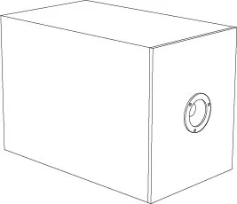

OK, so your camera doesn’t look much like this one, but they both work in exactly the same way. Yours just looks more complicated.
好吧，你的相机看起来和这个不太一样，但它们的工作原理完全相同。你的看起来更复杂。

A lot of new stuff has been added to cameras over the years. Some of these additions are quite handy, but a lot of them aren’t. This book will teach you about the handy ones – the ones that actually work and give you all the creative freedom you need to take great photographs.
多年来，相机中增加了很多新功能。其中一些功能非常方便，但很多功能并不方便。本书将教您如何使用这些方便的功能 - 即真正有用的功能，它们可以为您提供拍摄精彩照片所需的所有创意自由。

This isn’t a textbook and I’m not going to use graphs and camera-club jargon to explain the fundamentals of photography. You don’t need to know all that. In fact, when you’re starting out, it only gets in the way and stops you being creative.
这不是一本教科书，我不会用图表和摄影俱乐部的术语来解释摄影的基本原理。你不需要知道所有这些。事实上，当你刚开始的时候，这些只会妨碍你发挥创造力。

Instead, this book contains the work of inspirational photographers past and present. Through looking at their pictures you’ll understand their ideas and techniques and learn how to put them into practice yourself.
相反，这本书收录了过去和现在的摄影师的励志作品。通过观看他们的照片，你将了解他们的想法和技巧，并学习如何将它们付诸实践。

***\*You’ll see that taking great pictures is less about technical knowhow and much more about mastering that most valuable piece of kit – your eyes.\****
***\*您会发现，拍出好照片并不仅仅取决于技术知识，更重要的是掌握最宝贵的装备——您的眼睛。\****

But for now, try to remember that no matter how unnerving all the buttons, symbols and dials may seem, your camera is just a box with a hole in it. Whether it cost a few pennies or a few grand, that’s all there is to it.
但现在，请试着记住，无论所有的按钮、符号和拨盘看起来多么令人不安，你的相机只是一个有洞的盒子。无论它花费几便士还是几千美元，它都只是个东西。

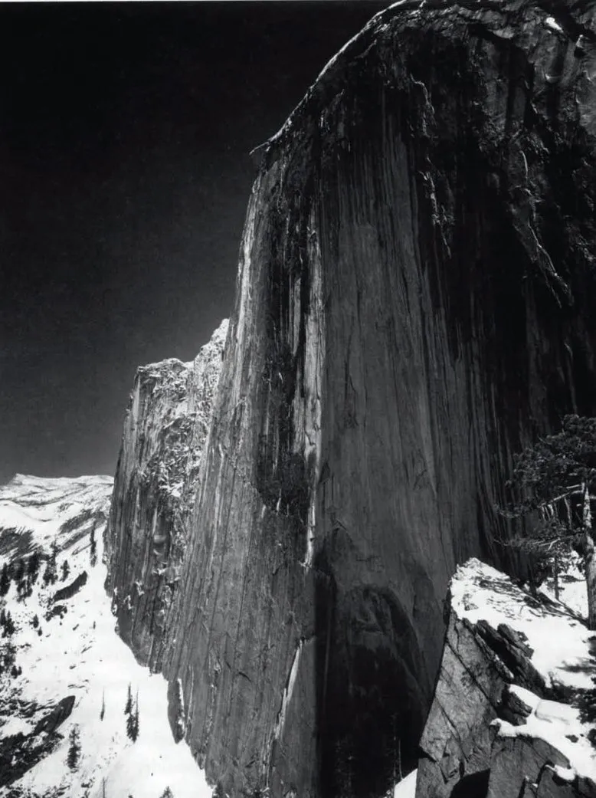

**Monolith**, The Face of Half Dome,
**巨石**，半圆顶的表面，

Yosemite National Park, California
加利福尼亚州优胜美地国家公园

Ansel Adams
安塞尔·亚当斯

1927

COMPOSITION
作品

## ***\*‘You don’t take a photograph, you make it’\**** ***\*“你不是在拍照，而是在创造照片”\****

(Ansel Adams)
（安塞尔·亚当斯）

There are 50 different photographers featured in this book. They’re a mixed bunch, each with their own styles, interests and ways of doing things. Put them in a room together and it might get heated.
本书介绍了 50 位不同的摄影师。他们各有特色，风格各异，兴趣各异，做事方式各异。把他们放在一个房间里，可能会很热闹。

But, eclectic as they are, there’s something they all have in common. It’s their shared appreciation for one of the most important aspects of photography – composition.
但尽管他们风格迥异，却都有一个共同点。那就是他们对摄影最重要的方面之一——构图的理解。

## ***\*Think of composition as the foundations of your image. And just like those of a building, foundations need to be strong.\**** ***\*将构图视为图像的基础。就像建筑物的基础一样，地基需要坚固。\****

Composition is all about how you choose to order the visual elements in your picture. It’s slippery and subjective, and often something you have to feel rather than calculate. But don’t let this talk of feeling make you nervous, as I’m about to show you some fundamental techniques to help get you started.
构图就是你如何选择排列图片中的视觉元素。它很不确定，也很主观，而且通常需要你用心去感受，而不是计算。但不要因为谈论感觉而感到紧张，因为我将向你展示一些基本技巧来帮助你入门。

These techniques are the ones that great photographers use time and time again. They’re also the ones that will instantly make your pictures come alive.
这些技巧是伟大的摄影师反复使用的。它们也能让您的照片瞬间变得生动。

***\*Leading lines\****
***\*引导线\****

***\*Look for the leading lines\****
***\*寻找引导线\****

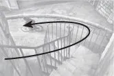

***\*For other examples:\****
***\*其他示例：\****

Alkan Hassan p. 21
Alkan Hassan 第 21 页

Luca Campigotto p. 38
Luca Campigotto 第 38 页

Joel Sternfeld p. 68
Joel Sternfeld 第 68 页

Jeanloup Sieff p. 88
Jeanloup Sieff 第 88 页

Great compositions take you on a journey. Your eyes are guided around the image on a specific path, leading to where the photographer wants to take you.
出色的构图会带你踏上一段旅程。你的眼睛会沿着特定的路径环视图像，到达摄影师想要带你去的地方。

Here, Henri Cartier-Bresson has taken a simple scene and created something beautiful. Instantly the strong, downward point of view makes us feel like we’re falling into the composition. Soon our eyes latch onto the foreground railings and descend down the steps. As the railings bend to the left, the kerb becomes more dominant. Only then do we arc around to reach the subject – a man racing past on a bike.
在这里，亨利·卡蒂埃-布列松用简单的场景创造出了美丽的画面。强烈的向下视角瞬间让我们感觉自己陷入了构图中。很快，我们的目光就锁定在前景栏杆上，并走下台阶。随着栏杆向左弯曲，路缘石变得更加突出。只有这时，我们才会转过身来看到拍摄对象——一个骑着自行车飞驰而过的男人。

This tightly controlled visual journey is called a ‘leading line’ and photographers love them.
这种严格控制的视觉旅程被称为“引导线”，摄影师非常喜欢它们。

***\*Use leading lines to give your composition structure and draw the viewer to key elements.\****
***\*使用引导线来构建你的构图结构并吸引观众注意关键元素。\****

One main leading line is often all you need and they’re at their most powerful when they sweep in from the edge of the frame.
一条主引导线往往就是您所需要的，当它们从画面边缘扫入时，其威力最大。

If you keep your eyes peeled you’ll find leading lines everywhere, from the converging rails of a train track, to the branch of a tree or the cracks in a rock face – and don’t be shy about making these lines very overt in your image.
如果您留心观察，您会发现到处都有引导线，从火车轨道的汇合轨道到树枝或岩壁的裂缝——不要羞于在图像中将这些线条表现得非常明显。

In this case, Cartier-Bresson makes our eyes travel in a slingshot motion around the image to heighten its very essence – movement.
在这种情况下，卡蒂埃-布列松让我们的眼睛以弹弓运动的方式在图像周围移动，以增强其本质——运动。

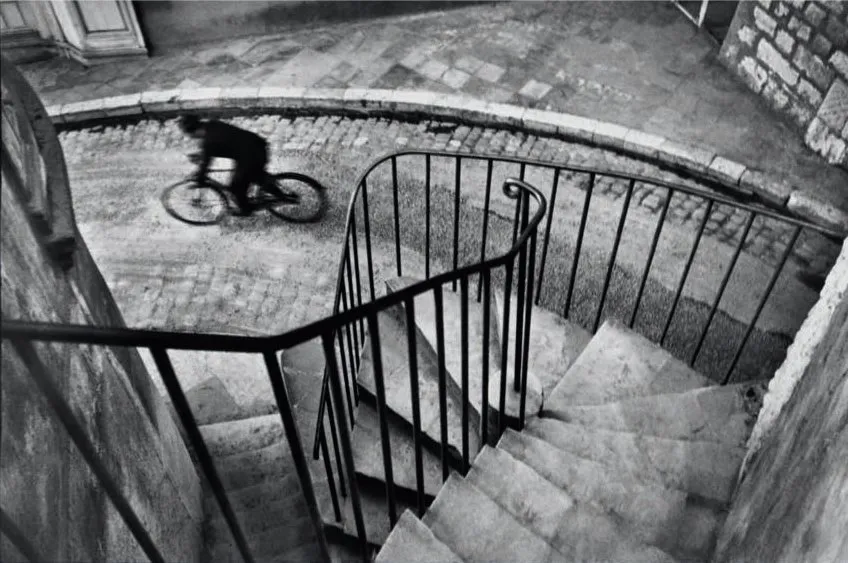

The Var department.
Var 部门。

Hyères. France
耶尔。法国

***\*Henri Cartier-Bresson\****
***\*亨利·卡蒂埃-布列松\****

1932

***\*Landscape or portrait\****
***\*横向或纵向\****

***\*The shape of things\****
***\*事物的形状\****

***\*For other examples:\****
***\*其他示例：\****

Cristina Garcia Rodero p. 15
克里斯蒂娜·加西亚·罗德罗 p. 15

Elaine Constantine p. 81
Elaine Constantine 第 81 页

Youngjun Koo p. 96
Youngjun Koo 第 96 页

Dorothea Lange p. 115
Dorothea Lange 第 115 页

It’s not just the lines in your image that dictate how our eyes move across it. The shape (or format) is just as important.
决定我们的眼睛如何移动的不仅仅是图片中的线条。形状（或格式）也同样重要。

***\*Horizontal pictures (or landscape format) encourage our eyes to move from side to side. Vertical pictures (or portrait format) make them move up and down.\****
***\*水平图片（或横向格式）鼓励我们的眼睛左右移动。垂直图片（或纵向格式）则鼓励我们的眼睛上下移动。\****

Choosing the format has nothing to do with whether you’re shooting landscapes or portraits. Instead, try to match the format of your picture to the dominant lines – or natural flow – of your subject. This means the shape of your picture and the subject matter will work together to guide the eye in one clear direction.
选择格式与拍摄风景还是肖像无关。相反，请尝试将图片格式与拍摄对象的主导线条（或自然流动）相匹配。这意味着图片的形状和主题将共同引导视线朝一个明确的方向。

In this photograph by Marc Asnin the landscape format prompts our eyes to glide from left to right along the undulating line of heads. It’s a busy scene, but the landscape format creates order by drawing out this leading line, which in turn communicates the acute sense of drama.
在 Marc Asnin 拍摄的这张照片中，风景画促使我们的目光沿着起伏的头部线条从左向右滑动。这是一个忙碌的场景，但风景画通过绘制这条引导线创造了秩序，这反过来又传达了强烈的戏剧感。

Look at the Ansel Adams image on page 8 and see how the portrait format accentuates the hanging weight of the monolithic rock face. The gravity of the lines works in tandem with the vertical shape of the image, making our eyes sink from top to bottom.
看看第 8 页的安塞尔·亚当斯 (Ansel Adams) 图像，看看肖像格式如何突出巨石表面的悬垂重量。线条的重力与图像的垂直形状协同作用，使我们的视线从上到下沉。

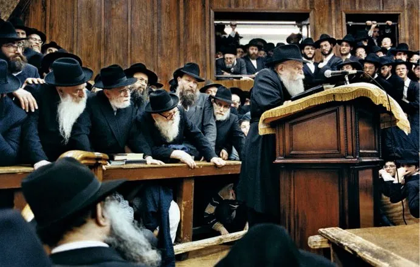

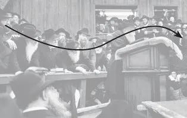

**The Rebbe**
**拉比**

***\*Marc Asnin\****
***\*马克·阿斯宁\****

1992

***\*Framing\****
***\*框架\****

***\*Think inside the box\****
***\*在框架内思考\****

***\*For other examples:\****
***\*其他示例：\****

Martin Parr p. 18
马丁·帕尔 第 18 页

Ernst Haas p. 37
恩斯特·哈斯 第 37 页

Denis Darzacq p. 53
丹尼斯·达扎克 第 53 页

Like the post-apocalyptic film **Mad Max**, in this image teenagers rule the world, running free across desert plains fuelled by one hedonistic fix after another.
就像世界末日题材的电影**《疯狂的麦克斯》**一样，在这幅画面中，青少年统治着世界，他们在沙漠平原上自由奔跑，享受着一次又一次的享乐主义。

Photographing during Nevada’s Burning Man festival, Cristina Garcia Rodero finds order in an otherwise anarchic scene through the use of framing. Here, our eyes initially bypass the hoards occupying the van and hone in on the leaping figure framed by a hoop.
在内华达州火人节期间拍摄的照片中，克里斯蒂娜·加西亚·罗德罗通过构图，在一个混乱的场景中找到了秩序。在这里，我们的目光首先绕过了货车上的人群，聚焦在被铁环框起来的跳跃的身影上。

***\*Framing draws attention to a particular part of your composition. It’s especially handy if you’re shooting a busy scene.\****
***\*取景会将注意力吸引到构图中的某个特定部分。如果你正在拍摄一个繁忙的场景，它尤其有用。\****

Look for doorways, windows and openings – anything that might help to focus attention on a particular part of your composition. But framing is a powerful tool, so don’t just frame any old thing. Find subjects that are worth putting a frame around. Think of it as creating a photograph within your photograph.
寻找门、窗和开口——任何可能有助于将注意力集中在构图特定部分的东西。但框架是一种强大的工具，所以不要只用框架来框住任何旧东西。寻找值得用框架框起来的物体。把它想象成在你的照片中创造一张照片。

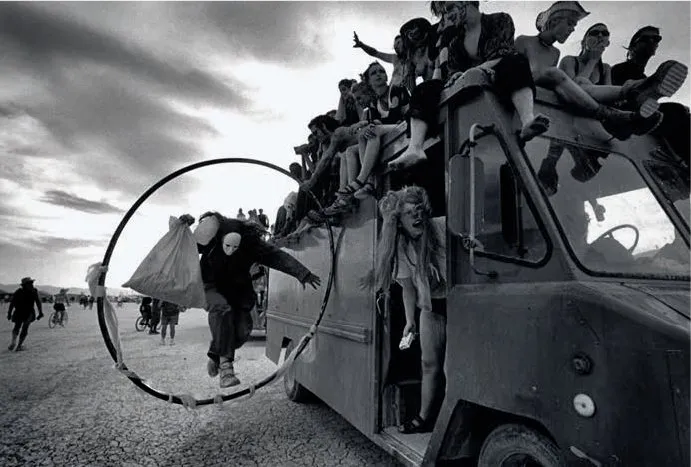

Burning Man Festival,
火人节，

Black Rock City. Nevada, USA
黑岩城。美国内华达州

***\*Cristina Garcia Rodero\****
***\*克里斯蒂娜·加西亚·罗德罗\****

1999

***\*Foreground interest\****
***\*前景兴趣\****

***\*The layered look\****
***\*分层外观\****

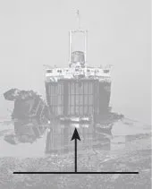

***\*For other examples:\****
***\*其他示例：\****

Henri Cartier-Bresson p. 11
亨利·卡蒂埃-布列松 第 11 页

Joel Sternfeld p. 68
Joel Sternfeld 第 68 页

Landscape photographers are especially picky. They don’t simply plonk their tripods anywhere. They hunt around for just the right spot. And it’s not a case of **around about here** will do, it’s a case of **exactly** here.
风景摄影师尤其挑剔。他们不会随便把三脚架放在任何地方。他们会四处寻找合适的位置。这不是说**这里附近**就可以了，而是说**正好**在这里。

In this image by Edward Burtynsky the subject is a rusting container ship. But the composition has a few more layers to it than that. Look at the textured mud in the very foreground, which leads us into the reflection and then up to the subject. This foreground mud isn’t there by chance. Burtynsky positioned himself to make this an essential part of the composition. It’s what’s called ‘foreground interest’.
爱德华·伯廷斯基的这幅作品中，主体是一艘生锈的集装箱船。但构图却不止于此。看看最前景中的纹理泥浆，它将我们引向倒影，然后引向主体。前景泥浆并非偶然出现。伯廷斯基将自己定位为构图的重要组成部分。这就是所谓的“前景趣味”。

***\*Foregound interest offers the viewer a stepping stone into your image and heightens its sense of depth.\****
***\*前景兴趣为观众提供了进入图像的垫脚石，并增强了其深度感。\****

Here, without the foreground interest, our eyes would feel too separated from the middle distance and background, and the image would lose its sense of depth. Cover the foreground area with your hand and you’re suddenly stranded, forced to make a visual leap of faith across a murky expanse of water.
在这里，如果没有前景，我们的眼睛会感觉与中景和背景相距太远，图像会失去深度感。用手遮住前景区域，你就会突然陷入困境，被迫在一片浑浊的水面上进行视觉飞跃。

When shooting landscapes, it’s easy to fixate on the big vistas, but always keep an eye on what’s going on immediately around you. Often what’s right at your feet holds the key to a crafted composition.
拍摄风景时，很容易将注意力集中在大视野上，但始终要留意周围发生的事情。通常，脚下的事物是构图的关键。

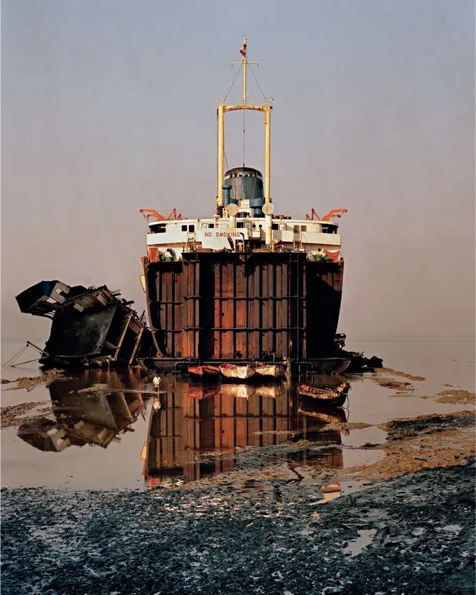

**Shipbreaking #31**,
**拆船#31** ，

Chittagong, Bangladesh
孟加拉国吉大港

***\*Edward Burtynsky\****
***\*爱德华·伯汀斯基\****

2001

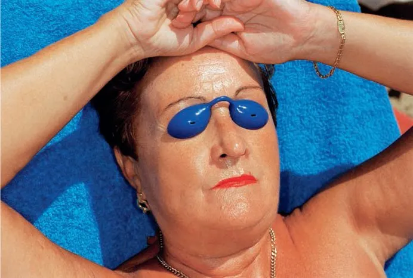

Benidorm, Spain
西班牙贝尼多姆

***\*Martin Parr\****
***\*马丁·帕尔\****

1997

***\*Getting close\****
***\*越来越近\****

***\*Get close.\****
***\*靠近点。\****
***\*And then get closer.\****
***\*然后靠近一点。\****

***\*For other examples:\****
***\*其他示例：\****

Shikhei Goh p. 98
Shikhei Goh 第 98 页

Risking thumps, shouts and dirty looks, Martin Parr is a photographer who often gets uncomfortably close to his subjects. By doing so, Parr draws our attention to the small but telling details, which would be lost in a wider composition.
马丁·帕尔是一名摄影师，他经常冒着被拍、被喊和被白眼的风险，与拍摄对象保持着亲密的距离。这样一来，帕尔就能让我们注意到那些微小但有说服力的细节，而这些细节在更宽广的构图中可能会被忽略。

Here, by getting in close and filling the frame with the subject, the photographer forces us to notice the subtleties that make this image so peculiar: the scarlet lipstick on those slightly pursed, dissatisfied lips; the gold jewellery; those oval goggles with the lizard-like eyeholes. All these details mean you can’t help but form an opinion of this woman – welcome to Benidorm!
在这里，摄影师通过近距离拍摄并将拍摄对象填满画面，迫使我们注意到使这张照片如此独特的细微之处：略微撅起、不满的嘴唇上涂着猩红色的口红；金首饰；带有蜥蜴眼孔的椭圆形护目镜。所有这些细节都意味着您不得不对这个女人形成看法——欢迎来到贝尼多姆！

***\*Very often, nothing kills an image more than keeping your distance.\****
***\*很多时候，没有什么比保持距离更能破坏形象了。\****

By getting in close – really close – and filling the frame with your subject, you’ll communicate that single, allimportant observation that captured your interest in the first place.
通过靠近——非常近——并让拍摄对象填满画面，您将传达最初引起您兴趣的那个单一而重要的观察结果。

So why not just stand further back and give the image a cheeky crop afterwards? Think of cropping as a fine tuner rather than a way of fundamentally altering your image. It’s important that Parr puts himself in the line of fire to get the shot. If he didn’t, his pictures would lose their humour and start to feel too underhand.
那么，为什么不站得更远一些，然后对照片进行一些巧妙的裁剪呢？将裁剪视为一种微调，而不是从根本上改变图像的方式。帕尔必须置身于火线中才能拍摄出照片。如果他不这样做，他的照片就会失去幽默感，并开始让人觉得太过卑鄙。

***\*Symmetry\****
***\*对称\****

***\*It’s a primal instinct\****
***\*这是一种原始本能\****

***\*For other examples:\****
***\*其他示例：\****

Sebastião Salgado p. 45
塞巴斯蒂安·萨尔加多 第 45 页

Apollo 17 p. 113
阿波罗 17 号第 113 页

Dorothea Lange p. 115
Dorothea Lange 第 115 页

Few could argue with the simple beauty of symmetry. It’s something that has universal appeal, satisfying our primal need for order.
很少有人会质疑对称的简单之美。它具有普遍的吸引力，满足了我们对秩序的原始需求。

Alkan Hassan instantly draws us into his composition through symmetry. The man is positioned right in the middle of the frame while the lines of the buildings draw our eyes into him like the triangle of a sealed envelope.
Alkan Hassan 通过对称性立即将我们吸引到他的构图中。男人正好位于画面中央，而建筑物的线条就像一个密封信封的三角形一样吸引着我们的目光。

***\*Symmetry isn’t simply a case of composing your image like an ink blot. It’s about creating an overall sense of harmony and balance.\****
***\*对称性并非简单地像墨迹一样构图。它旨在营造一种整体的和谐感和平衡感。\****

The symmetry here reflects the state of mind of the subject. There’s nothing anxious about him. Whatever or whoever he’s waiting for, he seems totally calm and at peace with the world. It’s an image of utter tranquillity in the built environment.
这里的对称性反映了主体的心理状态。他没有任何焦虑。无论他在等什么或等谁，他看起来都非常平静，与世界和平相处。这是一幅建筑环境中绝对宁静的画面。

Placing your subject in the middle of the frame is a good way to create symmetry. Just be warned: there’s a fine line between balance and boring. If everything is too perfectly mirrored, an image can feel a little soulless. Allow the human elements to creep in. The little things that draw our attention without upsetting the balance. Imagine this image without that bag – everything might start to feel a little too perfect. A little too phony.
将拍摄对象置于画面中间是创造对称感的好方法。但要注意：平衡与无聊之间只有一线之隔。如果一切都过于完美地镜像，图像会让人感觉有点缺乏灵魂。允许人性元素悄悄出现。这些小细节会吸引我们的注意力，但不会破坏平衡。想象一下没有那个包的照片——一切可能都会开始让人感觉有点太完美了。有点太虚假了。

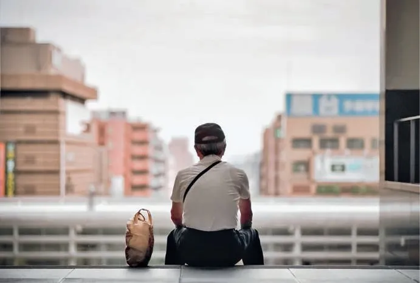

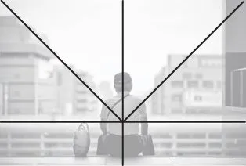

**Above the City**
**城市上空**

***\*Alkan Hassan\****
***\*阿尔坎·哈桑\****

2010

***\*The rule of thirds\****
***\*三分法则\****

***\*Be offish\****
***\*保持警惕\****

***\*For other examples:\****
***\*其他示例：\****

Henri Cartier-Bresson p. 11
亨利·卡蒂埃-布列松 第 11 页

Cristina Garcia Rodero p. 15
克里斯蒂娜·加西亚·罗德罗 p. 15

Fay Godwin p. 67
Fay Godwin 第 67 页

Elaine Constantine p. 81
Elaine Constantine 第 81 页

Inzajeano Latif p. 123
Inzajeano Latif 第 123 页

Like many, Guy Bourdin loves a good bottom. But rather than putting this one slap bang in the middle of the frame, here he’s added to the eccentricity of the shot by positioning the subject off-centre. Even so, the image is still nicely balanced, or, to put it another way, it doesn’t look ‘wrong’.
和许多人一样，盖伊·伯丁喜欢拍摄出漂亮的照片。但他没有将照片放在画面正中央，而是将拍摄对象置于画面中心之外，增加了照片的偏心感。即便如此，照片仍然保持了良好的平衡，或者换句话说，看起来并没有什么“不对劲”。

That’s because Bourdin has used the ‘rule of thirds’. This means splitting your frame into three sections – either horizontally or vertically – and positioning your focal point in line with this imaginary grid.
这是因为伯丁使用了“三分法”。这意味着将画面分成三个部分——水平或垂直——并将焦点与这个假想网格对齐。

***\*If you don’t want to centre your subject, the rule of thirds helps maintain balance.\****
***\*如果您不想将拍摄对象置于中心，三分法则有助于保持平衡。\****

Many photographers will spit at the mere sight of the rule of thirds because it can feel too calculated. That said, they’re all secretly at it. Just use it as a rough guideline and be careful not to position your subject too near the edge of the frame, or only slightly off-centre, as this can look a little clumsy.
许多摄影师一看到三分法就会嗤之以鼻，因为它看起来太过刻意。话虽如此，但他们都在暗中练习。只需将其作为粗略的指导方针，并注意不要将拍摄对象置于太靠近画面边缘的位置，或者稍微偏离中心的位置，因为这样看起来会有点笨拙。

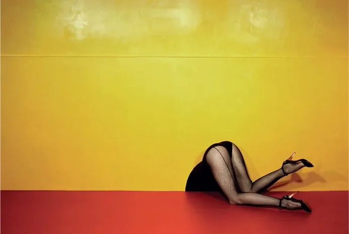

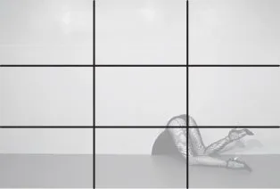

Charles Jourdan campaign
查尔斯·乔丹 (Charles Jourdan) 的广告

***\*Guy Bourdin\****
***\*盖·伯丁\****

Spring, 1979
1979 年春

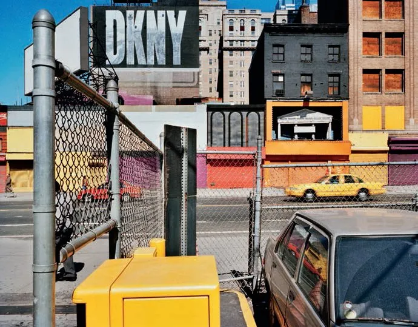

42nd Street and Eighth Avenue
第 42 街和第八大道

***\*Lars Tunbjörk\****
***\*拉尔斯·通比约克\****

1997

***\*Working the frame\****
***\*框架工作\****

***\*Make every inch count\****
***\*充分利用每一寸空间\****

***\*For other examples:\****
***\*其他示例：\****

Marc Asnin p. 13
马克·阿斯宁 第 13 页

Lewis Baltz p. 27
刘易斯·巴尔茨 第 27 页

Joel Sternfeld p. 68
Joel Sternfeld 第 68 页

I love this picture by Lars Tunbjörk. I love the fact that no single part is beautiful. The beauty comes from everything working together. Nothing is out of place. Nothing seems incidental.
我喜欢 Lars Tunbjörk 的这幅画。我喜欢没有一个部分是美丽的。美丽来自于所有部分的配合。一切都恰到好处。一切都显得恰到好处。一切都显得恰到好处。

You can’t ‘snap’ pictures like this. They’re the result of knowing exactly what’s going on in every part of your frame.
你无法像这样“拍摄”照片。它们是你准确了解画面中每个部分发生的情况的结果。

When lining up your shot, it’s your subtle movements that will make everything slot into place – **a little lower, a touch to the left, a couple of steps back**. These minor adjustments ensure the foreground fencepost is absolutely vertical. They mean the passing taxi is framed rather than cut in two. They make the vivid tapestry of colours balance each other, without anything becoming too overpowering. They ensure nothing is creeping into the frame that doesn’t belong.
在排列镜头时，微妙的动作会让所有东西都各就各位——**稍微低一点、向左一点、后退几步**。这些细微的调整确保前景栅栏柱完全垂直。这意味着经过的出租车被框住，而不是被一分为二。它们使鲜艳的色彩相互平衡，而不会让任何东西变得过于强烈。它们确保没有任何东西进入不属于的画面。

***\*When composing your image avoid ‘passive’ areas that don’t add much.\****
***\*在构图时，请避免出现没有太大帮助的“被动”区域。\****

Just when you think you’re ready to take your picture, pause for a moment and glance around your frame – is everything where it should be? Is the composition working as a whole? If you’re not quite nailing it, change position – even very slightly – and keep an eye on how all the elements move around in relation to each other.
当你觉得可以拍照时，请稍作停顿，环顾一下画面——所有东西都摆在合适的位置了吗？整体构图是否合理？如果你没有完全摆好，请改变位置——哪怕是轻微的改变——并留意所有元素之间的相对位置。

***\*Visual weight\****
***\*视觉重量\****

***\*Reducing it down\****
***\*减少\****

***\*For other examples:\****
***\*其他示例：\****

Guy Bourdin p. 23
Guy Bourdin 第 23 页

This image doesn’t have the busyness of the last. But even with all that space, none of it seems unnecessary. Everything is exactly where it should be. It has the same sense of cold order as the landscaped industrial park it depicts.
这张照片没有上一张那么忙碌。但即使有这么多空间，也没有任何多余的东西。一切都恰到好处。它和它所描绘的工业园一样，给人一种冷冰冰的秩序感。

Here Lewis Baltz felt the visual weight of each element. He didn’t just see a garage door surrounded by a brick wall and an area of tarmac. Instead he reduced everything down to two-dimensional shapes and tones.
在这里，刘易斯·巴尔茨感受到了每个元素的视觉重量。他看到的不仅仅是一扇被砖墙和一片柏油路面包围的车库门。相反，他将一切简化为二维形状和色调。

***\*Don’t see the world as it is. See it as a photograph.\****
***\*不要以世界的本来面目看待它。而要把它看作一张照片。\****

Notice how much ‘heavier’ the dark ground seems compared to the light wall, and how this has influenced the amount of space Baltz has given them in the frame. See how the grey of the garage door is counterbalanced by the diamond of white cut into the tarmac. See how the space between all of these elements, and their position in relation to the edge of the frame, creates absolute equilibrium.
请注意，与浅色墙壁相比，深色地面看起来“重”了多少，以及这如何影响了 Baltz 在框架中为它们留出的空间大小。看看车库门的灰色如何与柏油路面上的菱形白色相平衡。看看所有这些元素之间的空间以及它们相对于框架边缘的位置如何创造绝对的平衡。

Feeling the visual weight of your scene is a complicated balancing act, but your eyes are already pretty effective weighing scales. You measure visual weight when deciding where to hang a picture on a wall or when arranging food on a plate. All you have to do now is apply this already honed skill to your photography.
感受场景的视觉重量是一种复杂的平衡行为，但你的眼睛已经是相当有效的秤。当你决定在墙上挂一幅画的哪个位置或在盘子上摆放食物时，你会测量视觉重量。你现在要做的就是将这种已经磨练好的技巧应用到你的摄影中。

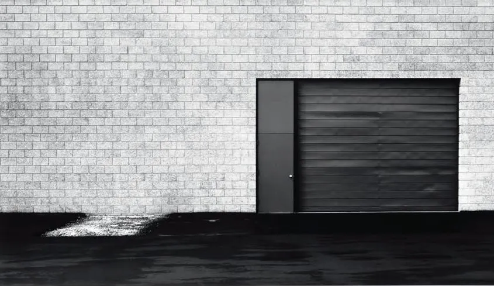

West Wall, Business Systems
西墙，商业系统

Division, Pertec, 1881 Langley,
部门，Pertec，1881 兰利，

Costa Mesa from ‘New Industrial Parks’
科斯塔梅萨的“新工业园区”

***\*Lewis Baltz\****
***\*刘易斯·巴尔茨\****

1974

***\*Breaking the rules\****
***\*打破规则\****

***\*Throw the rule book out the window\****
***\*把规则扔到窗外\****

***\*For other examples:\****
***\*其他示例：\****

Lee Friedlander p. 71
Lee Friedlander 第 71 页

Daido Moriyama p. 79
森山大道 p. 79

Robert Capa p. 105
罗伯特·卡帕 第 105 页

Robert Frank p. 121
罗伯特·弗兰克 第 121 页

Everything about this image by Bill Brandt is so wrong.
比尔·布兰特 (Bill Brandt) 拍摄的这张照片的一切都是错误的。

First, our eyes are pulled out of the image by the path on the right. Then there’s that off-kilter lamppost, awkwardly making contact with the very top of the frame. And look how the subject – the painter Francis Bacon – is positioned to the extreme left, his gaze brutally cut short by the edge of the frame. Add a horizon line that cuts right through the subject’s head and you’ve got an altogether uncomfortable composition, riddled with tension and anxiety.
首先，右侧的小路将我们的视线拉出画面。然后是那根歪斜的灯柱，尴尬地与画面顶部接触。再看看主体——画家弗朗西斯·培根——是如何被置于最左边的，他的目光被画面边缘粗暴地切断。再加上一条穿过主体头部的地平线，你就会得到一幅令人完全不舒服的构图，充满紧张和焦虑。

Tension and anxiety. Actually, that sounds a lot like Bacon’s paintings. On second thoughts, everything about this image is so right!
紧张和焦虑。其实，这听起来很像培根的画。再想想，这幅画的一切都太对了！

***\*Good photographs conform to the rules. Really great photographs often break them.\****
***\*好的照片符合规则。而真正伟大的照片常常打破规则。\****

While compositional techniques like leading lines, the rule of thirds, framing, and all the rest serve as essential building blocks, too much of that can make your photographs feel a bit safe and predictable.
虽然引导线、三分法、取景等构图技巧都是构成照片的基本要素，但过多使用这些技巧会让你的照片看起来有点安全和可预测。

So rather than making sure everything ‘conforms’, concentrate on creating compositions that capture the essence of your subject. This is a picture of a man who painted deformed heads, screaming popes and animal carcasses. Somehow, I don’t think the rule of thirds would’ve done the job.
因此，与其确保一切都“符合”，不如集中精力创作能够捕捉主题本质的构图。这是一幅画着畸形头像、尖叫教皇和动物尸体的男子的照片。不知何故，我认为三分法无法完成这项工作。

***\*Now go out and practise\****
***\*现在出去练习\****

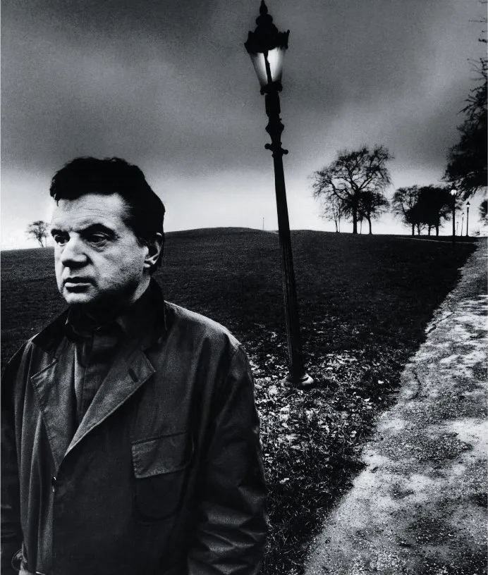

Francis Bacon, Primrose Hill
弗朗西斯·培根，樱草山

***\*Bill Brandt\****
***\*比尔·布兰特\****

1963

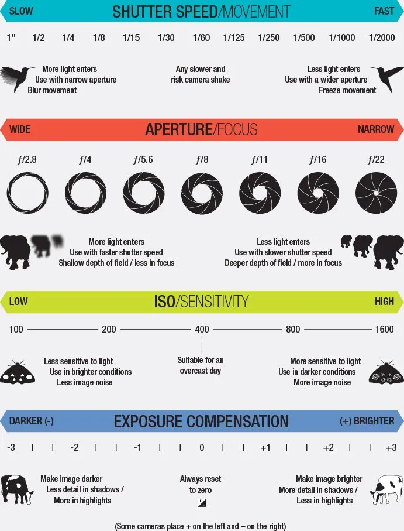

***\*EXPOSURE\****
***\*接触\****

***\*Seeing through the science\****
***\*透过科学看\****

When you take a picture, you control how much light enters the camera. Let too much light flood in and you’ll overexpose your image, meaning it will be too bright. Don’t let enough light in, and you’ll underexpose your image, meaning it will be too dark.
拍照时，你可以控制进入相机的光线量。如果光线过多，图像就会曝光过度，也就是说会太亮。如果光线不足，图像就会曝光不足，也就是说会太暗。

This balancing act is called exposure and it’s a case of juggling your shutter speed, aperture and ISO (International Organization for Standardization). This happy trio is inseparable. Each member is different. Each has its own job. And that’s exactly why they rely on each other so much.
这种平衡行为称为曝光，需要平衡快门速度、光圈和 ISO（国际标准化组织）。这三个快乐的人密不可分。每个成员都不同。每个人都有自己的工作。这正是他们如此依赖彼此的原因。

***\*SHUTTER SPEED\**** controls the length of time that light enters your camera
***\*快门速度\****控制光线进入相机的时间长度

***\*APERTURE\**** controls how much light enters your camera.
***\*光圈\****控制进入相机的光量。

***\*ISO\**** controls how sensitive your camera is to light.
***\*ISO\****控制相机对光线的敏感度。

Now you might think that exposure all seems a little sciency. On first impressions it is. But once you get to grips with a few fundamentals you’ll soon see that adjusting your shutter speed, aperture and ISO is just as much an exercise in creativity as it is in controlling light. And this term ‘correct exposure’, well, that’s just a matter of opinion.
现在你可能会认为曝光似乎有点科学。第一印象是这样的。但是一旦你掌握了一些基本知识，你很快就会发现调整快门速度、光圈和 ISO 既是一种创造力的锻炼，也是一种控制光线的锻炼。而这个术语“正确曝光”，嗯，这只是一个观点问题。

But before we delve into the fundamentals of exposure, let’s demystify a few things about camera modes.
但在深入研究曝光基础知识之前，让我们先揭开一些有关相机模式的神秘面纱。

***\*Modes\****
***\*模式\****

***\*The good, the bad and the ugly\****
***\*好、坏、丑\****

Your camera probably offers you anything between eight to fifteen shooting modes, right? You might think that having so many different modes is a bonus, but the truth is you’ll never need to use most of them.
你的相机可能提供 8 到 15 种拍摄模式，对吧？你可能认为拥有这么多不同的模式是一种福利，但事实是你永远不需要使用其中的大多数模式。

***\*THE GOOD\****
***\*优点\****

***\*P, S (Tv)\**** and ***\*A (Av)\**** are the only modes you need to get familiar with to take great photographs. These are the good guys. They’ll help you unlock your creativity and achieve the results you want. We’ll get to know them better over the next few pages.
***\*P、S（Tv）\****和***\*A（Av）\****是拍摄出色照片唯一需要熟悉的模式。这些都是好东西。它们将帮助您释放创造力并实现您想要的结果。我们将在接下来的几页中更好地了解它们。

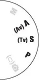

***\*THE BAD\****
***\*缺点\****

‘Scene modes’ – the modes represented by a picture, like this– are junk. These are factory presets, which adjust your camera’s settings to shoot a particular subject in a particular way. But there’s no single right way to photograph anything. That’s why your own ideas and creative flair are so important. So, from now on, just try to pretend they’re not there.
“场景模式”——用图片表示的模式，比如这个——是垃圾。这些是出厂预设，可以调整相机的设置以特定方式拍摄特定主题。但是，没有单一的正确方法来拍摄任何东西。这就是为什么你自己的想法和创意天赋如此重要。所以，从现在开始，试着假装它们不存在。

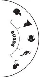

***\*THE UGLY\****
***\*丑陋\****

The fully ‘Auto’ mode is for quick snapshots, which often turn out looking nothing like you intended. Think of this as the mode with no personality or imagination. Having said that, it’s OK to set your camera to automatic – it’s just that there’s another mode that’s far better than this one.
全自动模式用于快速拍摄快照，但拍摄出来的照片往往与你的预期不符。你可以认为这是一种没有个性或想象力的模式。话虽如此，将相机设置为自动模式也是可以的，只不过还有一种模式比这种模式好得多。

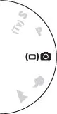

***\*‘Program’ Mode\****
***\*“程序”模式\****

***\*It’s ok to ‘P’ in public\****
***\*在公共场合使用“P”是可以的\****

**Manual – Goooood. Auto – Baaaaad**
**手册 – 好极了。汽车 – Baaaaad**

This is the deranged chant of camera-club traditionalists who think photographs taken using a manual setting are somehow more worthy. Don’t listen to them.
这是摄影俱乐部传统主义者的疯狂言论，他们认为使用手动设置拍摄的照片更有价值。不要听他们的。

***\*When you’re starting out, one of the best modes you’ll ever use is P.\****
***\*当您刚开始时，您会使用的最佳模式之一就是 P。\****

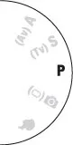

***\*P\**** stands for ‘Posh Auto’ or, more accurately, ‘Program’. This is the mode to use if you want your camera to sort out all the technical number stuff for you so you can concentrate on honing your eye. And, unlike the fully ‘Auto’ mode, using ***\*P\**** gives you a certain amount of all-important creative freedom.
***\*P\****代表“高级自动”或更准确地说是“程序”。如果您希望相机为您整理所有技术数字内容，以便您可以专心磨练您的眼睛，则可以使用此模式。而且，与完全“自动”模式不同，使用***\*P 模式\****可以为您提供一定程度的创作自由。

Firstly, using ***\*P\**** means your flash won’t automatically fire. This is good, as your flash will more than likely ruin your shot. Secondly, you can change your ISO, which is something you definitely need to know about.
首先，使用***\*P\****意味着闪光灯不会自动闪光。这很好，因为闪光灯很可能会毁了你的照片。其次，你可以更改 ISO，这是你绝对需要知道的事情。

But before we learn about either of these things, it’s time to introduce you to the first member of the exposure trio – shutter speed.
但在我们了解这些内容之前，是时候向您介绍曝光三要素中的第一个成员——快门速度。

***\*Shutter speed and ‘Shutter Priority‘\****
***\*快门速度和“快门优先”\****

***\*The bish, bash, bosh guide to shutter speed\****
***\*bish、bash、bosh 快门速度指南\****

When you take a photograph, your camera’s shutter opens, letting in light. It stays open for a period of time (usually only a fraction of a second) and then closes, cutting off the light. This period of time is called the ‘shutter speed’.
拍照时，相机的快门会打开，让光线进入。快门会保持打开状态一段时间（通常只有几分之一秒），然后关闭，切断光线。这段时间称为“快门速度”。

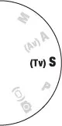

For reasons you’ll soon see, sometimes you’ll want to be in total control of your shutter speed. In these cases, the best mode to use is ‘Shutter Priority’, which is marked by ***\*S\**** or ***\*Tv\****.
出于您很快就会明白的原因，有时您会希望完全控制快门速度。在这些情况下，最佳模式是“快门优先”，标记为***\*S\****或***\*Tv\**** 。

‘Shutter Priority’ allows you to change your shutter speed, while your camera kindly sorts out the correct corresponding aperture. But let’s ignore aperture for now.
“快门优先”可让您更改快门速度，同时相机会选择正确的对应光圈。不过现在我们先忽略光圈。

Here’s how to change your shutter speed:
更改快门速度的方法如下：

***\*BISH\**** Select ‘Shutter Priority’. Most cameras have a mode dial. For those that don’t, you’ll be able to access your modes through the menu.
***\*BISH\****选择“快门优先”。大多数相机都有模式拨盘。如果没有，您可以通过菜单访问模式。

***\*BASH\**** Lightly tap the shutter release button to make your camera come to life. This is the button you press to take pictures.
***\*BASH\****轻按快门释放按钮，让您的相机启动。这是您按下以拍照的按钮。

***\*BOSH\**** Scroll one way to make your shutter speed faster. Scroll the other way to make it slower.
***\*BOSH\****向一个方向滚动可加快快门速度。向另一个方向滚动可减慢快门速度。

As you scroll, you’ll see numbers from this scale:
滚动时，您会看到以下数字：

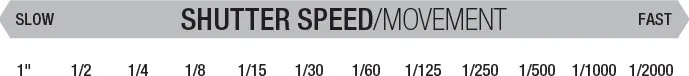

Cameras show shutter speed either as a fraction, for example ***\*1/500\****, or a number, for example ***\*500\****. Either way, this indicates a shutter speed that is a fraction of one second. So ***\*1/500\**** (or ***\*500\****) means your shutter will open for a mere one five hundredth of a second. That’s fast.
相机会以分数形式显示快门速度，例如***\*1/500\**** ，或以数字形式显示快门速度，例如***\*500\**** 。无论哪种方式，这都表示快门速度是一秒的几分之一。因此***\*1/500\**** （或***\*500\**** ）表示快门仅打开五百分之一秒。这很快。

If you see a double quotation mark after a number, for example, ***\*2"\****, this means your shutter speed is no longer fractions of a second, but whole seconds. So ***\*2"\**** means your shutter will open for two seconds. In photography, that’s an eternity.
如果数字后面有双引号，例如***\*2"\**** ，则表示快门速度不再是几分之一秒，而是整秒。因此***\*2"\****表示快门将打开两秒钟。在摄影中，这是永恒。

Generally, when it’s darker you have to use slower shutter speeds and when it’s brighter you have to use faster shutter speeds. This is because shutter speed acts like a timer, which controls the length of time light enters the camera. So if it’s dark you’ll need to allow light to enter for longer.
一般来说，天色较暗时，你必须使用较慢的快门速度；天色较亮时，你必须使用较快的快门速度。这是因为快门速度就像一个定时器，控制光线进入相机的时间长度。所以如果天色较暗，你需要让光线进入相机更长时间。

Now, let’s put exposure aside for a moment because this is where it gets really sexy. Shutter speed also creates two very distinctive visual effects in your image, and it’s all about photographing movement.
现在，让我们暂时把曝光放在一边，因为这才是真正性感的地方。快门速度也会在图像中产生两种非常独特的视觉效果，而这一切都是为了拍摄运动。

***\*Slow shutter speeds\****
***\*慢速快门\****

***\*The beauty of blur\****
***\*模糊之美\****

***\*For other examples:\****
***\*其他示例：\****

Luca Campigotto p. 38
Luca Campigotto 第 38 页

Slow shutter speeds blur movement. This is because the shutter stays open for longer, giving objects more time to move while the picture is being exposed.
慢速快门会使运动变得模糊。这是因为快门保持打开的时间更长，让物体在照片曝光时有更多时间移动。

Here Ernst Haas uses a slow shutter speed of perhaps three seconds to surround choreographer George Balanchine in a beautifully rhythmic blur. As the dancers pirouette around the frame, the traces of their movements contrast with the stillness of Balanchine, who remains motionless, looking on intently.
在这里，恩斯特·哈斯使用大约三秒的慢速快门速度，将编舞家乔治·巴兰钦包围在优美的节奏模糊中。当舞者在画面中旋转时，他们的动作痕迹与巴兰钦的静止形成鲜明对比，后者一动不动，全神贯注地注视着。

***\*To blur your moving subject, select ‘Shutter Priority’ (S or Tv) and a slow shutter speed.\****
***\*要模糊移动的物体，请选择“快门优先”（S 或 Tv）和慢速快门。\****

When shooting everyday subjects, such as people running and passing cars, you’ll start to see obvious signs of blur at shutter speeds slower than about ***\*1/60\****. The slower you go, the greater the blur.
在拍摄日常题材时，例如奔跑的人和过往车辆，当快门速度低于***\*1/60\****时，您就会开始看到明显的模糊迹象。速度越慢，模糊程度就越大。

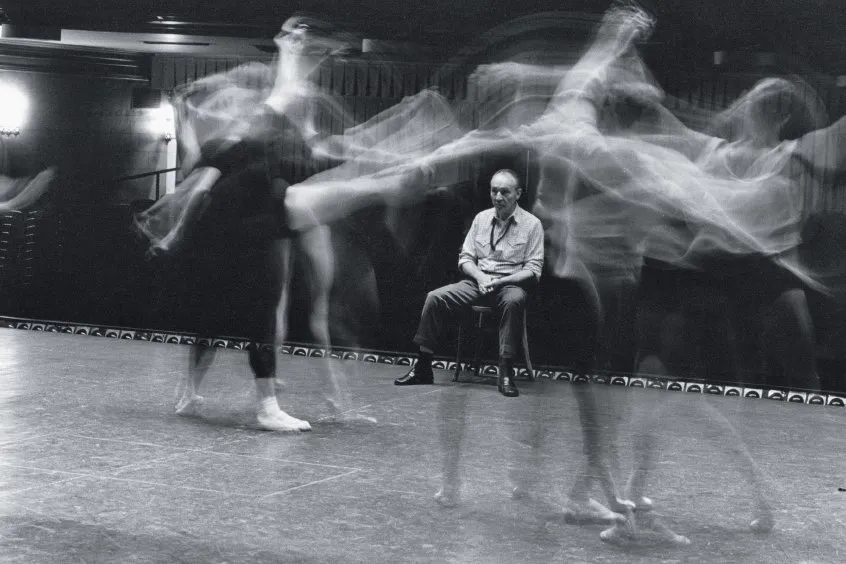

George Balanchine,
乔治·巴兰钦，

New York City Ballet
纽约市芭蕾舞团

***\*Ernst Haas\****
***\*恩斯特·哈斯\****

1960s
20 世纪 60 年代

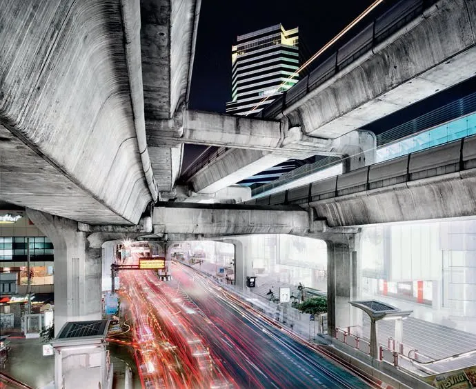

**Bangkok** from ‘Cityscapes’
《城市风景》中的**曼谷**

***\*Luca Campigotto\****
***\*卢卡·坎皮戈托\****

2006

***\*Slow shutter speeds at night\****
***\*夜间快门速度较慢\****

***\*Light trails\****
***\*光迹\****

Photographers have long been seduced by the luminous lure of cities after dark. As the sun goes down the lights come on, and what was nondescript during the day suddenly comes alive at night.
长期以来，摄影师们一直被夜幕降临后城市的璀璨魅力所吸引。太阳下山后，灯光亮起，白天平淡无奇的景象在夜晚突然变得生机勃勃。

Here Luca Campigotto uses a slow shutter speed to transform a city street into an artery of red and white light. As the shutter has stayed open for a few seconds, the passing cars have become nothing more than long trails of brilliant light.
在这里，卢卡·坎皮戈托使用慢速快门将城市街道变成一条红白光的动脉。由于快门保持打开状态几秒钟，过往车辆只剩下长长的耀眼光迹。

***\*When shooting on slow shutter speeds, make sure your camera doesn’t move. If it does, everything in your image will looked blurred. This is called ‘camera shake’.\****
***\*使用慢速快门拍摄时，请确保相机不会移动。如果相机移动，图像中的所有物体都会显得模糊。这称为“相机抖动”。\****

Here the only evidence of movement is the traffic, while the surrounding architecture has remained absolutely pin sharp. This is because Campigotto mounted his camera on a tripod to ensure that it didn’t move during the exposure.
在这里，唯一能证明运动的证据就是交通，而周围的建筑却依然清晰可见。这是因为 Campigotto 将相机安装在三脚架上，以确保在曝光期间相机不会移动。

Camera shake caused by hand holding your camera is the most common cause of death for night shots. Some cameras offer ‘Image Stabilization’ ***\*(IS)\**** or ‘Vibration Reduction’ ***\*(VR)\****. Switch this on and you’ll find that you can hand hold your camera at slower shutter speeds without the risk of camera shake. But if you’re going to use a shutter speed this slow, a tripod is the only cure.
手持相机造成的相机抖动是夜间拍摄最常见的致命原因。有些相机提供“图像稳定” ***\*(IS)\****或“减震” ***\*(VR) 功能\****。打开此功能，您会发现，您可以手持相机以较慢的快门速度拍摄，而不会出现相机抖动的风险。但是，如果您要使用如此慢的快门速度，三脚架是唯一的解决方案。

***\*Fast shutter speeds\****
***\*高速快门\****

***\*The big freeze\****
***\*大冻结\****

***\*For other examples:\****
***\*其他示例：\****

Cristina Garcia Rodero p. 15
克里斯蒂娜·加西亚·罗德罗 p. 15

Denis Darzacq p. 53
丹尼斯·达扎克 第 53 页

Adam Pretty p. 59
Adam Pretty 第 59 页

Fast shutter speeds do the opposite to slow shutter speeds – they freeze movement.
高速快门与慢速快门的作用相反——它们会冻结运动。

For his series ‘Blast’, Naoya Hatakeyama uses a very fast shutter speed of ***\*1/2000\**** to show the destructive effects of Japan’s limestone mining on the landscape.
在他的系列作品《爆炸》中，畠山直哉使用了***\*1/2000\****的超快快门速度来展示日本石灰石开采对景观的破坏性影响。

In this image, what would have been too fast to comprehend with the naked eye instead becomes a blowout of fantastic detail. Time is frozen as the reddish-brown debris hangs in mid-air against a beautiful blue sky. Here, the unease of destruction gives way to total seduction.
在这张照片中，原本肉眼无法理解的场景却变成了精彩绝伦的细节。时间仿佛凝固了，红褐色的碎片悬挂在半空中，映衬着美丽的蓝天。在这里，毁灭的不安让位于完全的诱惑。

***\*To freeze movement, use ‘Shutter Priority’ (S or Tv) and a fast shutter speed.\****
***\*要冻结运动，请使用“快门优先”（S 或 Tv）和高速快门。\****

Subjects appear frozen when photographed with fast shutter speeds because, in the instant that the picture is taken, nothing in front of the camera has time to move. Generally shutter speeds of ***\*1/125\**** and faster will start to freeze movement, such as people jumping and running water.
使用高速快门拍摄时，拍摄对象看起来是静止的，因为在拍摄照片的瞬间，相机前面的物体没有时间移动。通常，快门速度为***\*1/125\****或更快时，运动物体就会开始定格，例如跳跃的人和流水。

Remember, faster shutter speeds allow less light into the camera and if not enough light enters the camera, you’ll underexpose your image. But there’s a way around this. It’s time to meet ‘aperture’.
请记住，快门速度越快，进入相机的光线就越少，如果进入相机的光线不足，图像就会曝光不足。但有办法解决这个问题。是时候了解一下“光圈”了。

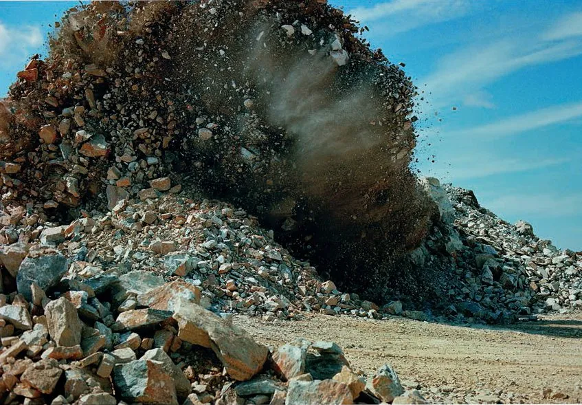

**Blast #8316**
**爆炸 #8316**

***\*Naoya Hatakeyama\****
***\*畠山直哉\****

1997

***\*Aperture and ‘Aperture Priority’\****
***\*光圈和“光圈优先”\****

***\*The bish, bash, bosh guide to aperture\****
***\*bish、bash、bosh 光圈指南\****

The aperture is a hole in your lens that you can make smaller or larger to control how much light enters your camera. Aperture works in exactly the same way as the pupil in your eye, which dilates in darker conditions and contracts in brighter conditions.
光圈是镜头上的一个孔，您可以将其缩小或放大以控制进入相机的光线量。光圈的工作原理与眼睛中的瞳孔完全相同，在较暗的条件下会扩大，在较亮的条件下会收缩。

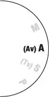

As well as controlling the amount of light entering your camera, aperture creates a very distinctive visual effect, which we’ll come to in a second. So just like shutter speed, which has a ‘Shutter Priority’ mode, aperture has its very own ‘Aperture Priority’ mode, which is ***\*A\**** or ***\*Av\****.
除了控制进入相机的光量之外，光圈还能产生非常独特的视觉效果，我们稍后会讲到。就像快门速度有“快门优先”模式一样，光圈也有自己的“光圈优先”模式，即***\*A\****或***\*Av\**** 。

The great thing about ‘Aperture Priority’ is that it allows you to change the aperture while your camera figures out the shutter speed.
“光圈优先”的优点在于，它允许您在相机计算快门速度的同时更改光圈。

Here’s how to change your aperture:
改变光圈的方法如下：

***\*BISH\**** Select ‘Aperture Priority’. Most cameras have a mode dial. For those that don’t, you’ll be able to access your modes through the menu.
***\*BISH\****选择“光圈优先”。大多数相机都有模式拨盘。如果没有，您可以通过菜单访问模式。

***\*BASH\**** Lightly tap the shutter release button to make your camera come to life. This is the button you press to take pictures.
***\*BASH\****轻按快门释放按钮，让您的相机启动。这是您按下以拍照的按钮。

***\*BOSH\**** Scroll one way to make your aperture wider. Scroll the other way to make it narrower.
***\*BOSH\****向一个方向滚动可使光圈变宽。向另一个方向滚动可使光圈变窄。

The exact size of the hole is measured in ‘f-stops’. At first, f-stops can be a little confusing, as the higher the number, the narrower the hole, and vice versa:
孔的确切尺寸以“光圈”来衡量。起初，光圈可能有点令人困惑，因为数字越高，孔越窄，反之亦然：

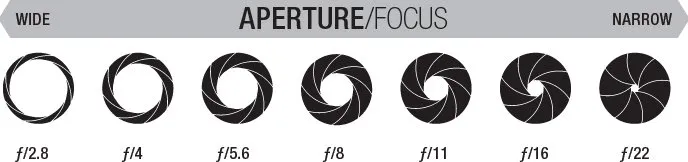

The aperture is in your lens, not your camera, so depending on your lens you might find that you have a different range of f-stops (or ‘f-numbers’, as they are also called).
光圈位于镜头中，而不是相机中，因此，根据镜头的不同，您可能会发现具有不同范围的 f 值（或称为“f 数值”）。

Now here’s the thing: as you change the aperture, notice what’s happening to the shutter speed. It’s changing too, right? When you select a wide aperture, such as ***\*ƒ/5.6\****, the shutter speed is faster, and when you select a narrow aperture, such as ***\*ƒ/22\****, it’s slower.
现在，问题来了：当你改变光圈时，注意快门速度发生了什么变化。它也在变化，对吧？当你选择大光圈（例如***\*ƒ\**** ***\*/\**** ***\*5.6 ）\****时，快门速度会更快，而当你选择小光圈（例如***\*ƒ\**** ***\*/\**** ***\*22 ）\****时，快门速度会更慢。

This is because the camera is varying the shutter speed to compensate for the fact that you’re letting in more or less light through the lens. It’s a balancing act, and exactly the same thing was happening to the aperture when you were using ‘Shutter Priority’.
这是因为相机会改变快门速度来补偿镜头中光线的进入量。这是一种平衡行为，使用“快门优先”时光圈也会发生同样的情况。

But the plot thickens. Changing your aperture also radically alters the ‘depth of field’ in your image and I think this is something you’re going to like.
但情节变得复杂起来。改变光圈也会从根本上改变图像的“景深”，我认为这是你会喜欢的。

***\*Shallow depth of field\****
***\*浅景深\****

***\*Stand out by being shallow\****
***\*浅显易懂\****

***\*For other examples:\****
***\*其他示例：\****

Alkan Hassan p. 21
Alkan Hassan 第 21 页

Slinkachu p. 46
Slinkachu 第 46 页

Youngjun Koo p. 96
Youngjun Koo 第 96 页

Here, Sebastião Salgado gives his subject a striking sculptural presence by making the lines of the man’s body so clearly defined against an out-of-focus background. This effect is called a shallow depth of field. See how it causes us to be drawn to the intensity of the man’s stare and his powerful, muscular frame covered with scarring and white ash.
在这里，塞巴斯蒂安·萨尔加多 (Sebastião Salgado) 通过在失焦背景下清晰地勾勒出男人身体的线条，赋予了拍摄对象惊人的雕塑感。这种效果称为浅景深。看看它如何让我们被男人凝视的力度和他那布满伤疤和白灰的强壮肌肉所吸引。

***\*To achieve a shallow depth of field select ‘Aperture Priority’ and a wide open aperture (low f-number).\****
***\*为了获得浅景深，请选择“光圈优先”和大光圈（低 f 值）。\****

By throwing an area of your image out of focus you’re effectively getting rid of detail. This causes your subject to really stand out. As seen here, a shallow depth of field makes portraits particularly striking.
通过使图像的某个区域失焦，您实际上会失去细节。这会使您的主体真正脱颖而出。如图所示，浅景深使肖像特别引人注目。

If you have a camera with an optical viewfinder (a DSLR for example), you won’t see this effect when you’re composing your picture. You’ll only see it once you’ve taken the shot. If, however, you have a camera with a electronic viewfinder (most bridge and compact system cameras), you will see this effect through the viewfinder.
如果您的相机带有光学取景器（例如数码单反相机），您在构图时将看不到这种效果。只有在拍摄后才能看到它。但是，如果您的相机带有电子取景器（大多数桥式和紧凑型系统相机），您将通过取景器看到这种效果。

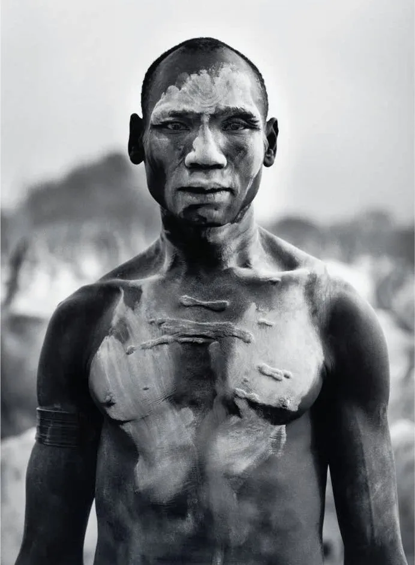

Dinka man, Southern Sudan
南苏丹丁卡族男子

***\*Sebastião Salgado\****
***\*塞巴斯蒂安·萨尔加多\****

2006

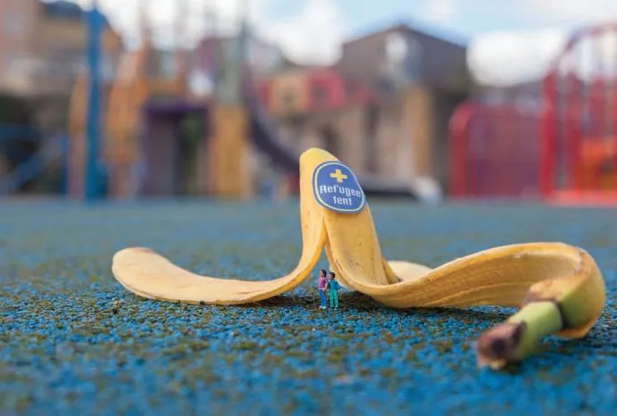

**Hide and Seek**
**捉迷藏**

***\*Slinkachu\****
***\*斯林卡丘\****

2013

***\*Shallow depth of field\****
***\*浅景深\****

***\*Compelling close-ups\****
***\*引人注目的特写镜头\****

***\*For other examples:\****
***\*其他示例：\****

Shikhei Goh p. 98
Shikhei Goh 第 98 页

Slinkachu is an artist who creates witty and sometimes tragic narratives by placing miniature figures in unexpected locations around the city. The set-ups are so tiny, most people pass them by without even noticing. This means his work relies on photography to bring it to a wider audience.
Slinkachu 是一位艺术家，他通过在城市中意想不到的地方放置微型人物来创造诙谐有时甚至悲剧性的故事。这些装置非常小，大多数人经过时甚至都没有注意到。这意味着他的作品依靠摄影来将其带给更广泛的受众。

***\*Depth of field is at its most shallow when shooting close-ups.\****
***\*拍摄特写镜头时景深最浅。\****

Here, Slinkachu has achieved such a shallow depth of field (a matter of millimetres) because he has used a wide aperture (low f-number) and is very close to his subject. He’s also zoomed in a little, which helps to extenuate the effect of a shallow depth of field.
在这里，Slinkachu 实现了如此浅的景深（几毫米），因为他使用了大光圈（低 f 值），并且距离拍摄对象非常近。他还将镜头拉近了一点，这有助于减轻浅景深的效果。

Focus is all about distance from the camera. Even though this is a close-up notice the physical depth that’s very visible in the image. If you want to really see the effects of a shallow depth of field, make sure there’s a good amount of distance behind or in front of your subject, otherwise there won’t be anything to actually fall out of focus.
焦点完全取决于与相机的距离。即使这是特写镜头，也要注意图像中非常明显的物理深度。如果你想真正看到浅景深的效果，请确保拍摄对象前后有足够的距离，否则实际上不会有任何东西失焦。

***\*Deep depth of field\****
***\*深景深\****

***\*Deep and meaningful\****
***\*深刻而有意义\****

***\*For other examples:\****
***\*其他示例：\****

Ansel Adams p. 8
安塞尔·亚当斯 第 8 页

Edward Burtynsky p. 17
爱德华·伯汀斯基 第 17 页

Lars Tunbjörk p. 24
Lars Tunbjörk 第 24 页

Joel Sternfeld p. 68
Joel Sternfeld 第 68 页

Jeanloup Sieff p. 88
Jeanloup Sieff 第 88 页

Here Richard Misrach photographs the scars left behind by military testing sites in the Nevada desert. Stretching into the distance, debris litters the landscape, like bones in an elephant graveyard, while in the foreground a bomb crater takes on the appearance of a vividly coloured hot spring. But rather than teaming with life, this toxic pool symbolizes only man-made death and destruction.
理查德·米斯拉奇拍摄了内华达州沙漠中军事试验场留下的伤痕。向远处望去，碎石散落在地，就像大象墓地里的骨头一样，而前景中的弹坑则呈现出色彩鲜艳的温泉。但这片有毒的水潭并非充满生机，而是象征着人为的死亡和破坏。

***\*A narrow aperture (high f-number) causes everything from the foreground through to the background to be in focus.\****
***\*窄光圈（高 f 值）可使从前景到背景的所有事物均清晰对焦。\****

This is an example of a deep depth of field and here it’s helping to communicate the scale and detail of the landscape.
这是深景深的一个例子，它有助于传达景观的规模和细节。

Landscape, and often portrait photography is generally less about capturing movement and far more about controlling your depth of field. For this reason, select ‘Aperture Priority’ so you’re in control of your aperture and depth of field, while the camera worries about the shutter speed.
风景摄影和人像摄影通常不太注重捕捉运动，而更注重控制景深。因此，选择“光圈优先”，这样您就可以控制光圈和景深，而相机则负责快门速度。

To help you remember the relationship between aperture and depth of field think: small f-number = small area of focus; big f-number = big area of focus.
为了帮助您记住光圈和景深之间的关系，请思考：小 f 数值 = 小焦点区域；大 f 数值 = 大焦点区域。

Just remember, if you’re using a very narrow aperture, your shutter speed will compensate by being slower,
请记住，如果你使用非常窄的光圈，你的快门速度会降低，

so use a tripod (or any stable surface) to avoid camera shake. There is, however, an alternative. It’s time to meet the final member of the exposure trio.
因此请使用三脚架（或任何稳定的表面）以避免相机抖动。不过，还有另一种选择。现在是时候见见曝光三重奏的最后一位成员了。

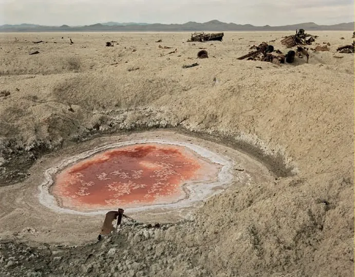

Bomb Crater and Destroyed Convoy,
炸弹坑和被摧毁的车队，

Bravo 20 Bombing Range, Nevada
内华达州 Bravo 20 轰炸靶场

***\*Richard Misrach\****
***\*理查德·米斯拉奇\****

1986

***\*ISO\****

***\*Your camera’s sensitive side\****
***\*相机的敏感面\****

ISO controls how sensitive your camera is to light. It works like this:
ISO 控制相机对光线的敏感度。其工作原理如下：

When it’s dark you need to make the most of the limited light, so you increase the sensitivity of your camera by increasing your ISO. When it’s bright, your camera doesn’t need to be as sensitive, so you decrease the sensitivity of your camera by decreasing your ISO.
天黑时，你需要充分利用有限的光线，因此你可以通过增加 ISO 来增加相机的灵敏度。天亮时，你的相机不需要那么敏感，因此你可以通过降低 ISO 来降低相机的灵敏度。

If your camera is more sensitive, light doesn’t need to enter for so long, meaning you’ll be able to use faster shutter speeds in low light. This will help to avoid camera shake.
如果你的相机更灵敏，光线就不需要进入那么长时间，这意味着你可以在弱光下使用更快的快门速度。这将有助于避免相机抖动。

To change your ISO, first make sure you’re on one of the ‘good’ modes (see p. 32) then find your ISO setting. This will either be a button on your camera’s body or an option in one of its menus. Find it and you’ll see that your ISO scale looks something like this:
要更改 ISO，首先请确保您处于“良好”模式之一（见第 32 页），然后找到您的 ISO 设置。这可以是相机机身上的一个按钮，也可以是其菜单之一中的一个选项。找到它，您会看到您的 ISO 刻度如下所示：

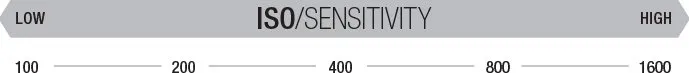

(You might find that your ISO scale starts lower, goes higher or has more intervals.)
（您可能会发现您的 ISO 标度一开始较低，然后升高或具有更多间隔。）

A good ISO for an overcast day is ***\*400\****. So when deciding on your ISO, start by asking yourself, ‘is it brighter or darker than an overcast day?’
阴天的合适 ISO 为***\*400。\****因此，在确定 ISO 时，首先要问自己，“天气比阴天更亮还是更暗？”

***\*Always set your ISO first, as it affects what shutter speed and aperture you can use.\****
***\*始终先设置 ISO，因为它会影响您可以使用的快门速度和光圈。\****

One of the great things about digital photography is that you can change your ISO from picture to picture. Go outdoors (brighter) and turn it down. Walk indoors (darker) and crank it up.
数码摄影的一大优点是，你可以改变每张照片的 ISO。走到户外（更亮）时，把 ISO 调低。走到室内（更暗）时，把 ISO 调高。

Just be warned, the higher the ISO, the more ‘noisy’ your image becomes. In extreme cases it’s an effect not dissimilar to a photo taken on an early camera phone. Depending on your camera, it’s something you might only start to notice when shooting on about ***\*800\**** ISO and higher.
请注意，ISO 越高，图像的“噪点”越多。在极端情况下，其效果与早期相机手机拍摄的照片并无二致。根据您的相机，您可能只有在 ISO 为***\*800\****或更高时才会开始注意到这一点。

It’s fair to say that ISO is the least glamorous of the exposure trio. But while it doesn’t do anything creative in itself, as you’re about to see, adjusting the sensitivity of your camera frees you up to achieve some really striking effects.
公平地说，ISO是曝光三项中最不吸引人的。但尽管它本身并没有什么创意，但正如您将要看到的，调整相机的灵敏度可以让您自由地实现一些真正引人注目的效果。

***\*ISO\****

***\*For other examples:\****
***\*其他示例：\****

Maciej Dakowicz p. 116
Maciej Dakowicz 第 116 页

Now, you’re going to find that you sometimes underexpose your image when trying to use fast shutter speeds, particularly in low light. This is where increasing your ISO is really helpful.
现在，你会发现，当你尝试使用高速快门时，图像有时会曝光不足，尤其是在弱光条件下。这时，增加 ISO 就非常有用了。

For his series ‘Hyper’, Denis Darzacq turns a supermarket into a stage for street dancers to perform. Here a dancer hangs suspended in the air, like something from a sci-fi movie.
在他的系列作品《Hyper》中，丹尼斯·达扎克将超市变成了街头舞者的表演舞台。在这里，一名舞者悬在半空中，就像科幻电影里的场景一样。

***\*Increasing your ISO is essential if you want to use fast shutter speeds in low light.\****
***\*如果您想在弱光条件下使用高速快门，则提高 ISO 是必不可少的。\****

Even when you’re not after such striking effects – perhaps you’re simply wanting to avoid camera shake in low light – increasing your ISO will help you access faster shutter speeds. Remember, camera shake occurs at speeds slower than about ***\*1/60\**** so nudge up your ISO just enough to tip you over that marker. Don’t be tempted to just whack up your ISO as high as it will go or you’ll risk unnecessary image noise.
即使您不追求如此惊人的效果——也许您只是想避免在弱光下相机抖动——增加 ISO 也可以帮助您获得更快的快门速度。请记住，相机抖动发生在低于***\*1/60\****的速度下，因此只需将 ISO 调高到足以超过该标记即可。不要试图将 ISO 调高到最高，否则您将面临不必要的图像噪点风险。

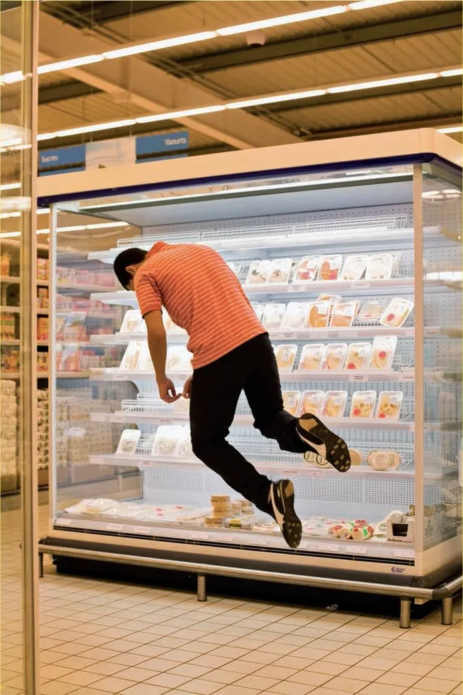

**Hyper No. 03**
**超级 03 号**

***\*Denis Darzacq\****
***\*丹尼斯·达扎克\****

2007

***\*‘Manual’\****
***\*'手动的'\****

***\*All good photographers use ‘Manual’, right?\****
***\*所有优秀的摄影师都使用“手动”，对吗？\****

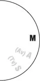

Sit down. I’m about to tell you something that might come as a shock: shooting in ‘Manual’ (***\*M\****) is a waste of time.
坐下。我要告诉你一件可能会让你震惊的事情：用“手动”（ ***\*M\**** ）拍摄是浪费时间。

Still there? OK, I’ll explain. Unlike ‘Shutter Priority’ and ‘Aperture Priority’, when using ‘Manual’ you’re in control of shutter speed **and** aperture **and** ISO.
还在吗？好的，我来解释一下。与“快门优先”和“光圈优先”不同，使用“手动”时，您可以控制快门速度**、**光圈**和**ISO。

In ‘Manual’ your camera is still telling you what it thinks is the ‘correct exposure’, in exactly the same way that it does in every other mode. But instead of making the changes for you, you have to do it all yourself.
在“手动”模式下，相机仍会告诉您它认为的“正确曝光”，方式与在其他所有模式下完全相同。但相机不会为您进行更改，而是必须您自己完成所有更改。

Often people use ‘Manual’ and simply adjust the shutter speed and aperture to match what their camera is telling them. By doing this they’re effectively shooting in ‘Program’ (***\*P\****), and taking a lot longer. Trust me, ‘Manual’ adds nothing to the picture!
人们通常使用“手动”模式，只需调整快门速度和光圈以匹配相机的指示即可。这样做实际上是在“程序”（ ***\*P\**** ）模式下拍摄，而且拍摄时间更长。相信我，“手动”模式对照片没有任何帮助！

***\*When you’re trying to get familiar with all the technical stuff, using ‘Manual’ slows you down, adds confusion and, worst of all, means you risk missing the shot.\****
***\*当您尝试熟悉所有技术内容时，使用“手动”会减慢您的速度、增加混乱，最糟糕的是，意味着您可能会错过拍摄。\****

That said, there is a situation in general day-to-day shooting when you could opt to use ‘Manual’. It’s when you want to override what your camera is telling you and intentionally under- or overexpose your picture. But rather than using ‘Manual’, I’m going to show you a much faster and easier method of getting the same result.
话虽如此，在日常拍摄中，有时您可以选择使用“手动”模式。这是当您想忽略相机的指示并故意让照片曝光不足或过度时。但与使用“手动”模式不同，我将向您展示一种更快、更简单的方法来获得相同的结果。

***\*Exposure compensation\****
***\*曝光补偿\****

***\*The alternative to ‘Manual’\****
***\*“手动”的替代方案\****

Meet ‘Exposure Compensation’. This function allows you to make your entire image brighter or darker and looks something like this:
了解“曝光补偿”。此功能可让您使整个图像更亮或更暗，看起来像这样：

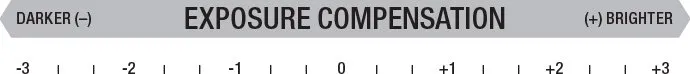

On most cameras the exposure compensation button is marked bybut some cameras have a dedicated dial instead. Scrolling towards ***\*+\**** will set your camera to overexpose your photographs, meaning they’ll be brighter. Scrolling towards ***\*–\**** will set your camera to underexpose your photographs, meaning they’ll be darker. Always remember to set your ‘Exposure Compensation’ back to ***\*0\**** or you’ll end up affecting all of your subsequent shots.
在大多数相机上，曝光补偿按钮标记为，但有些相机有专用拨盘。向***\*+\****滚动将设置您的相机过度曝光您的照片，这意味着它们会更亮。向***\*–\****滚动将设置您的相机曝光不足您的照片，这意味着它们会更暗。请务必记住将“曝光补偿”重新设置为***\*0\**** ，否则您最终会影响所有后续拍摄。

Intentionally over- or underexposing your photograph may seem an odd thing to do, but ‘Exposure Compensation’ is a function you’ll find yourself using more than you would think.
故意让照片曝光过度或曝光不足看起来是一件奇怪的事情，但“曝光补偿”功能却比你想象的要常用得多。

In a nutshell if you photograph something very bright, like snow, you’ll find that it looks quite grey or underexposed. Likewise, if you photograph something very dark, like the inside of a bar, you’ll find it looks too bright or overexposed.
简而言之，如果你拍摄非常明亮的物体，比如雪，你会发现它看起来相当灰暗或曝光不足。同样，如果你拍摄非常暗的物体，比如酒吧内部，你会发现它看起来太亮或曝光过度。

Exposure compensation overcomes this by allowing you to make your picture brighter (scroll towards the ***\*+\****) or darker (scroll towards the ***\*–\****).
曝光补偿可以解决这个问题，它允许您使图片更亮（向***\*+\****滚动）或更暗（向***\*-\****滚动）。

Exposure compensation is also essential for a backlit subject. Let’s look at a couple of examples.
对于逆光拍摄来说，曝光补偿也是必不可少的。我们来看几个例子。

***\*Exposure compensation\****
***\*曝光补偿\****

***\*Detail from the shadows\****
***\*阴影中的细节\****

***\*For other examples:\****
***\*其他示例：\****

Alkan Hassan p. 21
Alkan Hassan 第 21 页

Backlight is seductive and beautiful. But like many things seductive and beautiful, it has to be handled with care.
背光既诱人又美丽。但就像许多诱人而美丽的事物一样，必须小心处理。

This poignant photograph by Jo Metson Scott shows a young ballerina taking a break from the rigours of practice at the National Youth Ballet. Pictured sitting on her own, deep in thought, she inspires empathy in anyone familiar with the pressures of performance. And it’s that strong, overexposed daylight flooding in through the open window that seems to symbolize an escape for the girl and the choice between giving up and battling on.
乔·梅森·斯科特 (Jo Metson Scott) 拍摄的这张照片感人至深，照片中，一位年轻的芭蕾舞演员正在国家青年芭蕾舞团 (National Youth Ballet) 休息，她正在紧张的练习中。照片中，她独自坐着，陷入沉思，这让任何熟悉表演压力的人都感同身受。透过敞开的窗户，强烈的、曝光过度的日光似乎象征着女孩的逃离，以及放弃和继续战斗之间的选择。

Adding to the pull of this image is the fact that we can also see the young girl’s face and her preoccupied expression. When shooting a backlit subject (someone in front of a window is a common example) they often become silhouetted and all facial detail is lost. This is because the light inside is much darker relative to the light outside.
这张照片的魅力还在于，我们还可以看到小女孩的脸和她专注的表情。拍摄逆光对象时（常见的例子是窗前的人），他们通常会变成剪影，面部细节全部丢失。这是因为室内光线比室外光线暗得多。

***\*To draw out detail in the shadows, use ‘Exposure Compensation’ and scroll towards the +.\****
***\*要绘制阴影中的细节，请使用“曝光补偿”并向 + 滚动。\****

By doing this you’ll make your whole image brighter. This means the highlights might well blow out, but don’t worry too much about this, as long as you can see the detail in your subject.
这样做会使整个图像更亮。这意味着高光可能会过曝，但不必太担心，只要您能看到拍摄对象的细节即可。

The precise amount to increase your exposure compensation by all depends on the specific lighting conditions. So the best way to get a feel for this is to grab your camera and give it a go yourself.
增加曝光补偿的确切量取决于具体的照明条件。因此，体验这一点的最佳方式是拿起相机亲自尝试一下。

Laura Veazey in her Fox Costume, National Youth Ballet
劳拉·维泽 (Laura Veazey) 身着狐狸服装，国家青年芭蕾舞团

***\*Jo Metson Scott\****
***\*乔·梅森·斯科特\****

2010

***\*Exposure compensation\****
***\*曝光补偿\****

***\*Seductive silhouettes\****
***\*诱人的轮廓\****

***\*For other examples:\****
***\*其他示例：\****

Trent Parke p. 63
特伦特·帕克 第 63 页

Unlike the previous image, where the photographer brought out the detail in the shadows, here Adam Pretty has thrown them into absolute blackness. The divers and surrounding architecture have become beautifully clean, abstract forms silhouetted against a richly textured sky.
与前一张照片中摄影师突出阴影中的细节不同，这张照片中的 Adam Pretty 将它们置于绝对黑暗中。潜水员和周围的建筑变得干净而美丽，在纹理丰富的天空映衬下，呈现出抽象的轮廓。

***\*To silhouette your backlit subject use ‘Exposure Compensation’ and scroll towards the –.\****
***\*要为背光拍摄对象勾勒轮廓，请使用“曝光补偿”并向 – 滚动。\****

By doing this you’ll underexpose your whole image, making the shadows darker while drawing out the detail in the highlights.
通过这样做，您将使整个图像曝光不足，使阴影变暗，同时在高光中绘制出细节。

The more you underexpose your image, the darker the shadow areas will become and you’ll start to see more detail in the highlights. But, again, don’t take my word for it. Give it a go yourself.
图像曝光越不足，阴影区域就会越暗，高光部分的细节就会越丰富。不过，再说一遍，不要轻信我的话。自己尝试一下吧。

***\*Now go out and practise\****
***\*现在出去练习\****

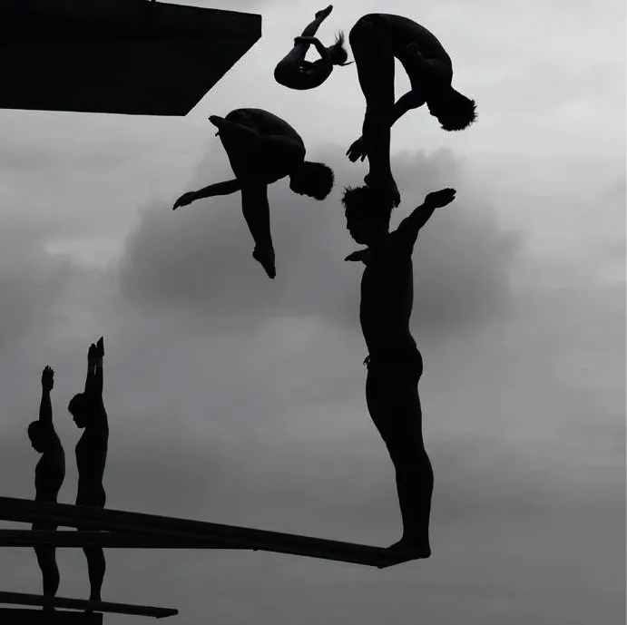

**Divers**
**潜水员**

***\*Adam Pretty\****
***\*亚当·普雷蒂\****

2011

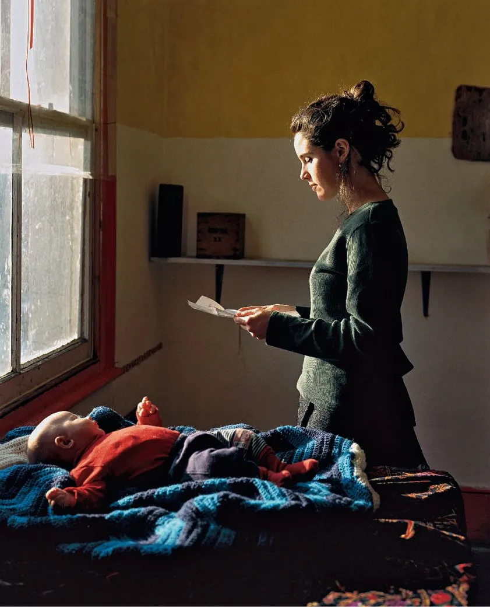

**Woman Reading Possession Order**
**女人读占有令**

***\*Tom Hunter\****
***\*汤姆·亨特\****

1997

***\*LIGHT\****
***\*光\****

***\*Light is your subject\****
***\*光是你的主题\****

You can’t pick it up. You can’t bump into it. You can’t give it a cuddle – light is intangible. But to take great photographs you need to start thinking of light as an object – an object with the elusive power of a shapeshifter.
你无法将它捡起。你无法撞到它。你无法拥抱它——光是无形的。但要拍出精彩的照片，你需要开始将光视为一个物体——一个具有难以捉摸的变形能力的物体。

Everything is at the mercy of light. What’s arresting one minute can leave no impression the next, simply because of a change in the light. The mundane can become beautiful and the beautiful, mundane. Just look at the light in this image by Tom Hunter. What mood is it creating?
一切都受光的支配。前一分钟还引人注目的东西，后一分钟可能就没有任何印象了，这仅仅是因为光线的变化。平凡可以变得美丽，而美丽的东西，平凡。看看汤姆·亨特这张照片中的光线。它创造了什么样的氛围？

***\*Whether you have your camera with you or not, the only way to learn about light is to observe it constantly.\****
***\*无论您是否携带相机，了解光的唯一方法就是不断观察它。\****

When you’re sitting at your desk, walking down the street or driving your car, ask yourself, ‘how is the light affecting the space and atmosphere around me?’ Notice how it draws out textures, colour and detail. How it attracts your attention to a specific point within a scene. How it gives a space depth or makes it seem absolutely flat.
当您坐在办公桌前、走在街上或开车时，请问问自己，“光线如何影响我周围的空间和氛围？”注意它如何呈现纹理、颜色和细节。它如何吸引您的注意力到场景中的特定点。它如何赋予空间深度或使其看起来绝对平坦。

But with all its infinite forms and variations, light can be split into two fundamental types – hard and soft. Both have particular traits that affect the overall mood of your image. In this chapter we’re going to start by comparing and contrasting some of the most common.
但是，尽管光的形式和变化无穷，它还是可以分为两种基本类型——硬光和软光。这两种光都有影响图像整体氛围的特定特征。在本章中，我们将首先比较和对比一些最常见的光。

***\*Hard light\****
***\*硬光\****

***\*Hard light creates contrast\****
***\*硬光创造对比\****

***\*For other examples:\****
***\*其他示例：\****

Lars Tunbjörk p. 24
Lars Tunbjörk 第 24 页

Philip-Lorca diCorcia p. 91
Philip-Lorca diCorcia 第 91 页

René Burri p. 93
René Burri 第 93 页

Hard light comes from one direction and is typical of a spotlight or bright sunshine. Due to its intensity, one of the most common traits of hard light is high contrast.
硬光来自一个方向，是聚光灯或明亮阳光的典型特征。由于其强度，硬光最常见的特征之一是高对比度。

Trent Parke is a photographer who uses this kind of light to transform urban landscapes into something less familiar. Here the hard light cuts through the city forming an island of light where a couple stand seemingly marooned. But they’re not without their supplies. Accompanying them
特伦特·帕克 (Trent Parke) 是一位摄影师，他利用这种光线将城市景观变成一种不太熟悉的景象。在这里，强光穿过城市，形成一个光岛，一对夫妇站在那里，似乎被孤立了。但他们并非没有补给。陪伴他们的

in the highlights is everything they need, from a place to stay and somewhere to eat in the form of a motel and a fast food restaurant.
亮点是他们需要的一切，从住宿到以汽车旅馆和快餐店形式的就餐场所。

***\*Hard light causes anything in its path to become a highlight, while everything else remains dark.\****
***\*硬光会使其路径上的任何物体变成高光，而其他物体则保持黑暗。\****

You can use the contrasts created by hard light to abstract or simplify your composition. That’s exactly what’s going on here. The shadows form large areas of black, which mask unnecessary detail. This, in turn, causes our eyes to be drawn to the highlights.
你可以利用强光产生的对比来抽象或简化你的构图。这正是这里发生的事情。阴影形成大片黑色，掩盖了不必要的细节。这反过来又导致我们的目光被吸引到高光部分。

The unevenness of hard light makes it tricky to work with, as you will lose detail somewhere. This is another situation where exposure compensation helps. Scroll towards the ***\*+\**** to bring out detail in the shadows and to the ***\*–\**** to bring out the detail in the highlights.
强光的不均匀性使得拍摄变得棘手，因为您会丢失某些细节。这是曝光补偿有用的另一种情况。向***\*+\****滚动可显示阴影中的细节，向***\*-\****滚动可显示高光中的细节。

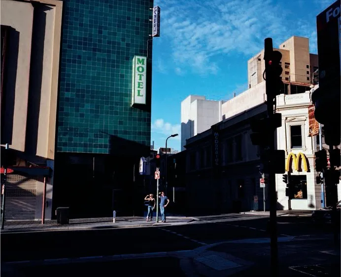

Heinley Street, Adelaide
阿德莱德海因利街

***\*Trent Parke\****
***\*特伦特·帕克\****

2006

***\*Soft light\****
***\*柔和的灯光\****

***\*Soft light is more even\****
***\*柔和光线更均匀\****

***\*For other examples:\****
***\*其他示例：\****

Alkan Hassan p. 21
Alkan Hassan 第 21 页

Sebastião Salgado p. 45
塞巴斯蒂安·萨尔加多 第 45 页

Richard Learoyd p. 73
Richard Learoyd 第 73 页

If hard light packs a punch, soft light is more like a massage.
如果硬光具有强大的冲击力，那么软光则更像是一种按摩。

In Ryan McGinley’s photograph a young man holds an alligator. But rather than being laden with drama, this image imbues a state of calm. His grip is more of an embrace and the black and white adds a touch of melancholy. But it’s the soft light that’s truly dictating the mood here.
在瑞恩·麦克金利 (Ryan McGinley) 的照片中，一名年轻男子抱着一只鳄鱼。但这张照片并没有充满戏剧性，反而给人一种平静的感觉。他的握持更像是拥抱，黑白色调增添了一丝忧郁。但真正决定这里气氛的是柔和的光线。

***\*Soft light is less intense meaning there isn’t such a stark divide between the highlights and shadows.\****
***\*柔和的光线不太强烈，这意味着高光和阴影之间没有那么明显的界限。\****

Soft light still casts shadow as it very often comes from one direction, like hard light. But the shadows aren’t nearly as dark and dramatic. Rather than being a void of black, detail is still very visible. This more even quality tends to make images feel ‘slower’ and more contemplative.
柔和的光线仍会投射阴影，因为它通常来自一个方向，就像硬光一样。但阴影并不那么暗淡和戏剧化。细节仍然非常清晰，而不是一片漆黑。这种更均匀的质量往往会让图像感觉“更慢”和更沉思。

To soften light you need to diffuse it. In the studio this can be achieved by using what’s called a ‘soft box’. In more everyday conditions, where you have less control over the light, steer clear of any powerful directional light sources, such as spotlights, flash or bright, unobstructed sunshine.
要使光线柔和，您需要将其散射。在工作室中，可以使用所谓的“柔光箱”来实现这一点。在日常情况下，您无法控制光线，因此请避开任何强大的定向光源，例如聚光灯、闪光灯或明亮、无遮挡的阳光。

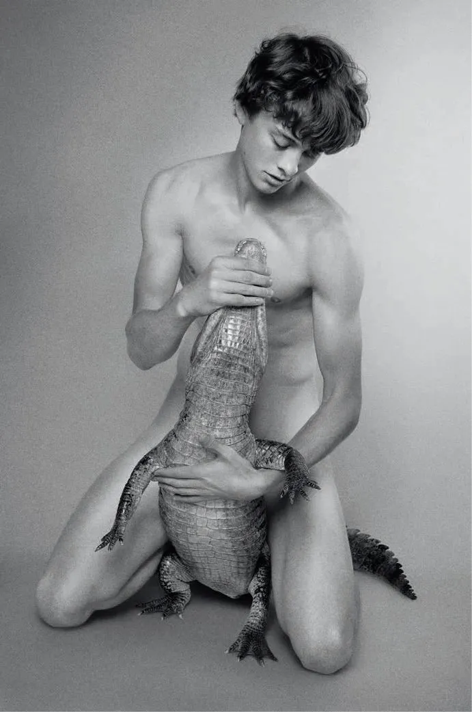

**Wes (Gator)**
**韦斯（鳄鱼）**

***\*Ryan McGinley\****
***\*瑞安·麦金利\****

2010

***\*Hard light\****
***\*硬光\****

***\*Hard light creates depth\****
***\*硬光创造深度\****

***\*For other examples:\****
***\*其他示例：\****

Naoya Hatakeyama p. 41
畠山直哉 p. 41

Fay Godwin’s black-and-white photographs celebrate the ever-changing light and landscape of the British Isles. Avoiding the sugar coated lies of picture postcards, Godwin’s photographs instead show rural scenes interrupted by industry, both ancient and modern. Here a circle of standing stones seem engaged in a solemn meeting which has lasted three and a half thousand years.
费伊·戈德温的黑白照片颂扬了英国群岛不断变化的光线和风景。戈德温的照片没有使用明信片中那种甜言蜜语的谎言，而是展示了被工业所干扰的乡村风光，既有古代的，也有现代的。在这里，一圈立石似乎正在进行一场持续了三千五百年的庄严会议。

Shadows tell us the whole truth about light. They show us where it’s coming from and how intense it is. In this image taken just after a hailstorm, a sudden swath of hard sunlight breaks through the clouds, creating dark shadows with razor-sharp edges.
阴影告诉我们有关光的全部真相。它们告诉我们光从何而来，以及光有多强烈。在这张刚过冰雹后拍摄的照片中，一束强烈的阳光突然穿透云层，形成了边缘锋利的黑色阴影。

***\*The strong, decisive shadows that go hand in hand with hard light create depth and three-dimensionality.\****
***\*强烈而果断的阴影与硬光相结合，创造出深度和立体感。\****

The shadows emphasize the jagged shape of the stones and accentuate their angles. It brings the stones to life and gives them more presence. We see that each is different; each has its own character and story to tell.
阴影突出了石头的锯齿状形状，并突出了它们的角度。它使石头栩栩如生，更具存在感。我们看到每颗石头都是不同的；每颗都有自己的特点和故事要讲述。

A few moments later the light would have changed and the shadows disappeared. But you don’t need this kind of dramatic light to create captivating landscapes. In fact, as you’ll see over the page, soft light does something completely different, but equally alluring.
几分钟后，光线就会发生变化，阴影就会消失。但你不需要这种戏剧性的光线来创造迷人的风景。事实上，正如你在页面上看到的，柔和的光线会产生完全不同但同样迷人的效果。

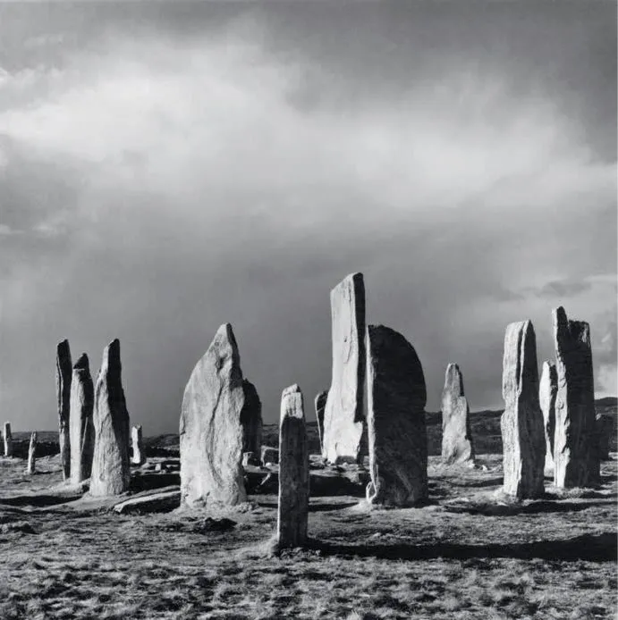

Callanish after Hailstorm, Lewis
冰雹过后的卡拉尼什，刘易斯

***\*Fay Godwin\****
***\*费伊·戈德温\****

1980

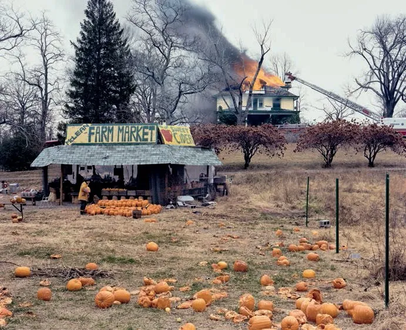

McLean, Virginia
弗吉尼亚州麦克莱恩

***\*Joel Sternfeld\****
***\*乔尔·斯特恩菲尔德\****

December 1978
1978 年 12 月

***\*Soft light\****
***\*柔和的灯光\****

***\*Soft light can be flat\****
***\*柔光可平\****

***\*For other examples:\****
***\*其他示例：\****

Richard Misrach p. 49
Richard Misrach 第 49 页

A house burns in the distance while a fireman seems more concerned with choosing the right pumpkin than putting out the flames. In this photograph by Joel Sternfeld, what should be a dramatic scene instead has an intriguing sense of the everyday about it.
远处一所房子着火了，而消防员似乎更关心的是选择合适的南瓜而不是扑灭大火。在乔尔·斯特恩菲尔德拍摄的这张照片中，本应是戏剧性的场景却呈现出一种有趣的日常感。

It’s the soft or ‘flat light’ of an overcast day that helps remove any trace of drama here. This type of light is very low in contrast. It casts little or no shadow and makes everything in an image seem flatter. What we’re left with here is a very matter-of-fact photograph, which draws us in through unanswered questions rather than instant gratification.
阴天的柔和或“平光”有助于消除任何戏剧性的痕迹。这种光线对比度很低。它几乎不投射阴影，使图像中的所有东西看起来都更平坦。我们留下的是一张非常平淡的照片，它通过未解答的问题而不是即时的满足感吸引我们。

***\*The blanket evenness of soft or flat light means that there are no dramatic shadows and highlights to create depth and draw the eye.\****
***\*柔和或平坦的灯光的均匀性意味着没有戏剧性的阴影和高光来创造深度和吸引眼球。\****

This evenness means your composition alone has to guide the viewer around your image. Here Sternfeld has used some classic compositional techniques to control the movement of our eye. I can spot three. If you need a clue, turn back to pages 10, 16 and 22.
这种均匀性意味着你的构图必须独自引导观众围绕你的图像。在这里，斯特恩菲尔德使用了一些经典的构图技巧来控制我们眼睛的运动。我能发现三种。如果你需要线索，请翻回第 10、16 和 22 页。

***\*Hard light\****
***\*硬光\****

***\*Hard light is brutal\****
***\*硬光很残酷\****

***\*For other examples:\****
***\*其他示例：\****

Martin Parr p. 18
马丁·帕尔 第 18 页

Daido Moriyama p. 79
森山大道 p. 79

Philip-Lorca diCorcia p. 91
Philip-Lorca diCorcia 第 91 页

Lee Friedlander is a photographer addicted to the brutality of hard light. His compositions of city streets, roadside encounters, American landscapes and himself are often a disorientating onslaught of space and lines, carved up by the omnipotence of light and shadow.
李·弗里德兰德是一位沉迷于强光的摄影师。他拍摄的城市街道、路边偶遇、美国风景和他本人的照片常常是令人眼花缭乱的空间和线条，被无所不能的光影所分割。

This is one of Friedlander’s most confrontational selfportraits. His finger presses down on that cable-release as though it were the trigger of a bomb. And look at the light. By facing into the light directly, Friedlander causes the shadow of the camera equipment to cut right through him, while the highlight draws us into his steely left eye. This, it’s fair to say, is Friedlander on a bad day.
这是弗里德兰德最具对抗性的自画像之一。他的手指按下快门线，就像是按下炸弹的引爆器。看看光线。弗里德兰德直接面对光线，相机设备的阴影穿过他，而高光则将我们吸引到他冷酷的左眼上。可以说，这是弗里德兰德心情不好时的照片。

***\*Hard light is dramatic. It creates cutthroat shadows and stark highlights, which are unforgiving and expose all.\****
***\*硬光非常引人注目。它能产生强烈的阴影和鲜明的高光，无情且暴露一切。\****

If you’re looking to flatter a subject then avoid hard light altogether. Friedlander isn’t out to flatter. Instead, his photographic experiments with light, space and lines repackage the world and present us with something less familiar and far more arresting.
如果你想让拍摄对象看起来更美，那就完全避免使用硬光。弗里德兰德并不是想让拍摄对象看起来更美。相反，他通过光线、空间和线条进行的摄影实验重新包装了世界，为我们呈现了一些不那么熟悉、更引人注目的东西。

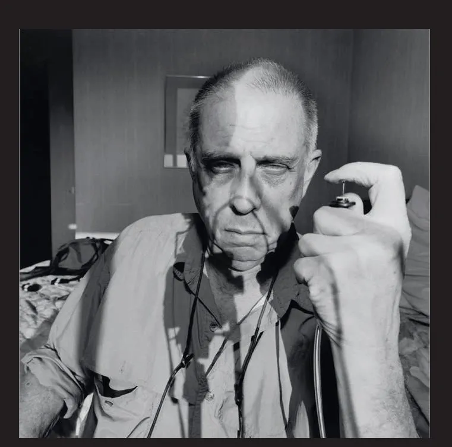

**Oregon**
**俄勒冈州**

***\*Lee Friedlander\****
***\*李·弗里德兰德\****

1997

***\*Soft light\****
***\*柔和的灯光\****

***\*Soft light is flattering\****
***\*柔和的灯光令人赏心悦目\****

***\*For other examples:\****
***\*其他示例：\****

Sebastião Salgado p. 45
塞巴斯蒂安·萨尔加多 第 45 页

Ryan McGinley p. 65
Ryan McGinley 第 65 页

Inzajeano Latif p. 123
Inzajeano Latif 第 123 页

Rather than attack a subject, soft light caresses.
柔和的光线不会攻击主体，而是会抚摸它。

Richard Learoyd uses soft light to create portraits with a deeply meditative quality. In this image, see how the shadows curve around the lines of the body, their edges slowly fading rather than coming to an abrupt stop. This is the work of very soft, or ‘diffused’ light.
Richard Learoyd 使用柔和的光线来创作具有深度冥想特质的肖像。在这幅图中，您可以看到阴影如何围绕身体线条弯曲，其边缘慢慢消失而不是突然停止。这是非常柔和或“散射”光线的效果。

***\*Portrait photographers love soft, diffused light as it draws out form and features without being severe.\****
***\*肖像摄影师喜欢柔和、散射的光线，因为它可以突出形状和特征，但又不会显得太过刺眼。\****

Soft light is a master of mediation. It softens any hard edges and smooths surfaces. It’s a light that only flatters.
柔和的光线是调和的高手。它能柔化任何硬边并使表面变得光滑。这是一种只会让人赏心悦目的光线。

Experiment by placing your subject at different angles to the light. See how the shadows change, giving your subject a greater or lesser sense of three-dimensional form.
尝试将拍摄对象放置在与光线成不同角度的位置。观察阴影如何变化，让拍摄对象呈现出或多或少的三维感。

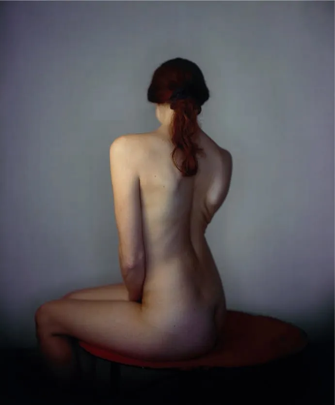

**Jemma on Mirror**
**镜子里的杰玛**

***\*Richard Learoyd\****
***\*理查德·利罗伊德\****

2010

***\*Natural and artificial light\****
***\*自然光和人造光\****

***\*The connotations of colour\****
***\*颜色的内涵\****

***\*For other examples:\****
***\*其他示例：\****

Luca Campigotto p. 38
Luca Campigotto 第 38 页

Denis Darzacq p. 53
丹尼斯·达扎克 第 53 页

Maciej Dakowicz p. 116
Maciej Dakowicz 第 116 页

Another way to categorize light is by **natural** or **artificial**.
对光进行分类的另一种方法是根据光是**自然光**还是**人造光**。

Natural light comes, in one form or another, from the sun. Artificial light comes from manmade sources – anything from household bulbs to street lights to flash.
自然光以各种形式来自太阳。人造光则来自人造光源——从家用灯泡到路灯再到闪光灯。

***\*Natural and artificial light are unequivocally distinct. They convey different moods and are very different in colour.\****
***\*自然光与人造光有着明显的不同。它们传达出不同的情绪，颜色也大不相同。\****

Here Nadav Kander photographs an anonymous house overshadowed by a monolithic overpass. See how the sodium glow of the street lights has drowned out the natural light and cast a yellowish hue over the image. This creates a sense of unease. It makes the scene feel so unnatural, almost polluted.
这里，纳达夫·坎德 (Nadav Kander) 拍摄了一座被巨大的立交桥遮蔽的无名房屋。看看路灯的钠光如何淹没了自然光，并在图像上投下了淡黄色的色调。这给人一种不安的感觉。它让场景感觉如此不自然，几乎被污染了。

For a very different kind of light look back to the photograph by Tom Hunter at the start of this chapter. It shows a woman reading a possession order in the light of a window. The natural light gently touches the woman, the letter and her baby. Its colour is so ‘white’, it creates a state of innocent calm.
要想看到一种非常不同的光线，请回顾本章开头汤姆·亨特拍摄的照片。照片中，一名妇女在窗户的灯光下阅读占有令。自然光轻轻地照耀着这名妇女、这封信和她的孩子。它的颜色是如此的“白”，营造出一种纯真平静的状态。

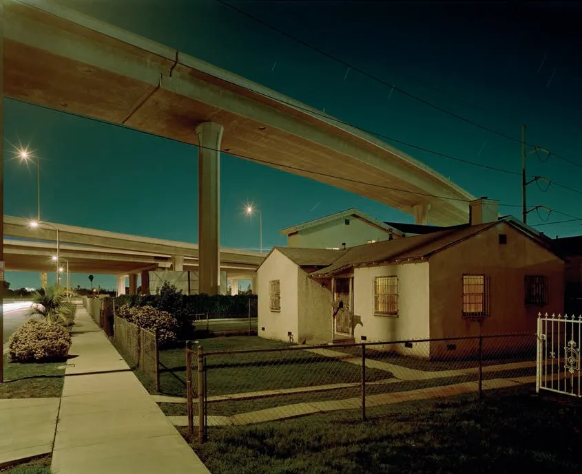

**House under Highway**, Los Angeles
洛杉矶**高速公路下的房屋**

***\*Nadav Kander\****
***\*纳达夫·坎德\****

2005

***\*White balance\****
***\*白平衡\****

***\*Controlling colour\****
***\*控制颜色\****

Light comes in all sorts of different colours. Daylight can be quite blue, or cool, while household lights can be quite orange, or warm.
光有各种不同的颜色。日光可以是相当蓝的，或冷的，而家用灯可以是相当橙的，或暖的。

Adjusting your white balance allows you to either accentuate the colour of the light or make it seem more neutral, or ‘white’. This is important when it comes to conveying a particular mood or atmosphere in your image. So, for your shooting convenience, your camera comes with a few white balance presets, which match some of the most commonly encountered lighting conditions:
调整白平衡可让您突出光线的颜色或使其看起来更中性或“白色”。这对于在图像中传达特定的情绪或氛围非常重要。因此，为了方便您拍摄，您的相机附带一些白平衡预设，可匹配一些最常见的照明条件：

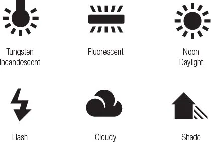

Each of these symbols represents a particular colour (or temperature) of light. By selecting the symbol that best matches your shooting conditions, the colours in your image will look truer to life.
每个符号都代表一种特定的光色（或温度）。通过选择最符合您拍摄条件的符号，您图像中的颜色将看起来更加逼真。

To get a feel for this, shoot the same subject using different white balance settings and you’ll see how the colours change.
为了感受这一点，请使用不同的白平衡设置拍摄同一物体，您将看到颜色如何变化。

As Nadav Kander has shown on the previous doublepage, an image that looks ‘too blue’ or ‘too orange’, for example, isn’t necessarily a bad thing. You can use the colour of light to provoke an emotional response in the viewer. Giving your image a slightly blue cast makes it feel cooler. Giving it an orange cast makes it feel warmer.
正如 Nadav Kander 在上一页中展示的那样，看起来“太蓝”或“太橙”的图像不一定是坏事。你可以利用光的颜色来激发观众的情绪反应。给图像略带蓝色色调会让它感觉更冷。给它橙色色调会让它感觉更暖。

Don’t get too hung up on perfecting white balance, because setting your camera to ‘Auto WB’ (***\*AWB\****) generally does a pretty good job. It’s only in extreme cases that you need to change it yourself.
不要太纠结于白平衡的完善，因为将相机设置为“自动白平衡”（ ***\*AWB\**** ）通常效果很好。只有在极端情况下，您才需要自己更改它。

***\*Inbuilt flash\****
***\*内置闪光灯\****

***\*The light without love\****
***\*没有爱的光\****

A woman runs down a debris-strewn alleyway barefoot and wearing nothing but a white nightgown. The camera angle is low; the frame skewed. This drama is arrested in the violent light of Daido Moriyama’s flash, which reaches out for the woman like the frenzied grasp of a psychopath.
一名女子赤脚跑过一条碎石遍地的小巷，身上只穿着一件白色睡衣。摄影机角度很低，画面歪斜。森山大道的闪光灯发出强烈光线，将这一戏剧性场面定格，闪光灯像精神病患者疯狂抓握一样向女子伸出。

***\*Inbuilt flash dominates the look and feel of an image.\****
***\*内置闪光灯决定图像的外观和感觉。\****

As the flash lights your subject from the same angle as the one you’re shooting from, harsh shadows are thrown forward and its intensity causes anything in the very foreground, or slightly reflective, to become overexposed.
当闪光灯从与拍摄角度相同的角度照亮拍摄对象时，会向前投射出刺眼的阴影，并且其强度会导致前景中的任何物体或略微反光的物体曝光过度。

The use of inbuilt flash dowses Moriyama’s image with an unsettling yet mesmerizing fear. But, if used less skillfully, it can also work against you and create a snapshot look that is wholly unflattering on a subject, so proceed with caution.
内置闪光灯的使用为森山的照片增添了一种令人不安却又令人着迷的恐惧感。但是，如果使用不当，它也会对你不利，并产生完全不讨人喜欢的快照效果，因此请谨慎操作。

Shooting in ***\*P\**** (on most cameras) or ‘Shutter’ or ‘Aperture Priority’ (on all cameras) means your flash won’t fire. Alternatively all cameras have the option to turn off the flash. If it’s dark, you could increase your ISO instead (need a reminder? See p.50).
在***\*P 模式\****下拍摄（大多数相机）或“快门”或“光圈优先”模式（所有相机）意味着闪光灯不会闪光。或者，所有相机都可以选择关闭闪光灯。如果天色昏暗，您可以增加 ISO（需要提醒吗？请参阅第 50 页)。

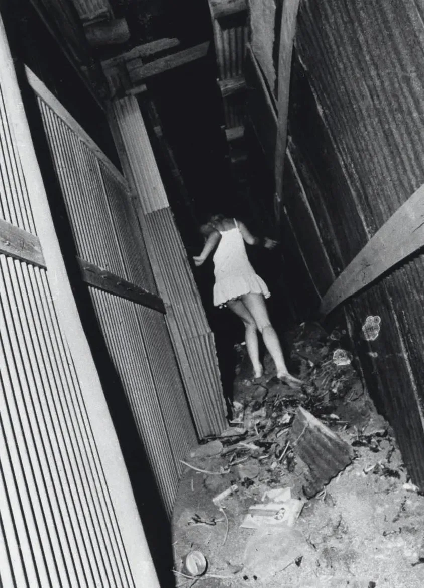

Untitled (woman in white dress running in Yokosuka)
无题（穿白衣的女子在横须贺奔跑）

***\*Daido Moriyama\****
***\*森山大道\****

1971

***\*Fill flash\****
***\*填充闪光灯\****

***\*Daylight flasher\****
***\*日光闪光器\****

***\*For other examples:\****
***\*其他示例：\****

Martin Parr p. 18
马丁·帕尔 第 18 页

Philip-Lorca diCorcia p. 91
Philip-Lorca diCorcia 第 91 页

This model’s speciality must be swimsuits rather than hands if she’s willing to offer up her finger to a passing seagull like that.
如果这位模特愿意向这样一只路过的海鸥伸出自己的手指，那么她擅长的肯定是泳衣而不是手。

The reason this shot looks so ‘electric’ is because Elaine Constantine has used flash in daylight or ‘fill flash’. Here, it’s made the foreground subject stand out and given the shot amazing energy.
这张照片之所以看起来如此“充满活力”，是因为 Elaine Constantine 在日光下使用了闪光灯或“补光灯”。在这里，它使前景主体脱颖而出，并赋予照片惊人的活力。

***\*To force your flash to fire find the button or menu icons marked by\****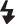***\*and scroll through the options.\****
***\*要强制闪光灯闪光，请找到标有\*******\*的按钮或菜单图标，然后滚动浏览选项。\****

If you’re shooting a backlit scene or just want to make your subject stand out even though it’s not necessarily dark, fill flash will do the job. But fill flash is an artificial light source so it won’t give your image a natural look.
如果您拍摄的是逆光场景，或者只是想让拍摄对象突出，即使拍摄环境并不一定很暗，补光闪光灯也能满足您的需求。但补光闪光灯是一种人造光源，因此不会让您的图像看起来自然。

On a side note, when a flash fires it throws light on a subject that comes and goes in an instant. This causes any movement within the reach of the flash to be frozen. So what we’re looking at here is the result of the flash, rather than a very fast shutter speed.
顺便提一下，闪光灯闪光时，光线会瞬间照射到来去匆匆的物体上。这会导致闪光灯照射范围内的任何运动都冻结。因此，我们在这里看到的是闪光灯的效果，而不是非常快的快门速度。

***\*Now go out and practise\****
***\*现在出去练习\****

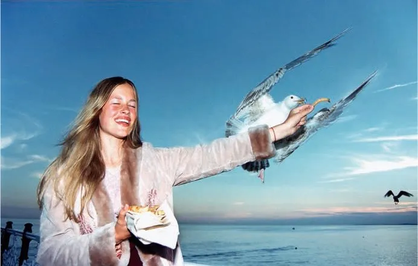

**Seagull and Chips**
**海鸥和薯条**

***\*Elaine Constantine\****
***\*伊莱恩·康斯坦丁\****

2007

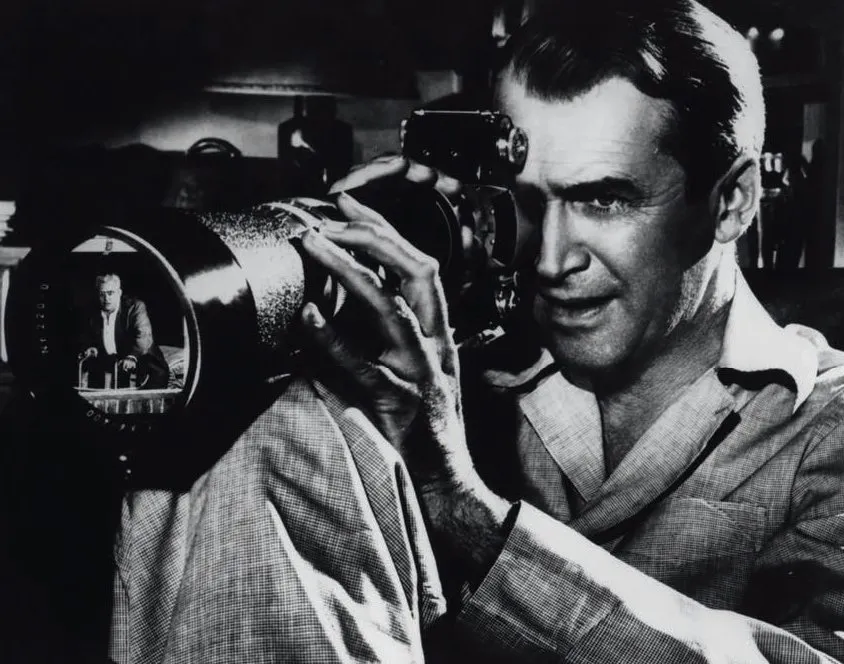

**Rear Window** film still
**后窗**电影剧照

***\*Alfred Hitchcock / Robert Burks\****
***\*阿尔弗雷德·希区柯克 / 罗伯特·伯克斯\****

1954

***\*LENSES\****
***\*镜头\****

***\*Life through a lens\****
***\*镜头下的生活\****

Lenses do more than simply make something look closer or further away.
镜头的作用不仅仅是让物体看起来更近或更远。

***\*They radically alter your relationship with your subject and the way you take pictures.\****
***\*它们从根本上改变了您与拍摄对象的关系以及拍摄照片的方式。\****

Watch Hitchcock’s **Rear Window** and you’ll see what I mean. An injured press photographer finds himself confined to his apartment and seduced by the power of a telephoto lens. From his wheelchair, he gains access to the outside world through the lens, but only as an observer, obsessed with spying on his unsuspecting neighbours from afar.
看看希区柯克的**《后窗》** ，你就会明白我的意思。一位受伤的新闻摄影师发现自己被困在公寓里，被长焦镜头的力量所吸引。他坐在轮椅上，通过镜头看到外面的世界，但只是作为一名观察者，痴迷于从远处监视毫无戒心的邻居。

Depending on its weight, a lens can make you more mobile or slow you down. Depending on its size, a lens can make you highly visible or totally discreet. Depending on its magnification, a lens can turn you into an active participant or a distant voyeur.
根据镜头的重量，镜头可以让你行动更敏捷或行动缓慢。根据镜头的大小，镜头可以让你高度显眼或完全隐蔽。根据镜头的放大倍数，镜头可以让你成为积极的参与者或远处的偷窥者。

Each of these qualities has its advantages and disadvantages. And, as we’re about to see, lenses can also distort the sense of space in a photograph and change its emphasis. But, more importantly, lenses affect what you’re actually able to photograph, as different subjects call for different types of lenses.
这些品质各有优缺点。而且，正如我们即将看到的，镜头也会扭曲照片中的空间感并改变其重点。但更重要的是，镜头会影响您实际拍摄的内容，因为不同的主题需要不同类型的镜头。

This chapter is going to help you understand some fundamental visual effects of different lenses. But first, let’s get to the bottom of some essential lens lingo that will see you through even the most gruelling of camera-club conversations.
本章将帮助您了解不同镜头的一些基本视觉效果。但首先，让我们深入了解一些基本的镜头术语，这些术语将帮助您应对最艰难的摄影俱乐部对话。

***\*Lenses made easy\****
***\*让镜头更简单\****

***\*Lens lingo\****
***\*镜头术语\****

***\*ZOOM AND PRIME\****
***\*变焦和定焦\****

Lenses can be split into two types. There are ones which allow you to zoom in and out – you guessed it: zoom lenses. And there are ones that don’t. These are called ‘prime’ or ‘fixed’ lenses as they are fixed at one particular focal length.
镜头可分为两种类型。一种镜头可以放大和缩小——你猜对了：变焦镜头。另一种镜头则不能。这些镜头被称为“定焦”或“固定”镜头，因为它们的焦距是固定的。

***\*FOCAL LENGTH\****
***\*焦距\****

This is measured in millimetres. Put simply, focal lengths are either ‘short’ or ‘long’. Shorter focal lengths give a wide-angle effect which makes objects seem further away. Longer focal lengths give a telephoto effect which makes objects seem closer.
以毫米为单位。简而言之，焦距要么“短”，要么“长”。较短的焦距会产生广角效果，使物体看起来更远。较长的焦距会产生远摄效果，使物体看起来更近。

***\*FIELD OF VIEW\****
***\*视野\****

This refers to how much of the world you can see through the lens. Wide-angle lenses (shorter focal lengths) offer a wider field of view. Telephoto lenses (longer focal lengths) offer a narrower field of view.
这指的是你可以通过镜头看到多少世界。广角镜头（焦距较短）提供更宽的视野。长焦镜头（焦距较长）提供较窄的视野。

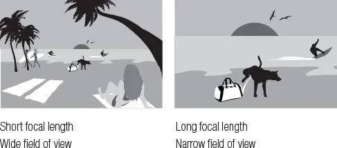

***\*SENSOR SIZE\****
***\*传感器尺寸\****

Focal lengths do different things on different cameras. For example, a focal length that’s considered wide on one camera might seem quite telephoto on another. This is down to the varied size of camera sensors now available. If you want to know more about this, I would go online, but prepare yourself for a lot of technical talk.
焦距对不同的相机有不同的影响。例如，在一台相机上被视为较宽的焦距在另一台相机上可能看起来相当远摄。这是因为现在可用的相机传感器尺寸各不相同。如果你想了解更多相关信息，我会上网，但请做好听大量技术性谈话的准备。

Knowing the ins and outs of why sensor size affects focal length won’t help you take better pictures (but it will help you make friends and influence people at your local camera club). That said, it is helpful to have a good idea of which focal lengths give which effects on your own camera, so here’s a table for you to refer back to during this chapter.
了解传感器尺寸影响焦距的来龙去脉并不能帮助您拍出更好的照片（但它可以帮助您结交朋友并影响当地摄影俱乐部的人）。话虽如此，了解哪种焦距会对您的相机产生哪些影响还是很有帮助的，因此这里有一个表格供您在本章中参考。

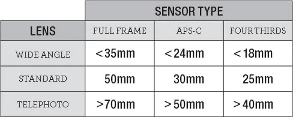

***\*Wide angle / short focal length\****
***\*广角/短焦距\****

***\*It’s all about the context\****
***\*一切都与背景有关\****

***\*For other examples:\****
***\*其他示例：\****

Cristina Garcia Rodero p. 15
克里斯蒂娜·加西亚·罗德罗 p. 15

Melanie Einzig p. 103
Melanie Einzig 第 103 页

Holly Andres’s set-up images linger somewhere between memory and make-believe. In this image see how the wide-angle lens presents us with an unusually expansive view. This has allowed more elements to be included in the composition, which, in turn, starts to piece together a story – albeit an ambiguous one.
Holly Andres 的布景照片介于记忆与虚构之间。在这张照片中，我们可以看到广角镜头如何为我们呈现一个异常广阔的视野。这使得更多的元素可以包含在构图中，反过来，这开始拼凑出一个故事——尽管是一个模糊的故事。

***\*Wide-angle lenses (or short focal lengths) cause periphery details to play an allimportant role.\****
***\*广角镜头（或短焦距）使周边细节发挥重要作用。\****

First the wide angle suggests that the viewer is in the boot of a car, like the victim of a deal gone bad. Then the shop front, the lampposts and telegraph poles all hint that this is a quick stop en route to a more final destination. And then there’s the couple. Shorter focal lengths seemingly elongate distance. This has made the woman in the background appear so small compared to that unnerving hand, which looms large in the very foreground.
首先，广角镜头让观众感觉自己身处汽车后备箱，就像交易失败的受害者。然后，商店门面、路灯柱和电线杆都暗示着这是前往最终目的地途中的短暂停留。然后是这对夫妇。较短的焦距似乎拉长了距离。这使得背景中的女人与前景中那只令人不安的手相比显得如此渺小。

When shooting with a short focal length, always keep an eye on what’s happening around your actual subject, as this context will be an important part of your image. Also, make sure you get close to your subject as shorter focal lengths make everything seem much further away.
使用短焦距拍摄时，请始终留意拍摄对象周围的情况，因为这种背景将成为图像的重要组成部分。此外，请确保靠近拍摄对象，因为较短的焦距会使所有事物看起来更远。

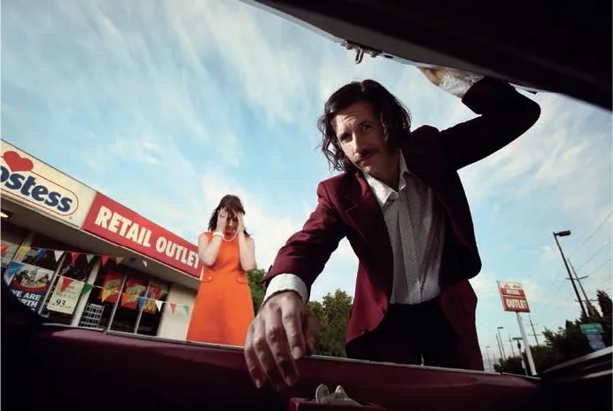

**Wonder** from ‘Full of Grace’
《充满恩典》中的**奇迹**

***\*Holly Andres\****
***\*霍莉·安德烈斯\****

2009

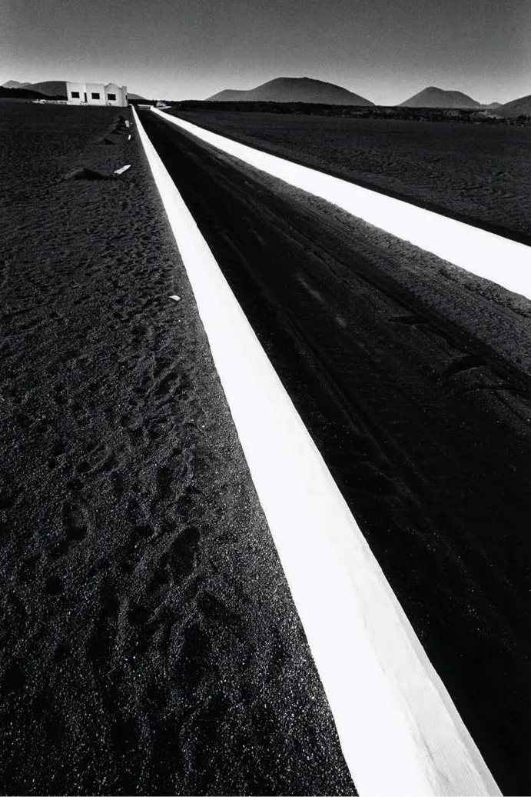

**Lanzarote**
**兰萨罗特岛**

***\*Jeanloup Sieff\****
***\*让卢普·西耶夫\****

1975

***\*Wide angle / short focal length\****
***\*广角/短焦距\****

***\*Composition is the key\****
***\*构图是关键\****

Wide-angle lenses are often used for landscapes, as they allow you to capture big vistas. But there’s a flipside. As shorter focal lengths elongate distance, points of interest that may seem relatively close with the naked eye, suddenly become insignificant details, lost within a wider composition.
广角镜头通常用于拍摄风景，因为它们可以让你捕捉到广阔的景色。但也有不利的一面。随着焦距变短，距离会变长，肉眼看起来相对较近的兴趣点突然变成了微不足道的细节，在更广阔的构图中消失了。

***\*As wide-angle lenses create a lot of space in an image, you really have to nail your composition.\****
***\*由于广角镜头在图像中创造了很大的空间，因此您必须确定自己的构图。\****

Here Jeanloup Sieff has used a very short focal length to created a dramatic sense of space. Notice how your eyes run up and down those lines, pulling you back and forth, from the foreground into the distance, like a visual tug of war. Without such a powerful compositional device the house and distant mountains would have struggled to attract our attention.
在这里，Jeanloup Sieff 使用了非常短的焦距来营造一种戏剧性的空间感。请注意你的眼睛是如何在这些线条上上下移动的，将你从前景拉到远处，就像一场视觉拔河比赛。如果没有如此强大的构图手段，房子和远处的山脉将很难吸引我们的注意力。

When shooting landscapes (or anything for that matter) with a wide-angle lens, look for leading lines and foreground interest. This will help to emphasize focal points and pull your composition together.
使用广角镜头拍摄风景（或任何事物）时，请寻找引导线和前景。这将有助于强调焦点并整合您的构图。

***\*Telephoto / long focal length\****
***\*远摄/长焦距\****

***\*Are you a predator?\****
***\*你是掠食者吗？\****

***\*For other examples:\****
***\*其他示例：\****

René Burri p. 93
René Burri 第 93 页

Telephoto lenses (or long focal lengths) reduce the risk of you getting eaten, scorched, washed away, hit by stray balls or sued. All because they make distant subjects appear closer. But there’s more to telephoto lenses than that.
远摄镜头（或长焦距镜头）可降低您被吃掉、烧焦、冲走、被流弹击中或被起诉的风险。所有这些都是因为它们使远处的物体看起来更近。但远摄镜头的作用远不止于此。

***\*Telephoto lenses transform you into a hidden observer – someone who is suddenly able to capture subjects unawares.\****
***\*长焦镜头可以让您变成一个隐藏的观察者——能够突然间捕捉到意想不到的拍摄对象。\****

For his series ‘Heads’, Philip-Lorca diCorcia set up a photographic trap using a telephoto lens and an offcamera flash. When people walked into frame diCorcia shot the picture from afar, capturing his subjects as they walked down the street. The results are candid portraits of everyday people that take on a strangely filmic quality.
在他的系列作品《头像》中，菲利普·洛尔卡·迪科西亚使用远摄镜头和离机闪光灯设置了一个摄影陷阱。当人们走进画面时，迪科西亚从远处拍摄，捕捉到他们走在街上的画面。结果是普通人的真实肖像，呈现出一种奇怪的电影质感。

Telephoto lenses are essential when you’re unable to get physically close to your subject – in sports and wildlife photography for instance. But when you are able to get close, and choose not to, your images can start to feel quite predatory.
当你无法靠近拍摄对象时，长焦镜头必不可少——例如在体育和野生动物摄影中。但是当你能够靠近却选择不靠近时，你的照片就会开始让人感觉像是掠食动物。

That didn’t bother diCorcia. In fact, that’s what he wanted. But is this what you want? If not, use a shorter focal length that forces you to get in close and interact with your subject.
这并没有困扰迪科西亚。事实上，这正是他想要的。但这是你想要的吗？如果不是，请使用较短的焦距，迫使你靠近拍摄对象并与拍摄对象互动。

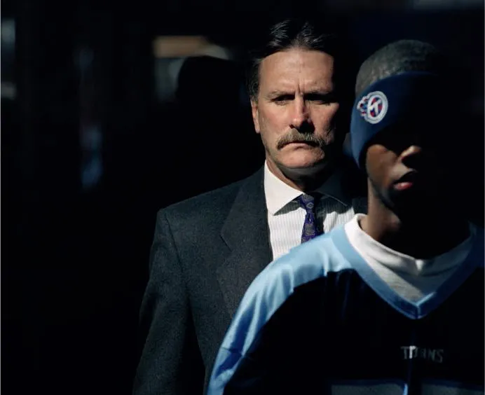

**Head #6**
**头＃6**

***\*Philip-Lorca diCorcia\****
***\*菲利普·洛尔卡·迪科西亚\****

2001

***\*Telephoto / long focal length\****
***\*远摄/长焦距\****

***\*The telephoto effect\****
***\*远摄效果\****

***\*For other examples:\****
***\*其他示例：\****

Philip-Lorca diCorcia p. 91
Philip-Lorca diCorcia 第 91 页

Here René Burri uses a telephoto lens to capture a group of men engaged in a kind of **Ocean’s Eleven** walk on top of a São Paulo skyscraper. Whatever the reason for their meeting, up here, no one risks being overheard.
这里，雷内·布里使用长焦镜头拍摄了一群男子在圣保罗摩天大楼顶上进行**“十一罗汉”**式散步的场景。无论他们相聚的原因是什么，在这里，没有人会冒着被人偷听的风险。

This kind of shot is only possible with a telephoto lens, as the high magnification allows you to home in on small details from a much bigger scene. If shot using a shorter focal length, then these men would be an insignificant detail within a sprawling cityscape.
只有使用长焦镜头才能拍摄出这种照片，因为高放大倍率可让您从更大的场景中捕捉到微小的细节。如果使用较短的焦距拍摄，那么这些人将成为广阔城市景观中微不足道的细节。

The telephoto lens causes something else to happen too. Notice how the space or depth in this image feels somehow odd.
长焦镜头也会导致其他一些情况发生。请注意这张照片中的空间或深度感觉有些奇怪。

***\*Telephoto lenses give the illusion of compressing depth, making everything seem ‘flatter’.\****
***\*长焦镜头给人一种压缩深度的感觉，使一切看起来都“更平坦”。\****

See how prominent that long avenue is within the composition. Rather than leading us into the distance, it appears like a flat, vertical strip running up the image. And look at the angles of the buildings, they seem more like layered cut-out shapes than three-dimensional objects.
看看那条长长的大道在构图中有多突出。它不是引导我们走向远方，而是看起来像一条平坦的垂直带子贯穿整个画面。看看建筑物的角度，它们看起来更像是分层的剪切形状，而不是三维物体。

This apparent flatness is a signature effect of a telephoto lens and it causes images to look more graphic.
这种明显的平坦性是长焦镜头的标志性效果，它使图像看起来更加生动。

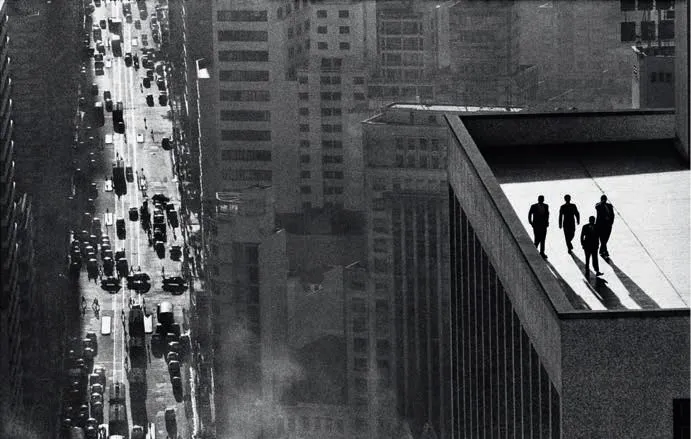

São Paulo, Brazil
巴西圣保罗

***\*René Burri\****
***\*雷内·布里\****

1960

***\*Standard focal length\****
***\*标准焦距\****

***\*Far from the standard treatment\****
***\*距离标准治疗还很远\****

Lying between short and long is a magical focal length disparagingly referred to as ‘standard’. In other words, it feels neither too wide nor too telephoto.
介于短焦距和长焦距之间的是被轻蔑地称为“标准”的神奇焦距。换句话说，它既不会让人感觉太广，也不会让人感觉太远。

For her series ‘Pull Back the Shade’, Muzi Quawson documented the life of Amanda, a local musician in search of the hippy ideal in upstate New York. But rather than photograph Amanda every now and then, Quawson literally moved in with her, sometimes for months at a time, and documented every aspect of her life.
穆兹·夸森 (Muzi Quawson) 在她的系列作品《揭开阴影》 (Pull Back the Shade) 中记录了阿曼达 (Amanda) 的生活，阿曼达是一名在纽约州北部寻找嬉皮士理想的当地音乐家。但夸森并没有时不时地拍摄阿曼达，而是直接搬去和她同住，有时一住就是几个月，并记录了她生活的方方面面。

***\*A ‘standard’ focal length gets you close to your subject, without being too close.\****
***\*“标准”焦距可让您靠近拍摄对象，但又不会太近。\****

Using this standard focal length allowed Quawson to document her subject’s life without becoming intrusive. The results are incredibly intimate photographs, which are also extraordinarily candid.
使用这种标准焦距，Quawson 可以记录拍摄对象的生活，而不会打扰拍摄对象。拍摄出来的照片非常私密，而且非常坦诚。

When deciding on which focal length to use, think about how this will affect your physical position in relation to your subject, and how that then affects the way people will ‘read’ your images.
当决定使用哪个焦距时，请考虑这将如何影响您相对于拍摄对象的物理位置，以及这将如何影响人们“阅读”您的图像的方式。

Here, a wider lens would have forced Quawson to get physically closer to achieve this level of intimacy, but that would have been too invasive. A telephoto, on the other hand, would have forced her to keep her distance, but that would have felt predatory.
在这里，广角镜头会迫使 Quawson 身体靠近，以达到这种亲密程度，但那样会太过侵犯。另一方面，长焦镜头会迫使她保持距离，但那样会让人觉得她像是在掠夺。

Quawson’s preferred lens is a prime: one with no zoom capability. She’s not alone in this regard, and for good reason…
Quawson 最喜欢的镜头是定焦镜头：没有变焦功能。她并不是唯一一个喜欢这种镜头的人，理由很充分……

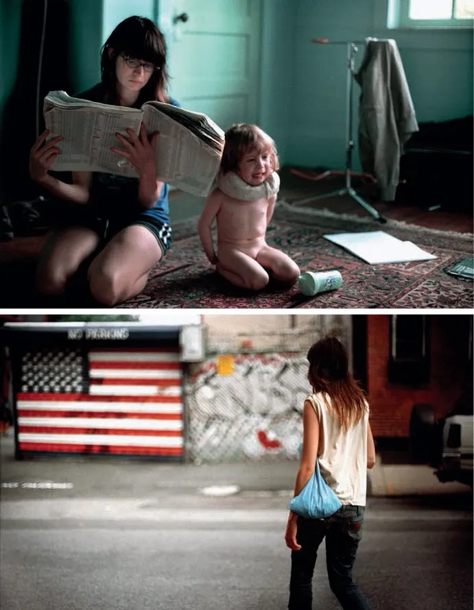

**Inside the Bluehouse**
**蓝屋内部**

**Union City Blues** from ‘Pull Back the Shade’
**联合城蓝调**（摘自《Pull Back the Shade》）

***\*Muzi Quawson\****
***\*穆兹·夸森\****

2002–06

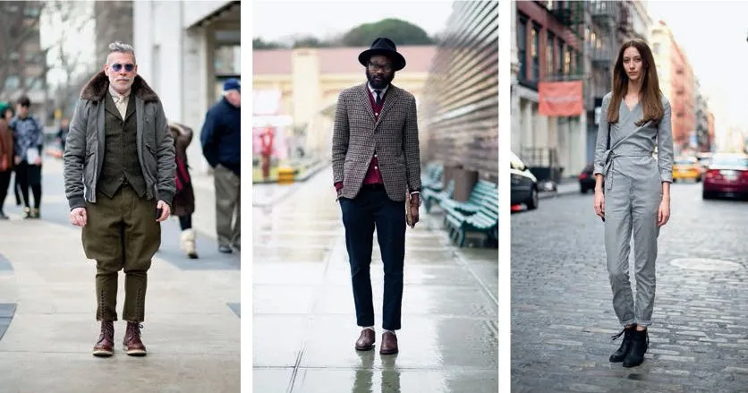

From ‘I’m Koo’
摘自《我是 Koo》

***\*Youngjun Koo\****
***\*具永俊\****

2013

***\*Prime lenses\****
***\*定焦镜头\****

***\*Prime examples\****
***\*主要例子\****

***\*For other examples:\****
***\*其他示例：\****

Alkan Hassan p. 21
Alkan Hassan 第 21 页

Sebastião Salgado p. 45
塞巴斯蒂安·萨尔加多 第 45 页

Muzi Quawson p. 95
Muzi Quawson 第 95 页

Shikhei Goh p. 98
Shikhei Goh 第 98 页

Youngjun Koo’s website (koo.im) featuring his distinctively clean, fresh portraits of nattily dressed fashionistas on the street has become a Mecca among fashion blogs.
Youngjun Koo 的网站 (koo.im) 以他独特的干净、清新的街头时尚达人肖像为特色，已成为时尚博客中的圣地。

Koo uses a prime lens – one fixed at a specific focal length with no zoom capability. You might think that sounds limiting but primes carry real advantages.
Koo 使用定焦镜头——焦距固定且无变焦功能的镜头。您可能认为这听起来很局限，但定焦镜头确实具有优势。

***\*Prime lenses offer wider maximum apertures, giving a much shallower depth of field.\****
***\*定焦镜头提供更大的最大光圈，从而提供更浅的景深。\****

Here, the shallow depth of field causes the subjects to really come forward against a soft background. Our attention is drawn to the people and their clothes instead of the urban busyness surrounding them. And what’s the other payoff of wider apertures? You’ve got it: faster shutter speeds. That’s always handy, especially in low light.
在这里，浅景深使拍摄对象在柔和的背景下显得格外突出。我们的注意力被吸引到人物和他们的衣服上，而不是他们周围的城市喧嚣。大光圈还有什么好处呢？你懂的：快门速度更快。这总是很方便，尤其是在弱光下。

All this and the fact that they’re often cheaper, optically superior and lighter than their zooming counterparts make prime lenses altogether great. So if you want to get the ‘Koo look’ use a prime lens. One with a fairly standard focal length will fit like a glove.
所有这些，以及它们通常比变焦镜头更便宜、光学性能更优越和更轻的事实，使得定焦镜头总体上非常出色。因此，如果您想获得“Koo 风格”，请使用定焦镜头。具有相当标准焦距的定焦镜头非常适合。

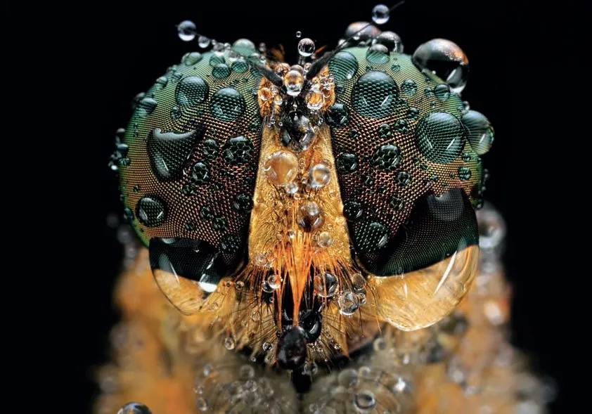

**Dew on Me**
**露水在我身上**

***\*Shikhei Goh\****
***\*吴世凯\****

2012

***\*Macro photography\****
***\*微距摄影\****

***\*Close encounters of the macro kind\****
***\*近距离接触\****

***\*For other examples:\****
***\*其他示例：\****

Edward Weston p. 108
爱德华·韦斯顿 第 108 页

Macro photography – the art of photographing extreme close-ups – has the ability to transform everyday objects into alien forms and totally change our perception of the world around us.
微距摄影——拍摄极端特写的艺术——能够将日常物体转变为陌生的形式并彻底改变我们对周围世界的看法。

***\*The most common macro lenses tend to be telephoto primes.\****
***\*最常见的微距镜头往往是远摄定焦镜头。\****

As they are prime, the optical clarity is fantastic, while the high magnification means you don’t need to be quite as physically close to your little subject as you might think.
由于它们是定焦镜头，因此光学清晰度极佳，而高放大倍数意味着您不需要像您想象的那样在物理上靠近您的小拍摄对象。

Here Shikhei Goh trains his lens on a giant set of bug eyes covered in droplets of water. By doing so he makes visible the amazingly complex patterns and textures of the insect’s eyes, which most of us have never been confronted with before. This macro effect gives the bug a monumental presence, like one of the cast from **Honey, I Shrunk the Kids**.
在这里，Shikhei Goh 将镜头对准了一组巨大的虫眼，上面覆盖着水滴。通过这种方式，他可以看到昆虫眼睛的惊人复杂图案和纹理，这是我们大多数人以前从未见过的。这种微距效果使虫子具有巨大的存在感，就像**《亲爱的，我把孩子缩小了》**中的演员一样。

Even though you’re working on such a small scale, all the same compositional techniques apply. Here Goh has used symmetry to create balance. Also, notice how the shallow depth of field creates a nice three-dimensional effect and draws our attention to specific details.
即使你正在创作一幅如此小的作品，所有相同的构图技巧都适用。在这里，Goh 使用了对称性来创造平衡。另外，请注意浅景深如何创造出漂亮的三维效果，并将我们的注意力吸引到具体的细节上。

***\*Now go out and practise\****
***\*现在出去练习\****

**The Lightness of Being**
**存在的轻松**

***\*Chris Levine\****
***\*克里斯·莱文\****

2004

***\*SEEING\****
***\*看见\****

***\*Don’t look. See.\****
***\*别看，看看吧。\****

So you’ve got a handle on the technical stuff. You’ve got a good idea about composition. Light and lenses too. So how do you use all that to take great pictures?
所以你掌握了技术方面的东西。你对构图很有想法。光线和镜头也很好。那么你如何利用所有这些来拍出好照片呢？

Well, this is where you go out and practise. Give it a go yourself. Take pictures. Embrace the mistakes and try again. But mastering techniques alone will only get you so far.
好吧，这就是你出去练习的地方。自己尝试一下。拍照。接受错误并重试。但仅掌握技巧并不能让你走这么远。

***\*If you want to take great pictures, ones that really stand out from the crowd, you need to stop looking and start seeing.\****
***\*如果您想要拍出出色的照片，真正脱颖而出的照片，您需要停止“观看”，开始观察。\****

**Seeing** is how Chris Levine captured this portrait of Queen Elizabeth. Originally commissioned to create a three-dimensional, holographic image using state-of-theart technology, Levine saw something unexpected when the Queen rested her eyes between set-ups. For a brief moment, he was no longer **looking** at the Queen, he was **seeing** Elizabeth.
克里斯·莱文 (Chris Levine) 拍摄伊丽莎白女王肖像的方式就是**“看”** 。莱文最初受委托使用最先进的技术制作一幅三维全息图像，当女王在设置间隙休息时，莱文看到了意想不到的事情。在那一瞬间，他不再**看着**女王，而是**看着**伊丽莎白。

Unfortunately your camera doesn’t have a **seeing** mode. In fact, it can’t help you with this at all. That’s because **seeing** is very personal. Everyone sees things differently – what’s fascinating to one person is banal to the next. **Seeing** is about turning on your eyes and turning off your brain. It’s about responding to your instincts.
不幸的是，你的相机没有**观看**模式。事实上，它根本帮不了你。这是因为**观看**是非常个人化的。每个人看待事物的方式都不同——对一个人来说令人着迷的东西对另一个人来说可能很平淡无奇。**观看**意味着打开你的眼睛，关闭你的大脑。它意味着对你的直觉做出反应。

So what we have here aren’t techniques. They’re not hard and fast rules. Instead, they’re much more about personal approaches, feeling (sorry, there’s that word again) and rethinking what your idea of ‘good photography’ might be.
所以，我们这里要讨论的不是技巧。它们不是硬性规定。相反，它们更多的是关于个人方法、感觉（抱歉，又用这个词了）以及重新思考你对“好摄影”的定义。

***\*Decisive moments\****
***\*决定性时刻\****

***\*It’s all in the timing\****
***\*一切都取决于时机\****

***\*For other examples:\****
***\*其他示例：\****

Henri Cartier-Bresson p. 11
亨利·卡蒂埃-布列松 第 11 页

Marc Asnin p. 13
马克·阿斯宁 第 13 页

Cristina Garcia Rodero p. 15
克里斯蒂娜·加西亚·罗德罗 p. 15

Maciej Dakowicz p. 116
Maciej Dakowicz 第 116 页

A man walks into frame with a cockatoo perched on his shoulder. A Rottweiler on the prowl glances to the right. A couple embrace and a character seemingly exhausted by life slumps in the middle of the frame. What kind of strange New York allegory is this?
一名男子走进画面，肩上站着一只凤头鹦鹉。一只正在觅食的罗威纳犬向右瞥了一眼。一对情侣拥抱在一起，画面中间一个似乎因生活而精疲力竭的人物瘫倒在地。这是什么样的奇怪的纽约寓言？

Here, Melanie Einzig captures four very separate, unrelated ‘elements’ as they come together for a single moment. A second later and this beautifully odd quartet would have moved on, never to meet again.
在这里，梅兰妮·艾因齐格捕捉到了四个非常独立、毫无关联的“元素”，它们在一瞬间汇聚在一起。一秒钟之后，这四个美丽而又奇怪的元素就会离开，永远不会再相遇。

Knowing exactly when to press the shutter is one of the single most important aspects of photography. It’s what Henri Cartier-Bresson called the ‘decisive moment’ – arresting photographic instances so fleeting, they come and go in the click of a finger and hopefully a camera’s shutter.
准确知道何时按下快门是摄影中最重要的方面之一。这就是亨利·卡蒂埃-布列松所说的“决定性瞬间”——捕捉转瞬即逝的瞬间，它们在手指轻按或相机快门的瞬间出现和消失。

***\*Capturing the decisive moment, whether it’s a sudden change in the light, a telling gesture or a street scene like this is all about anticipation and instinct.\****
***\*捕捉决定性瞬间，无论是光线的突然变化、一个明显的动作还是这样的街景，都需要预测和本能。\****

If you keep your eyes peeled, you’ll soon start to see moments like this all around you. When it comes to it, you’ll have no time to think, so set your camera up in advance. You want to freeze a moment in time, so use ‘Shutter Priority’ and a fast shutter speed.
如果你保持警惕，你很快就会开始看到身边这样的瞬间。当它来临时，你没有时间去思考，所以提前设置好你的相机。如果你想定格某个瞬间，那么请使用“快门优先”和高速快门。

This is about as pure as photography gets.
这几乎是摄影最纯粹的体现。

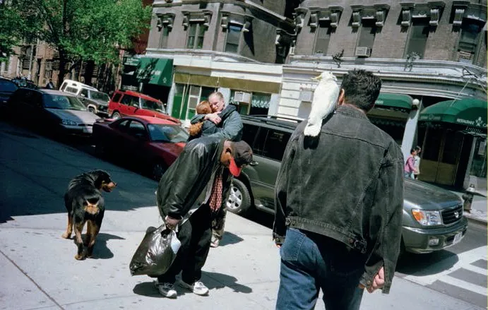

Spring Corner, New York
纽约春角

***\*Melanie Einzig\****
***\*梅兰妮·艾因齐格\****

2000

***\*The dangers of perfection\****
***\*完美的危险\****

***\*Perfect is often imperfect\****
***\*完美往往是不完美的\****

***\*For other examples:\****
***\*其他示例：\****

Bill Brandt p. 29
Bill Brandt 第 29 页

Lee Friedlander p. 71
Lee Friedlander 第 71 页

Daido Moriyama p. 79
森山大道 p. 79

Robert Frank p. 121
罗伯特·弗兰克 第 121 页

Badly composed, blurry and brilliant. The technical flaws in this image of the D-Day landing are what make it so powerful.
构图糟糕，模糊但精彩。这张诺曼底登陆照片的技术缺陷让它如此震撼。

In this case, war photographer Robert Capa photographs the event up close, in the thick of the madness. While the soldiers waded ashore with their rifles, Capa did the same, armed only with a couple of cameras. Later, his negatives were accidentally burnt in a darkroom dryer, but, rather than ending up in the bin, the few surviving images found their way into the history books.
这次，战地摄影师罗伯特·卡帕在最疯狂的时刻近距离拍摄了这一事件。士兵们带着步枪涉水上岸，卡帕也只带了几台相机。后来，他的底片在暗房烘干机中意外烧毁，但幸存下来的几张照片并没有被扔进垃圾箱，而是被载入史册。

With photography, there’s always the temptation to strive for perfection and disregard – or worse, delete – anything that falls short. But this desire for perfection can choke your creativity.
摄影时，总是有追求完美的诱惑，忽略或更糟的是删除任何不完美之处。但这种对完美的追求会扼杀你的创造力。

***\*Sometimes you can’t have it all and it’s far better to capture the right moment with the wrong settings, rather than the wrong moment with the right settings.\****
***\*有时您无法拥有一切，用错误的设置捕捉正确的时刻比用正确的设置捕捉错误的时刻要好得多。\****

Capa’s ‘crappy’ images of that day have a rawness that do more than just document the event. They capture what it must have been like to live it.
卡帕那天拍摄的“糟糕”照片不仅记录了当时的情景，还捕捉到了当时的情景。

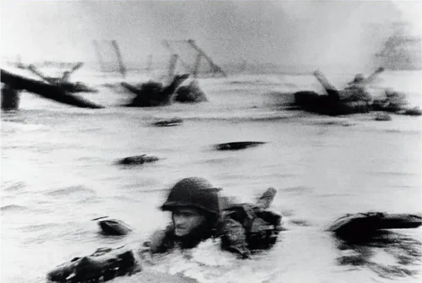

Landing of the American troops on Omaha Beach.
美军在奥马哈海滩登陆。

Normandy, France.
法国诺曼底。

***\*Robert Capa\****
***\*罗伯特·卡帕\****

June 6th, 1944
1944 年 6 月 6 日

***\*Unexpected beauty\****
***\*意想不到的美丽\****

***\*Don’t always look for ‘nice’\****
***\*不要总是寻找“好”\****

***\*For other examples:\****
***\*其他示例：\****

Lewis Baltz p. 27
刘易斯·巴尔茨 第 27 页

Maciej Dakowicz p. 116
Maciej Dakowicz 第 116 页

Robert Frank p. 121
罗伯特·弗兰克 第 121 页

**Where My Grandfather Drank #1** is the simple and poignant title of this image by Stephen J. Morgan.
**《我祖父喝酒的地方#1》**是史蒂芬·J·摩根 (Stephen J. Morgan) 创作的这幅作品的简单而深刻的标题。

Beauty. Stories. Visual poetry. They’re found in the strangest of places. Morgan found them all in the corner of a run-down social club in Birmingham.
美丽、故事、视觉诗歌。它们存在于最奇怪的地方。摩根在伯明翰一家破旧的社交俱乐部的角落里发现了它们。

It’s with the ‘nice’ subjects – sunsets, pretty flowers, hot air balloons – that you’ll actually struggle to find any of these things. The ‘nice’ subjects offer you a package deal of conventional beauty. Sure, everyone loves a sunset but your photograph will, at best, only act as a substitute for the real thing.
而对于“美丽”的主题——日落、美丽的花朵、热气球——你实际上很难找到这些东西。“美丽”的主题为你提供了一揽子的传统美。当然，每个人都喜欢日落，但你的照片充其量只能作为真实事物的替代品。

***\*Average photographers imitate beauty. Great photographers create their own.\****
***\*普通摄影师模仿美，而伟大的摄影师创造自己的美。\****

See past the obvious and hunt out a more personal and surprising version of beauty. Look for subjects that, for whatever reason, interest you, rather than the ones you think are ‘photogenic’.
抛开显而易见的东西，寻找更个性化、更令人惊奇的美。寻找那些无论出于什么原因让你感兴趣的对象，而不是那些你认为“上镜”的对象。

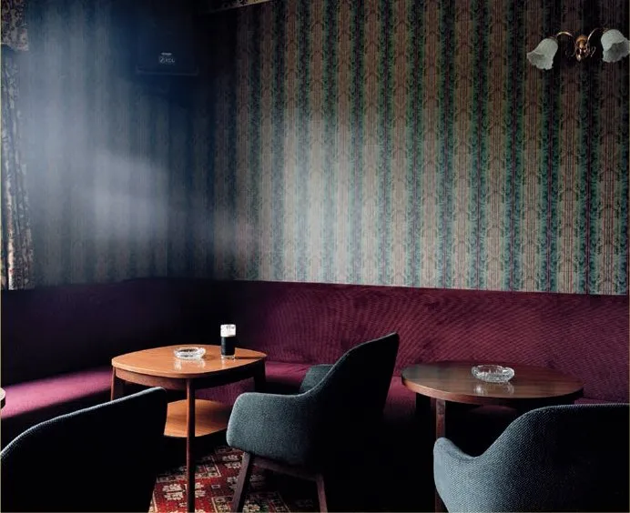

**Where my Grandfather Drank #1**
**我祖父喝酒的地方#1**

***\*Stephen J. Morgan\****
***\*史蒂芬·J·摩根\****

2002

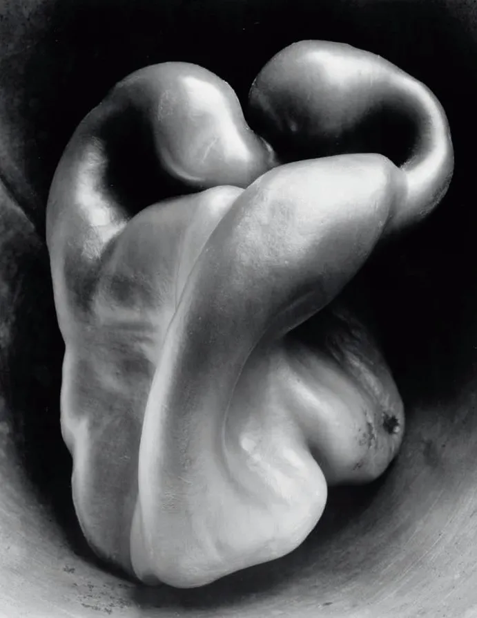

**Pepper #30**
**胡椒 #30**

***\*Edward Weston\****
***\*爱德华韦斯顿\****

1930

***\*The world unobstructed\****
***\*世界畅通无阻\****

***\*See with your eyes, not your camera\****
***\*用眼睛看，而不是用相机看\****

***\*For other examples:\****
***\*其他示例：\****

Lewis Baltz p. 27
刘易斯·巴尔茨 第 27 页

Melanie Einzig p. 103
Melanie Einzig 第 103 页

American photographer Edward Weston saw the world differently to everyone else. That’s what made him one of the all-time masters of photography. But if Weston had spent all his time looking through the lens, rather than **seeing**, this humble pepper would have been eaten long before he transformed it into one of the most famous photographs of the twentieth century.
美国摄影师爱德华·韦斯顿 (Edward Weston) 的世界观与其他人不同。这也是他成为摄影大师的原因之一。但如果韦斯顿一直把时间花在透过镜头看而不是用**眼睛看**，那么这颗不起眼的辣椒早在他拍出二十世纪最著名的照片之前就被吃掉了。

Great photographs are the result of **seeing** with your eyes. If you’re too quick to pick up your camera, you’ll risk seeing nothing. In fact, the act of looking through your camera should be the very last piece of the puzzle.
精美的照片是眼睛**观察**的结果。如果你太快拿起相机，你可能会什么也看不到。事实上，透过相机观察应该是拼图的最后一块。

***\*Sometimes, leave the camera in the bag and just spend the day seeing.\****
***\*有时，把相机放在包里，花一天时间去观察。\****

So what did Edward Weston see in **Pepper #30** that made him want to photograph it? Two figures embracing? The arch of a person’s back? A strongman flexing his muscles? Or just a beautifully abstract form in its own right?
那么，爱德华·韦斯顿在**《佩珀 #30》**中看到了什么，让他想拍摄它？两个人拥抱？一个人背部的拱起？一个大力士展示他的肌肉？还是本身就是一种美丽的抽象形式？

More to the point, what do you see in **Pepper #30**?
更重要的是，你在**Pepper #30**中看到了什么？

***\*A different point of view\****
***\*不同的观点\****

***\*Photography yoga\****
***\*摄影瑜伽\****

***\*For other examples:\****
***\*其他示例：\****

Henri Cartier-Bresson p. 11
亨利·卡蒂埃-布列松 第 11 页

Slinkachu p. 46
Slinkachu 第 46 页

Holly Andres p. 87
Holly Andres 第 87 页

Spotting the difference between a good photographer and a bad photographer is easy. It’s nothing to do with how much equipment they have. It’s nothing to do with how much they know. In fact, you can tell the difference without even looking at their pictures.
辨别优秀摄影师和糟糕摄影师之间的区别很容易。这与他们的设备数量无关。与他们的知识水平无关。事实上，你甚至不用看他们的照片就能看出区别。

***\*Good photographers are contortionists.\****
***\*优秀的摄影师都是柔术演员。\****

They’re the ones hunching, squatting and bending over backwards. They’re the ones constantly down on the ground and climbing on benches. Good photographers perform all manner of photography yoga to get **the shot**.
他们弯腰驼背、蹲下、向后弯腰。他们经常趴在地上、爬上长凳。优秀的摄影师会进行各种摄影瑜伽来**拍摄照片**。

Here Elliott Erwitt has adopted a dog’s-eye view of the world. By getting right down on the ground he’s found the perfect angle from which to tell his joke: first we smile in empathy for the small dog in the hat. Then we double take on realizing that those aren’t human legs on the left, but the legs of the world’s largest dog!
在这里，埃利奥特·厄维特采用了狗的视角来看待世界。通过趴在地上，他找到了讲笑话的最佳角度：首先，我们同情地对戴帽子的小狗微笑。然后我们再次意识到左边的不是人的腿，而是世界上最大的狗的腿！

Head height is boring. It’s an all too familiar point of view of the world, with a punch pulling neutrality. Always be looking for those unfamiliar and surprising viewpoints, even if it means getting your knees dirty.
头部高度很无聊。这是对世界非常熟悉的视角，具有中立性。始终寻找那些不熟悉且令人惊讶的观点，即使这意味着弄脏你的膝盖。

To Mr Erwitt I say ‘thank you’. I’ll happily pay for your dry cleaning.
我要对 Erwitt 先生说声“谢谢”。我很乐意为您支付干洗费用。

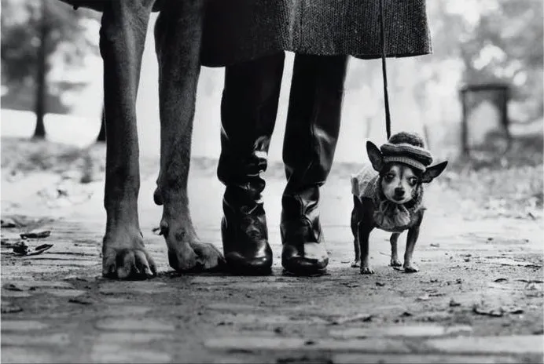

**Felix, Gladys and Rover**
**菲利克斯、格拉迪斯和罗孚**

***\*Elliott Erwitt\****
***\*艾略特·厄维特\****

1974

***\*The good from the bad\****
***\*好与坏\****

***\*Photographs without excuses\****
***\*无借口的照片\****

***\*For other examples:\****
***\*其他示例：\****

Ansel Adams p. 8
安塞尔·亚当斯 第 8 页

Martin Parr p. 18
马丁·帕尔 第 18 页

Robert Capa p. 105
罗伯特·卡帕 第 105 页

All the effort that went into capturing this shot paid off. The crew of Apollo 17 really nailed it. It’s a picture that comes without any excuses.
拍摄这张照片所付出的所有努力都得到了回报。阿波罗 17 号机组人员真的做到了。这是一张毫无借口的照片。

***\*Great photographs don’t usually offer themselves up on a plate. You have to go that extra mile to capture them.\****
***\*精美的照片通常不会轻易出现。您必须付出额外的努力才能拍摄到它们。\****

Such images often lie at the end of a patient wait, a steep climb, a long day on your feet or, in this case, a short trip into space.
这样的照片通常是在耐心等待之后、陡峭的攀登之后、长时间站立之后，或者在这种情况下，短途太空旅行之后拍摄的。

But nothing’s guaranteed. Even after all the effort, sometimes you’re left with a shot that doesn’t quite cut it. A shot that does come with excuses like, ‘just before I took this the light was incredible.’ Or, ‘yeah, I know, but I was eating my lunch just as it poked its head out the hole.’
但没有什么是可以保证的。即使付出了所有的努力，有时你还是会拍出一张不太理想的照片。拍出一张理想的照片时，你会找借口，比如“就在我拍这张照片之前，光线太棒了。”或者“是的，我知道，但我当时正在吃午餐，它就从洞里探出头来。”

Shots with excuses – we’ve all taken them – require you to be tough with yourself. Just write them off as the ones that got away. Whatever you do, don’t let the sole fact that they were hard to get warp your idea of their quality.
找借口拍摄的照片——我们都拍过——需要你对自己严厉一点。就把它们当作错过的照片吧。无论你做什么，都不要因为它们很难拍而扭曲你对它们质量的看法。

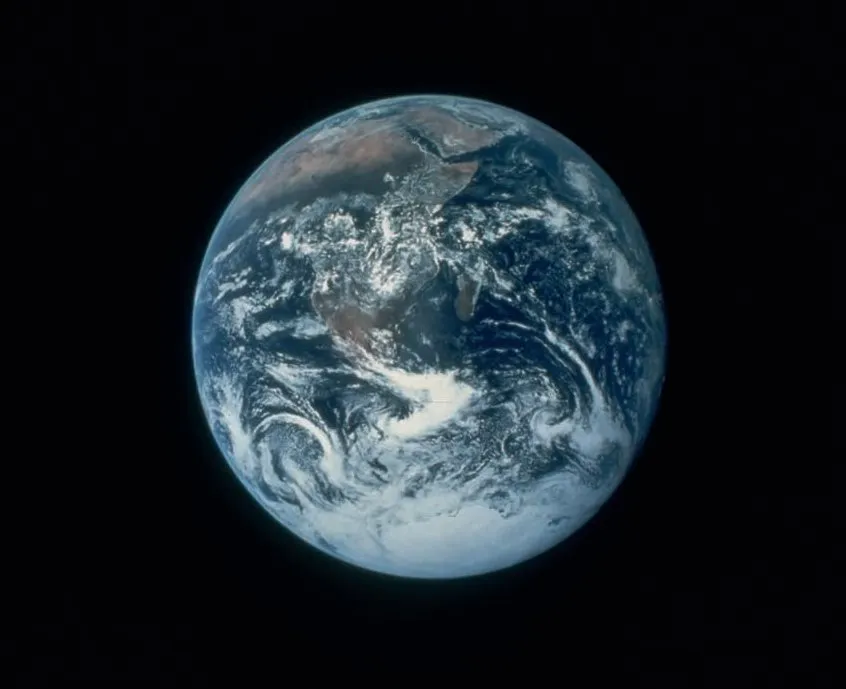

NASA picture of the Earth
美国宇航局拍摄的地球照片

***\*Apollo 17\****
***\*阿波罗 17 号\****

1972

***\*How to capture\**** ****\*the shot\*****
***\*如何\********\*拍摄\*****

***\*True or false: good photographers nail it first time?\****
***\*对还是错：优秀的摄影师第一次就能拍出好照片？\****

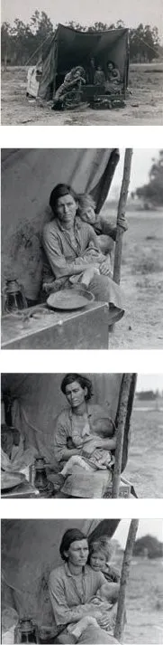

Before you answer, take a look at this photograph by Dorothea Lange, taken during the extreme hardships of America’s Great Depression.
在回答之前，请先看看多萝西娅·兰格 (Dorothea Lange) 的这张照片，它是在美国大萧条时期的极度困难时期拍摄的。

Just look at that deeply preoccupied gaze. The turned heads of the children. That delicately placed hand and that strong vertical forearm. This image has an intensity that makes it totally compelling.
看看那深沉专注的目光。孩子们转过头去。那只手放在精致的位置，那只强壮的垂直前臂。这幅图像具有一种令人信服的强度。

**Migrant Mother** is the iconic finale to a few other, not so amazing, photographs. But if Lange hadn’t taken those other shots, she’d never have captured this one.
**《移民母亲》**是其他几张不那么令人惊叹的照片的标志性结局。但如果兰格没有拍摄其他照片，她就永远不会拍下这张照片。

***\*When shooting, give yourself time and keep probing. Often the act of taking pictures leads you to what you’re looking for.\****
***\*拍摄时，给自己一些时间并不断探索。通常，拍照的过程会引导你找到想要的东西。\****

Photography isn’t about hitting a winner with every click. Getting the shot is a process. Here Lange needed to spend time observing, waiting, shooting – and she didn’t stop until she found what she was looking for.
摄影并不是每次点击都能拍出好照片。拍摄照片是一个过程。在这里，兰格需要花时间观察、等待、拍摄——直到找到她想要的东西，她才会停下来。

With every shot she edged slowly forward. This built a mutual trust between subject and photographer. In the end, it was this patient, methodical process that made the difference between something **meh** and something magnificent.
每次拍摄时，她都会慢慢地向前移动。这在拍摄对象和摄影师之间建立了相互信任。最终，正是这种耐心、有条不紊的过程，让**平淡无奇**的照片变成了精彩绝伦的照片。

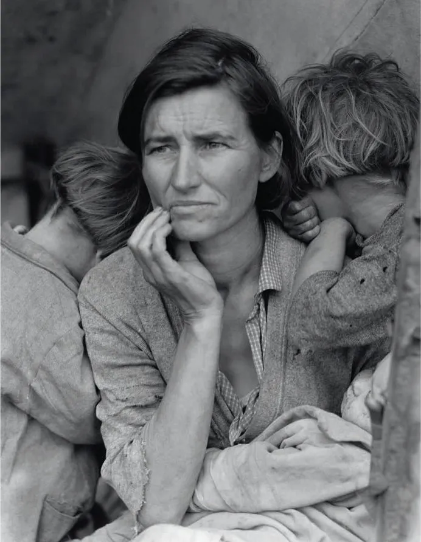

**Migrant Mother**
**流动母亲**

***\*Dorothea Lange\****
***\*多萝西娅·兰格\****

1936

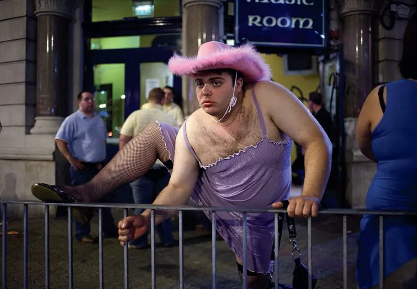

**Sunday 25th June 2006, 23:42** from ‘Cardiff After Dark’
**2006 年 6 月 25 日星期日，23:42，**来自“卡迪夫夜生活”

***\*Maciej Dakowicz\****
***\*马切伊·达科维茨\****

2006

***\*One subject, one shoot\****
***\*一个主题，一次拍摄\****

***\*Know what you’re looking for\****
***\*知道你在寻找什么\****

***\*For other examples:\****
***\*其他示例：\****

Youngjun Koo p. 96
Youngjun Koo 第 96 页

Saturday night. Cardiff town centre. But this isn’t an image of a man having ‘fun’. It’s an image of a man totally spellbound. Of someone far removed from their everyday self. As he attempts to climb over the railings he takes on the appearance of a gorilla escaping from a zoo. Who knows what carnage is about to be wreaked on the world!
星期六晚上。卡迪夫市中心。但这不是一幅男人“玩乐”的画面。这是一幅男人完全被迷住的画面。一个远离日常生活的人。当他试图爬过栏杆时，他看起来像一只从动物园逃出来的大猩猩。谁知道世界上即将发生什么样的屠杀！

Rather than going out with the intention of shooting everything and anything, Maciej Dakowicz shot this picture knowing exactly what he was looking for – inebriated Welsh clubbers out on the town.
Maciej Dakowicz 拍摄这张照片时并没有打算拍摄一切，而是清楚地知道自己在寻找什么——在城里泡吧的醉醺醺的威尔士夜店客。

***\*Focusing your attention on a particular subject matter gives you more purpose and better results when shooting.\****
***\*将注意力集中在特定的主题上可以让您在拍摄时更有目的性并获得更好的效果。\****

It can be as simple as saying, ‘today I’m going to look for candid street portraits’. Doing this hones your eye and you’ll find that you capture moments that you would otherwise have missed or not even have noticed.
可以简单地说，“今天我要寻找街头肖像照”。这样做可以磨练你的眼力，你会发现自己捕捉到了本来会错过甚至没有注意到的瞬间。

By going out week on week with a particular purpose, Dakowicz saw past streets paved with discarded fast-food containers and unconscious teenagers and uncovered a world of vulnerability and aggression, of humour and horror.
通过每周带着特定目的外出，达科维奇看到过去的街道上遍布着丢弃的快餐容器和昏迷的青少年，发现了一个充满脆弱和侵略、幽默和恐怖的世界。

***\*The importance of intrigue\****
***\*阴谋的重要性\****

***\*Pose questions, not answers\****
***\*提出问题，而不是答案\****

***\*For other examples:\****
***\*其他示例：\****

Joel Sternfeld p. 68
Joel Sternfeld 第 68 页

Holly Andres p. 87
Holly Andres 第 87 页

René Burri p. 93
René Burri 第 93 页

Melanie Einzig p. 103
Melanie Einzig 第 103 页

Elliott Erwitt p. 111
艾略特·厄维特 第 111 页

Who sits in this chair? Why has the window been blacked out? There’s beauty in those clashing colours and patterns. Did someone consciously bring them together or are they just a random collection of items that occupy the same room?
谁坐在这把椅子上？窗户为什么被涂黑了？这些冲突的色彩和图案很美。有人刻​​意把它们放在一起吗？还是它们只是占据同一房间的随机物品集合？

Alec Soth’s photographs of strangers, places and objects that he encounters on the road never quite tell us the whole story. They serve more as glimpses into moments observed and it’s left up to us to fill in the blanks.
亚历克·索斯拍摄的陌生人、地方和路上遇到的物品的照片从未完全告诉我们故事的全部。它们更像是对所观察到的瞬间的一瞥，而空白则留给我们去填补。

***\*Don’t feel like your photographs have to explain themselves. Hold a little back. Give our imagination somewhere to go.\****
***\*不要觉得你的照片必须自己解释。稍微收敛一下。让我们的想象力有地方可以发挥。\****

Here Soth made a choice about what he did and didn’t include in his composition. There’s no one in this picture, but it’s still undeniably a portrait: the magazine, the empty chair, the ruffled carpet and the glowing lamp all add up to something, or someone. 
在这里，索斯选择了在构图中要包含和不包含的内容。这张照片中没有人，但不可否认的是，它仍然是一幅肖像画：杂志、空椅子、褶皱的地毯和发光的灯都构成了某物或某人。

To instil a little intrigue into your pictures don’t focus too much on ‘the subject’. Instead look for those little truths that start to say so much more. Steer clear of Kodak moments and keep an eye on what’s going on in-between. Be a detective and look for the oddities that begin to hint at a story.
要想让照片更吸引人，就不要把注意力过多地放在“主题”上。相反，要寻找那些能说明更多内容的小真相。避开柯达瞬间，留意中间发生的事情。做一名侦探，寻找那些开始暗示故事的奇怪之处。

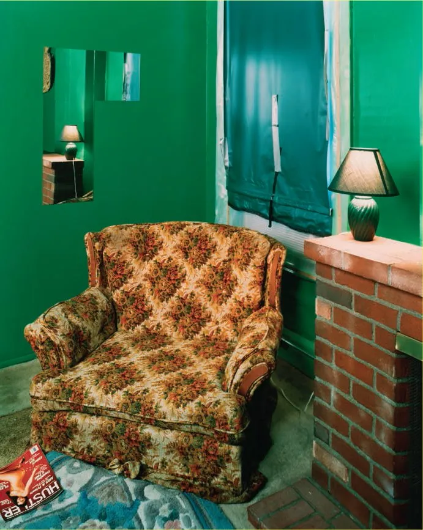

**Sugar’s, Davenport**
**Sugar's(达文波特)**

***\*Alec Soth\****
***\*亚历克·索斯\****

2002

***\*The power of a project\****
***\*项目的力量\****

***\*Photographs need photographs\****
***\*照片需要照片\****

***\*For other examples:\****
***\*其他示例：\****

Richard Misrach p. 49
Richard Misrach 第 49 页

Muzi Quawson p. 95
Muzi Quawson 第 95 页

Maciej Dakowicz p. 116
Maciej Dakowicz 第 116 页

First published in 1958, Robert Frank’s **The Americans** is a photography book portraying America as a country of loneliness, insecurity and racial segregation. It takes you on a road trip right into the disconnected heart of 1950s America.
罗伯特·弗兰克的**《美国人》**于 1958 年首次出版，是一本摄影书，描绘了美国作为一个孤独、不安全和种族隔离的国家的形象。它带你踏上一段公路之旅，直达 20 世纪 50 年代美国与世隔绝的心脏地带。

As an art student the photographs confused me. They all seemed a little rough around the edges. They didn’t conform to my idea of ‘good photography’.
作为一名艺术系学生，这些照片让我感到困惑。它们看起来都有些粗糙。它们不符合我对“好照片”的定义。

It was two more years before I realized I’d been looking at the **The Americans** all wrong. I’d been seeing the book as individual pictures; analyzing each one separately, trying to fathom why this one or that one was so ‘great’.
又过了两年我才意识到自己对**《美国人》**的看法完全错误。我一直把这本书看作是一部部独立的电影，对每部电影都进行单独分析，试图弄明白为什么这部或那部电影如此“伟大”。

But **The Americans** isn’t meant to be seen that way. It’s a photographic novel with a beginning, middle and end. As a series, the pictures suddenly made sense. Together, their style and subject matter carry a message that no single one alone could ever voice.
但**《美国人》**不应该被这样看待。这是一部有开头、中间和结尾的摄影小说。作为一个系列，这些照片突然变得有意义了。它们的风格和主题结合在一起，传达出一种信息，任何一个人都无法单独表达出来。

***\*If you go about capturing individual, unrelated pictures, you’ll end up with a nice enough set of photos, but you won’t come close to exploring photography’s full potential.\****
***\*如果您拍摄单独的、不相关的照片，您最终会得到一组足够漂亮的照片，但您还远远没有发掘摄影的全部潜力。\****

By committing to a series – whether it’s about a place, a person or whatever interests you – you’re able to tell a very carefully constructed story: one where the specific style and order of photographs is essential to their meaning. A story that articulates what you really feel.
通过拍摄一系列照片——无论是关于某个地方、某个人还是任何你感兴趣的东西——你都可以讲述一个精心构建的故事：照片的特定风格和顺序对于其含义至关重要。这个故事可以表达你的真实感受。

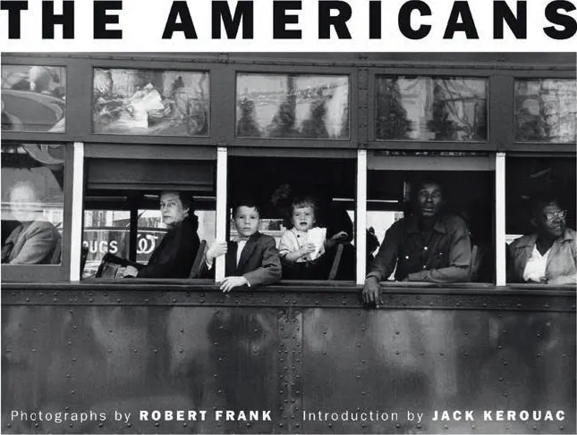

**The Americans**
**美国人**

***\*Robert Frank\****
***\*罗伯特·弗兰克\****

First published in 1958
首次出版于 1958 年

***\*That extra something\****
***\*额外的东西\****

***\*Now for the magic\****
***\*现在开始施展魔法\****

***\*For other examples:\****
***\*其他示例：\****

Bill Brandt p. 29
Bill Brandt 第 29 页

Lee Friedlander p. 71
Lee Friedlander 第 71 页

Stephen J. Morgan p. 107
史蒂芬·J·摩根 第 107 页

This image by Inzajeano Latif reminds me that photography is a form of magic. It has the ability to do so much more than simply show us what something or someone looks like. Photography – great photography – manages to penetrate the surface of the world and show us a little of what lies beneath.
Inzajeano Latif 拍摄的这张照片让我想起摄影是一种魔法。它能做的远不止简单地向我们展示某物或某人的模样。摄影——伟大的摄影——能够穿透世界的表面，向我们展示其之下的一些东西。

OK, of course photography isn’t magic. What we’re looking at here is a skilfully constructed collection of elements. Those clenched fists wrapped in torn fabric. That beautiful light which falls somewhere between hard and soft. The warm orange against that cool blue. And that stare. That confrontational yet vulnerable stare.
好吧，摄影当然不是魔术。我们在这里看到的是一组精心构建的元素。那些被撕碎的布料包裹的紧握的拳头。那美丽的光线介于坚硬和柔软之间。温暖的橙色与冷蓝色形成对比。还有那凝视。那种对抗而又脆弱的凝视。

But, while all of this is true, the photograph seems to dig a little deeper. Somehow it adds up to more than the sum of its parts.
但尽管这些都属实，这张照片似乎更能说明问题。不知何故，它的整体效果大于各部分的总和。

You could master every photography technique out there. You could have every piece of kit and know all the jargon. But that wouldn’t help you capture images like this, as they require an altogether different approach.
你可以掌握所有的摄影技巧。你可以拥有所有的工具，了解所有的术语。但这并不能帮助你拍摄这样的照片，因为它们需要一种完全不同的方法。

So what is it? I asked Latif that very question. He thought for a moment and said,
那么，到底是什么呢？我问了拉蒂夫这个问题。他想了一会儿，说：

***\*‘Don’t overthink things. Photograph what you feel.’\****
***\*“别想太多。拍下你的感受。”\****

The magic of photography, the bit that can’t quite be explained, is you.
摄影的魔力在于你，那部分无法用语言解释。

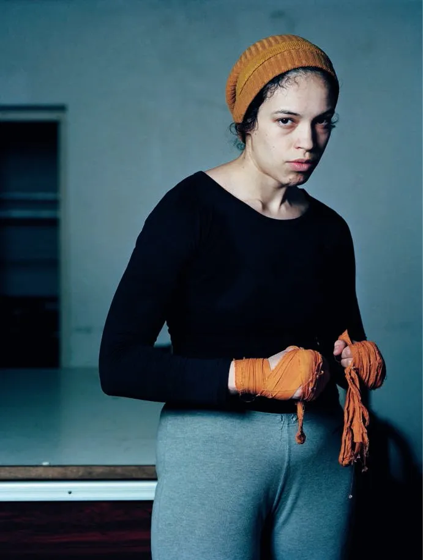

**Female Boxer #3**
**女拳击手#3**

***\*Inzajeano Latif\****
***\*因萨热亚诺·拉蒂夫\****

2009

***\*Troubleshooting\****
***\*故障排除\****

***\*Why isn’t my camera focusing where I want it to?\****
***\*为什么我的相机无法聚焦到我想要的位置？\****

Your camera divides the frame into different focusing points. Keep things simple by using ‘Single Point’ and position this point in the centre of your frame.
相机将画面划分为不同的对焦点。使用“单点”并将该点置于画面中央，可使操作变得简单。

Your camera also has different ‘Auto Focus’ modes. You can either set your focus to track a moving subject – generally called ‘Servo’ or ‘Continuous’ – which is good for sports photography. Or you can set your camera to lock the focus when you press the shutter release halfway down. This is called ‘One Shot’ or ‘Single Shot’. This in conjunction with ‘Single Point’ is the best default set-up. If you don’t want your subject in the middle of your picture, focus on it and then recompose without lifting your finger off the button.
您的相机还具有不同的“自动对焦”模式。您可以将焦点设置为跟踪移动的物体（通常称为“伺服”或“连续”），这非常适合体育摄影。或者您可以将相机设置为在半按快门释放按钮时锁定焦点。这称为“一次拍摄”或“单次拍摄”。这与“单点”结合使用是最佳默认设置。如果您不想让拍摄对象位于照片中间，请将焦点对准它，然后重新构图，而无需将手指从按钮上移开。

***\*Why does my whole picture look ‘out of focus’?\****
***\*为什么我的整个照片看起来“失焦”？\****

Chances are it’s not a focusing issue; it’s camera shake caused by a slow shutter speed. If you are handholding your camera, check that your shutter speed is not dropping below 1/60. If it is, try increasing your ISO (p. 50–4) or use a tripod (p.39).
很可能这不是对焦问题，而是由于快门速度慢导致的相机抖动。如果您手持相机，请检查快门速度是否低于 1/60。如果低于 1/60，请尝试增加 ISO（第 50-4 页）或使用三脚架（第 39 页）。

***\*Why are my pictures too dark or too bright?\****
***\*为什么我的照片太暗或太亮？\****

Firstly check your ‘Exposure Compensation’ (p. 55). Secondly, if you’re shooting on ‘Shutter’ or ‘Aperture Priority’, make sure that your camera is able to offer you a corresponding exposure value. For example, if you’ve selected a really fast shutter speed, your camera will need to compensate by using a very wide aperture. You might find that even at the widest aperture still not enough light is entering the camera, meaning your picture is underexposed. In this case, use a slower shutter speed or increase your ISO (p. 50–4) so your camera is more sensitive to light.
首先检查“曝光补偿”（第 55 页）。其次，如果您使用“快门”或“光圈优先”拍摄，请确保您的相机能够为您提供相应的曝光值。例如，如果您选择了非常快的快门速度，您的相机将需要使用非常大的光圈进行补偿。您可能会发现，即使在最大光圈下，进入相机的光线仍然不足，这意味着您的照片曝光不足。在这种情况下，请使用较慢的快门速度或增加 ISO（第 50-4 页），以便您的相机对光线更敏感。

***\*Should I use ‘Aperture’ or ‘Shutter Priority’?\****
***\*我应该使用“光圈”还是“快门优先”？\****

Work backwards. Ask yourself, ‘what’s my picture about?’ If it’s fundamentally about capturing a moving subject use ‘Shutter Priority’ (p.34–41). If it’s more about controlling your depth of field use ‘Aperture Priority’ (p.42–9).
逆向思考。问问自己，“我的照片是关于什么的？”如果主要是为了捕捉移动的物体，请使用“快门优先”（第 34-41 页）。如果主要是为了控制景深，请使用“光圈优先”（第 42-9 页）。

***\*What metering mode should I use?\****
***\*我应该使用哪种测光模式？\****

Metering modes change how your camera measures the light. This calculation determines the shutter speed and aperture.
测光模式会改变相机测量光线的方式。此计算决定了快门速度和光圈。

‘Evaluative’, ‘Matrix’ or ‘Multi-Segment’ measures all the light coming through the lens and offers an average. ‘Partial’ or ‘Spot’ measures the light from the very centre point of the frame, which can be helpful for backlit subjects. ‘Centre-Weighted’ is halfway between the two as it measures the light from the central area of your frame.
“评价”、“矩阵”或“多段”测量通过镜头的所有光线并提供平均值。“局部”或“点”测量来自画面正中心点的光线，这对于背光拍摄对象很有帮助。“中央重点”介于两者之间，因为它测量来自画面中央区域的光线。

Rather than mess about with metering modes, set your camera to ‘Evaluative’, ‘Matrix’ or ‘Multi-Segment’ metering. Then use ‘Exposure Compensation’ if you want to make your subject brighter or darker. This way you start to get a much better feel for light.
不要乱用测光模式，将相机设置为“评价”、“矩阵”或“多段”测光。然后，如果您想让拍摄对象更亮或更暗，请使用“曝光补偿”。这样，您就会开始对光线有更好的感觉。

***\*Why do the colours in my picture look weird?\****
***\*为什么我的照片颜色看上去很奇怪？\****

More than likely this is because your white balance is not set to the right lighting conditions (p.76–7).
这很可能是因为您的白平衡没有设置为正确的光照条件（第 76-7 页）。

***\*RAW or JPEG?\****
***\*RAW 还是 JPEG？\****

RAW files carry more information than JPEGs, so if you’re going to do some heavy tweaking on your pictures afterwards then shoot RAW. Be warned, unlike JPEGs, RAW files chew up space on your memory card, meaning fewer shots.
RAW 文件比 JPEG 包含更多信息，因此如果您之后要对照片进行大量调整，则请拍摄 RAW。请注意，与 JPEG 不同，RAW 文件会占用存储卡空间，这意味着拍摄的照片更少。