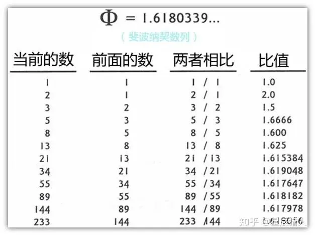

1. 掌握基本规则，
2. 练习，练习，练习
3. 内化
4. 自由发挥

你可以参考摄影中的经典构图法则，比如：

- 三分法（Rule of Thirds）
- 引导线（Leading Lines）
- 框架构图（Framing）
- 对称和平衡（Symmetry & Balance）
- 负空间（Negative Space）

Summary：

- 1/3 其实也类似黄金分割，当然1/3，1/2都简单直白，所以人们更习惯吧，习惯等于喜欢
- 黄金分割，这些发散曲线的螺旋角一般在137.5度，更为精确的数字应该是137.50776度，因为137.5=360-360*0.618，所以这个角度又被称为黄金角度。
  黄金角度十分特别，是因为没有任何360度的简分数能加以表达；360度的***\*5/8相当接近，8/13更为接近，13/21\****则算是最接近的了，但没有任何一个分数能准确地表达出黄金角度跟360度的比例。如下图，将一个圆周进行黄金分割，它的短弧所对应的角度成为“黄金角”，即360×（1－0.618…）≈137.5° 。
- 