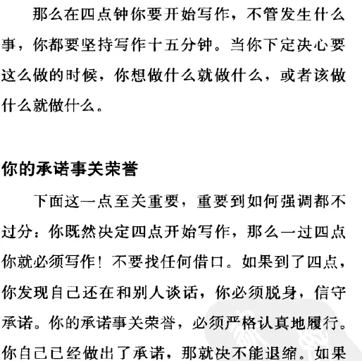
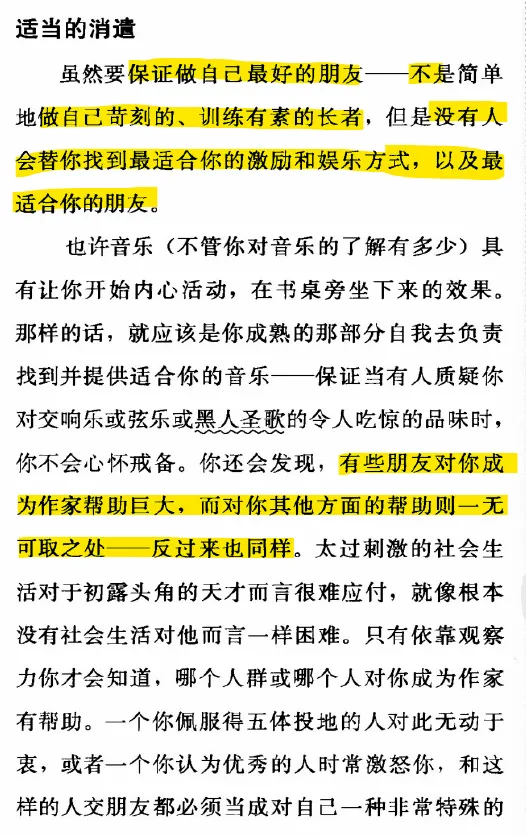
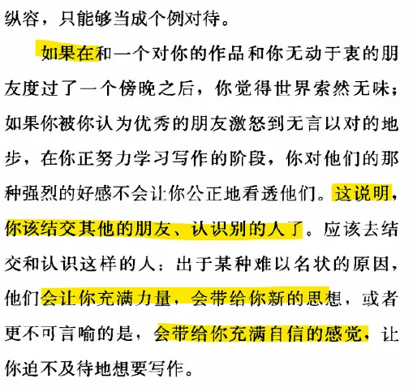
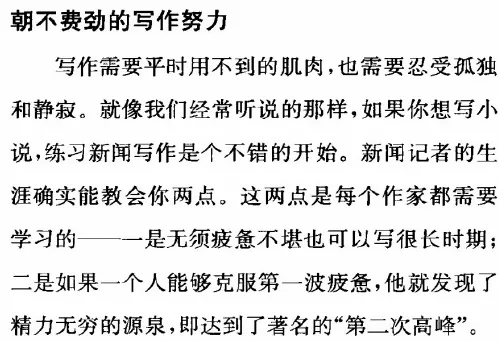
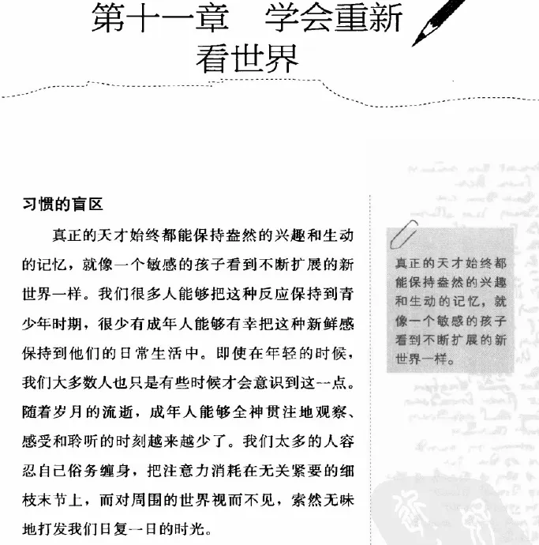
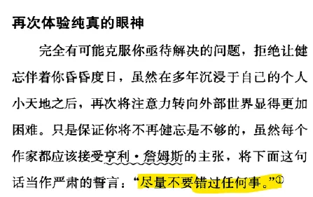
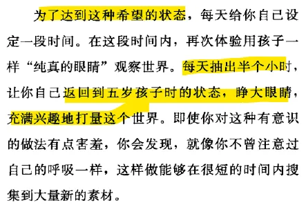

 Becoming a writer 

这是国内首次引进的关于创意写作的一套丛书，是关于文学创作的教科书和自学指导。**首批选了四本，它们是:《成为作家》、《开始写吧!--虚构文学创作》和《开始写吧!--非虚构文学创作》，以及《小说写作教程:虚构文学速成全攻略》。**这套书给我们提供了文学创作的全方位解决方案，包括成为作家的思想准备，以及不同文学种类的写作要素和方法训练

# Ch 6 按时写作

