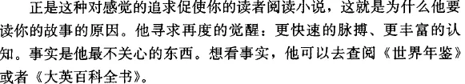
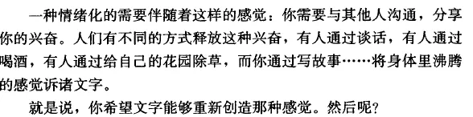
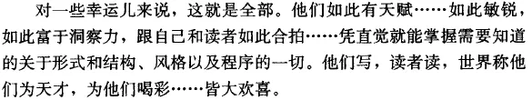
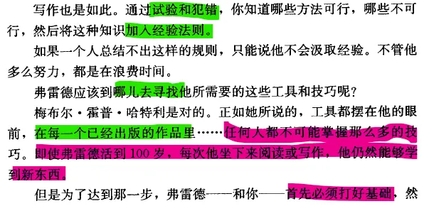
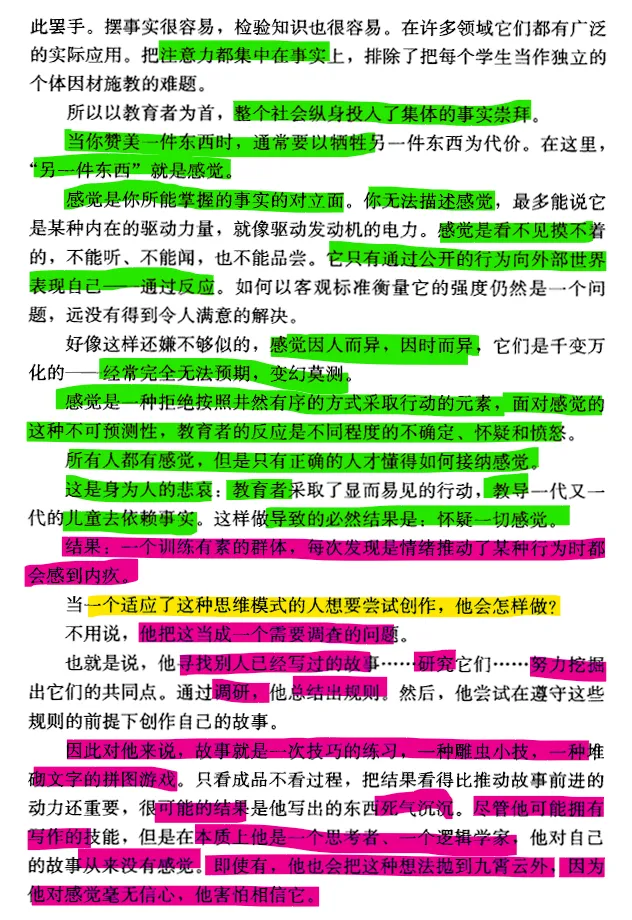
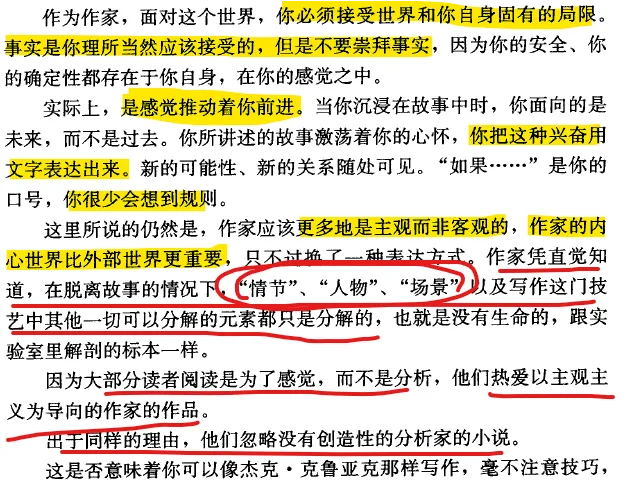
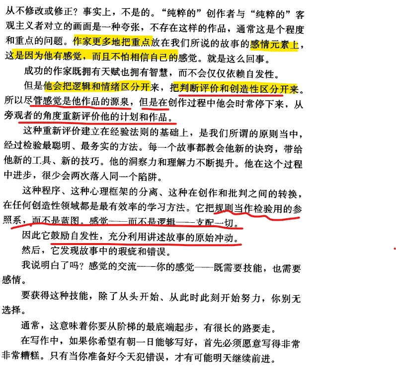
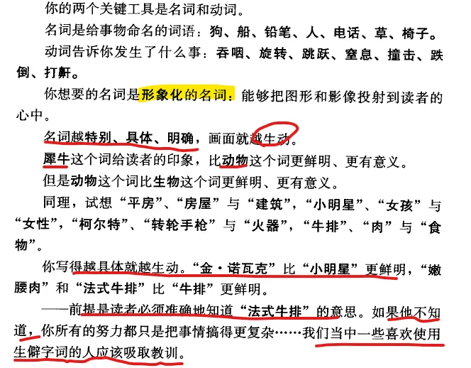

# Techniques of the Selling Writer

# CHAPTER 1

A story is experience translated into literary process.
故事是经验转化为文学的过程。

 

You need to know only four things in order to write a solid story:
为了写出一个完整的故事，你只需要知道四件事：

 

- **how to group words into motivation-reaction units;如何将单词分组为动机-反应单元；**
- **how to group motivation-reaction units into scenes and sequels;如何将动机-反应单元分组为场景和续集；**
- **how to group scenes and sequels into story pattern;如何将场景和续集分组为故事模式；**
- **how to create the kind of characters that give a story life.如何创造让故事栩栩如生的人物。**

那么，为什么这么多人觉得学习写作很难呢？他们陷入了一些陷阱，拖慢了他们的速度，阻碍了他们的进步。具体来说，有八个陷阱：

 

1. They take an unrealistic view.他们持有不切实际的观点。
2. They hunt for magic secrets.他们追寻魔法的秘密。
3. They try to learn the hard way.3.他们试图通过艰难的方式学习。

4. They refuse to follow feeling.4.他们拒绝跟随感觉。

5. They attempt to write by rules.他们试图按规则写作。
6. They don’t want to be wrong.6.他们不想犯错。

7. They bow down to the objective.7.他们向目标低头。

8. They fail to master technique.8.他们未能掌握技术。

## *Emotion and the writer 情绪与作家*

**All your life you’ve lived with feelings** . . . inner awarenesses, pleasant or painful, that rose in you when you bumped a knee or bit a lemon, kissed a girl or soothed a hurt child. The Marine Band playing “The Halls of Montezuma” brought one type of emotion . . . a guitar and “La Paloma” another. Your father’s death, your sister’s marriage, snowflakes drifting down, the smell of wood smoke, angry words, soft whispers, a scornful laugh, the comedian whose pants fall down, puppies’ warm cuddlesomeness . . . to one and all of them, you react.

**With feelings.**

In some of us, these feelings are more intense than they are in others; and, they’re aroused by different stimuli and situations. The slight that brings this woman to fury is passed by unnoticed by her neighbor. Fred Friggenheimer is more aware of certain nuances than is George Abercroft . . . more sensitive to subtleties of sensation and of impulse: overtones, undertones, implications. You pity the sharecropper’s bony, sway-backed horse; I pity the cropper; our friend pities himself, that he should be forced to face the fact of such degradation.

In other words, each of us experiences and responds to life differently, in a manner uniquely and individually his own.

Now all this is ever so important to a writer.

Why?

Because *feeling is the place every story starts.*

Where do you find feeling?

It springs from the human heart.

*As a writer, your task is to bring this heart-bound feeling to the surface in your reader: to make it well and swell and surge and churn.*

*Understand, feeling is in said reader from the beginning. You give him nothing he doesn’t possess already.*

*But emotion,* for most people, too often is like some sort of slumbering giant, lulled to *sleep* by preoccupation with the dead facts of that outer world we call objective. ~~*When we look at a painting, we see a price tag. A trip is logistics more than pleasure. Romance dies in household routine.*~~

Yet life *without feeling* is a sort of *death*.

Most of us know this. So, we long *wistfully* for *speeded heartbeat, sharpened senses, brighter colors.*

This search for feeling is what turns your reader to fiction; the reason why he reads your story. He seeks a reawakening: heightened pulse; richer awareness. *Facts are the least of his concern. For them, he can always go to the World Almanac or Encyclopedia Britannica.*

Further, Reader wants this sharpening of feeling because he needs it, emotionally speaking. Otherwise, why would he bother with your copy?

Now, let’s look at the other side of the coin:

Where do stories originate?

In you, the writer.

**Why do you write them?**

**You too have feelings . . . feelings that excite you**, the way the witch-cult excited Fred Friggenheimer.

*An emotional need comes with these feelings*: the need to *communicate* your *excitement* to others. So, where another man similarly excited might let his tension go in talk, or get drunk, or chop weeds in his garden, you write a story . . . put down words with which you seek to *re-create the feelings* that seethe inside you.

That is, you hope the words re-create those feelings.

And then?

**For some fortunate souls, that’s all there is to it. So talented are they . . . so sensitive, so perceptive, so completely attuned to themselves and to their audience . . . that they intuitively grasp everything they need to know of form and structure, style and process. They write, readers read, the world hails them as geniuses. . . . A happy state.**

However, don’t let the thought of such ability depress you. Though I’ve heard for years about these awesome figures, I’ve vet to meet a living, breathing writer who hadn’t worked—and worked hard—for everything he got.

Most writers learn by doing. Practice, trial and error, train them. It’s as if our friend Fred were to go home tonight to his wife Gertrude with a joke to tell.

Listening, she stares at him blankly. “What’s so funny about that?”

Fred tries again. And maybe, this time, he gets the point across: Gertrude laughs.

Tomorrow, a new joke comes along. So, Fred tries to remember what he did before, so that he can present this story to Gertrude in such a manner that she’ll laugh first time round, without benefit of follow-ups or explanations.

If his plan succeeds, he tucks the procedure away in the back of his head. From here on out, for him, it will constitute a cornerstone of verbal humor. He’s found himself a rule to follow.

It’s the same with writing. By trial and error, you learn that some things work and others don’t . . . then incorporate that knowledge into rules-of-thumb.

Failure to develop such rules says merely that the man concerned is incapable of learning by experience. No matter how hard he tries, his time is wasted.

Where’s Fred to find these tools . . . the specific bits and tricks he needs?

Here Mabel Hope Hartley scores. As she says, the devices are all right there before his eyes, in every published story . . . more of them than any one man can ever hope to master. Even though Fred lives to be a hundred, he’ll still learn new twists each time he sits down to read or write.

But in order to reach that stage, Fred—and you—first must master fundamentals, so that he knows what to look for.

## *The snare of the objective 客观性的陷阱*

 

There are two types of mind in this world . . . two approaches to the field of fiction.
这个世界有两种心态……两种对待小说的态度。

One type is that of the objectivist, the man who sees everything analytically. Three things warp his orientation:
*一种是客观主义者，他们看待一切事物都带着分析性。有三件事会扭曲他们的取向：*

 

a. He depends on facts. a. 他依赖事实。

*~~b. He distrusts feelings. b. 他不相信感觉。~~*

c. Therefore, he tries to write mechanically. c. 因此，他尝试机械地写作。

 

This man may have an inclination to create. But he’s the product of an educational system that focuses on facts the way a Mohammedan zeros in on Mecca; and, in his case, the education took.
这个人或许有创作的倾向。但~~*他受的教育体系注重事实*~~，就像穆斯林专注于麦加一样；而就他而言，教育对他来说，是徒劳的。

Now there’s nothing wrong with facts as such. Educators of necessity seek a common ground on which to reach their students.
这本身并没有错。教育工作者必须寻求一个共同点来与学生沟通。

# CHAPTER 2  The Words  You Write

 

A story is words strung onto paper.故事是串在纸上的文字。

Specifically, it’s desirable that you learn three things:具体来说，你最好了解三件事：

 

1. How to choose the right words.1.如何选择正确的词语。

2. How to make copy vivid.2.如何让文案生动起来。

3. How to keep meaning clear.3.如何保持意思清晰。

 

## How to find the right words

如何找到合适的词语

What are your essential jobs, in actually writing copy? They are:
在实际撰写文案时，你的基本工作是什么？它们是：

a. Selection. 选择。

b. Arrangement.. 安排。

c. Description.. 描述。

Then, you bring your material to life.
然后，你就让你的材料变得生动起来。

*With description.通过描述。*

*To live through a story . . . experience it as vividly as if it were his own . . . your reader must capture it with his own senses.*
*要让读者体验故事中的生活……要像亲身经历一样生动地体验它……你的读者必须用自己的感官去捕捉它。*

How do you put perfume on the page? The tiger’s roar? The whisky’s bite? The warm spring air? The earth? The blood?
如何在纸上描绘香水？老虎的吼叫？威士忌的辛辣？温暖的春风？泥土？鲜血？

*With words: description.*通过文字：描述。

But simply written, of course? With short words, short sentences, short paragraphs, and so on?
当然是简单写法啦？用短词、短句、短段落等等？

Few of us read voluntarily about the primer-level doings of Dick and Jane. *Simplicity* is a virtue in writing, true; *but never the primary virtue.*
我们很少有人会主动去读迪克和简的入门级作品。简洁的确是写作的美德，但绝不是写作的首要美德。

What is? Vividness. How about brevity?
什么是？生动。简洁呢？

It’s important too. Within reason. Within reason?
这也很重要。在合理范围内。在合理范围内？

As in the case of simplicity, brevity is never the heart of the issue. *Vividness* is.
就像简单性一样，简洁从来不是问题的核心，生动才是。

## *Making copy come alive 让文案生动起来*

How do you write vividly?怎样才能写得生动形象？

You present your story in terms of things that can be verified by sensory perception. Sight, hearing, smell, taste, touch—these are the common denominators of human experience; these are the evidence that men believe.
你的故事要用那些能被感官知觉验证的事物来呈现。视觉、听觉、嗅觉、味觉、触觉——这些都是人类经验的共同点；也是人们相信的证据。

Describe them precisely, put them forth in terms of action and of movement, and you’re in business.
准确地描述它们，用行动和运动的形式表达出来，这样你就成功了。

Your two key tools are nouns and verbs. 您的*两个关键工具是名词和动词。*

Nouns are words that name something: dog, boat, pencil, man, telephone, grass, chair.
名词是用来命名某事物的单词： 狗、船、铅笔、男人、电话、草、椅子。

