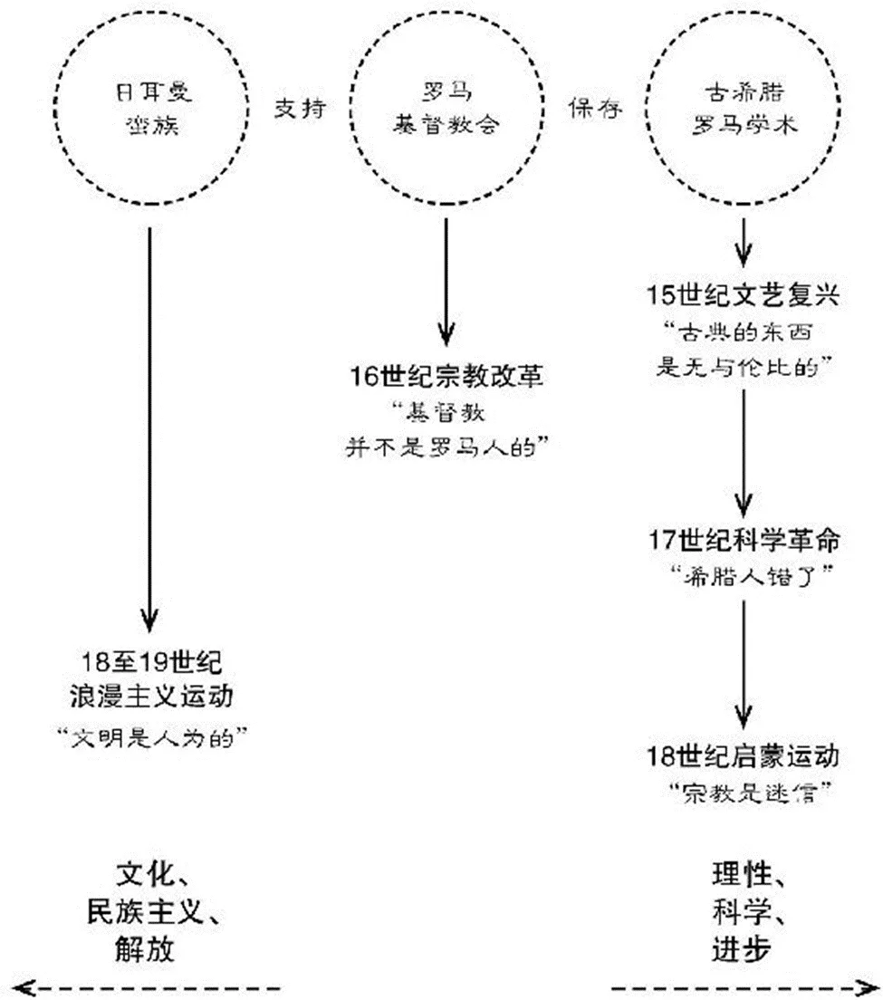

中国历史，黑格尔

**光荣革命”**

这场政变的过程非常平和。威廉三世挟着顺风之势，迅速穿越了英吉利海峡。他一登陆，詹姆斯二世的军队几乎全面倒戈，归顺敌人阵营。詹姆斯二世逃到了爱尔兰，这对国会来说倒也方便，因为不必对他进行审判或砍他的头，只消宣布王位空虚，随即拥立了威廉和玛丽为共同君主。

在国会操盘下，国王和议会的权力至此已被重新洗牌，威廉与玛丽之所以戴得上英国王冠，即是以接受以下这些条件为前提。这份改写了宪法的文献名为《权利法案》。它是议会权利以及个人权利的综合体：

个人权利：

**人民有向国王请愿的权利**[教会人士曾向詹姆斯二世请愿，希望国王更改他的宗教政策，结果遭到詹姆斯惩罚]。

人民不得被课以过高的保释金和罚金。

**人民有不遭受残酷与非常惩罚的自由。**

新教徒有携带武器的权利。

陪审团成员不得由国王选派。

以现代标准来看，这份文件对人权的保障颇为有限，但它是其后所有权利表述的奠基石。**例如“不得施加残酷和非常惩罚”这一条，美国甚至照章全收在它的《人权法案》里。**

---

# 极简欧洲史

在欧洲文明发端之初，它的组成元素有三：

## 1.古希腊和罗马文化；

**罗马人比希腊人更骁勇善战。他们用来治理帝国的法律比希腊人高明，对打仗和治国方面都极为有用的工程建筑，水准也在希腊人之上。可是，在其他方面，就连罗马人也承认希腊人比他们高明**，心甘情愿地卑躬屈膝、复制仿效。罗马的精英分子除了说自己的母语拉丁语，也会说希腊语；他们把儿子送到雅典上大学，要不就雇个希腊奴隶在家教小孩。因此，我们谈到罗马帝国时，常形容它是“希腊罗马风格”，是因为罗马人乐见这样的发展。

## 2.基督教——犹太教（犹太民族之宗教）的一个奇特分支；

**犹太人一直相信**，宇宙间只有一个真神，这是极不寻常的观点，**希腊人和罗马人崇奉多神**，这比较普遍。**犹太人还有个更异乎寻常的信念**，他们认为自己是上帝的选民，所以这个**唯一真神会对他们特别照顾。**因此，犹太人必须遵守上帝的律法作为回报，这套律法的基石是“十诫”，是摩西将犹太人从埃及的为奴之地带领出来时告谕给他们的。

耶稣，基督教的始祖，就是个犹太人，他所有的门徒也都是犹太人。在耶稣传道之时，犹太人再度丧失了国家主权；巴勒斯坦是罗马帝国的一个偏远省份。

耶稣一些徒众对他寄予厚望，希望他能领导起义，对抗罗马。他的敌人设计于他，想骗他说出带有谋反意图的话。他们问，我们应该纳税给罗马吗？耶稣回答，拿一个银钱给我看——这上头是什么图案？对方回答，是恺撒的像。**耶稣就说：“恺撒的，就应归给恺撒；天主的，就应归还天主。”**

## 3.对罗马帝国进行侵略的日耳曼蛮族的战士文化。

这个混合体的第三组人马，是入侵罗马帝国的日耳曼蛮族。他们原本住在北方边界处，在公元400年之后大举入侵，到了公元476年，西罗马帝国已被他们毁灭。欧洲文明这个混合体，就在法国、西班牙和意大利这些地方粗具雏形。

至于恺撒的归恺撒，上帝的归上帝们，发现必须开始统治自己所占领的社会，这不但令他们始料未及，而且处境非常棘手。他们目不识丁，在他们所制造出的混乱中，一息仅存的罗马政权终于断了气，而商业交易和所有城镇都在萎缩。各拥武装的蛮族首领们纷纷自立为王，建立起小邦小国；王国之间自相残杀，迅速楼起迅速楼塌。在西欧，一直要到数百年后，现代国家的雏形——法国、西班牙和英国——才终于出现。

**处于这些情境下的政府脆弱不堪，弱到连税都征不到**。（在我们看来，这些词汇本身就是矛盾的：一个征不了税的政府！）这位已不光是蛮族首领的日耳曼人现在已化身为国王，他把土地分封给他的战士，而这些战士则化身为贵族，条件是一旦国王需要军队，这些贵族就得供应，要多少就给多少。可是，渐渐地，这些贵族开始视这些土地为己有，对于出兵多少、精良与否、为何出兵，也开始自作主张。

**国王长年征战不休，原因可能是为了争权，为了保住统治权以免落入贵族手里，为了自订税收**，为了拥有一支自己能完全掌控的军队，为了设立自己的官僚体制。可是，因为他们一开始就立足薄弱，有些事永远也威吓不了人。*私有财产变得神圣不可侵犯*，那些贵族已把借着条件交换得来的土地变成了私有财产。这对政府来说永远是个束缚，因此，虽然欧洲国王的权力日增一日，却不曾演变成东方的专制君王。

**东方的专制暴君把领土上的一切都据为己有**，如果需要什么物资，**只要没收某人物产**或派兵到市集拿一堆东西回来就是。反观欧洲的政府，虽然号称“绝对权力”，却从未这样做过。*“并非所有东西都归国王所有”，是欧洲政府思维的基石。从私有财产权出发，衍生出人权观念，是西方价值的核心*。政府权力必须有所限制，这样的观念之所以勃兴，其实是因为这些政府从一开始就处处受限。

**“对政府有所设限”对经济的发展也有举足轻重的影响。欧洲经济之所以能一飞冲天，成长速度非其他地区所能比拟，“商人有保障”是个关键。**

---

这也是一个比较“入世”的世界。**古典时代的人对死后的生命其实没有那么看重，对人在地球上的所作所为关注更多，他们对人的力量和能耐欢喜拥抱，不会满脑子想的尽是人的邪恶堕落。**文艺复兴学者现在进入了一个思想奔放的世界。怎样生活最好，想些什么最好，古代哲学家和道德家早就百花齐放，在观点上百家争鸣，但他们的辩证和推论并没有被传承下来，因为基督教会已经给人民的思想紧紧裹上了束缚衣。

*文艺复兴是中世纪世界遭遇的第一个重大冲击，16世纪的宗教改革运动是第二个，这回是对基督教会的直接攻击*。宗教改革的目的，是要基督教会回复到尚未罗马化之前的样貌。我们说过，基督教会因为跟着罗马帝国一起成长，各种特性深得罗马真传；**在罗马帝国灭亡后，教会的教皇依然屹立，地位俨然君王一般，而总主教和各教区的主教，也犹如古罗马帝国的行政百官，辖下更有不计其数的地方神父。这个圣职体制不单有自己的法律、刑罚和监狱，还有自订的税收制度。**

**在中世纪，大部分的神父、主教和总主教加入教会，**并不是因为宗教情怀或特别虔诚；他们加入教会，是因为它是当时**最庞大也最有钱的组织**。领圣职就跟今天你去当公务员、进大公司、进政坛或进大学没有两样，可能是为了一份稳定的差事、有兴趣的工作或高薪，也可能是为了吃香喝辣、施展权力。在教会里，你有的是机会捞油水、发横财，还能替亲戚朋友谋职找事，让他们鸡犬升天。

**马丁·路德是个修士，对自己的宗教非常认真**。他对自己的救赎充满煎熬：“我，一个满身罪恶的人，必须怎么做才可能得救？”**一天，他读到《圣经》**中保罗写给罗马教会的书信，顿时豁然开朗。保罗说：*“你只要相信耶稣基督就能得救。”*马丁·路德从这句话里做出推论：

*你根本不必做任何事就能得救，尤其不必对神父的指示言听计从。你只要相信上帝、抱持信仰就行了。*

*“因信称义”，是路德教派的中心教义。只要相信基督，你就能得到救赎*。当然，作为信徒，你会乐于去做让上帝高兴的事，一如教会所说，要行善积德，去做一些耶稣说我们该做的工。**可是，行善积德本身并不能帮助你得救。**

既然异端必须受火刑烧死，**马丁·路德是如何逃过这个劫数的呢？有好几个原因。第一，拜印刷术发明之赐。马丁·路德对教会的批评和谴责立刻被印成文字，传遍了整个欧洲。**马丁·路德开始抨击教会之时，印刷术还是个新发明，问世不过五十年；教皇要打压马丁·路德的计划还没成形，他的大名已是尽人皆知，每个人都在拜读他的批评文章。在过去，也曾有许多异端在一国之内带领着一小撮跟随者，但马丁·路德不一样，他很快就拥有了大批随众，国内国外都有。

**牛顿、达尔文**让谁低头？

**现在，我们要来看欧洲文化是如何从“回顾”演变为“前瞻”，看它何以开始相信进步，相信假以时日世界会变得更好**——这是一种很奇特的信念。相信进步，是17世纪科学革命的结果。这段时期是现代科学的发轫期。

**法国启蒙运动——你会在哪里找到“上帝”？**

**科学革命之后，那个时代的人并不认为科学的种种发现贬低了人的重要性。恰恰相反，他们认为，如果人类做得到这一步——借由理性思索出整个自然体系的运作，又能用数学精确表达，当然就可以利用理性更上层楼。我们可以把这份理性用于人类生活，让它得到脱胎换骨的改善，这份以理性为尊的渴望，就成了启蒙运动的驱动力。**

**这场18世纪的智识运动，目的是发挥理性，将它运用在政府、道德观念、神学和社会的改造上。**

*启蒙运动从法国发端，声势也最为壮大*。在启蒙运动的学者看来，这是个受无知和迷信宰制的世界。*社会有两股非理性的强大势力，一是教会，即天主教廷；一是法国国王，那位绝对专制的一国之君。教会和法国国王的地位之所以屹立不摇，靠的就是人民的无知。*

教会到处兜售奇迹故事，为了让人民听话，恫吓要让他们永远在地狱受苦；法国国王指称自己治国是奉上帝的神谕，质疑王权就是违反教义，人民除了乖乖服从别无选择。*启蒙运动的一位推动者如此归结该运动的诉求：“我希望看到最后一个国王被最后一个神父的肠子给绞死。”*

无可否认，这是很极端的看法。*启蒙运动不是革命运动，甚至不是政治性的运动。它由一群学者、作家、艺术家和历史学家推动，这些知识分子相信，一旦理性与教育变得普及，迷信和无知自然消弭于无形，人民也就不会相信神迹或君权神授这类胡说八道。只要人民得到教化，民智自然开启。*

*不过，启蒙运动的领导人物并不是民主主义者*；若是哪个开明的君主愿意开始推行他们规划出的理性社会，他们乐见其成。18世纪欧洲有几位君主，确实做到了世称的“开明专制”。他们废除了野蛮刑罚和酷刑，将法律诉诸明文，开始以具体的作为教育人民。

**启蒙运动的信息是：宗教是迷信。因此，尽管宗教曾是欧洲文明的核心，现在也不得不靠边站，由理性取而代之。跟着理性和科学走，未来就有进步。**这个箭头（见下页）带我们跳出了这一页，也带我们脱离黑暗，走向光明。

**启蒙运动种种理念受到的第一个试炼，是18世纪末的法国大革命。遗憾的是，尽管对理性抱持高度期望，法国大革命在国王和教会双双被扫除之后，并没有带来一个民智洞开的新纪元，反而带来流血、暴政和独裁。**不过，这个怪异混合体的最后一个元素在此之前便已失去了停泊的依靠，这是18世纪末期至19世纪初叶浪**漫主义运动**的结果。

*浪漫主义运动崇尚感受、情绪以及所有强烈的情感。在这方面，它和一心一意信奉理性的启蒙运动形成截然的对比。*这场运动延烧整个欧洲，但尤以德意志地区（主要包括今日德国）为烈，理念在此也得到最充分的发挥。浪漫主义的信徒并不想用理性去控制情绪和激情。在他们心目中，光是优雅地将古典曲调重新演绎出来，称不上是伟大的作家或艺术家；穷尽灵魂、掏心剖腹地将热情、痛苦、绝望赤裸裸地摊在第一线的才是。艺术应该是情感激荡、表达淋漓、惊天撼地的。

*德意志发展出的这些观念，是刻意针对法国启蒙运动观念而发。*

*现代社会对文化的兴趣和尊重就发端于这个转折点上，历史上头一遭，知识分子开始搜集民俗文化*。对于傲慢自大的法国知识分子关于理性的夸夸之言，他们的答复是：穿上你的靴子去走走路吧，走向平民百姓，走向农村耕民，记下他们的故事和歌谣，从中你会找到真正的启迪。浪漫主义的信息是：文明是人为的，它束缚了我们、局限了我们，唯有活在传统文化当中，你才算是活得完整。

*从此，这个观念就一直深植西方社会。19世纪有一次重大的爆发，采取的形态之一是呐喊自由解放：让我们甩掉所有的规范，让我们活得简单、直接、自在，让我们自己耕种、自己织布；让我们蓄发蓄须、住在公社里，让我们诚实面对自己的情感，人与人之间坦诚相见。还有，让我们接近更真实的人——劳工、农民或是“高贵的野蛮人”。*

**浪漫主义运动也催生了民族主义的意识形态，这个观念在当今世界依然是一股强大的力量。**

浪漫主义崇尚情感、文化、民族主义和自由解放，图中和这个箭头背道而驰的是理性、科学和进步

文艺复兴时代的学者和作家认为，他们或许做得出能与古希腊罗马匹敌的艺术、文学和学术，但绝不可能超越。他们因此称之为古典，意思就是经典的、最优的。

**古人与现代人的成就孰优孰劣，世人辩论长达两百年之久，直到17世纪，希腊关于太阳、地球、星球和星宿的科学观被证明是错误的，这场争辩才告停息。**自彼时起，大家对古典就减少了尊敬，转而把更多希望放在现代人可能有的成就上。不过，就某些领域而言，我们的起点依然是希腊罗马的书写者。当我们注视着这些巨人，还是可能油然而生“古典情怀”。

亚里士多德的三段论——三段论可能导致各式各样的错误推理，但只要按部就班遵循规则，都可以找出漏洞来。由此可知，为什么大家会说是希腊人教会我们如何理性思考。

**国王斗国会，国会杀国王**

詹姆斯一世、其子查理一世、两个孙子詹姆斯二世及查理二世，都和国会争吵不休。这些国王每每拙于应付国会，可是他们面对一个现实的难题——他们需要更多财政税入，但当他们找国会商量加税，国会却提出要求，希望提升对国家政策的掌控。想当然耳，国王拒绝让国会插手，他只好另辟蹊径寻找财源，极力避免回头去找国会。这自然引起国会更多的狐疑，在他们看来，国王似乎打算仿效欧洲别国君王正在做的事：完全架空国会。

不过，真正让这些冲突白热化，使得国会诸公准备为理想冒生命危险的导火线，却是宗教因素。由于斯图亚特王朝的国王若不是天主教徒，就是娶了天主教徒为后，在信仰英国新教的臣民眼里，他们怎么说都是不够忠贞的。

詹姆斯一世拒绝了清教徒的改革要求，但他做了一个重大决策，同意将《圣经》翻译成英文，这个版本活泼但不失典雅，成为英语世界后三个世纪共同奉读的《圣经》版本。詹姆斯的儿子查理一世对现今称为英国高教派（High Anglicanism）的神学和仪式情有独钟，但不只是清教徒，就连大部分的新教徒都认为这个教派太偏近天主教色彩。**查理一世却强迫英国教会接受他的**见解，此举大大冒犯了英国教会，毕竟它是名正言顺的官方教会，而且查理一世还是它的最高领导者。查理虽非天主教徒，但王后笃信天主教，还特别安排自己的神父在宫廷之上参与弥撒，总之，英王由偏新教变得偏天主教了。

**查理**和国会的关系不久就因为宗教问题走到了死胡同，治下连续有十一年没有召集国会；他当然有权这样做，因为唯有国王下令，国会才能召开。只要他够小心，或许有办法永远不召开国会，但愚蠢的是，**他硬要他统治的另一个王国苏格兰的人民接受他喜欢的礼拜仪式**。没想到苏格兰人更虔信新教、民族性更烈，他们组织了一支军队进入了英格兰，逼迫查理打消此念，导致查理需要军队来抵御这批苏格兰人，至此不得不召开国会，寄望它通过税制以筹措军费。

**没流一滴血，“光荣革命”**

个人权利：

人民有向国王请愿的权利[教会人士曾向詹姆斯二世请愿，希望国王更改他的宗教政策，结果遭到詹姆斯惩罚]。

人民不得被课以过高的保释金和罚金。

人民有不遭受残酷与非常惩罚的自由。

新教徒有携带武器的权利。

陪审团成员不得由国王选派。

以现代标准来看，这份文件对人权的保障颇为有限，但它是其后所有权利表述的奠基石。例如“不得施加残酷和非常惩罚”这一条，美国甚至照章全收在它的《人权法案》里。

议会权利：

国王必须定期召开国会会议。

国王不得延宕或搁置法令[詹姆斯二世对不利于天主教的法令即百般推迟]。

没有议会同意，国王不得征收税赋[詹姆斯二世和他之前的君主都是利用国王的威权征税]。

没有国会同意，国王不得于和平时期设置常备军队[詹姆斯二世就设了一支]。

国王不得自设法庭[詹姆斯二世曾经自设法庭以落实他对教会的掌控]。

国王不得干涉国会议员的选举[詹姆斯二世曾经暗中运作，试图选出一个比较赞同他想法的议会]。

国王不得干涉议会的言论自由；议员发表言论时不用担心会受到法律制裁[如今称为议会特权]。

就这样，英国国会让自己成了宪政体制的一个常设单位。整个过程没有流一滴血，史称“光荣革命”。国君依然握有相当的权力：挑选首长，拟订政策，缔结条约，对外宣战。不过，由于国君只能在国会同意下得到税金，国君选出的行政首长必须获得国会的支持。久而久之，这条限制就衍生成这样的制度：表面上国家的执政者是君主或王室代表，但无分大小国事，他们都得听从各部首长的建言，而这些首长必须向国会负责。这是英国现行的制度，所有跟着英国西敏寺萧规曹随的国家政府亦是如此。

看完《政府论》，美法搞革命

拟定这些自由原则用以支持这场国会政变的是英国哲学家**约翰·洛克（John Locke）**。他的著作《政府论》（Two Treatises on Government）出版于1690年，彼时革命才刚尘埃落定。洛克的主张是：依据罗马自然法的观念，每个人都拥有与生俱来的生存权、财产权和自由权，而透过政府的成立，人民有如和政府签下契约：人民授予政府权力，为的是让自己的权利得到保护；如果政府不能保护人民的这些权利，人民有权解散政府，重新建立新的政府。过去有关国王如神癨一般的地位、臣民服从君命的义务，这些观念通通都被扫到一边，成立政府已与签订一纸商业契约无异。

不过，这位思想家并非提出“政府论”的第一人；过去的封建君主和臣民之间早已存有这样的默契关系，而随着国会存续下来，治国要站在人民这边而不是与之为敌的观念，也得以留存——虽然或许只留存在人民的脑海里。

在英国，洛克这本著作使得过去发生的种种，有了正当理由而不再被视为是革命行径；尔后发生在美国和法国的反抗风潮因它有了起义的凭借，新的社会秩序也拜赐于这些白纸黑字的权利而得到界定。