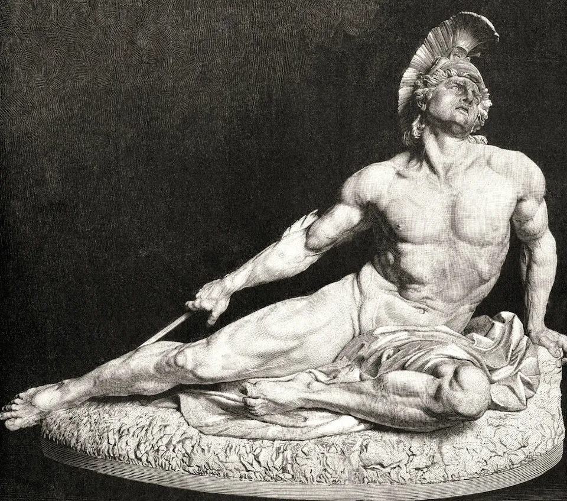
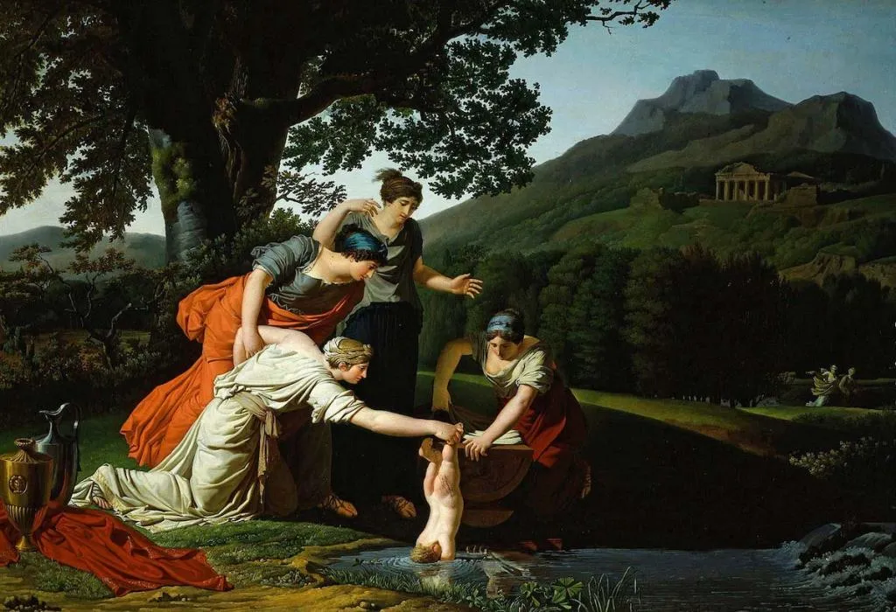
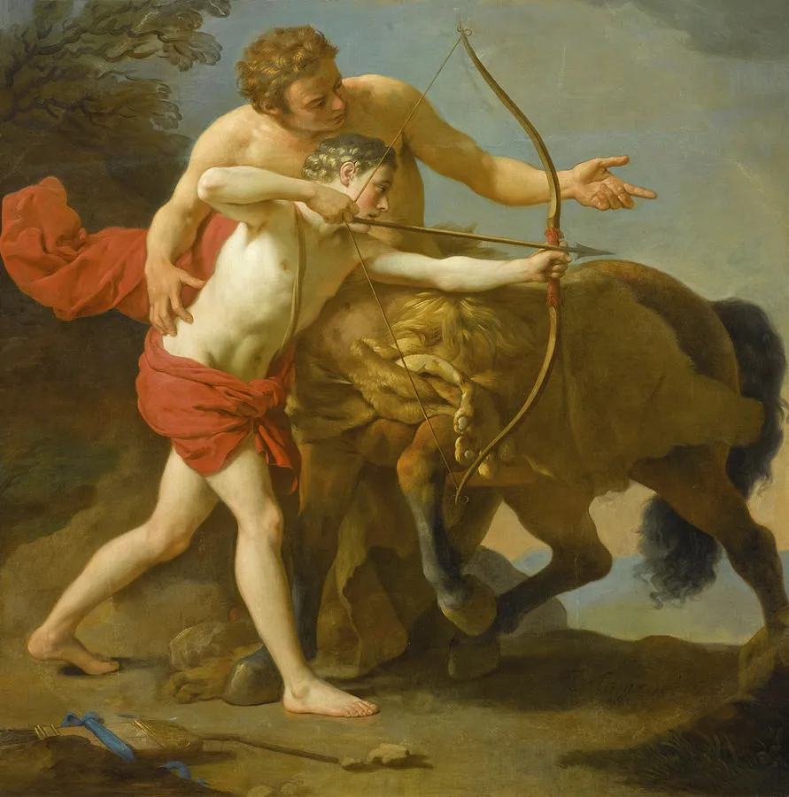
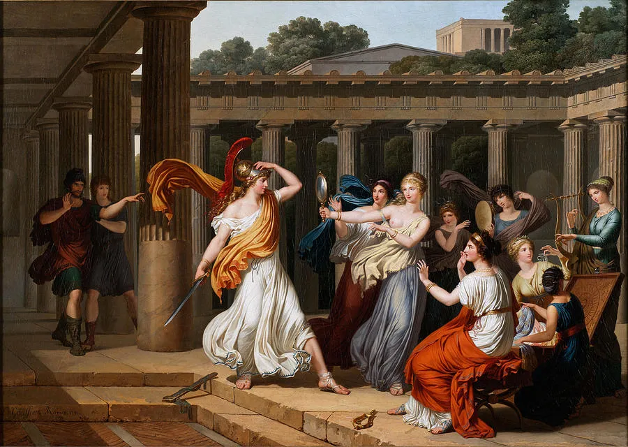
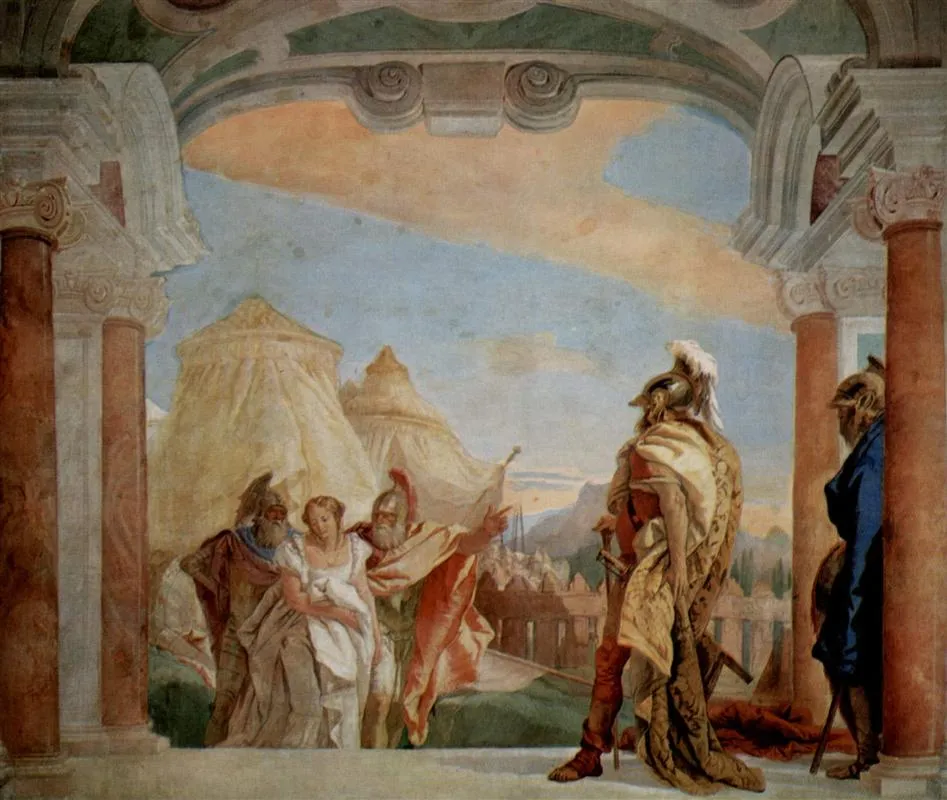
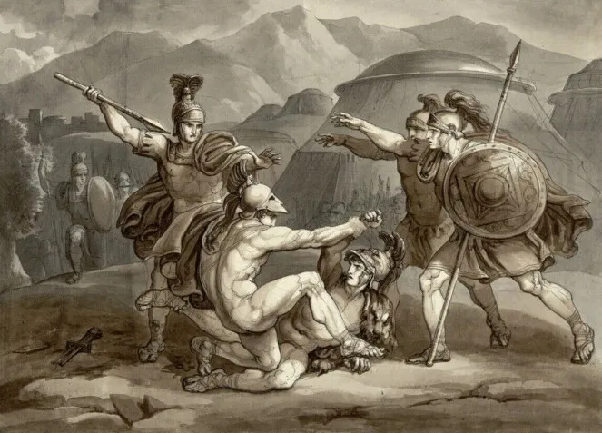
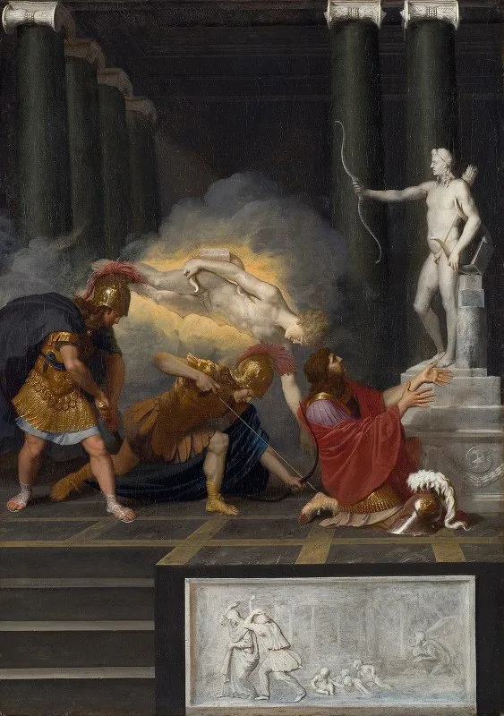

在 [普罗米修斯的故事](https://nzhong.wordpress.com/2021/10/06/普罗米修斯（prometheus）/) 结尾，我们提到了一个惊天大秘密。那是什么呢？普罗米修斯（[Prometheus](https://en.wikipedia.org/wiki/Prometheus)）告诉宙斯（[Zeus](https://en.wikipedia.org/wiki/Zeus)）：「你知道女神忒提斯（[Thetis](https://en.wikipedia.org/wiki/Thetis)）对吧？有这么一个预言：不论她和谁生的儿子，都注定比老爸英雄一百倍！」

宙斯听了大惊失色。他和他弟弟，海神波塞冬（[Poseidon](https://en.wikipedia.org/wiki/Poseidon)），都在疯狂的追求忒提斯。万一追到手，生了个儿子比他厉害一百倍，自己岂不是要王位不保？怪不得都说这个秘密足以摧毁或挽救奧林匹斯众神的统治。

宙斯和波塞冬你推我我推你，都再也不肯追女神了。最后一商量，决定把忒提斯下嫁给个凡人，塞亚（[Phthia](https://en.wikipedia.org/wiki/Phthia)）的国王佩琉斯（[Peleus](https://en.wikipedia.org/wiki/Peleus)）。这样她生的儿子再厉害，不过是比一个凡人老爸厉害。

佩琉斯和忒提斯结婚后，生下个儿子，叫做阿喀琉斯（[Achilles](https://en.wikipedia.org/wiki/Achilles)）。

------

在阿喀琉斯还是婴儿的时候，忒提斯为了给他塑个不灭金身，抓住他左脚的脚踝，把他浸入冥河斯堤克斯（[River Styx](https://en.wikipedia.org/wiki/Styx)），使得他日后刀枪不入。

但由于她抓住的左脚脚踝那里没有沾水，这一小块成为阿喀琉斯全身唯一的弱点。这就是所谓的 [Achilles’ heel](https://en.wikipedia.org/wiki/Achilles'_heel) 。

Thetis immersing her son Achilles, in the River Styx. by Antoine Borel, 18th century; in the collection of the Galleria Nazionale, Parma, Italy.

忒提斯又给儿子找了个好老师，奇戎（[Chiron](https://en.wikipedia.org/wiki/Chiron)）。这个奇戎可了不得，有点儿像岳飞的老师周侗：十八般武艺样样精通。而且琴棋书画，文武双全。

阿喀琉斯天分极高，在奇戎精心培养下，学生很快就青出于蓝，远胜乃师。

The Centaur Chiron instructing Achilles, by Louis-Jean-Francois Lagrenee (1724-1805)

这时忒提斯给儿子占了一卦：A）你要么辉煌灿烂但年轻早死，B）要么平凡的度过一生，舒适漫长。

阿喀琉斯毫不犹豫的选择了 A），完全没有注意到老妈眼角伤心的泪光。

------

然后就到了帕里斯（[Paris](https://en.wikipedia.org/wiki/Paris_(mythology))）劫持海伦（[Helen](https://en.wikipedia.org/wiki/Helen_of_Troy)），希腊远征特洛伊的那一段故事，细节请挪步「[人间第一美女：海伦](https://nzhong.wordpress.com/2021/06/28/人间第一美女：海伦/)」。

忒提斯担心这场战争，就是预言中要给儿子带来「辉煌灿烂但年轻早死」的事件。她一早把阿喀琉斯打扮成个女子，托付给塞罗斯国王莱克墨德斯（[Lycomedes of Scyros](https://en.wikipedia.org/wiki/Lycomedes_of_Scyros)），和国王的女儿们藏在一起，希望能躲过这场战争。

希腊第一占卜师卡尔卡斯（[Calchas](https://en.wikipedia.org/wiki/Calchas)）预言，「没有阿喀琉斯我们赢不了。」于是希腊军团派出足智多谋的奥德修斯（[Odysseus](https://en.wikipedia.org/wiki/Odysseus)），哪怕找遍天涯海角也要把他揪出来。

奥德修斯假扮成一个珠宝商，来到莱克墨德斯宫中。面对众多如花似玉的少女们，他不慌不忙的端出个大箱子，里面摆满了香水，胭脂，锦缎，镜子，还有一把剑。

只见众美女有试衣服的，有照镜子的，有抹口红，有撒香水的，只有一个‘美女’拿起了那把剑。

奥德修斯上前一把抓住她：“哈哈，阿喀琉斯，你就别躲了！”

Odysseus recognises Achilles amongst the daughters of Lycomedes, by Louis Gauffier (1762–1801) 

------

阿喀琉斯随军出征特洛伊，他是希腊军中的第一高手。

在早期的一场胜仗中，他擒获了一个特洛伊公主，波吕塞娜（[Polyxena](https://en.wikipedia.org/wiki/Polyxena)）。阿喀琉斯惊叹于后者的美貌，不仅放她生还，还在遣返前向她透露了自己唯一的命门弱点：脚后跟。

在第十年的另一场胜仗中，阿喀琉斯又擒获了一个美女，布里塞伊斯（[Briseis](https://en.wikipedia.org/wiki/Briseis)）。这回他想自己留着了，但又被希腊主帅阿伽门农（[Agamemnon](https://en.wikipedia.org/wiki/Agamemnon)）抢走。

Eurybates and Talthybios Lead Briseis to Agamemmon, 1757, by Giovanni Battista Tiepolo (1696-1770)

阿喀琉斯一气之下，退出战局。这就是荷马史诗的开篇，「阿喀琉斯之怒」。

第一高手退出后，希腊军团节节败退，差点儿被特洛伊人赶到海里。在此期间，阿喀琉斯的好基友，帕特洛克罗斯（[Patroclus](https://en.wikipedia.org/wiki/Patroclus)），被特洛伊主帅赫克特（[Hector](https://en.wikipedia.org/wiki/Hector)）斩杀。

*Patroclus Killed by Hector. 19th.century. Bartolomeo Pinelli. Italian 1771–1835. chalk, feather in gray-gray and brown wash on paper.*

这一来，本来谁也劝不动的阿喀琉斯，要重返战场了。

其实他从各方面（老妈忒提斯，帕特洛克罗斯的魂魄）都得到明确的信息：如果重返战斗，死亡注定要降临到自己的头上。但他不管，他要为好友复仇。

终于在特洛伊的城墙底下，他追上了特洛伊王子。大战三百回合，阿喀琉斯杀死了赫克特。

之后，他又杀死了亚马逊女王 [Penthesilea](https://en.wikipedia.org/wiki/Penthesilea)，和非洲勇士门农（[Memnon](https://en.wikipedia.org/wiki/Memnon_(mythology))）。

------

前面提到的公主波吕塞娜，是特洛伊王子帕里斯的妹妹。她把阿喀琉斯的弱点告诉了哥哥。

帕里斯以妹妹为诱饵，把阿喀琉斯骗到了特洛伊城边。在天神阿波罗（[Apollo](https://en.wikipedia.org/wiki/Apollo)）的帮助下，他用一支毒箭，射中了阿喀琉斯左脚的脚后跟。

这位希腊第一勇士，终于没能逃脱命运的安排。死后，他和好友帕特洛克罗斯合葬在特洛伊的海边。

Achilles wounded in the Heel, by Bertholet Flemalle (Belgian, 1614–1675)

据说阿喀琉斯死前，说过这么一段话。

「天神其实嫉妒我们。他们不知道死亡，所以不懂得生命的美丽。他们没有时间的概念，所以不懂得友情的珍贵。他们不需要付出代价，所以不懂得选择的价值。

很多事情，正因为我们注定的灭亡，让一切更加灿烂辉煌。」