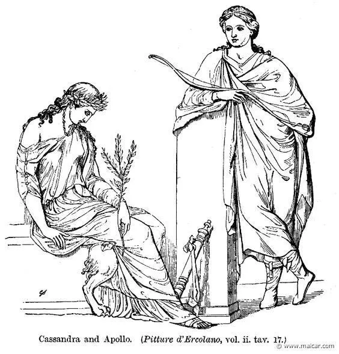
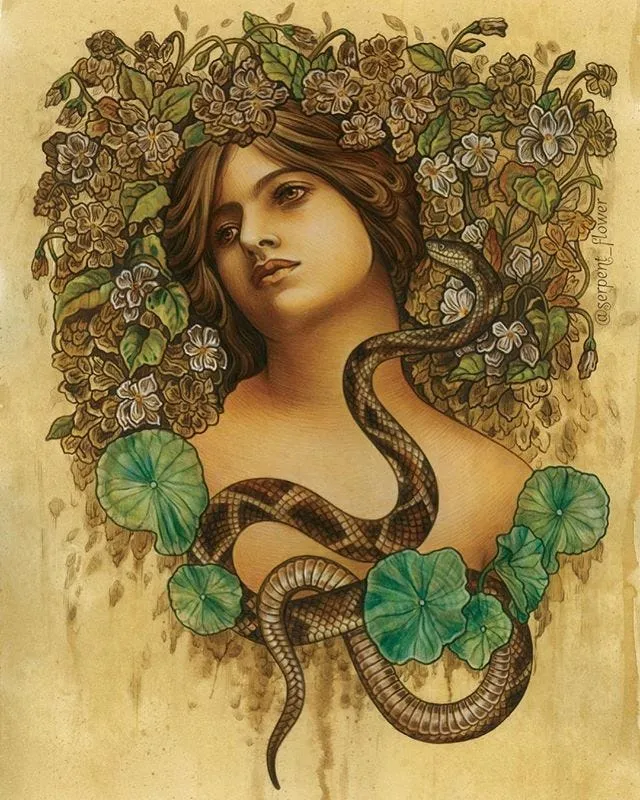
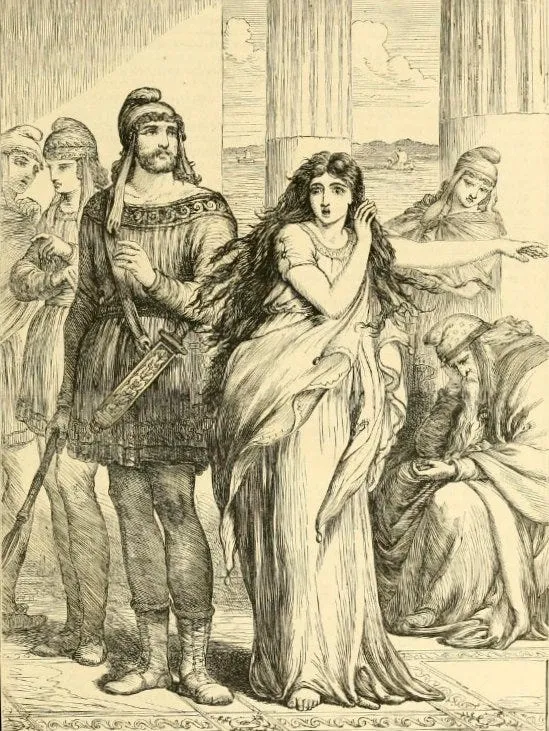
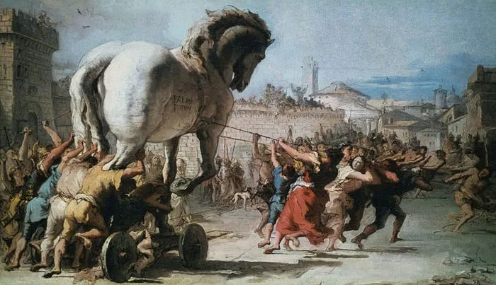
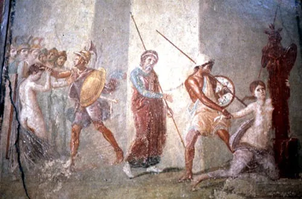
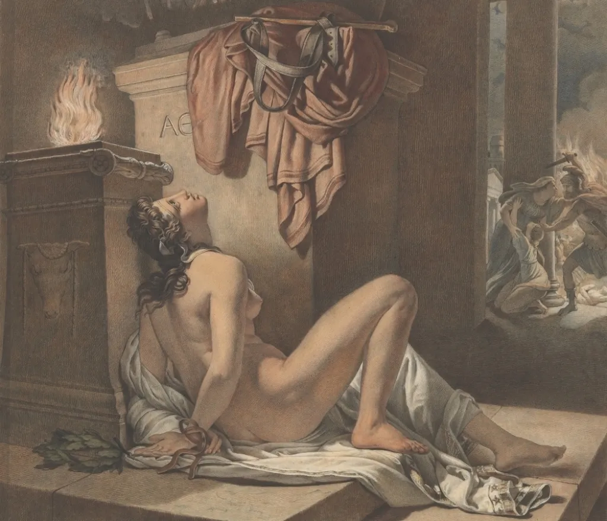
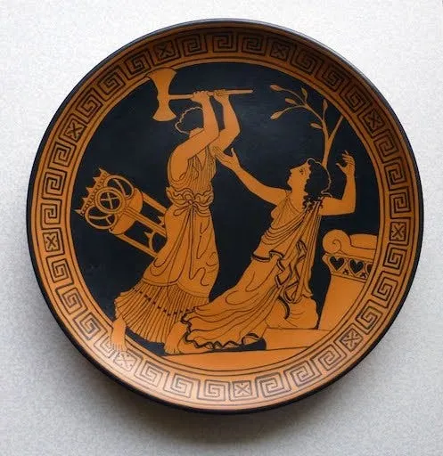
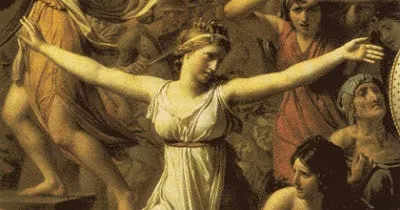

卡桑德拉（ [Cassandra](https://en.wikipedia.org/wiki/Cassandra) ）是个很悲剧的人物。她有天下最厉害的一项能力：预知未来。但同时又背负着最狠毒的诅咒：没有人信她。

所以一次又一次的，她预先看到自己和亲人好友的悲惨未来。但不管她怎么警告别人，大家都无动于衷。于是惨剧就在她眼前，按照她早就知道的方式，一步一步的展开发生。

然后预知下一个惨剧，周而复始。

卡桑德拉是特洛伊老国王普里阿摩斯（ [Priam](https://en.wikipedia.org/wiki/Priam)）和王后赫库芭（ [Hecuba](https://en.wikipedia.org/wiki/Hecuba)）的女儿。她天生丽质，在姐妹公主里是最聪明漂亮的。追求她的人排了几条街，有国王，有王子，有富二代，还有太阳神阿波罗（ [Apollo](https://en.wikipedia.org/wiki/Apollo) ）。

在希腊神系里，阿波罗不只是太阳光明之神，还是诗歌，舞蹈，预知未来（ [Prophecy](https://en.wikipedia.org/wiki/Prophecy) ）神。小伙子为了追大美女，出手也够豪的：他把预知未来的能力白白送给了卡桑德拉。

而卡桑德拉呢，毫不客气的收下了礼物，然后冷脸说，”你虽然不是癞蛤蟆，但想吃天鹅肉，做梦去吧。”

这一下可好，阿波罗给气的。但他也狠，并没有收回预见的能力，而是给美女加了一个诅咒：”你能准确的看到未来。但当你警告别人的时候，没有人会信你。”

另一个版本，是说有一天晚上，卡桑德拉在阿波罗神殿门口的地上睡着了。

一只蛇游了过来，在她耳边吹了一口蛇气。从此她就能听到未来。

于是就开始了她的悲惨人生。

卡桑德拉老早就预见了他弟弟，帕里斯（ [Paris](https://en.wikipedia.org/wiki/Paris_(mythology)) ），会给特洛伊带来灭顶之灾。所以她建议早早的就把小帕杀死。

> *“Kill him! Kill the destroyer of* [*Priam*](http://www.maicar.com/GML/Priam1.html)*’s city! Kill that child!”
> 杀死他！他将是老爸城市（特洛伊）的灾星！杀死他！*
>
> *(*[*Cassandra*](http://www.maicar.com/GML/Cassandra.html)*. Euripides,* [*Andromache*](http://www.amazon.com/exec/obidos/ASIN/0226307662/carlosparada-20) *293).*

当然，大家没有杀死帕里斯。他长大后，以特洛伊王子的身份，出访希腊的斯巴达。

那里有人间第一美女，海伦（ [Helen](https://en.wikipedia.org/wiki/Helen_of_Troy) ）。

在帕里斯出发前，卡桑德拉劝大家不要派他出使，大家没有听。

卡桑德拉又劝弟弟不要去，尤其不要去碰海伦，斯巴达国王的老婆。帕里斯没有听。

后来帕里斯把海伦给劫回来了，特洛伊满城的人都欢迎他们。卡桑德拉告诉大家，”这个女人会毁掉咱们的城市。”

当然没有人听。

不久，希腊军团在阿伽门农（ [Agamemnon](https://en.wikipedia.org/wiki/Agamemnon) ）的带领下，向特洛伊宣战。

## Get Ning Zhong’s stories in your inbox

Join Medium for free to get updates from this writer.

Subscribe

卡桑德拉劝众人把海伦还回去。

她劝哥哥赫克特（ [Hector](https://en.wikipedia.org/wiki/Hector)）王子不要去挑战希腊的第一勇将阿喀琉斯（ [Achilles](https://en.wikipedia.org/wiki/Achilles) ）。

在哥哥被阿喀琉斯杀死后不久，希腊军队假装撤退，留下一匹木马。她告诉大家，不要把木马拉进城中。

她甚至直接嚷嚷，”木马里有人！”

后面的事大家都知道了。特洛伊人不听，把木马拉进了城里。晚上，希腊军官从木马里钻出来，血洗特洛伊。

卡桑德拉也知道没用，但她还是躲到了雅典娜（ [Athena](https://en.wikipedia.org/wiki/Athena) ）的神殿。按照国际公约，在那里战胜方不应该放肆的。

但小埃阿斯（ [Ajax the Lesser](https://en.wikipedia.org/wiki/Ajax_the_Lesser) ）不管，闯进神殿，侮辱了卡桑德拉。

这一来，连一直支持希腊军队的雅典娜都看不下去了，她杀死了小埃阿斯。

卡桑德拉被作为战利品，分给了希腊主帅，迈锡尼的国王阿伽门农当女奴/小妾。

在早先的另一段故事里，阿伽门农杀死了自己的女儿（ [Iphigenia](https://en.wikipedia.org/wiki/Iphigenia)）。他的原配妻子，也就是 Iphigenia 的老妈，叫克吕泰涅斯特拉（ [Clytemnestra](https://en.wikipedia.org/wiki/Clytemnestra) ）。名字很长，咱们叫她主母吧。

由于女儿的关系，主母很恨阿伽门农。特洛伊战争的这十年，主母留在迈锡尼，又有了新的情人。

卡桑德拉劝阿伽门农，不要回迈锡尼了，回去也要小心提防主母。

因为她早已看到了新主人和自己的结局。

阿伽门农不听，回去后不久，被主母和情人一起杀死了。

主母也杀死了卡桑德拉。临死前她告诉主母，你将来会被你的儿子杀死。

这是卡桑德拉悲惨一生中最后一次预言了。她也知道主母不会听的。

后来主母的儿子俄瑞斯忒斯（ [Orestes](https://en.wikipedia.org/wiki/Orestes) ）杀死了主母。

其实按照纯逻辑推理，当初卡桑德拉在拒绝阿波罗的时候，应该已经知道拒绝他的这一切后果了。

但她还是拒绝了他。