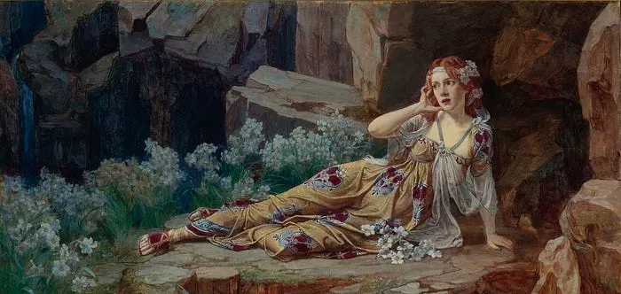
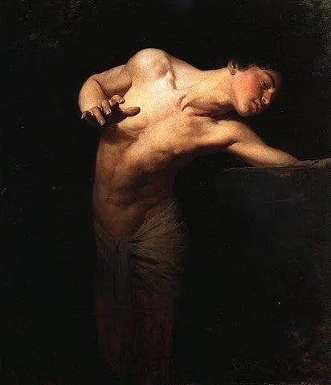
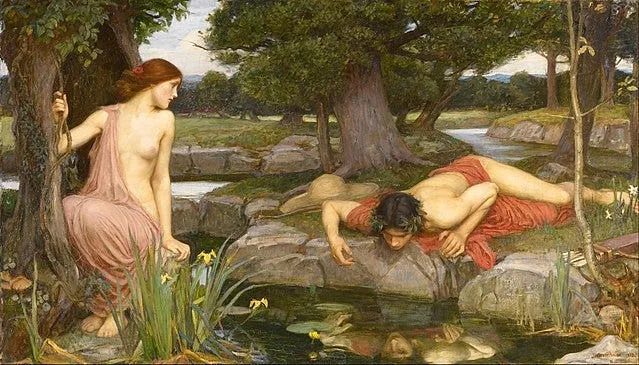
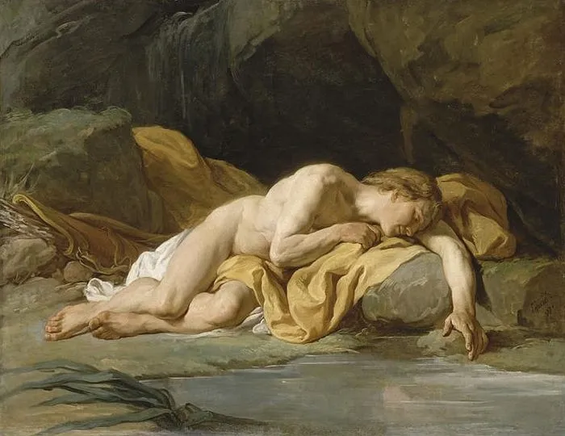
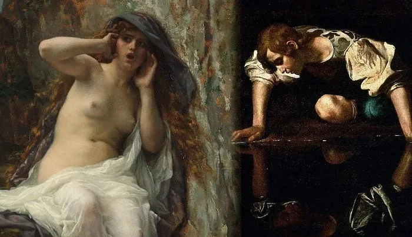

回声的名字叫艾蔻（[Echo](https://en.wikipedia.org/wiki/Echo_(mythology))），是一个聪明漂亮的河泽仙女（[Nymph](https://en.wikipedia.org/wiki/Nymph) ）。

在希腊神系里，河泽仙女是地位不太高的二等神。但里面出美女的比例极高，经常会勾引正神，或被正神勾引。举个不厚道的例子吧，有点儿类似中南海后院的总政歌舞团。

但艾蔻是属于那种比较文静，爱读书，有气质的女孩。

这一天，众神之神宙斯（ [Zeus](https://en.wikipedia.org/wiki/Zeus) ）又来跟某个仙女鬼混。艾蔻洁身自好，到旁边的林子里散步。

正好宙斯的原配赫拉（ [Hera](https://en.wikipedia.org/wiki/Hera) ）气急败坏的赶来捉奸，嘴里还嘀嘀咕咕的，”不知是哪个不要脸的小三，看我抓住怎么收拾你！”

艾蔻有心要帮闺蜜一把，就拉住赫拉聊天。她知识面极广，古今中外天南地北的，说的精彩有趣。等赫拉醒悟过来，已经几个时辰过去，宙斯和仙女早跑了。

*Echo — Talbot Hughes (1869–1942) — PD-art-100*

赫拉气得不行，把怨恨从不知名的小三全转到艾蔻身上：”小蹄子胆子不小啊，敢来跟老娘作对？你不是仗着口才好么？行，送你一个诅咒：你以后再也说不出一句话。只有别人说话时，你重复最后一个词！”

天后的诅咒，立刻生效。艾蔻哭着说，”…一个词。”

自恋的名字叫纳西瑟斯（ [Narcissus](https://en.wikipedia.org/wiki/Narcissus_(mythology)) ），是一个英俊自负的美少年。

他妈妈在他小时候给他算过一命。占卜师说，”不要让他看见自己的相貌，这小伙子就能长命百岁。”

*Narcissus (1881), by Gyula Benczúr (1844–1920)*

他长大后成了希腊第一美男。任何见到他的人，不管是师奶还是少女，都立刻会被他的容貌迷住。

可能是追求者太多了吧，他整天一副谁也看不上的样子，很酷很拽。

有一天，艾蔻在树林里漫步，看见不远处的纳西瑟斯。只看了一眼，她就知道完了，这辈子再也不会爱上别人了。

她躲在一颗大树后面，可是她没法开口。赫拉狠毒的诅咒，让她只能等待对方先说话。

*Echo and Narcissus (1903), by John William Waterhouse*

- 纳西瑟斯听见了树后面的声音：”是谁在这里？”
- 艾蔻：”…在这里”
- 纳西瑟斯：”你是谁？出来让我看看你。”
- 艾蔻：”…看看你”
- 纳西瑟斯转到树后，看见了艾蔻，”啊，你怎么都不回答我。咱们一起玩吧。”
- 艾蔻高兴坏了，张开双臂向他飞奔过来：”…一起玩吧”

谁想到她这样反而吓到了纳西瑟斯。他厌恶的将她推开，”离我远一点！我宁愿死了，也不要和你在一起！”

## Get Ning Zhong’s stories in your inbox

Join Medium for free to get updates from this writer.

Subscribe

艾蔻的眼泪一下子就流下来了。看着转身而去的纳西瑟斯，她喃喃道，”在一起，在一起…”

在此之后，艾蔻终日在旷野哭泣。慢慢的，她的肉身耗尽，只留下声音。在空旷处只要有任何人呼喊，她总会回应最后一个词。

所以 Echo 就是回声的意思。

纳西瑟斯的冷酷，终于惹恼了复仇女神（ [Nemesis](https://en.wikipedia.org/wiki/Nemesis) ）。要惩罚他很容易：有一天复仇女神把纳西瑟斯引到了湖边，让他在水里看到了自己的影像。

和所有师奶与少女们一样，这个自恋的美少年深深的被自己的容貌所吸引。

*Narcissus languishing by his reflection, Nicolas Bernardt Lepicie*

从此他不吃不睡，整天在湖边凝视自己的容颜。

慢慢的，他的肉身也耗尽了。在那片湖边地上，长出了一株水仙花（ [Narcissus](https://en.wikipedia.org/wiki/Narcissus_(plant)) ）。

（附加花絮）
在 Paulo Coelho 的「The Alchemist」一书的开头，有这么一段故事：

- 纳西瑟斯死后，那个湖从淡水湖，变成了咸水湖，里面全是泪水。
- 森林仙女就来问湖：”你为什么哭啊？”
- 湖说，”因为纳西瑟斯死了。”
- 仙女恍然，又不无嫉妒的说，”也只有你有福气这么近距离欣赏他的英俊。”
- 湖有些意外，”纳西瑟斯长得很帅么？”
- 这回轮到仙女惊讶了，”他整天望着你，你整天看着他，怎么会不知道他帅？如果不是他的容貌，你为什么替他悲伤？”
- 湖沉默了良久，缓缓说，”我倒真的从来没有注意过。”
- “我为他悲伤，是因为当他跪在湖边看自己倒影的时候，在他深邃的眼珠里，我看到了自己的美丽。”

*Echo, by Alexandre Cabanel, 1874;
with Narcissus, by Caravaggio, 1599