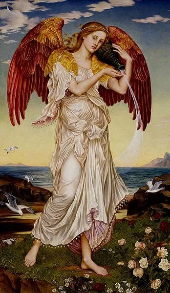
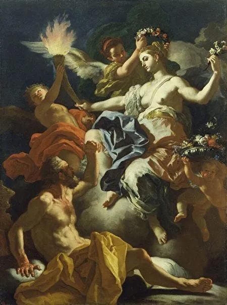
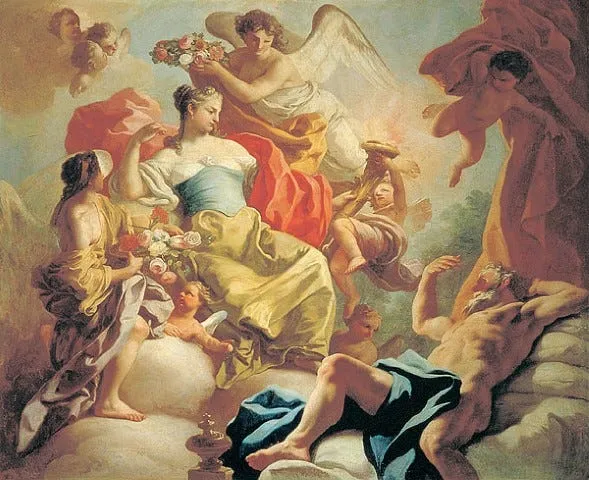
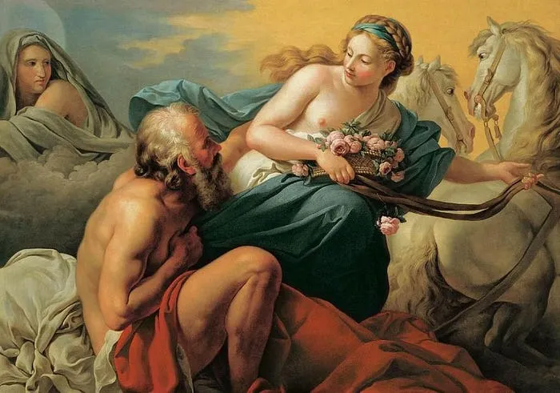
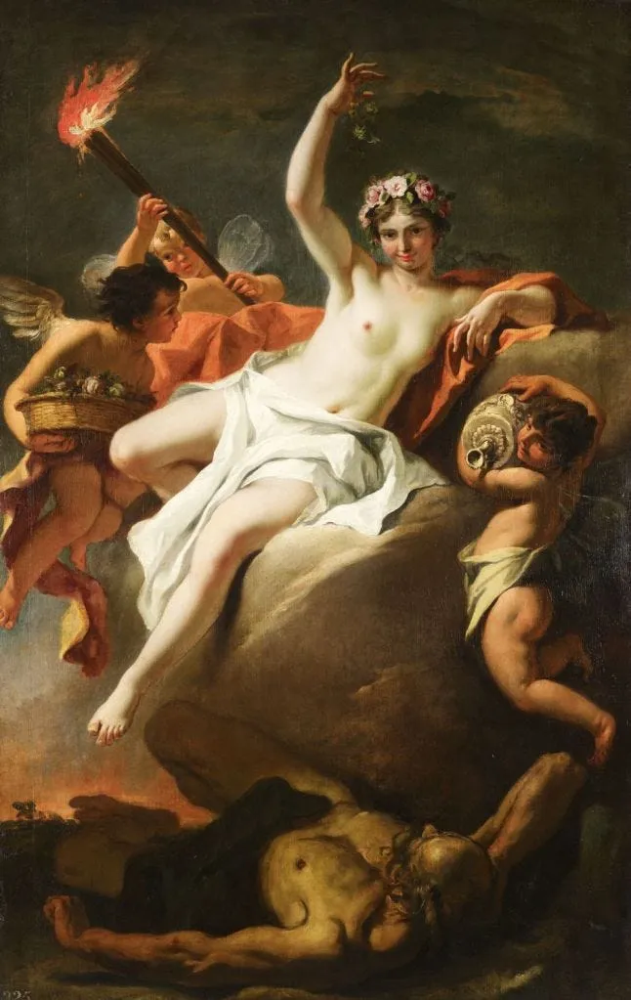

艾奥斯（[Eos](https://en.wikipedia.org/wiki/Eos)）是希腊神话中的黎明女神。每天清晨，她会用她的”玫瑰指”打开天空大门，让太阳升起给人类带来光明。她还会沿途播撒玫瑰花瓣，让世界充满了玫瑰的馨香。

在罗马神话里，她的名字叫奥罗拉（[Aurora](https://en.wikipedia.org/wiki/Aurora_(mythology))）。

L’Aurore by William-Adolphe Bouguereau, 1881

Eos by Evelyn De Morgan, 1895

某天，她看到了年轻英俊的提索奥努斯（[Tithonus](https://en.wikipedia.org/wiki/Tithonus)）。前者是泰坦女神，后者是凡人小伙一个，门不当户不对。

可是提索奥努斯实在是太帅了，把我们黎明女神帅的神魂颠倒。于是她把小伙子劫持到天上，当了个赘婿。

然后悲剧就发生在这里：艾奥斯向众神之神宙斯（[Zeus](https://en.wikipedia.org/wiki/Zeus)）求祝福的时候，犯了一个大错误：她求宙斯给这个凡人「长生不死」（[Immortality](https://en.wikipedia.org/wiki/Immortality)），但忘了求「长生不老」（[Eternal Youth](https://en.wikipedia.org/wiki/Eternal_youth)）。

宙斯也就笑呵呵的同意了她的请求。

随着时间一年年的流逝，提索奥努斯逐渐衰老。他的白发渐长，满脸皱纹。皮肤上的斑点越来越多，眼睛里的灵气越来越少。

## Get Ning Zhong’s stories in your inbox

Join Medium for free to get updates from this writer.

Subscribe

而艾奥斯还是和最初一样，像黎明的玫瑰，永远的年轻，美丽，充满朝气。

在这幅「奥罗拉离开提索奥努斯」里，提索奥努斯是半坐半躺在左下角地上的老头。他用手遮住脸，是不愿看到黎明女神美丽性感的身体，还是羞于让后者看到自己苍老的容颜？

这里又有类似的构图：黎明女神在明，老头在暗。他用手遮住脸，是在羞愧，还是在愤恨？

提索奥努斯深情的凝视着女神，似乎在恳求她不要离开。

但艾奥斯的手已经伸向要离去的缰绳。她的眼光是不屑，是怜悯，是不耐烦？

提索奥努斯一直恳求天神让他死去。但宙斯的话，一言既出，死马难追。他没有死的权力。

据说到后来，他老的完全动不了了，整日在一间空屋子里喃喃自语。艾奥斯可怜他，把他变成了一只蝉。