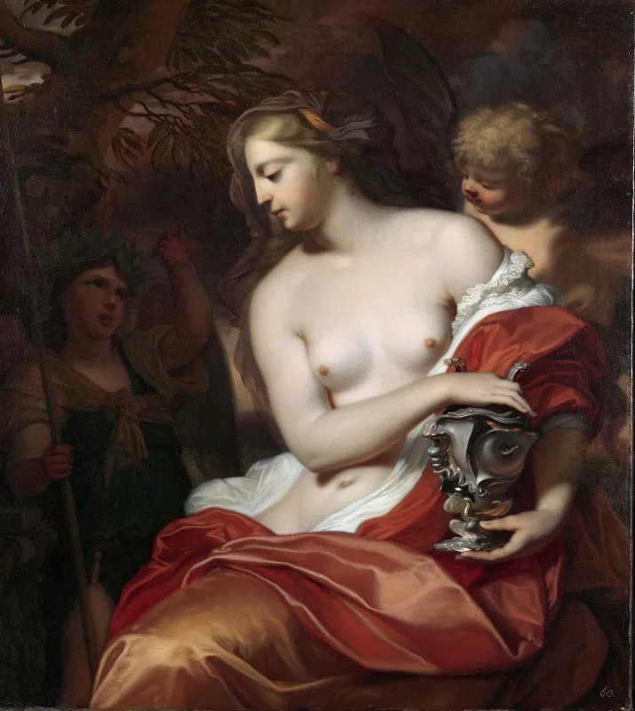
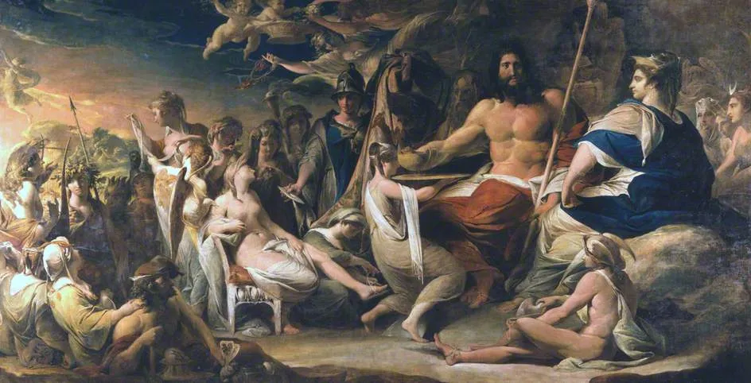
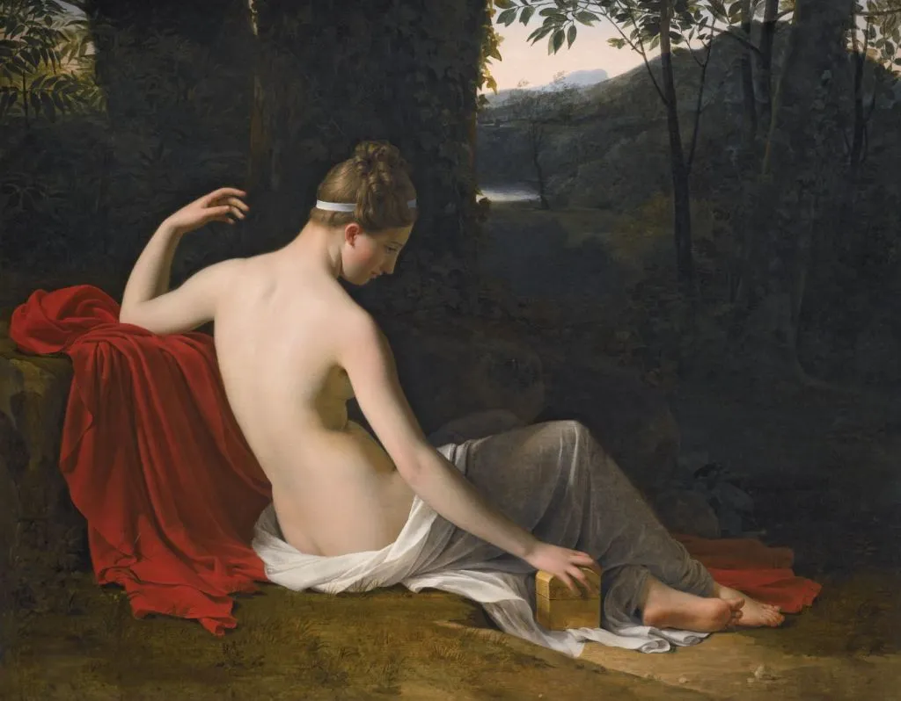
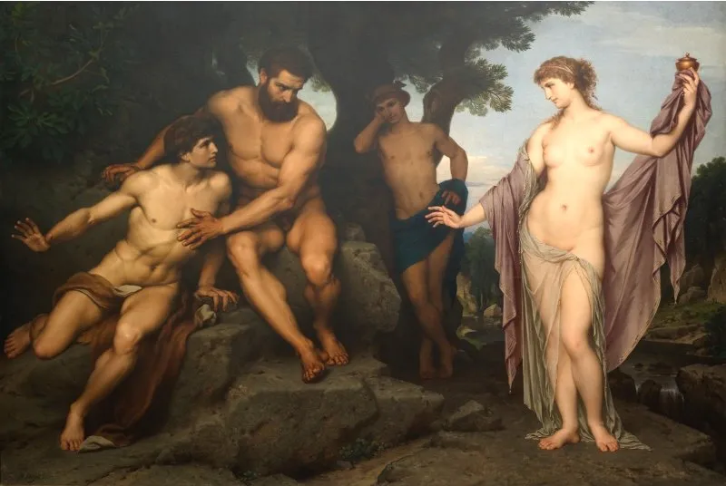
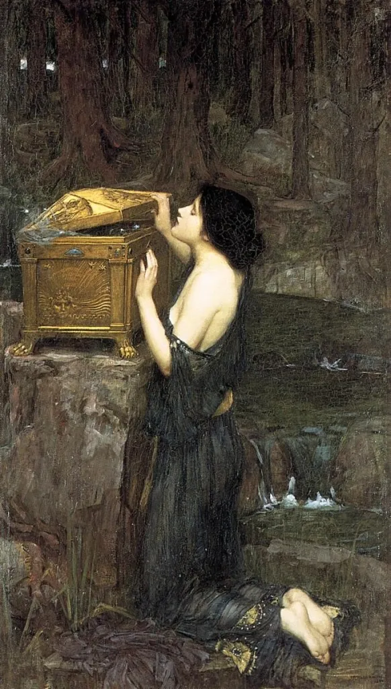
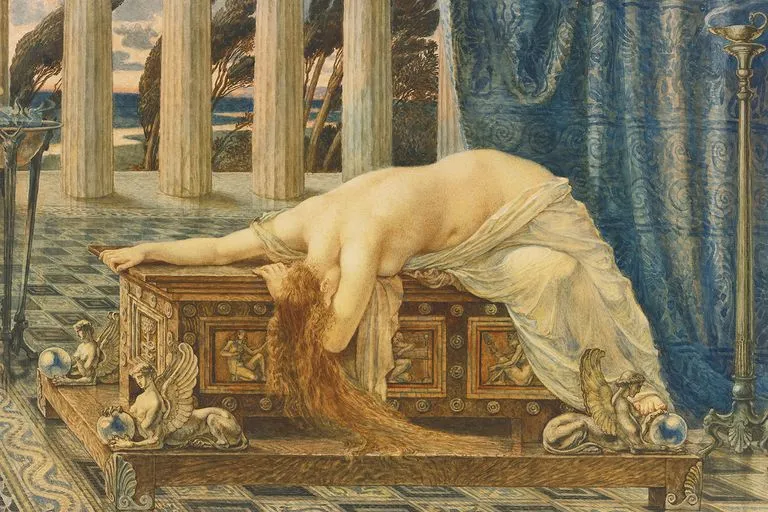

在希腊神话中，天神们创造了人类，但起初不知为啥，只造了一堆男的。

结果一群大老爷们儿，居然也混的风生水起的，让天神们颇有些嫉妒。尤其是普罗米修斯（[Prometheus](https://en.wikipedia.org/wiki/Prometheus)）盗取火种给了人间之后，宙斯（[Zeus](https://en.wikipedia.org/wiki/Zeus)）彻底怒了。

宙斯很生气，后果很严重。

他 [重罚普罗米修斯](https://nzhong.wordpress.com/2021/10/06/普罗米修斯（prometheus）/) 不说，还命令匠神赫法伊斯托斯（[Hephaestus](https://en.wikipedia.org/wiki/Hephaestus)）新造一个人。这回要造个女的，给凡间添乱。

于是就有了我们的主角潘朵拉（[Pandora](https://en.wikipedia.org/wiki/Pandora)），人世间的第一个女子。

------

Pandora (1676), by Barend Graat (Dutch, 1628-1709)

The Birth of Pandora, c.1791, by James Barry (1741–1806), Manchester Art Gallery, UK

匠神揣摩圣意，深知红颜祸水，越漂亮越添乱的道理，把潘朵拉造的这叫一个国色天香。其他诸神也跟着凑热闹，

- 天后赫拉（[Hera](https://en.wikipedia.org/wiki/Hera)）赐给她嫉妒心，
- 情欲女神阿佛洛狄忒（[Aphrodite](https://en.wikipedia.org/wiki/Aphrodite)）赐给她美貌和勾魂大法，
- 信使神荷米斯（[Hermes](https://en.wikipedia.org/wiki/Hermes)）赐给她巧舌和狡诈，
- 智慧女神雅典娜（[Athena](https://en.wikipedia.org/wiki/Athena)）赐给她智慧和善辩，
- 宙斯则赐给她好奇心（姜还是老的辣）。

礼物送完，众神围着潘朵拉看了一圈，嗯，足够颠倒众生的了。

宙斯又准备了一个盒子（最初传说中是罐子），里面装满了人世间的各种邪恶：战争，疾病，贪婪，邪恶，痛苦，等等等等。

然后宙斯要把潘朵拉嫁给艾皮米修斯（[Epimetheus](https://en.wikipedia.org/wiki/Epimetheus)），用这个邪恶盒子做为嫁妆。

Pandora Reclining in a Wooded Landscape, oil on canvas, by Louis Hersent (1777–1860)

------

这个艾皮米修斯，是前面提到的普罗米修斯的弟弟。但他们兄弟俩皆然相反：哥哥普罗米修斯能预知未来，有先见之明。而弟弟艾皮米修斯是典型的事后诸葛亮，除了马后炮啥也不会。

普罗米修斯在被宙斯重罚，上刑场之前，做了两件事：

- 他告诉弟弟，“宙斯要给你找个妻子，你千万不要接受。如果你实在不听我的话真娶了她，也千万不要打开她带来的那个盒子。”
- 他又说服宙斯，把「希望」也放进了那个邪恶盒子里。

如今哥哥在服那个无期徒刑，艾皮米修斯看到潘朵拉的绝色容颜，早把老哥的叮嘱忘在九霄之外。他擦了擦口水加鼻血，一个劲的点头，“我接受。即日成婚，即日成婚！”

Prometheus and Epimetheus before Pandora， by Hermann Julius Schlösser, 1878. Nationalgalerie, Staatliche Museen zu Berlin

------

后面的故事大家都很熟悉了。结婚之后，艾皮米修斯倒是没忘了哥哥的第二句话，一直不让潘朵拉打开那个「潘朵拉的盒子」。

但怎么说宙斯最老奸巨猾呢？他一早料到这里，所以当时赐给潘朵拉的，是好奇心。

女人的好奇心，是谁也挡不住的。终于有一天，潘朵拉不顾老公的阻止，打开了盒子。

一瞬间，战争，疾病，贪婪，邪恶，痛苦，等等等等，飞出盒子，充满了人间。

Pandora opening her box (1896), by John William Waterhouse (1849-1917)

Pandora’s box, 1880s. Artist: Yoshitoshi, Tsukioka (1839-1892)

艾皮米修斯长叹道，“哎呀，早知道如此，当初应该听哥哥的话就好了。”

宙斯在天上得意的笑了。

------

但这里有一桩悬案，几千年来一直没有定论。

最初记载这个故事的赫西俄德（[Hesiod](https://en.wikipedia.org/wiki/Hesiod)）特意提到，「希望，没有跟着其他的邪恶一起飞出潘朵拉的盒子」。但他也没有说希望是否留在了盒子里面。

有人说，普罗米修斯把「希望」赐给人类，因为他知道，希望可以在最艰苦最绝望的时候，引导着人们渡过苦难，战胜邪恶。

也有人说，宙斯早把普罗米修斯的小算盘看得一清二楚。他就是要给人类「虚幻的希望」，使得凡人不要那么快灭绝，而在苦难中，一代一代继续的忍受命运的捉弄。

但前者又说，普罗米修斯当然知道宙斯的想法。但他确信「希望」的力量，确信人类有一天会摆脱天神的控制，成为自己的主宰。

潘朵拉呢，她可能只是希望男生不要把所有罪恶的来源都推到女生身上。

Pandora (1885), by Walter Crane (British, 1845–1915)