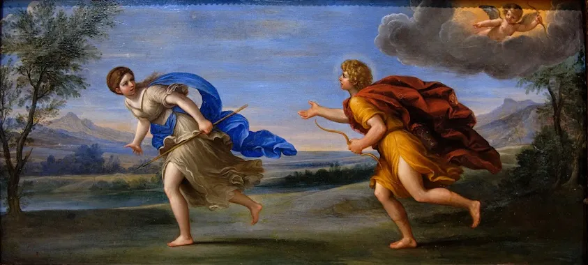

达芬尼（[Daphne](https://en.wikipedia.org/wiki/Daphne)）是一个美丽的河泽仙女（[Nymph](https://en.wikipedia.org/wiki/Nymph)）。

她们 Nymph 是希腊神系里出美女最多的一族。而在众姐妹中，达芬尼又艳压群芳。按现今的话说，是「千年一见の美人」。

绝世的容颜，加上（相对）卑微的身份，就注定了她的命运。

------

某天，太阳神阿波罗（[Apollo](https://en.wikipedia.org/wiki/Apollo)）一番苦战，用弓箭杀死了半龙半蛇的神兽巨蟒（[Python](https://en.wikipedia.org/wiki/Python_(mythology))）。胜利后，他志得意满，得瑟的到处招摇。

正好前面碰上丘比特（[Cupid](https://en.wikipedia.org/wiki/Cupid)），一双小翅膀扑棱扑棱的，手里拿着那只主宰爱恨的小弓。

阿波罗上前，晃了晃自己手里的大弓：“瞧瞧吧，这才是真的弓箭。你的那玩意儿那么小，还是别拿出来现眼了。以后射箭这种事，或者射任何东西，还是留给我们真男人来做吧。“

Apollo standing at left shooting a python with an arrow, above to the left are the muses and at right on a cloud Cupid approaching Apollo, from the ‘Story of Apollo and Daphne’, Master of the Die (Italian, active Rome, ca. 1530–60)

阿波罗走了以后，丘比特越想越气。为了报复，他把一只金箭头射向了阿波罗，而相应的一只铅箭头，射向了达芬尼。

于是阿波罗疯狂的爱上了达芬尼，而后者见到前者，只会莫名的嫌弃厌恶。

------

这时候一个运气很差的王子，柳西普斯（[Leucippus](https://en.wikipedia.org/wiki/Leucippus_(mythology))），闪亮登场了。

按说他是个王子，颜值也不差（Leucippus在希腊文中是白马的意思），追谁都应该是易如反掌。但他偏偏喜欢上了达芬尼，稀里糊涂的得了阿波罗这个厉害的情敌。

为了接近达芬尼，我们这个王子男扮女装，穿条裙子撒点儿香水，略施粉黛，居然也能以假乱真。和达芬尼还有她的几个姐妹混到一起，整天打猎玩耍，一下子亲密无间，成了无话不谈的好闺蜜。

这一来可把天上的阿波罗看的又羡又恨。他苦追达芬尼已经有一段时间了，没有任何进展。现在来了个小白脸，居然快要得手了？

于是有一天，他使出一个神法，把达芬尼众姐妹和柳西普斯引到一处泉水旁。又控制了众姐妹的意愿，大家纷纷跳入泉中洗澡。

by Giambattista Pittoni (1687 – 1767)

裙子一脱，就暴露了柳西普斯的男儿身。众仙女惊叫：“流氓！流氓！”

我们可怜的王子被仙女们当场打死。

------

除掉了情敌，阿波罗的桃花运并没有就此改变。达芬尼看到他就躲。

Apollo And Daphne, Painted by Francesco Albani (c. 1578–1660)

但身为奥林匹斯十二正神之一的阿波罗，法力实在太强大了。终于有一天，他把美女逼到了一个角落，她已无处可逃。

可怜的达芬尼对天祈祷，“救救我吧，不要让我落入这个流氓的魔爪！”

他的老爹河神佩尼斯（[Peneus](https://en.wikipedia.org/wiki/Peneus)），另一说是万神之王宙斯（[Zeus](https://en.wikipedia.org/wiki/Zeus)），听到了她绝望的呼喊，就把她变成了一颗月桂树。

所以月桂树在希腊文中叫 Daphne。

Daphne praying to Peneus, by Johann Nepomuk Schodlberger (1779-1853)

Apollo and Daphne, a marble sculpture made 1622–1625 by Bernini (1598–1680)

Apollo and Daphne, 1736, by Jean-Etienne Liotard (Swiss, 1702-1789)

------

阿波罗伤心不已，从树上取下枝叶，编织了一个月桂花环（[Laurel Wreath](https://en.wikipedia.org/wiki/Laurel_wreath)）。从此，给体育比赛胜利者戴上花环，成了至高的荣誉。

他又施神法，让月桂树的叶子万年长青。

